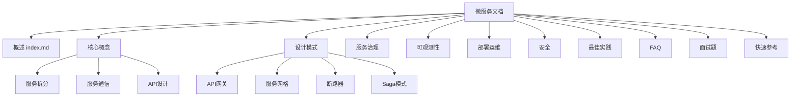
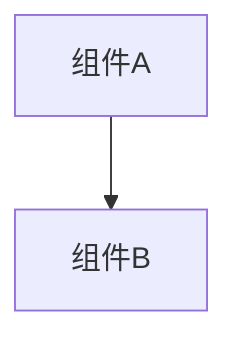

# Design Document

## Overview

本设计文档描述微服务文档的整体架构、文件组织结构和内容规范。文档将遵循现有 Docusaurus 站点的风格，使用中文编写，包含丰富的代码示例、Mermaid 图表和表格。

## Architecture

### 文档目录结构

```
docs/microservices/
├── _category_.json          # 侧边栏分类配置
├── index.md                 # 概述/入口页面
├── core-concepts.md         # 核心概念
├── design-patterns.md       # 设计模式
├── service-governance.md    # 服务治理
├── observability.md         # 可观测性
├── deployment.md            # 部署与运维
├── security.md              # 安全
├── best-practices.md        # 最佳实践
├── faq.md                   # 常见问题
├── interview-questions.md   # 面试题
└── quick-reference.md       # 快速参考
```

### 文档层级关系



## Components and Interfaces

### 1. 侧边栏配置 (_category_.json)

```json
{
  "label": "微服务",
  "position": 15,
  "link": {
    "type": "generated-index",
    "description": "微服务架构完整指南"
  }
}
```

### 2. 文档页面 Frontmatter 规范

每个 Markdown 文件必须包含以下 frontmatter：

```yaml
---
sidebar_position: <number>
title: <页面标题>
description: <页面描述>
---
```

### 3. 内容组件规范

#### 表格组件
用于对比和列表展示：
```markdown
| 特性 | 说明 |
| ---- | ---- |
| xxx  | xxx  |
```

#### Mermaid 图表
用于架构图和流程图：
```markdown

```

#### 代码示例
使用语法高亮的代码块：
```markdown
```java
// Java 代码示例
```
```

#### 导航组件
在 index.md 底部使用：
```markdown
import DocCardList from '@theme/DocCardList';
<DocCardList />
```

## Data Models

### 文档元数据模型

```typescript
interface DocumentMetadata {
  sidebar_position: number;
  title: string;
  description: string;
}
```

### 文档内容结构

每个文档页面应包含以下结构：
1. Frontmatter（元数据）
2. 一级标题（与 title 一致）
3. 概述/介绍段落
4. 主要内容章节（二级标题）
5. 代码示例和图表
6. 相关链接或导航

## Correctness Properties

*A property is a characteristic or behavior that should hold true across all valid executions of a system-essentially, a formal statement about what the system should do. Properties serve as the bridge between human-readable specifications and machine-verifiable correctness guarantees.*

由于本项目是文档创建任务，大部分需求涉及内容质量，需要人工审查而非自动化测试。以下是可验证的属性：

### Property 1: 文档目录结构完整性
*For any* 完成的微服务文档集合，`docs/microservices/` 目录下必须包含所有规定的文件（index.md, core-concepts.md, design-patterns.md 等）
**Validates: Requirements 1.1, 1.2, 1.3**

### Property 2: Frontmatter 格式正确性
*For any* 微服务文档中的 Markdown 文件，必须包含有效的 frontmatter（sidebar_position, title, description）
**Validates: Requirements 1.3, 2.1**

### Property 3: Index 页面组件完整性
*For any* index.md 文件，必须包含 Mermaid 图表、表格和 DocCardList 导航组件
**Validates: Requirements 2.2, 2.3, 2.5**

### Property 4: FAQ 问题数量
*For any* faq.md 文件，必须包含至少 15 个问题及解答
**Validates: Requirements 10.1**

## Error Handling

### 文档构建错误
- Frontmatter 格式错误：确保 YAML 语法正确
- Mermaid 图表语法错误：验证图表语法
- 组件导入错误：确保 DocCardList 正确导入

### 内容验证
- 链接有效性：检查内部链接是否指向存在的页面
- 代码示例：确保代码块有正确的语言标识

## Testing Strategy

### 验证方法

由于这是文档项目，测试主要通过以下方式进行：

1. **文件存在性检查**
   - 验证所有规定的文件是否已创建
   - 验证目录结构是否正确

2. **Docusaurus 构建测试**
   - 运行 `npm run build` 验证文档能否正确构建
   - 检查是否有构建警告或错误

3. **内容格式验证**
   - 检查 frontmatter 是否完整
   - 检查 Mermaid 图表是否能正确渲染

4. **人工审查**
   - 内容准确性审查
   - 代码示例正确性审查
   - 文档风格一致性审查

### 验证命令

```bash
# 构建文档验证
npm run build

# 本地预览验证
npm run start
```

