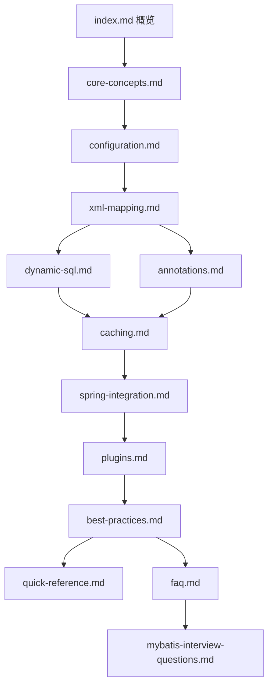

# Design Document: MyBatis 文档

## Overview

本设计文档描述了为技术文档站点添加 MyBatis 持久层框架完整学习指南的实现方案。文档将基于 Docusaurus 框架，遵循现有文档站点的结构和风格规范，提供从基础到高级的系统化学习内容。

## Architecture

### 文档目录结构

```
docs/
├── mybatis/                          # MyBatis 文档目录
│   ├── _category_.json               # 侧边栏分类配置
│   ├── index.md                      # 概览首页
│   ├── core-concepts.md              # 核心概念
│   ├── configuration.md              # 配置详解
│   ├── xml-mapping.md                # XML 映射
│   ├── dynamic-sql.md                # 动态 SQL
│   ├── annotations.md                # 注解映射
│   ├── caching.md                    # 缓存机制
│   ├── spring-integration.md         # Spring 集成
│   ├── plugins.md                    # 插件机制
│   ├── best-practices.md             # 最佳实践
│   ├── quick-reference.md            # 快速参考
│   └── faq.md                        # 常见问题
├── interview/
│   └── mybatis-interview-questions.md # MyBatis 面试题
```

### 文档依赖关系



## Components and Interfaces

### 1. 分类配置文件 (_category_.json)

```json
{
  "label": "MyBatis",
  "position": 15,
  "link": {
    "type": "generated-index",
    "description": "MyBatis 持久层框架完整学习指南"
  }
}
```

### 2. 文档 Frontmatter 规范

每个 Markdown 文件必须包含标准 frontmatter：

```yaml
---
sidebar_position: <number>
title: <页面标题>
---
```

### 3. 文档内容结构规范

每个文档页面应包含：
- 标题和简介
- 核心内容章节
- 代码示例（使用 ```java 或 ```xml 代码块）
- 相关链接
- 页脚（更新时间、版本信息）

## Data Models

### 文档元数据模型

| 字段 | 类型 | 描述 |
|------|------|------|
| sidebar_position | number | 侧边栏排序位置 |
| title | string | 页面标题 |
| id | string | 可选，文档唯一标识 |
| sidebar_label | string | 可选，侧边栏显示名称 |

### 文档文件命名规范

- 使用 kebab-case 命名（小写字母，单词间用连字符）
- 文件扩展名为 `.md`
- 示例：`core-concepts.md`, `xml-mapping.md`, `spring-integration.md`

## Correctness Properties

*A property is a characteristic or behavior that should hold true across all valid executions of a system-essentially, a formal statement about what the system should do. Properties serve as the bridge between human-readable specifications and machine-verifiable correctness guarantees.*

### Property 1: 文档命名规范一致性

*For any* 文档文件在 `docs/mybatis/` 目录下，文件名应符合 kebab-case 命名规范（小写字母和连字符）。

**Validates: Requirements 1.3**

### Property 2: Frontmatter 格式一致性

*For any* Markdown 文档文件，其 frontmatter 应包含必需的 `sidebar_position` 和 `title` 字段，且格式符合 YAML 规范。

**Validates: Requirements 2.5**

### Property 3: 内部链接有效性

*For any* 文档中的内部链接（以 `/docs/` 开头），链接目标文件应存在于文档目录中。

**Validates: Requirements 14.3**

## Error Handling

### 文档构建错误

| 错误类型 | 原因 | 解决方案 |
|----------|------|----------|
| Frontmatter 解析错误 | YAML 格式不正确 | 检查缩进和语法 |
| 链接 404 | 目标文件不存在 | 检查链接路径 |
| 侧边栏排序冲突 | position 重复 | 调整 sidebar_position |

## Testing Strategy

### 文档验证方式

由于本项目是文档创建任务，主要通过以下方式验证：

1. **结构验证**：检查所有必需文件是否存在
2. **格式验证**：验证 frontmatter 格式正确
3. **链接验证**：确保内部链接指向有效目标
4. **构建验证**：运行 `npm run build` 确保文档站点构建成功

### 验证清单

- [ ] 所有文档文件已创建
- [ ] _category_.json 配置正确
- [ ] 所有 frontmatter 格式正确
- [ ] 内部链接有效
- [ ] 代码示例语法正确
- [ ] 文档站点构建成功

## 文档内容大纲

### index.md - 概览首页

1. MyBatis 简介
2. 核心特性
3. 学习路径（初级/中级/高级）
4. 完整学习资源表格
5. 相关资源链接

### core-concepts.md - 核心概念

1. MyBatis 架构概述
2. 核心组件（SqlSessionFactory、SqlSession、Mapper）
3. MyBatis vs JDBC 对比
4. 工作流程和执行原理

### configuration.md - 配置详解

1. 配置文件结构
2. 核心配置项
3. 环境配置
4. 类型别名和类型处理器

### xml-mapping.md - XML 映射

1. Mapper XML 结构
2. CRUD 标签详解
3. resultMap 配置
4. 参数映射（#{} vs ${}）
5. 高级映射（关联查询）

### dynamic-sql.md - 动态 SQL

1. if 条件判断
2. choose/when/otherwise
3. where/set/trim
4. foreach 批量操作
5. sql 片段复用
6. bind 变量绑定

### annotations.md - 注解映射

1. 基本 CRUD 注解
2. 结果映射注解
3. @Provider 动态 SQL
4. XML vs 注解对比

### caching.md - 缓存机制

1. 一级缓存原理
2. 二级缓存配置
3. 缓存失效场景
4. 第三方缓存集成

### spring-integration.md - Spring 集成

1. MyBatis-Spring 配置
2. Spring Boot Starter
3. 事务管理
4. 多数据源配置

### plugins.md - 插件机制

1. 插件原理
2. 四大拦截对象
3. 自定义插件开发
4. PageHelper 分页插件
5. MyBatis-Plus 简介

### best-practices.md - 最佳实践

1. Mapper 设计规范
2. SQL 编写规范
3. 性能优化建议
4. 项目结构建议

### quick-reference.md - 快速参考

1. 配置项速查
2. XML 标签速查
3. 注解速查
4. 动态 SQL 速查
5. 常用代码片段

### faq.md - 常见问题

1. 配置问题
2. 映射问题
3. 性能问题
4. Spring 集成问题

### mybatis-interview-questions.md - 面试题

1. 基础概念题
2. 缓存机制题
3. 动态 SQL 题
4. 源码原理题
