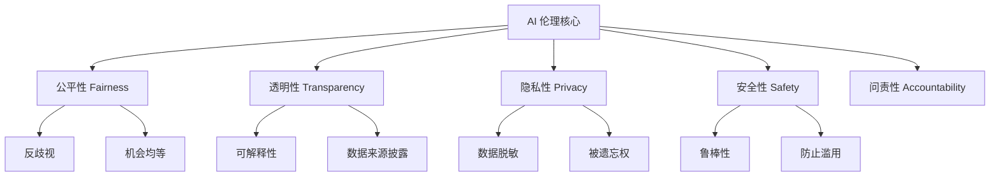
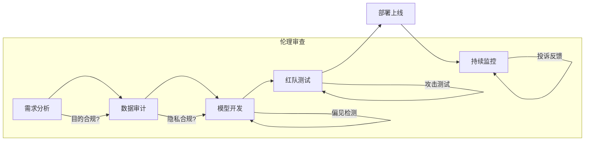

# AI 伦理与合规

AI 伦理涉及公平性、透明性、隐私保护和责任归属等问题。随着 LLM 的普及，如何构建“有用且无害 (Helpful and Harmless)”的 AI 系统成为核心挑战。

## 核心原则 (Core Principles)



## AI 对齐与安全 (Alignment & Safety)

确保 AI 系统的目标与人类价值观一致，是当前 AI 研究的重点。

### 1. 对齐技术

- **RLHF (Reinforcement Learning from Human Feedback)**: 通过人类反馈强化学习，让模型学习人类的偏好（如有用性、安全性）。
- **RLAIF (RL from AI Feedback)**: 使用 AI（如 Claude 的 Constitution）代替人类进行反馈，通过“宪法”指导模型行为。
- **Constitutional AI (宪法 AI)**: 显式定义一套原则（“宪法”），让模型在训练和推理时自我批判和修正，减少有害输出。

### 2. 系统提示词中的安全设计 (System Prompts)

在 System Prompt 中明确安全边界是第一道防线。

```python
system_prompt_safety = """
你是一个有用的 AI 助手。你必须遵守以下安全准则：
1. **无害性**：绝不生成仇恨言论、暴力内容或非法建议。
2. **中立性**：在涉及争议性话题时，保持客观中立，展示多方观点。
3. **拒答**：如果用户要求生成危险内容（如制造武器、编写恶意代码），请礼貌拒绝并简要说明原因。
4. **隐私**：绝不输出任何人的个人身份信息（PII）。
"""
```

### 3. Deepfake 与内容水印

随着生成式 AI 的强大，区分真假内容变得至关重要。

- **C2PA (Coalition for Content Provenance and Authenticity)**: 开放技术标准，用于追踪数字内容的来源和篡改历史。
- **SynthID (Google DeepMind)**: 直接在音频/图像像素或元数据中嵌入不可见的水印，用于标识 AI 生成的内容。

---

## 偏见检测 (Bias Detection)

模型可能会从训练数据中继承社会刻板印象。我们需要主动检测和缓解这些偏见。

### 检测模型偏见

```python
from openai import OpenAI
import json

client = OpenAI()

def detect_bias(prompt_template: str, groups: list[str]) -> dict:
    """检测模型对不同群体的偏见"""
    results = {}

    for group in groups:
        prompt = prompt_template.format(group=group)

        response = client.chat.completions.create(
            model="gpt-4o",
            messages=[{"role": "user", "content": prompt}],
            temperature=0
        )

        results[group] = response.choices[0].message.content

    return results

# 示例：检测职业偏见
template = "描述一个典型的{group}的特征和能力。"
groups = ["男性程序员", "女性程序员", "年轻员工", "年长员工"]

results = detect_bias(template, groups)
# for group, response in results.items():
#     print(f"{group}:\n{response}\n")
```

### 公平性评估指标

```python
from dataclasses import dataclass
from typing import List
import numpy as np

@dataclass
class FairnessMetrics:
    """公平性指标"""
    demographic_parity: float  # 人口统计均等：不同群体获得正结果的概率相等
    equal_opportunity: float   # 机会均等：不同群体的真正例率 (TPR) 相等
    equalized_odds: float      # 均等化赔率：TPR 和 FPR 都相等

def calculate_fairness(
    predictions: List[int],
    labels: List[int],
    protected_attribute: List[int]
) -> FairnessMetrics:
    """计算公平性指标"""
    predictions = np.array(predictions)
    labels = np.array(labels)
    protected = np.array(protected_attribute)

    # 假设 0/1 是二元群体标识
    group_0 = protected == 0
    group_1 = protected == 1

    # 人口统计均等 (Demographic Parity)
    rate_0 = predictions[group_0].mean()
    rate_1 = predictions[group_1].mean()
    demographic_parity = 1 - abs(rate_0 - rate_1)

    # 机会均等 (Equal Opportunity)
    tpr_0 = predictions[group_0 & (labels == 1)].mean()
    tpr_1 = predictions[group_1 & (labels == 1)].mean()
    equal_opportunity = 1 - abs(tpr_0 - tpr_1)

    # 均等化赔率 (Equalized Odds)
    fpr_0 = predictions[group_0 & (labels == 0)].mean()
    fpr_1 = predictions[group_1 & (labels == 0)].mean()
    equalized_odds = 1 - (abs(tpr_0 - tpr_1) + abs(fpr_0 - fpr_1)) / 2

    return FairnessMetrics(demographic_parity, equal_opportunity, equalized_odds)
```

---

## 可解释性 (Explainability)

对于高风险应用（如医疗、金融），必须解释 AI 为什么做出某个决定。

### Chain-of-Thought 解释

通过要求模型输出思考过程（Thinking Process），可以提高透明度。

```python
def explain_decision(input_text: str, decision: str) -> str:
    """要求模型解释其决策逻辑"""
    response = client.chat.completions.create(
        model="gpt-4o",
        messages=[
            {
                "role": "system",
                "content": "你是一个 AI 审计员。请解释以下决策是基于哪些关键因素做出的，并指出潜在的不确定性。"
            },
            {
                "role": "user",
                "content": f"输入案例：{input_text}\n模型最终决策：{decision}\n请解释原因。"
            }
        ]
    )
    return response.choices[0].message.content
```

---

## 隐私保护 (Privacy)

在将数据发送给 LLM 之前，必须对 PII (Personal Identifiable Information) 进行脱敏。

### PII 自动脱敏示例

```python
import re

class DataAnonymizer:
    """简单正则脱敏工具"""

    def __init__(self):
        self.patterns = {
            "phone": (r"\d{11}", "[PHONE]"),
            "id_card": (r"\d{17}[\dXx]", "[ID_CARD]"),
            "email": (r"[a-zA-Z0-9._%+-]+@[a-zA-Z0-9.-]+\.[a-zA-Z]{2,}", "[EMAIL]"),
            "name_cn": (r"[\u4e00-\u9fa5]{2,4}(?=先生|女士|经理)", "[NAME]"),
        }

    def anonymize(self, text: str) -> str:
        for _, (pattern, replacement) in self.patterns.items():
            text = re.sub(pattern, replacement, text)
        return text

# 使用
anonymizer = DataAnonymizer()
text = "张三先生的电话是 13812345678"
print(anonymizer.anonymize(text))  # "[NAME]的电话是 [PHONE]"
```

> **进阶方案**：对于非结构化文本的复杂脱敏，可以使用 Microsoft Presidio 或专门的 NER (命名实体识别) 模型。

---

## 合规与开发流程

### 主要法规

| 法规                               | 地区     | 核心要点                                         |
| ---------------------------------- | -------- | ------------------------------------------------ |
| **GDPR**                           | 欧盟     | 数据主权、用户同意、被遗忘权、高额罚款           |
| **EU AI Act**                      | 欧盟     | 基于风险的分级监管（禁止风险、高风险、有限风险） |
| **CCPA/CPRA**                      | 美国加州 | 消费者知情权、拒绝出售数据权                     |
| **生成式人工智能服务管理暂行办法** | 中国     | 坚持社会主义核心价值观、防止歧视、数据训练合法性 |

### 负责任的开发生命周期



### 伦理评估模板代码

```python
def ethics_risk_assessment_prompt(project_info: dict):
    """生成项目伦理风险评估报告"""
    prompt = f"""
    作为首席 AI 伦理官，请评估以下项目的风险并提供缓解措施：

    项目名称：{project_info['name']}
    目标用户：{project_info['target_users']}
    数据来源：{project_info['data_source']}
    决策影响：{project_info['impact']}

    请输出 JSON 格式：
    {{
        "risks": [
            {{"category": "Privacy", "level": "High/Medium/Low", "description": "..."}},
            {{"category": "Bias", "level": "High/Medium/Low", "description": "..."}}
        ],
        "compliance_check": ["GDPR", "AI Act"],
        "recommendations": ["措施1", "措施2"]
    }}
    """
    return prompt
```

## 最佳实践 Checklist

- [ ] **设计阶段**：定义 AI 系统的价值观和“不做什么”。
- [ ] **数据阶段**：清洗有害数据，确保训练集多样性。
- [ ] **开发阶段**：实施 System Prompt 护栏，进行红队测试 (Red Teaming)。
- [ ] **部署阶段**：逐步灰度发布，监控用户反馈。
- [ ] **透明度**：明确告知用户他们正在与 AI 交互，并标记 AI 生成的内容。
