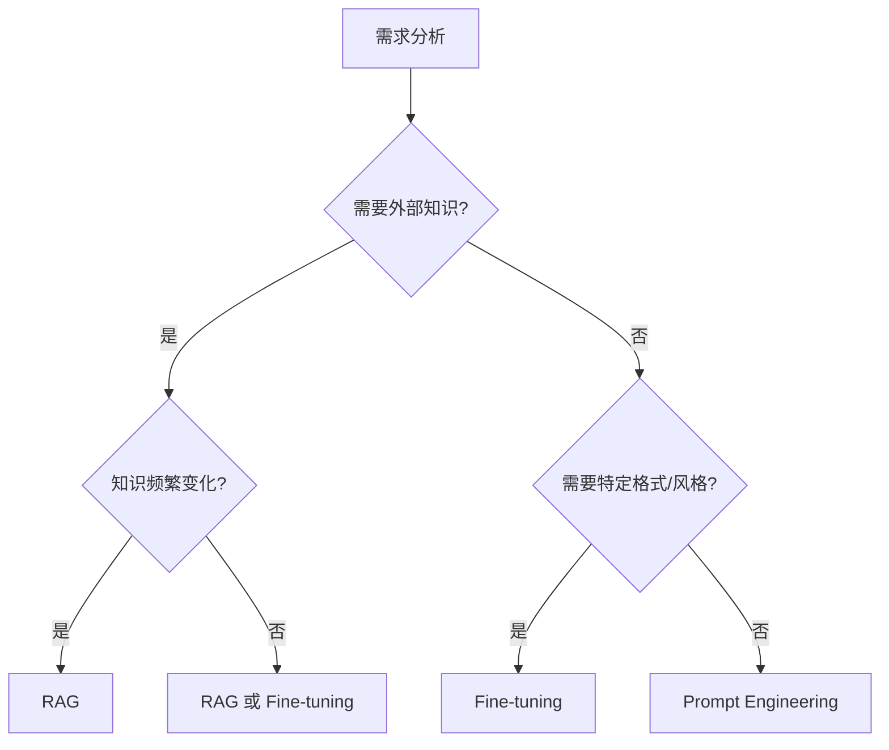

# Fine-tuning（微调）

Fine-tuning（微调）是用你的数据对基础模型进行再训练，使其更符合特定任务、格式或风格。它常用于"让模型更像你的产品"，而不是"让模型知道更多事实"。

## 什么时候适合微调

### 适合微调的场景

| 场景             | 说明                                   |
| ---------------- | -------------------------------------- |
| **稳定输出格式** | 固定 JSON/SQL/函数参数结构             |
| **任务专精**     | 分类、信息抽取、客服意图识别、代码补全 |
| **语气风格统一** | 品牌口吻、写作风格一致                 |
| **减少 Prompt**  | 把复杂指令"内化"到模型中               |

### 不太适合微调的场景

- **需要最新知识/私有知识**：优先用 RAG
- **频繁变化的知识**：微调维护成本高
- **简单任务**：Few-shot Prompting 可能就够了

## RAG vs Fine-tuning 的选择

| 目标                   | 推荐方案                           |
| ---------------------- | ---------------------------------- |
| 补充可变知识/私有知识  | RAG                                |
| 改变模型行为/格式/风格 | Fine-tuning                        |
| 两者都需要             | RAG + Fine-tuning（或 RAG + 指令优化） |



## 数据准备

### 数据质量原则

- **样本质量 > 数量**：先做 100-500 条高质量"黄金样本"
- **覆盖边界情况**：错误输入、缺字段、歧义问题、长文本
- **去重与一致性**：同类问题答案不要互相矛盾
- **安全与合规**：移除敏感信息（PII、密钥、内部机密）

### 数据格式

#### OpenAI 格式（对话）

```json
{"messages": [
  {"role": "system", "content": "你是企业客服助手。"},
  {"role": "user", "content": "怎么重置密码？"},
  {"role": "assistant", "content": "你可以在登录页点击"忘记密码"，然后按照邮件提示操作。"}
]}
```

#### 分类任务格式

```json
{"messages": [
  {"role": "system", "content": "对用户反馈进行分类，类别：bug/feature/question/other"},
  {"role": "user", "content": "登录按钮点击没反应"},
  {"role": "assistant", "content": "bug"}
]}
```

#### 信息抽取格式

```json
{"messages": [
  {"role": "system", "content": "从文本中提取结构化信息，输出 JSON"},
  {"role": "user", "content": "张三，男，1990年出生，现居北京"},
  {"role": "assistant", "content": "{\"name\": \"张三\", \"gender\": \"男\", \"birth_year\": 1990, \"city\": \"北京\"}"}
]}
```

### 数据准备脚本

```python
import json
from pathlib import Path

def prepare_training_data(raw_data: list[dict], output_path: str):
    """将原始数据转换为 OpenAI 微调格式"""
    formatted_data = []
    
    for item in raw_data:
        formatted_item = {
            "messages": [
                {"role": "system", "content": item.get("system_prompt", "")},
                {"role": "user", "content": item["input"]},
                {"role": "assistant", "content": item["output"]}
            ]
        }
        formatted_data.append(formatted_item)
    
    # 写入 JSONL 文件
    with open(output_path, 'w', encoding='utf-8') as f:
        for item in formatted_data:
            f.write(json.dumps(item, ensure_ascii=False) + '\n')
    
    print(f"已生成 {len(formatted_data)} 条训练数据")
    return formatted_data

def validate_data(file_path: str) -> dict:
    """验证训练数据格式"""
    errors = []
    total = 0
    
    with open(file_path, 'r', encoding='utf-8') as f:
        for i, line in enumerate(f, 1):
            total += 1
            try:
                data = json.loads(line)
                if "messages" not in data:
                    errors.append(f"Line {i}: missing 'messages' field")
                else:
                    for msg in data["messages"]:
                        if "role" not in msg or "content" not in msg:
                            errors.append(f"Line {i}: invalid message format")
            except json.JSONDecodeError as e:
                errors.append(f"Line {i}: JSON parse error - {e}")
    
    return {
        "total": total,
        "valid": total - len(errors),
        "errors": errors[:10]  # 只返回前 10 个错误
    }
```

## OpenAI Fine-tuning 实战

### 1. 上传训练数据

```python
from openai import OpenAI

client = OpenAI()

# 上传训练文件
training_file = client.files.create(
    file=open("training_data.jsonl", "rb"),
    purpose="fine-tune"
)

print(f"File ID: {training_file.id}")
```

### 2. 创建微调任务

```python
# 创建微调任务
fine_tune_job = client.fine_tuning.jobs.create(
    training_file=training_file.id,
    model="gpt-4o-mini-2024-07-18",  # 基础模型
    hyperparameters={
        "n_epochs": 3,  # 训练轮数
        "batch_size": "auto",
        "learning_rate_multiplier": "auto"
    },
    suffix="my-custom-model"  # 模型名称后缀
)

print(f"Job ID: {fine_tune_job.id}")
print(f"Status: {fine_tune_job.status}")
```

### 3. 监控训练进度

```python
import time

def monitor_fine_tuning(job_id: str):
    """监控微调任务进度"""
    while True:
        job = client.fine_tuning.jobs.retrieve(job_id)
        print(f"Status: {job.status}")
        
        if job.status == "succeeded":
            print(f"✅ 训练完成！模型 ID: {job.fine_tuned_model}")
            return job.fine_tuned_model
        elif job.status == "failed":
            print(f"❌ 训练失败: {job.error}")
            return None
        
        # 获取最新事件
        events = client.fine_tuning.jobs.list_events(job_id, limit=5)
        for event in events.data:
            print(f"  [{event.created_at}] {event.message}")
        
        time.sleep(60)  # 每分钟检查一次

# 监控训练
model_id = monitor_fine_tuning(fine_tune_job.id)
```

### 4. 使用微调模型

```python
# 使用微调后的模型
response = client.chat.completions.create(
    model=model_id,  # 使用微调模型 ID
    messages=[
        {"role": "user", "content": "怎么修改收货地址？"}
    ],
    temperature=0.7
)

print(response.choices[0].message.content)
```

## 训练参数调优

### 关键超参数

| 参数                       | 说明                 | 建议值       |
| -------------------------- | -------------------- | ------------ |
| `n_epochs`                 | 训练轮数             | 2-4          |
| `batch_size`               | 批次大小             | auto 或 4-32 |
| `learning_rate_multiplier` | 学习率倍数           | 0.5-2.0      |

### 参数选择建议

```python
# 小数据集 (< 100 条)
hyperparameters = {
    "n_epochs": 4,
    "learning_rate_multiplier": 0.5  # 降低学习率防止过拟合
}

# 中等数据集 (100-1000 条)
hyperparameters = {
    "n_epochs": 3,
    "learning_rate_multiplier": "auto"
}

# 大数据集 (> 1000 条)
hyperparameters = {
    "n_epochs": 2,
    "learning_rate_multiplier": 1.0
}
```

## 评估与验证

### 创建评估集

```python
def split_data(data: list, train_ratio: float = 0.9):
    """划分训练集和验证集"""
    import random
    random.shuffle(data)
    split_idx = int(len(data) * train_ratio)
    return data[:split_idx], data[split_idx:]

# 使用验证集
fine_tune_job = client.fine_tuning.jobs.create(
    training_file=training_file.id,
    validation_file=validation_file.id,  # 添加验证集
    model="gpt-4o-mini-2024-07-18"
)
```

### 评估指标

```python
def evaluate_model(model_id: str, test_data: list) -> dict:
    """评估微调模型"""
    correct = 0
    total = len(test_data)
    
    for item in test_data:
        response = client.chat.completions.create(
            model=model_id,
            messages=[
                {"role": "system", "content": item["system"]},
                {"role": "user", "content": item["input"]}
            ],
            temperature=0
        )
        
        predicted = response.choices[0].message.content.strip()
        expected = item["expected"].strip()
        
        if predicted == expected:
            correct += 1
    
    return {
        "accuracy": correct / total,
        "correct": correct,
        "total": total
    }
```

## 生产落地建议

### 版本管理

```python
# 记录模型版本信息
model_registry = {
    "v1.0": {
        "model_id": "ft:gpt-4o-mini:org::abc123",
        "training_file": "training_v1.jsonl",
        "metrics": {"accuracy": 0.92},
        "created_at": "2024-01-15",
        "status": "deprecated"
    },
    "v1.1": {
        "model_id": "ft:gpt-4o-mini:org::def456",
        "training_file": "training_v1.1.jsonl",
        "metrics": {"accuracy": 0.95},
        "created_at": "2024-02-01",
        "status": "production"
    }
}
```

### 灰度发布

```python
import random

def get_model_for_request(user_id: str, rollout_percentage: float = 0.1):
    """灰度发布：部分流量使用新模型"""
    if random.random() < rollout_percentage:
        return "ft:gpt-4o-mini:org::new_model"  # 新模型
    return "ft:gpt-4o-mini:org::stable_model"   # 稳定模型
```

### 回滚策略

```python
class ModelManager:
    def __init__(self):
        self.current_model = "ft:gpt-4o-mini:org::v1.1"
        self.fallback_model = "ft:gpt-4o-mini:org::v1.0"
        self.error_count = 0
        self.error_threshold = 10
    
    def get_model(self):
        if self.error_count > self.error_threshold:
            print("⚠️ 错误过多，回滚到稳定版本")
            return self.fallback_model
        return self.current_model
    
    def report_error(self):
        self.error_count += 1
    
    def reset_errors(self):
        self.error_count = 0
```

## 成本估算

| 模型              | 训练成本        | 推理成本（输入） | 推理成本（输出） |
| ----------------- | --------------- | ---------------- | ---------------- |
| gpt-4o-mini       | $3.00 / 1M tokens | $0.30 / 1M       | $1.20 / 1M       |
| gpt-4o            | $25.00 / 1M tokens | $5.00 / 1M       | $15.00 / 1M      |

:::tip 成本优化
- 先用小模型 (gpt-4o-mini) 验证效果
- 精简训练数据，去除冗余样本
- 使用验证集及早停止，避免过度训练
:::

## 常见问题

### 1. 过拟合

**症状**：训练集表现好，测试集表现差

**解决方案**：
- 增加训练数据多样性
- 减少训练轮数
- 降低学习率

### 2. 欠拟合

**症状**：训练集和测试集表现都不好

**解决方案**：
- 增加训练数据量
- 增加训练轮数
- 检查数据质量

### 3. 格式不稳定

**症状**：输出格式时好时坏

**解决方案**：
- 在训练数据中增加格式示例
- 使用 JSON Mode
- 添加格式验证后处理

## 延伸阅读

- [OpenAI Fine-tuning 文档](https://platform.openai.com/docs/guides/fine-tuning)
- [LoRA Fine-tuning 实战](./lora-fine-tuning) - 本地微调开源模型
