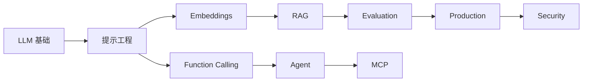

# AI 开发概览

欢迎来到 AI 开发文档。这里汇集了关于人工智能应用开发的核心概念和技术指南，特别是针对大语言模型（LLM）的应用开发。

## 文档导航

### 📖 基础知识

- [🧠 LLM 基础知识](./llm-fundamentals) - Transformer 架构、Token、生成参数、主流模型介绍
- [✨ 提示工程](./prompt-engineering) - Prompt 设计原则、技巧与模板
- [🧩 Embeddings（向量表示）](./embeddings) - 向量表示、相似度、切分与入库实践

### 🎯 核心技术

- [🤖 AI Agent (智能体)](./agent) - Agent 架构、工作模式与代码实现
- [🔧 Function Calling](./function-calling) - 函数调用原理与 API 使用
- [📚 RAG (检索增强生成)](./rag) - RAG 工作流程与代码实践
- [🔌 MCP (模型上下文协议)](./mcp) - 模型与外部工具的标准化连接协议

### 🛠️ 工程实践

- [🧪 Fine-tuning（微调）](./fine-tuning) - 什么时候用微调、数据准备、评估与发布
- [📏 Evaluation（评估与测试）](./evaluation) - 离线评估、在线 A/B、回归体系
- [🚀 Production（生产化与部署）](./production) - 延迟/成本/稳定性/观测/发布策略
- [🔐 Security（安全与隐私）](./security) - Prompt 注入、工具滥用、权限与脱敏

### 📚 参考指南

- [📋 快速参考](./quick-reference) - API、参数、代码片段速查
- [❓ 常见问题](./faq) - FAQ 解答

## 学习路线

**推荐顺序**：

1. **基础概念**：先掌握 LLM 工作原理和 Prompt 技巧
2. **向量与检索**：理解 Embeddings，为 RAG/记忆打基础
3. **知识增强**：通过 RAG 连接外部知识库
4. **工具调用**：学习 Function Calling，让模型具备行动能力
5. **智能体**：构建完整的 Agent 系统（规划/记忆/工具编排）
6. **评估体系**：建立离线回归与在线 A/B，让迭代可控
7. **生产化**：优化延迟/成本/稳定性/观测与发布流程
8. **安全与隐私**：处理注入、越权、工具滥用与脱敏
9. **标准集成**：使用 MCP 实现标准化工具连接

## 技术栈推荐

| 类型       | 推荐                          | 备选               |
| ---------- | ----------------------------- | ------------------ |
| **框架**   | LangChain                     | LlamaIndex         |
| **模型**   | GPT-4o / Claude 3.5           | Qwen2 / LLaMA 3    |
| **向量库** | Chroma (开发) / Milvus (生产) | Pinecone, pgvector |
| **评估**   | Langsmith                     | Arize, Deepeval    |
