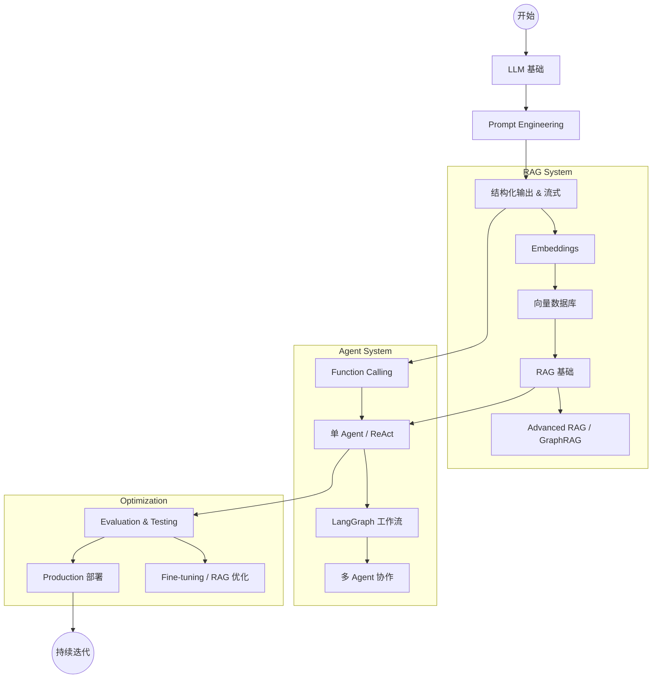

# AI 开发概览

欢迎来到 AI 开发文档。
这里是构建现代人工智能应用的完整知识库，专注于 **LLM (Large Language Model)** 全栈开发。无论是想了解 Transformer 原理，还是构建生产级的 RAG 系统和 Agent，这里都有你需要的指南。

## 🎯 你的角色是？(Learning Paths)

为了帮助你更高效地学习，我们为不同背景的开发者整理了推荐路径：

### 🐣 初学者 (Beginner / Student)

_目标：理解核心概念，跑通第一个 Demo_

1. **基础**：[LLM 基础知识](./llm-fundamentals) -> [Prompt Engineering](./prompt-engineering)
2. **上手**：[本地部署 LLM](./local-llm) (Ollama) -> [AI 编码助手开发](./coding-assistant)

### 👩‍💻 应用开发者 (App Developer)

_目标：在应用中集成 AI 能力_

1. **核心**：[Prompt Engineering](./prompt-engineering) -> [结构化输出](./structured-output) -> [Function Calling](./function-calling)
2. **进阶**：[RAG 实战](./rag) -> [向量数据库](./vector-database) -> [多模态](./multimodal)
3. **架构**：[AI Agent](./agent) -> [LangGraph 工作流](./langgraph)

### 🧪 算法/模型工程师 (AI Engineer)

_目标：优化模型效果，训练自有模型_

1. **优化**：[Evaluation (评估)](./evaluation) -> [Fine-tuning (微调)](./fine-tuning) -> [RAG](./rag)
2. **深入**：[GraphRAG](./graphrag) -> [LoRA Fine-tuning](./lora-fine-tuning) -> [模型蒸馏](./distillation)
3. **前沿**：[Reasoning 模型 (o1/o3)](./reasoning) -> [Speculative Decoding](./speculative-decoding)

### 🚀 架构师/Tech Lead (Architect)

_目标：技术选型，生产化落地，安全合规_

1. **落地**：[Production (生产化)](./production) -> [成本优化](./cost-optimization) -> [可观测性](./observability)
2. **安全**：[Security](./security) -> [Guardrails](./guardrails) -> [AI 伦理](./ai-ethics)
3. **基础设施**：[MCP 协议](./mcp) -> [本地部署](./local-llm) -> [Agent 架构](./agent)

---

## 📚 文档导航

### 📖 基础知识 (Foundations)

- [🧠 LLM 基础知识](./llm-fundamentals) - Transformer 架构、Token、生成参数、主流模型
- [✨ 提示工程 (Prompt Engineering)](./prompt-engineering) - COT、Few-Shot、Prompt 模板与最佳实践
- [🧩 Embeddings](./embeddings) - 向量表示原理、文本切分 (Chunking) 与余弦相似度

### 🎯 核心技术 (Core Technologies)

- [🤖 AI Agent (智能体)](./agent) - **(New)** Agent 架构、ReAct 模式、记忆与规划
- [🔧 Function Calling](./function-calling) - 让 LLM 连接外部工具与 API
- [📚 RAG (检索增强生成)](./rag) - 解决幻觉、连接私有数据的标准范式
- [🔌 MCP (Model Context Protocol)](./mcp) - 开放标准，实现 AI 模型与数据的解耦连接
- [🔀 LangGraph 工作流](./langgraph) - 构建有状态、复杂的 Agent 业务流

### 🛠️ 工程实践 (Engineering)

- [🧪 Evaluation (评估)](./evaluation) - 你的 RAG 效果如何？Ragas, TruLens, A/B 测试
- [🚀 Production (生产化)](./production) - 延迟优化 (TTFT)、高并发、主要故障模式
- [💰 成本优化](./cost-optimization) - Token 精打细算、Prompt Caching、模型路由
- [📊 可观测性 (Observability)](./observability) - 全链路追踪 (Tracing)、Prompt 调试
- [🔐 Security (安全)](./security) - Prompt 注入防护、PII 隐私过滤

### 🎨 多模态与进阶 (Advanced)

- [🖼️ 多模态应用](./multimodal) - VQA、图生文、语音交互 (Voice)
- [📐 结构化输出](./structured-output) - 稳定输出 JSON/Pydantic 对象
- [🌊 流式交互 (Streaming)](./streaming) - 提升用户体验的打字机效果
- [🏠 本地部署](./local-llm) - 使用 vLLM/Ollama 部署 Llama 3, Qwen, DeepSeek
- [🧩 推理模型 (Reasoning)](./reasoning) - OpenAI o1/o3, DeepSeek-R1 使用指南

### 🔧 深度优化 (Deep Optimization)

- [🧪 Fine-tuning (全量微调)](./fine-tuning) - 注入领域知识，改变模型行为
- [🚀 LoRA Fine-tuning](./lora-fine-tuning) - 高效参数微调实战
- [🧬 模型蒸馏 (Distillation)](./distillation) - 老师教学生，降低小模型推理成本
- [🔀 模型合并 (Merging)](./model-merging) - 组合多个模型的专长
- [🕸️ GraphRAG](./graphrag) - 结合知识图谱，解决跨文档的全局性问题

### 🛡️ 安全与合规

- [🛡️ Guardrails (护栏)](./guardrails) - 确保 AI 不说脏话、不聊政治
- [⚖️ AI 伦理](./ai-ethics) - 偏见、公平性与负责任的 AI
- [🔒 联邦学习](./federated-learning) - 数据不出域的协作训练

---

## 技术栈雷达 (Tech Stack Radar)

| 层级                  | 2025 推荐选型                                         | 备选方案                         |
| :-------------------- | :---------------------------------------------------- | :------------------------------- |
| **Foundation Models** | **GPT-4o**, **Claude 3.5 Sonnet**, **Gemini 1.5 Pro** | DeepSeek-V3, Qwen 2.5, Llama 3.1 |
| **Reasoning Models**  | **OpenAI o1 / o3**                                    | DeepSeek-R1, QwQ                 |
| **Frameworks**        | **LangChain** (通用), **LangGraph** (Agent)           | LlamaIndex (RAG 强项), AutoGen   |
| **Vector DB**         | **Milvus** (生产), **Chroma** (轻量)                  | Pinecone, Weaviate, pgvector     |
| **Evaluation**        | **Ragas**, **LangSmith**                              | Arize Phoenix, DeepEval          |
| **Deployment**        | **vLLM** (高吞吐), **Ollama** (本地)                  | TensorRT-LLM, TGI                |
| **Serving**           | **FastAPI**, **Vercel AI SDK**                        | Streamlit, Chainlit              |

## 学习路线图

