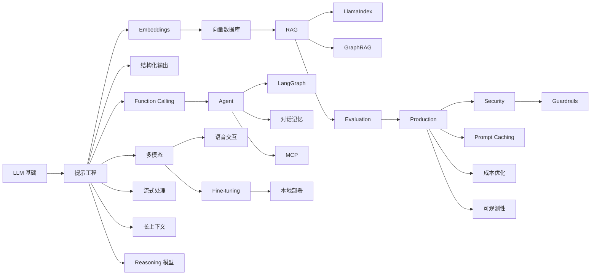

# AI 开发概览

欢迎来到 AI 开发文档。这里汇集了关于人工智能应用开发的核心概念和技术指南，特别是针对大语言模型（LLM）的应用开发。

## 文档导航

### 📖 基础知识

- [🧠 LLM 基础知识](./llm-fundamentals) - Transformer 架构、Token、生成参数、主流模型介绍
- [✨ 提示工程](./prompt-engineering) - Prompt 设计原则、技巧与模板
- [🧩 Embeddings（向量表示）](./embeddings) - 向量表示、相似度、切分与入库实践

### 🎯 核心技术

- [🤖 AI Agent (智能体)](./agent) - Agent 架构、工作模式与代码实现
- [🔧 Function Calling](./function-calling) - 函数调用原理与 API 使用
- [📚 RAG (检索增强生成)](./rag) - RAG 工作流程与代码实践
- [🔌 MCP (模型上下文协议)](./mcp) - 模型与外部工具的标准化连接协议
- [🔀 LangGraph 工作流编排](./langgraph) - 复杂 Agent 工作流、状态管理、人机协作

### 🛠️ 工程实践

- [🧪 Fine-tuning（微调）](./fine-tuning) - 什么时候用微调、数据准备、评估与发布
- [🧬 模型蒸馏](./distillation) - 大模型知识迁移到小模型
- [🎯 RLHF 与 DPO](./rlhf) - 人类反馈强化学习、偏好对齐
- [🔀 模型合并](./model-merging) - TIES、DARE、Task Arithmetic
- [📚 持续学习](./continual-learning) - 增量学习、防止灾难性遗忘
- [📏 Evaluation（评估与测试）](./evaluation) - 离线评估、在线 A/B、回归体系
- [🚀 Production（生产化与部署）](./production) - 延迟/成本/稳定性/观测/发布策略
- [🔐 Security（安全与隐私）](./security) - Prompt 注入、工具滥用、权限与脱敏

### 🎨 多模态与进阶

- [🖼️ 多模态 AI](./multimodal) - Vision、Audio、图像生成
- [📐 结构化输出](./structured-output) - JSON Mode、Pydantic 集成、数据提取
- [🌊 流式处理](./streaming) - 流式 API、SSE、前端集成
- [🏠 本地部署 LLM](./local-llm) - Ollama、vLLM、llama.cpp
- [🗜️ 模型量化](./quantization) - GGUF、GPTQ、AWQ、bitsandbytes
- [🧩 Mixture of Experts](./moe) - MoE 架构原理、Mixtral、DeepSeek
- [⚡ Speculative Decoding](./speculative-decoding) - 推测解码加速推理
- [🗄️ 向量数据库实战](./vector-database) - Chroma、Milvus、Pinecone、pgvector
- [🚀 LoRA Fine-tuning](./lora-fine-tuning) - 本地微调开源模型实战
- [🧩 Reasoning 模型](./reasoning) - o1/o3 推理模型使用指南

### 🔧 框架与优化

- [🦙 LlamaIndex 框架](./llamaindex) - 数据索引与检索专业框架
- [💾 Prompt Caching](./prompt-caching) - 提示缓存降低成本
- [📜 长上下文处理](./long-context) - Map-Reduce、Refine、层次化摘要
- [🧠 对话记忆管理](./memory) - 短期/长期记忆、向量记忆、实体记忆
- [🕸️ GraphRAG](./graphrag) - 知识图谱增强检索

### 🛡️ 安全与运维

- [🛡️ Guardrails（护栏）](./guardrails) - 输入输出过滤、内容审核、NeMo Guardrails
- [💰 成本优化](./cost-optimization) - Token 优化、模型选择、批处理、缓存策略
- [📊 AI 可观测性](./observability) - Tracing、Logging、Metrics、LangSmith
- [🎙️ 语音交互](./voice) - TTS、STT、OpenAI Realtime API
- [⚖️ AI 伦理与合规](./ai-ethics) - 偏见检测、公平性、隐私保护、合规要求
- [🔒 联邦学习](./federated-learning) - 隐私保护训练、FedAvg、Flower 框架

### 💻 应用开发

- [💻 AI 编码助手开发](./coding-assistant) - 代码补全、生成、解释、重构

### 📚 参考指南

- [📋 快速参考](./quick-reference) - API、参数、代码片段速查
- [❓ 常见问题](./faq) - FAQ 解答
- [📋 Gemini Workspace 提示词指南](./gemini-for-google-workspace-prompting-guide-101) - Google Workspace 提示词最佳实践

## 学习路线

**推荐顺序**：

1. **基础概念**：先掌握 LLM 工作原理和 Prompt 技巧
2. **输出控制**：学习结构化输出和流式处理
3. **向量与检索**：理解 Embeddings 和向量数据库
4. **知识增强**：通过 RAG 连接外部知识库，学习 LlamaIndex 和 GraphRAG
5. **工具调用**：学习 Function Calling，让模型具备行动能力
6. **智能体**：构建完整的 Agent 系统，掌握对话记忆管理
7. **工作流编排**：使用 LangGraph 处理复杂流程
8. **多模态**：掌握图像、音频、语音交互能力
9. **长上下文**：学习处理超长文档的策略
10. **推理模型**：使用 o1/o3 解决复杂推理问题
11. **评估体系**：建立离线回归与在线 A/B
12. **生产化**：优化延迟/成本/稳定性，使用 Prompt Caching
13. **安全防护**：Guardrails 护栏、注入防护、内容审核
14. **运维监控**：可观测性、成本优化
15. **本地部署**：使用 Ollama/vLLM 部署开源模型

## 技术栈推荐

| 类型         | 推荐                          | 备选               |
| ------------ | ----------------------------- | ------------------ |
| **框架**     | LangChain                     | LlamaIndex         |
| **工作流**   | LangGraph                     | Prefect, Airflow   |
| **模型**     | GPT-4o / Claude 3.5           | Qwen2.5 / LLaMA 3  |
| **推理模型** | o1-mini / o1                  | Claude 3.5 Sonnet  |
| **向量库**   | Chroma (开发) / Milvus (生产) | Pinecone, pgvector |
| **图数据库** | Neo4j                         | ArangoDB           |
| **评估**     | Langsmith                     | Arize, Deepeval    |
| **多模态**   | GPT-4o / Gemini 1.5           | Claude 3.5 Vision  |
| **语音**     | OpenAI Realtime API           | Azure Speech       |
| **微调**     | OpenAI Fine-tuning            | LoRA + PEFT        |
| **本地部署** | Ollama (开发) / vLLM (生产)   | llama.cpp, TGI     |
| **量化**     | GGUF (CPU) / AWQ (GPU)        | GPTQ, bitsandbytes |
| **MoE 模型** | Mixtral                       | DeepSeek, Qwen-MoE |
| **蒸馏**     | OpenAI Distillation           | 数据蒸馏           |
| **对齐**     | DPO                           | RLHF, ORPO         |
| **护栏**     | NeMo Guardrails               | Guardrails AI      |
| **可观测性** | LangSmith                     | Arize, OpenTelemetry |
