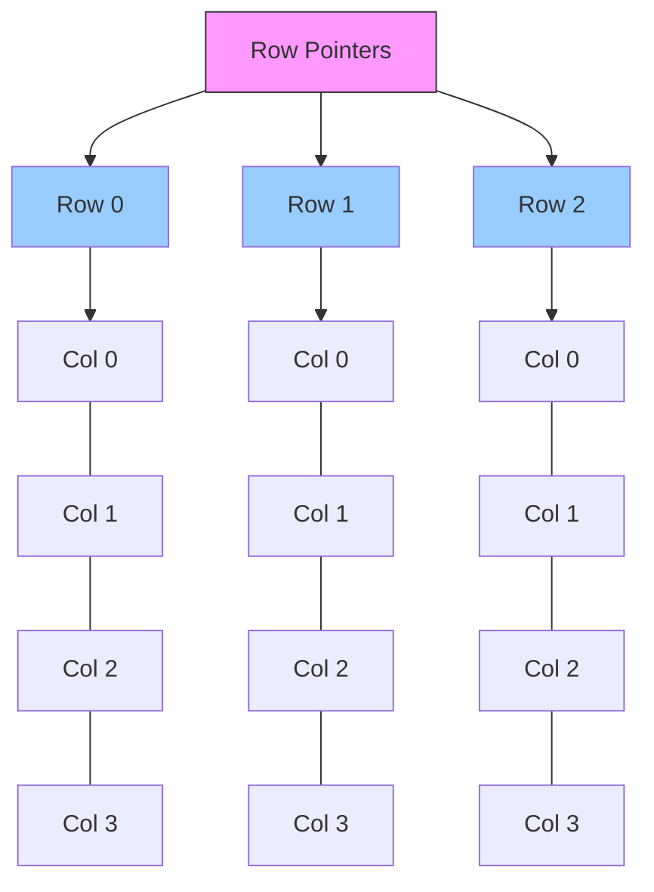

# 高级指针

深入探讨指针的高级用法，包括函数指针、复杂声明和常见模式。

## 函数指针详解

### 回调函数模式

```c
#include <stdio.h>
#include <stdlib.h>

// 定义回调函数类型
typedef void (*Callback)(int);

void on_success(int code) {
    printf("✅ 成功: %d\n", code);
}

void on_error(int code) {
    printf("❌ 错误: %d\n", code);
}

void process(int data, Callback success, Callback error) {
    if (data > 0) {
        success(data);
    } else {
        error(data);
    }
}

int main(void) {
    process(100, on_success, on_error);
    process(-1, on_success, on_error);
    return 0;
}
```

### 策略模式

```c
#include <stdio.h>

typedef int (*SortStrategy)(int, int);

int ascending(int a, int b) { return a - b; }
int descending(int a, int b) { return b - a; }

void sort(int arr[], int n, SortStrategy cmp) {
    for (int i = 0; i < n - 1; i++) {
        for (int j = 0; j < n - 1 - i; j++) {
            if (cmp(arr[j], arr[j+1]) > 0) {
                int temp = arr[j];
                arr[j] = arr[j+1];
                arr[j+1] = temp;
            }
        }
    }
}

void print(int arr[], int n) {
    for (int i = 0; i < n; i++) printf("%d ", arr[i]);
    printf("\n");
}

int main(void) {
    int arr1[] = {3, 1, 4, 1, 5, 9};
    int arr2[] = {3, 1, 4, 1, 5, 9};

    sort(arr1, 6, ascending);
    printf("升序: "); print(arr1, 6);

    sort(arr2, 6, descending);
    printf("降序: "); print(arr2, 6);

    return 0;
}
```

### 返回函数指针

```c
#include <stdio.h>

typedef int (*Operation)(int, int);

int add(int a, int b) { return a + b; }
int sub(int a, int b) { return a - b; }
int mul(int a, int b) { return a * b; }

Operation get_operation(char op) {
    switch (op) {
        case '+': return add;
        case '-': return sub;
        case '*': return mul;
        default: return NULL;
    }
}

int main(void) {
    Operation op = get_operation('+');
    if (op) {
        printf("10 + 5 = %d\n", op(10, 5));
    }
    return 0;
}
```

## 复杂指针声明

### 解读规则（右左法则）

```c
// 从标识符开始，先右后左

int *p;              // p 是指向 int 的指针
int *p[10];          // p 是数组，包含10个指向 int 的指针
int (*p)[10];        // p 是指针，指向包含10个 int 的数组
int *p(int);         // p 是函数，返回指向 int 的指针
int (*p)(int);       // p 是指针，指向返回 int 的函数
int (*p[10])(int);   // p 是数组，包含10个函数指针
```

### 使用 typedef 简化

```c
#include <stdio.h>

// 复杂声明
int (*(*fp)(int))[10];  // 难读

// 使用 typedef 简化
typedef int IntArray10[10];
typedef IntArray10* (*FuncPtr)(int);

FuncPtr fp2;  // 更清晰
```

## 二维数组与指针



```c
#include <stdio.h>
#include <stdlib.h>

void print_matrix(int rows, int cols, int matrix[rows][cols]) {
    for (int i = 0; i < rows; i++) {
        for (int j = 0; j < cols; j++) {
            printf("%3d ", matrix[i][j]);
        }
        printf("\n");
    }
}

int main(void) {
    // 静态二维数组
    int arr[3][4] = {
        {1, 2, 3, 4},
        {5, 6, 7, 8},
        {9, 10, 11, 12}
    };

    // 数组指针遍历
    int (*p)[4] = arr;
    printf("p[1][2] = %d\n", p[1][2]);  // 7

    // 动态二维数组（指针数组方式）
    int rows = 3, cols = 4;
    int **dynamic = malloc(rows * sizeof(int*));
    for (int i = 0; i < rows; i++) {
        dynamic[i] = malloc(cols * sizeof(int));
        for (int j = 0; j < cols; j++) {
            dynamic[i][j] = i * cols + j;
        }
    }

    printf("\n动态数组:\n");
    for (int i = 0; i < rows; i++) {
        for (int j = 0; j < cols; j++) {
            printf("%3d ", dynamic[i][j]);
        }
        printf("\n");
    }

    // 释放
    for (int i = 0; i < rows; i++) free(dynamic[i]);
    free(dynamic);

    return 0;
}
```

## 指针与 const 组合

```c
#include <stdio.h>

int main(void) {
    int a = 10, b = 20;

    // 4种组合
    int *p1 = &a;                // 普通指针
    const int *p2 = &a;          // 指向常量
    int *const p3 = &a;          // 常量指针
    const int *const p4 = &a;    // 两者都是常量

    // p2: 可以改指向，不能改值
    p2 = &b;     // OK
    // *p2 = 30; // 错误

    // p3: 可以改值，不能改指向
    *p3 = 30;    // OK
    // p3 = &b;  // 错误

    // p4: 都不能改
    // *p4 = 40; // 错误
    // p4 = &b;  // 错误

    return 0;
}
```

## restrict 关键字

```c
#include <stdio.h>

// restrict 告诉编译器指针是唯一访问数据的方式
void copy(int *restrict dest, const int *restrict src, int n) {
    for (int i = 0; i < n; i++) {
        dest[i] = src[i];
    }
}

int main(void) {
    int src[] = {1, 2, 3, 4, 5};
    int dest[5];

    copy(dest, src, 5);

    for (int i = 0; i < 5; i++) {
        printf("%d ", dest[i]);
    }
    printf("\n");

    return 0;
}
```

## 常见陷阱

```c
#include <stdio.h>
#include <stdlib.h>

// 1. 返回局部变量地址
int *bad_return(void) {
    int x = 10;
    return &x;  // 错误！x 在函数返回后销毁
}

// 正确做法
int *good_return(void) {
    int *p = malloc(sizeof(int));
    *p = 10;
    return p;  // 调用者负责释放
}

// 2. 指针未初始化
void bad_init(void) {
    int *p;    // 野指针
    // *p = 10; // 未定义行为
}

// 3. 内存泄漏
void memory_leak(void) {
    int *p = malloc(100);
    p = malloc(200);  // 之前的100字节泄漏了
    free(p);
}

int main(void) {
    int *p = good_return();
    printf("*p = %d\n", *p);
    free(p);
    return 0;
}
```

掌握高级指针后，就可以继续学习数据结构了！
