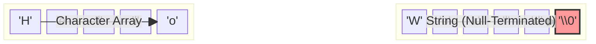

# 数组和字符串

数组是存储相同类型元素的连续内存区域，字符串是以 `\0` 结尾的字符数组。

## 一维数组

### 声明和初始化

```c
#include <stdio.h>

int main(void) {
    // 声明数组
    int arr1[5];

    // 声明并初始化
    int arr2[5] = {1, 2, 3, 4, 5};

    // 部分初始化（其余为0）
    int arr3[5] = {1, 2};  // {1, 2, 0, 0, 0}

    // 全部初始化为0
    int arr4[5] = {0};

    // 自动确定大小
    int arr5[] = {1, 2, 3};  // 大小为3

    // 访问元素
    printf("arr2[0] = %d\n", arr2[0]);
    printf("arr2[4] = %d\n", arr2[4]);

    // 修改元素
    arr2[0] = 10;

    // 数组大小
    int size = sizeof(arr2) / sizeof(arr2[0]);
    printf("数组大小: %d\n", size);

    return 0;
}
```

### 遍历数组

```c
#include <stdio.h>

int main(void) {
    int arr[] = {10, 20, 30, 40, 50};
    int size = sizeof(arr) / sizeof(arr[0]);

    // for 循环遍历
    printf("数组元素: ");
    for (int i = 0; i < size; i++) {
        printf("%d ", arr[i]);
    }
    printf("\n");

    // 计算和
    int sum = 0;
    for (int i = 0; i < size; i++) {
        sum += arr[i];
    }
    printf("元素和: %d\n", sum);

    // 找最大值
    int max = arr[0];
    for (int i = 1; i < size; i++) {
        if (arr[i] > max) max = arr[i];
    }
    printf("最大值: %d\n", max);

    return 0;
}
```

## 多维数组

```c
#include <stdio.h>

int main(void) {
    // 二维数组
    int matrix[3][4] = {
        {1, 2, 3, 4},
        {5, 6, 7, 8},
        {9, 10, 11, 12}
    };

    // 访问元素
    printf("matrix[1][2] = %d\n", matrix[1][2]);  // 7

    // 遍历二维数组
    printf("矩阵:\n");
    for (int i = 0; i < 3; i++) {
        for (int j = 0; j < 4; j++) {
            printf("%3d ", matrix[i][j]);
        }
        printf("\n");
    }

    // 三维数组
    int cube[2][3][4] = {
        {{1,2,3,4}, {5,6,7,8}, {9,10,11,12}},
        {{13,14,15,16}, {17,18,19,20}, {21,22,23,24}}
    };

    printf("\ncube[1][2][3] = %d\n", cube[1][2][3]);  // 24

    return 0;
}
```

## 字符串

### 字符串声明

````c
#include <stdio.h>
#include <string.h>

int main(void) {
    // 方式1：字符数组
    char str1[10] = "Hello";

    // 方式2：完整初始化
    char str2[] = "World";  // 自动加 '\0'，大小为6

    // 方式3：逐字符初始化
    char str3[] = {'H', 'i', '\0'};

    // 方式4：字符串指针（指向常量，不可修改）
    const char *str4 = "Pointer";

    printf("str1: %s\n", str1);
    printf("str2: %s, 长度: %zu\n", str2, strlen(str2));
}
```



```c
int main_continued(void) {
    char str1[10] = "Hello";

    // 修改字符数组
    str1[0] = 'h';
    printf("修改后 str1: %s\n", str1);

    return 0;
}
````

### 字符串函数

```c
#include <stdio.h>
#include <string.h>

int main(void) {
    char str1[50] = "Hello";
    char str2[] = "World";
    char dest[50];

    // strlen - 字符串长度
    printf("strlen(str1) = %zu\n", strlen(str1));

    // strcpy - 复制字符串
    strcpy(dest, str1);
    printf("strcpy: %s\n", dest);

    // strncpy - 安全复制
    strncpy(dest, str2, sizeof(dest) - 1);
    dest[sizeof(dest) - 1] = '\0';
    printf("strncpy: %s\n", dest);

    // strcat - 连接字符串
    strcpy(dest, str1);
    strcat(dest, " ");
    strcat(dest, str2);
    printf("strcat: %s\n", dest);  // Hello World

    // strcmp - 比较字符串
    printf("strcmp(str1, str2) = %d\n", strcmp(str1, str2));

    // strchr - 查找字符
    char *p = strchr(dest, 'W');
    if (p) printf("找到 'W' 在位置: %ld\n", p - dest);

    // strstr - 查找子串
    p = strstr(dest, "World");
    if (p) printf("找到 'World' 在位置: %ld\n", p - dest);

    return 0;
}
```

### 字符串输入输出

```c
#include <stdio.h>
#include <string.h>

int main(void) {
    char name[50];
    char line[100];

    // 读取单词（不含空格）
    printf("输入姓名: ");
    scanf("%49s", name);  // 限制长度
    printf("你好, %s\n", name);

    // 清除缓冲区
    while (getchar() != '\n');

    // 读取整行（包含空格）
    printf("输入一行文字: ");
    fgets(line, sizeof(line), stdin);

    // 移除fgets读入的换行符
    line[strcspn(line, "\n")] = '\0';
    printf("你输入了: %s\n", line);

    return 0;
}
```

### 字符串与数字转换

```c
#include <stdio.h>
#include <stdlib.h>

int main(void) {
    // 字符串转数字
    int i = atoi("123");
    long l = atol("123456789");
    double d = atof("3.14159");

    printf("atoi: %d\n", i);
    printf("atol: %ld\n", l);
    printf("atof: %f\n", d);

    // 更安全的转换
    char *endptr;
    long val = strtol("123abc", &endptr, 10);
    printf("strtol: %ld, 剩余: %s\n", val, endptr);

    // 数字转字符串
    char buffer[50];
    sprintf(buffer, "%d", 42);
    printf("sprintf: %s\n", buffer);

    snprintf(buffer, sizeof(buffer), "%.2f", 3.14159);
    printf("snprintf: %s\n", buffer);

    return 0;
}
```

## 常用数组操作

### 数组排序

```c
#include <stdio.h>
#include <stdlib.h>

int compare(const void *a, const void *b) {
    return *(int*)a - *(int*)b;
}

void printArray(int arr[], int n) {
    for (int i = 0; i < n; i++) {
        printf("%d ", arr[i]);
    }
    printf("\n");
}

int main(void) {
    int arr[] = {64, 34, 25, 12, 22, 11, 90};
    int n = sizeof(arr) / sizeof(arr[0]);

    printf("排序前: ");
    printArray(arr, n);

    qsort(arr, n, sizeof(int), compare);

    printf("排序后: ");
    printArray(arr, n);

    return 0;
}
```

### 二分查找

```c
#include <stdio.h>
#include <stdlib.h>

int compare(const void *a, const void *b) {
    return *(int*)a - *(int*)b;
}

int main(void) {
    int arr[] = {11, 12, 22, 25, 34, 64, 90};
    int n = sizeof(arr) / sizeof(arr[0]);

    int key = 25;
    int *result = bsearch(&key, arr, n, sizeof(int), compare);

    if (result) {
        printf("找到 %d 在索引 %ld\n", key, result - arr);
    } else {
        printf("未找到 %d\n", key);
    }

    return 0;
}
```

掌握数组和字符串后，就可以继续学习指针了！
