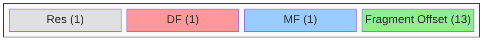

# 位操作

位操作是 C 语言的重要特性，用于底层编程和性能优化。

## 位运算符

```c
#include <stdio.h>

int main(void) {
    unsigned char a = 0b11001010;  // 202
    unsigned char b = 0b10110011;  // 179

    printf("a      = %08b = %d\n", a, a);
    printf("b      = %08b = %d\n", b, b);
    printf("a & b  = %08b (按位与)\n", a & b);
    printf("a | b  = %08b (按位或)\n", a | b);
    printf("a ^ b  = %08b (按位异或)\n", a ^ b);
    printf("~a     = %08b (按位取反)\n", (unsigned char)~a);
    printf("a << 2 = %08b (左移)\n", a << 2);
    printf("a >> 2 = %08b (右移)\n", a >> 2);

    return 0;
}
```

## 常用位操作

### 设置、清除、切换位

```c
#include <stdio.h>

#define SET_BIT(n, pos)    ((n) | (1 << (pos)))
#define CLEAR_BIT(n, pos)  ((n) & ~(1 << (pos)))
#define TOGGLE_BIT(n, pos) ((n) ^ (1 << (pos)))
#define CHECK_BIT(n, pos)  (((n) >> (pos)) & 1)

void printBits(unsigned char n) {
    for (int i = 7; i >= 0; i--) {
        printf("%d", (n >> i) & 1);
    }
    printf("\n");
}

int main(void) {
    unsigned char n = 0b00001010;  // 10

    printf("原始值:     "); printBits(n);

    n = SET_BIT(n, 0);
    printf("设置第0位:  "); printBits(n);

    n = CLEAR_BIT(n, 1);
    printf("清除第1位:  "); printBits(n);

    n = TOGGLE_BIT(n, 2);
    printf("切换第2位:  "); printBits(n);

    printf("第3位是:    %d\n", CHECK_BIT(n, 3));

    return 0;
}
```

### 实用技巧

```c
#include <stdio.h>
#include <stdbool.h>

// 判断奇偶
bool isOdd(int n) {
    return n & 1;
}

// 判断2的幂次
bool isPowerOf2(int n) {
    return n > 0 && (n & (n - 1)) == 0;
}

// 交换两数
void swap(int *a, int *b) {
    *a ^= *b;
    *b ^= *a;
    *a ^= *b;
}

// 计算1的个数 (popcount)
int countOnes(unsigned int n) {
    int count = 0;
    while (n) {
        count += n & 1;
        n >>= 1;
    }
    return count;
}

// 获取最低有效位
int lowestBit(int n) {
    return n & (-n);
}

int main(void) {
    printf("7 是奇数: %s\n", isOdd(7) ? "是" : "否");
    printf("8 是2的幂: %s\n", isPowerOf2(8) ? "是" : "否");
    printf("13 的二进制1的个数: %d\n", countOnes(13));

    int a = 5, b = 3;
    swap(&a, &b);
    printf("交换后: a=%d, b=%d\n", a, b);

    return 0;
}
```

## 位域



```c
#include <stdio.h>

// IP 数据包标志（简化）
struct IPFlags {
    unsigned int reserved : 1;
    unsigned int dontFragment : 1;
    unsigned int moreFragments : 1;
    unsigned int fragmentOffset : 13;
};

// RGB 颜色压缩
struct Color {
    unsigned int r : 8;
    unsigned int g : 8;
    unsigned int b : 8;
    unsigned int a : 8;
};

int main(void) {
    struct IPFlags flags = {0, 1, 0, 0};
    printf("Don't Fragment: %d\n", flags.dontFragment);

    struct Color red = {255, 0, 0, 255};
    printf("Color: RGBA(%d, %d, %d, %d)\n",
           red.r, red.g, red.b, red.a);
    printf("sizeof(Color) = %zu\n", sizeof(struct Color));

    return 0;
}
```

## 应用示例

### 权限管理

```c
#include <stdio.h>

#define PERM_READ    (1 << 0)  // 1
#define PERM_WRITE   (1 << 1)  // 2
#define PERM_EXECUTE (1 << 2)  // 4
#define PERM_ALL     (PERM_READ | PERM_WRITE | PERM_EXECUTE)

void printPermissions(int perm) {
    printf("权限: ");
    if (perm & PERM_READ) printf("读 ");
    if (perm & PERM_WRITE) printf("写 ");
    if (perm & PERM_EXECUTE) printf("执行 ");
    printf("\n");
}

int main(void) {
    int userPerm = PERM_READ | PERM_WRITE;
    printPermissions(userPerm);

    // 添加权限
    userPerm |= PERM_EXECUTE;
    printPermissions(userPerm);

    // 移除权限
    userPerm &= ~PERM_WRITE;
    printPermissions(userPerm);

    // 检查权限
    if (userPerm & PERM_EXECUTE) {
        printf("有执行权限\n");
    }

    return 0;
}
```

### 位图（Bitmap）

```c
#include <stdio.h>
#include <string.h>

#define BITMAP_SIZE 1000

unsigned char bitmap[BITMAP_SIZE / 8 + 1];

void setBit(int n) {
    bitmap[n / 8] |= (1 << (n % 8));
}

void clearBit(int n) {
    bitmap[n / 8] &= ~(1 << (n % 8));
}

int getBit(int n) {
    return (bitmap[n / 8] >> (n % 8)) & 1;
}

int main(void) {
    memset(bitmap, 0, sizeof(bitmap));

    setBit(42);
    setBit(100);
    setBit(500);

    printf("42 is set: %d\n", getBit(42));
    printf("43 is set: %d\n", getBit(43));
    printf("500 is set: %d\n", getBit(500));

    clearBit(42);
    printf("42 after clear: %d\n", getBit(42));

    return 0;
}
```

掌握位操作后，就可以继续学习项目实战了！
