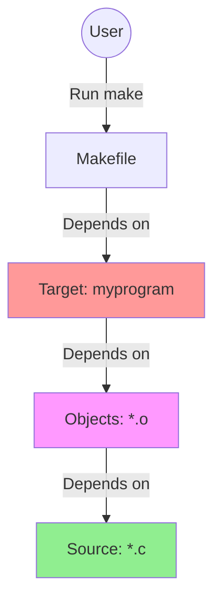

# C 语言构建系统

在实际的 C 项目开发中，手动编译每个文件是不现实的。构建系统可以自动化编译流程，管理依赖关系，提高开发效率。

## Makefile

Make 是最经典的构建工具，通过 `Makefile` 定义构建规则。

### 基础结构



一个简单的 `Makefile` 通常包含变量定义、目标规则和伪目标。

```makefile
# 编译器和选项
CC = gcc
CFLAGS = -Wall -Wextra -g
LDFLAGS =

# 目标文件
TARGET = myprogram
SRCS = main.c utils.c
OBJS = $(SRCS:.c=.o)

# 默认目标
all: $(TARGET)

# 链接规则
$(TARGET): $(OBJS)
	$(CC) $(OBJS) -o $(TARGET) $(LDFLAGS)

# 编译规则 (模式规则)
%.o: %.c
	$(CC) $(CFLAGS) -c $< -o $@

# 清理
clean:
	rm -f $(OBJS) $(TARGET)

.PHONY: all clean
```

### 自动化变量

- `$@`: 目标文件名
- `$<`: 第一个依赖文件名
- `$^`: 所有依赖文件名
- `$(@D)`: 目标文件的目录部分
- `$(@F)`: 目标文件的文件名部分

### 高级用法：自动生成依赖

为了避免手动维护头文件依赖，可以使用 `-MMD` 选项自动生成依赖文件。

```makefile
CC = gcc
CFLAGS = -Wall -Wextra -g -MMD -MP
SRC_DIR = src
BUILD_DIR = build

# 递归查找源文件
SRCS = $(wildcard $(SRC_DIR)/*.c)
OBJS = $(SRCS:$(SRC_DIR)/%.c=$(BUILD_DIR)/%.o)
DEPS = $(OBJS:.o=.d)

TARGET = $(BUILD_DIR)/app

all: $(TARGET)

$(TARGET): $(OBJS)
	@mkdir -p $(@D)
	$(CC) $(OBJS) -o $@

$(BUILD_DIR)/%.o: $(SRC_DIR)/%.c
	@mkdir -p $(@D)
	$(CC) $(CFLAGS) -c $< -o $@

-include $(DEPS)

clean:
	rm -rf $(BUILD_DIR)

.PHONY: all clean
```

## CMake

CMake 是一个现代的、跨平台的构建系统生成器。它不直接构建项目，而是生成 Makefile、Ninja 文件或 Visual Studio 工程。

### 基础 CMakeLists.txt

```cmake
cmake_minimum_required(VERSION 3.10)

# 项目信息
project(MyProject VERSION 1.0 DESCRIPTION "A simple C project")

# 设置 C 标准
set(CMAKE_C_STANDARD 11)
set(CMAKE_C_STANDARD_REQUIRED True)

# 添加可执行文件
add_executable(my_app main.c utils.c)

# 添加头文件路径
target_include_directories(my_app PRIVATE include)
```

### 现代 CMake 实践 (Target-based)

尽量使用 `target_*` 命令，而不是全局变量。

```cmake
cmake_minimum_required(VERSION 3.10)
project(ComplexApp)

# 添加库
add_library(math_lib STATIC src/math.c)
target_include_directories(math_lib PUBLIC include)

# 添加另一个库，依赖 math_lib
add_library(physics_lib STATIC src/physics.c)
target_link_libraries(physics_lib PRIVATE math_lib)

# 可执行文件
add_executable(main_app src/main.c)
target_link_libraries(main_app PRIVATE physics_lib)
```

### 常用命令

```bash
# 生成构建文件 (推荐在 build 目录中进行外部构建)
mkdir build && cd build
cmake ..

# 构建
cmake --build .

# 运行测试 (如果有)
ctest

# 安装
cmake --install . --prefix /usr/local
```

### 子目录管理

对于大型项目，通常使用 `add_subdirectory` 组织结构。

**根目录 CMakeLists.txt:**

```cmake
add_subdirectory(src)
add_subdirectory(tests)
```

**src/CMakeLists.txt:**

```cmake
add_library(core ...)
add_executable(app ...)
```

## Makefile vs CMake

| 特性         | Makefile                       | CMake                        |
| :----------- | :----------------------------- | :--------------------------- |
| **定位**     | 底层构建工具                   | 构建系统生成器               |
| **跨平台**   | 较差 (Windows 需 MinGW/Cygwin) | 优秀 (原生支持 VS, Xcode 等) |
| **语法**     | 简洁但晦涩，依赖 Shell         | 专用脚本语言，更高级         |
| **依赖管理** | 需手动或借助插件               | 内置支持                     |
| **适用场景** | 小型项目，Unix/Linux 环境      | 中大型项目，跨平台开发       |

## 总结

- 小项目或纯 Linux 环境，**Makefile** 足够简单直接。
- 跨平台、大型项目或涉及第三方库管理，**CMake** 是行业标准选择。
