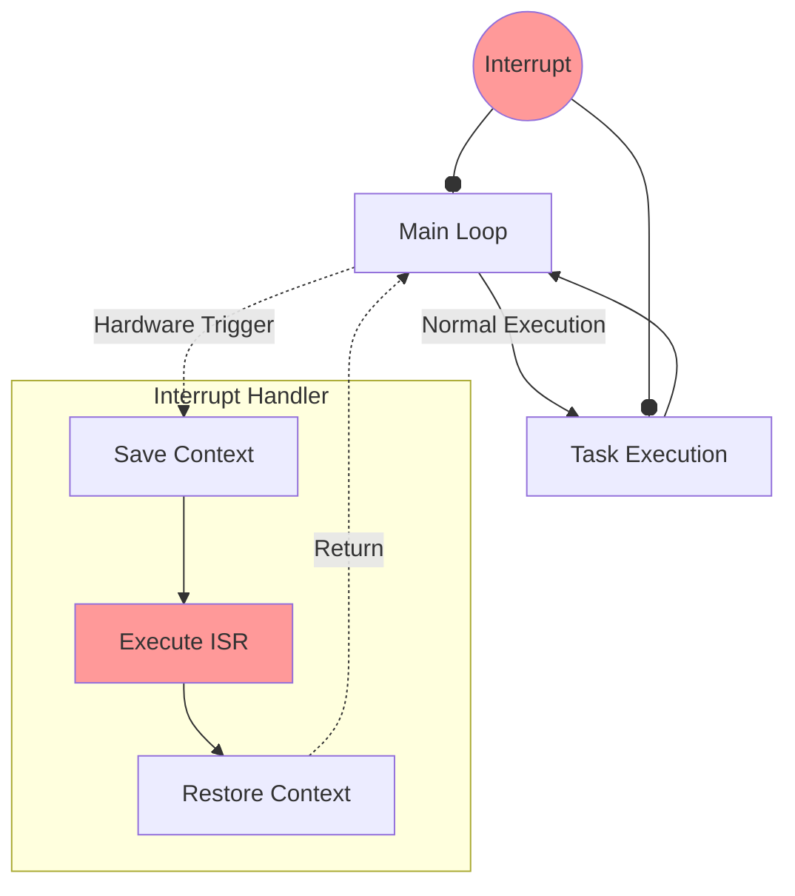
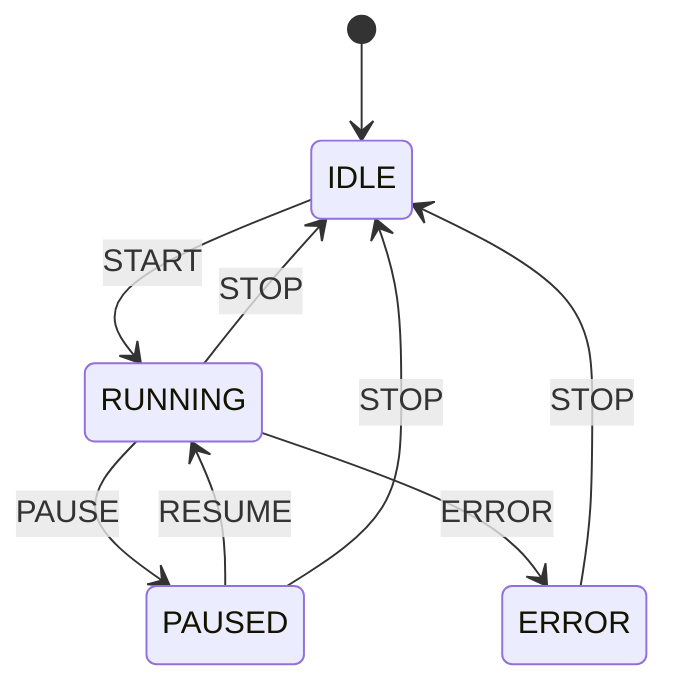

# 嵌入式 C 编程

嵌入式系统是 C 语言最重要的应用领域之一，用于开发单片机、物联网设备、汽车电子等。

## 嵌入式系统概述

### 什么是嵌入式系统

嵌入式系统是专用于执行特定功能的计算机系统，具有以下特点：

- **资源受限** - 内存和存储空间有限
- **实时性** - 需要在规定时间内响应
- **低功耗** - 通常使用电池供电
- **高可靠性** - 要求长时间稳定运行

### 常见嵌入式平台

| 平台         | 位宽     | 典型芯片     | 应用场景 |
| ------------ | -------- | ------------ | -------- |
| 8051         | 8 位     | AT89C51      | 简单控制 |
| AVR          | 8 位     | ATmega328    | Arduino  |
| ARM Cortex-M | 32 位    | STM32, LPC   | 工业控制 |
| ARM Cortex-A | 32/64 位 | Raspberry Pi | 复杂应用 |
| RISC-V       | 32/64 位 | ESP32-C3     | 新兴平台 |

## 硬件寄存器操作

### 寄存器基础

```c
#include <stdint.h>

// 寄存器地址定义
#define GPIO_BASE       0x40020000
#define GPIO_MODER      (*(volatile uint32_t *)(GPIO_BASE + 0x00))
#define GPIO_ODR        (*(volatile uint32_t *)(GPIO_BASE + 0x14))
#define GPIO_IDR        (*(volatile uint32_t *)(GPIO_BASE + 0x10))

// 位操作宏
#define BIT(n)          (1UL << (n))
#define SET_BIT(reg, n)   ((reg) |= BIT(n))
#define CLEAR_BIT(reg, n) ((reg) &= ~BIT(n))
#define READ_BIT(reg, n)  (((reg) >> (n)) & 1)
#define TOGGLE_BIT(reg, n) ((reg) ^= BIT(n))

// 设置 GPIO 引脚 5 为输出模式
void gpio_init(void) {
    // 配置模式寄存器
    GPIO_MODER &= ~(0x3 << 10);  // 清除位 [11:10]
    GPIO_MODER |= (0x1 << 10);   // 设置为输出模式
}

// 控制 LED
void led_on(void) {
    SET_BIT(GPIO_ODR, 5);
}

void led_off(void) {
    CLEAR_BIT(GPIO_ODR, 5);
}

void led_toggle(void) {
    TOGGLE_BIT(GPIO_ODR, 5);
}
```

### volatile 关键字

```c
// volatile 告诉编译器变量可能被外部因素改变
// 防止编译器优化掉对这些变量的读写

// 硬件寄存器必须使用 volatile
volatile uint32_t *TIMER_COUNT = (volatile uint32_t *)0x40000024;

// 中断服务程序修改的变量
volatile int interrupt_flag = 0;

void wait_for_interrupt(void) {
    // 没有 volatile，编译器可能优化为无限循环
    while (!interrupt_flag) {
        // 等待
    }
    interrupt_flag = 0;
}

// ISR (Interrupt Service Routine)
void TIMER_IRQHandler(void) {
    interrupt_flag = 1;
}
```

### 寄存器结构体映射

```c
#include <stdint.h>

// GPIO 寄存器结构体
typedef struct {
    volatile uint32_t MODER;    // 模式寄存器
    volatile uint32_t OTYPER;   // 输出类型
    volatile uint32_t OSPEEDR;  // 输出速度
    volatile uint32_t PUPDR;    // 上拉/下拉
    volatile uint32_t IDR;      // 输入数据
    volatile uint32_t ODR;      // 输出数据
    volatile uint32_t BSRR;     // 位设置/复位
    volatile uint32_t LCKR;     // 锁定
    volatile uint32_t AFR[2];   // 复用功能
} GPIO_TypeDef;

#define GPIOA ((GPIO_TypeDef *)0x40020000)
#define GPIOB ((GPIO_TypeDef *)0x40020400)

// 使用结构体访问寄存器
void gpio_example(void) {
    GPIOA->MODER |= (1 << 10);   // PA5 输出模式
    GPIOA->ODR |= (1 << 5);      // PA5 高电平
    GPIOA->BSRR = (1 << 5);      // 原子操作设置 PA5
    GPIOA->BSRR = (1 << 21);     // 原子操作清除 PA5
}
```

## 中断处理



### 中断向量表

```c
#include <stdint.h>

// 函数指针类型
typedef void (*IRQHandler)(void);

// 中断向量表（放在固定地址）
__attribute__((section(".isr_vector")))
const IRQHandler vector_table[] = {
    (IRQHandler)0x20010000,  // 初始栈指针
    Reset_Handler,           // 复位处理函数
    NMI_Handler,
    HardFault_Handler,
    // ... 其他中断向量
    TIMER0_IRQHandler,
    UART0_IRQHandler,
};

// 默认处理函数
void Default_Handler(void) {
    while (1);  // 死循环
}

// 弱符号，可被用户覆盖
__attribute__((weak, alias("Default_Handler")))
void TIMER0_IRQHandler(void);
```

### 中断服务程序

```c
#include <stdint.h>

// 共享变量必须使用 volatile
volatile uint32_t tick_count = 0;
volatile uint8_t rx_buffer[64];
volatile uint8_t rx_index = 0;

// 定时器中断服务程序
void SysTick_Handler(void) {
    tick_count++;
}

// UART 接收中断
void UART_IRQHandler(void) {
    // 检查中断标志
    if (UART->SR & UART_SR_RXNE) {
        uint8_t data = UART->DR;  // 读取数据会清除标志

        if (rx_index < sizeof(rx_buffer)) {
            rx_buffer[rx_index++] = data;
        }
    }
}

// 延时函数
void delay_ms(uint32_t ms) {
    uint32_t start = tick_count;
    while ((tick_count - start) < ms);
}
```

### 临界区保护

```c
#include <stdint.h>

// 禁用/启用中断
static inline uint32_t disable_irq(void) {
    uint32_t primask;
    __asm volatile ("MRS %0, primask" : "=r" (primask));
    __asm volatile ("CPSID i");
    return primask;
}

static inline void restore_irq(uint32_t primask) {
    __asm volatile ("MSR primask, %0" : : "r" (primask));
}

// 使用临界区保护共享资源
volatile int shared_counter = 0;

void safe_increment(void) {
    uint32_t state = disable_irq();

    shared_counter++;  // 临界区

    restore_irq(state);
}

// 宏简化临界区
#define CRITICAL_SECTION_BEGIN() uint32_t __irq_state = disable_irq()
#define CRITICAL_SECTION_END()   restore_irq(__irq_state)

void example(void) {
    CRITICAL_SECTION_BEGIN();
    // 临界区代码
    CRITICAL_SECTION_END();
}
```

## 内存管理

### 内存布局

```c
// 典型的嵌入式内存布局（链接脚本定义）
/*
MEMORY {
    FLASH (rx)  : ORIGIN = 0x08000000, LENGTH = 256K
    RAM   (rwx) : ORIGIN = 0x20000000, LENGTH = 64K
}

SECTIONS {
    .text   : { *(.text*) } > FLASH
    .rodata : { *(.rodata*) } > FLASH
    .data   : { *(.data*) } > RAM AT > FLASH
    .bss    : { *(.bss*) } > RAM
    .stack  : { . = . + 0x1000; } > RAM
}
*/

// 在代码中指定段
__attribute__((section(".data")))
int initialized_var = 42;

__attribute__((section(".bss")))
int uninitialized_var;

__attribute__((section(".rodata")))
const char message[] = "Hello, Embedded!";
```

### 静态内存分配

```c
#include <stdint.h>

// 嵌入式系统通常避免动态内存分配
// 使用静态分配和内存池

// 静态缓冲区
static uint8_t tx_buffer[256];
static uint8_t rx_buffer[256];

// 简单内存池
#define POOL_BLOCK_SIZE  32
#define POOL_BLOCK_COUNT 16

typedef struct {
    uint8_t blocks[POOL_BLOCK_COUNT][POOL_BLOCK_SIZE];
    uint8_t used[POOL_BLOCK_COUNT];
} MemPool;

static MemPool pool = {0};

void* pool_alloc(void) {
    for (int i = 0; i < POOL_BLOCK_COUNT; i++) {
        if (!pool.used[i]) {
            pool.used[i] = 1;
            return pool.blocks[i];
        }
    }
    return NULL;
}

void pool_free(void *ptr) {
    for (int i = 0; i < POOL_BLOCK_COUNT; i++) {
        if (ptr == pool.blocks[i]) {
            pool.used[i] = 0;
            return;
        }
    }
}
```

## 外设驱动

### GPIO 驱动示例

```c
#include <stdint.h>

typedef enum {
    GPIO_MODE_INPUT,
    GPIO_MODE_OUTPUT,
    GPIO_MODE_AF,
    GPIO_MODE_ANALOG
} GPIO_Mode;

typedef enum {
    GPIO_PULL_NONE,
    GPIO_PULL_UP,
    GPIO_PULL_DOWN
} GPIO_Pull;

typedef struct {
    uint8_t pin;
    GPIO_Mode mode;
    GPIO_Pull pull;
} GPIO_Config;

void GPIO_Init(GPIO_TypeDef *port, GPIO_Config *config) {
    uint32_t pin = config->pin;

    // 清除并设置模式
    port->MODER &= ~(0x3 << (pin * 2));
    port->MODER |= (config->mode << (pin * 2));

    // 设置上拉/下拉
    port->PUPDR &= ~(0x3 << (pin * 2));
    port->PUPDR |= (config->pull << (pin * 2));
}

void GPIO_Write(GPIO_TypeDef *port, uint8_t pin, uint8_t value) {
    if (value) {
        port->BSRR = (1 << pin);
    } else {
        port->BSRR = (1 << (pin + 16));
    }
}

uint8_t GPIO_Read(GPIO_TypeDef *port, uint8_t pin) {
    return (port->IDR >> pin) & 1;
}
```

### UART 驱动示例

```c
#include <stdint.h>

typedef struct {
    volatile uint32_t SR;   // 状态寄存器
    volatile uint32_t DR;   // 数据寄存器
    volatile uint32_t BRR;  // 波特率寄存器
    volatile uint32_t CR1;  // 控制寄存器1
    volatile uint32_t CR2;  // 控制寄存器2
    volatile uint32_t CR3;  // 控制寄存器3
} UART_TypeDef;

#define UART1 ((UART_TypeDef *)0x40011000)

// 状态位
#define UART_SR_TXE   (1 << 7)
#define UART_SR_RXNE  (1 << 5)

void UART_Init(uint32_t baudrate) {
    // 假设时钟为 16MHz
    UART1->BRR = 16000000 / baudrate;
    UART1->CR1 = (1 << 13) |  // 使能 UART
                 (1 << 3)  |  // 使能发送
                 (1 << 2);    // 使能接收
}

void UART_SendByte(uint8_t data) {
    while (!(UART1->SR & UART_SR_TXE));  // 等待发送缓冲区空
    UART1->DR = data;
}

uint8_t UART_ReceiveByte(void) {
    while (!(UART1->SR & UART_SR_RXNE));  // 等待接收数据
    return UART1->DR;
}

void UART_SendString(const char *str) {
    while (*str) {
        UART_SendByte(*str++);
    }
}

// printf 重定向
int _write(int fd, char *ptr, int len) {
    for (int i = 0; i < len; i++) {
        UART_SendByte(ptr[i]);
    }
    return len;
}
```

## 实时操作系统基础

### 简单任务调度

```c
#include <stdint.h>

#define MAX_TASKS 8

typedef void (*TaskFunc)(void);

typedef struct {
    TaskFunc func;
    uint32_t period;      // 执行周期（ms）
    uint32_t last_run;    // 上次执行时间
} Task;

static Task tasks[MAX_TASKS];
static uint8_t task_count = 0;
volatile uint32_t system_tick = 0;

void scheduler_add_task(TaskFunc func, uint32_t period) {
    if (task_count < MAX_TASKS) {
        tasks[task_count].func = func;
        tasks[task_count].period = period;
        tasks[task_count].last_run = 0;
        task_count++;
    }
}

void scheduler_run(void) {
    while (1) {
        uint32_t now = system_tick;

        for (int i = 0; i < task_count; i++) {
            if ((now - tasks[i].last_run) >= tasks[i].period) {
                tasks[i].func();
                tasks[i].last_run = now;
            }
        }
    }
}

// 使用示例
void task_led(void) {
    led_toggle();
}

void task_sensor(void) {
    read_sensor();
}

int main(void) {
    system_init();

    scheduler_add_task(task_led, 500);     // 500ms
    scheduler_add_task(task_sensor, 100);  // 100ms

    scheduler_run();
    return 0;
}
```

### 状态机



```c
typedef enum {
    STATE_IDLE,
    STATE_RUNNING,
    STATE_PAUSED,
    STATE_ERROR
} State;

typedef enum {
    EVENT_START,
    EVENT_PAUSE,
    EVENT_RESUME,
    EVENT_STOP,
    EVENT_ERROR
} Event;

typedef struct {
    State current_state;
} StateMachine;

void sm_init(StateMachine *sm) {
    sm->current_state = STATE_IDLE;
}

void sm_process_event(StateMachine *sm, Event event) {
    State next = sm->current_state;

    switch (sm->current_state) {
        case STATE_IDLE:
            if (event == EVENT_START) next = STATE_RUNNING;
            break;
        case STATE_RUNNING:
            if (event == EVENT_PAUSE) next = STATE_PAUSED;
            if (event == EVENT_STOP) next = STATE_IDLE;
            if (event == EVENT_ERROR) next = STATE_ERROR;
            break;
        case STATE_PAUSED:
            if (event == EVENT_RESUME) next = STATE_RUNNING;
            if (event == EVENT_STOP) next = STATE_IDLE;
            break;
        case STATE_ERROR:
            if (event == EVENT_STOP) next = STATE_IDLE;
            break;
    }

    if (next != sm->current_state) {
        // 状态转换回调
        on_state_change(sm->current_state, next);
        sm->current_state = next;
    }
}
```

## 调试技巧

### 串口调试

```c
#include <stdio.h>
#include <stdarg.h>

// 调试级别
#define DEBUG_LEVEL 2

#if DEBUG_LEVEL >= 1
    #define DEBUG1(fmt, ...) printf("[D1] " fmt "\n", ##__VA_ARGS__)
#else
    #define DEBUG1(fmt, ...)
#endif

#if DEBUG_LEVEL >= 2
    #define DEBUG2(fmt, ...) printf("[D2] " fmt "\n", ##__VA_ARGS__)
#else
    #define DEBUG2(fmt, ...)
#endif

// 断言
#define ASSERT(cond) do { \
    if (!(cond)) { \
        printf("ASSERT: %s, %s:%d\n", #cond, __FILE__, __LINE__); \
        while(1); \
    } \
} while(0)

// 使用示例
void example(void) {
    DEBUG1("系统启动");
    DEBUG2("详细信息: x=%d", 42);

    int *ptr = get_buffer();
    ASSERT(ptr != NULL);
}
```

### GPIO 调试

```c
// 使用 GPIO 进行时序分析
#define DEBUG_PIN_HIGH()  GPIOA->BSRR = (1 << 0)
#define DEBUG_PIN_LOW()   GPIOA->BSRR = (1 << 16)
#define DEBUG_PIN_PULSE() do { DEBUG_PIN_HIGH(); DEBUG_PIN_LOW(); } while(0)

void critical_function(void) {
    DEBUG_PIN_HIGH();  // 示波器可测量执行时间

    // 关键代码

    DEBUG_PIN_LOW();
}
```

## 最佳实践

```c
// 1. 使用固定宽度整数类型
#include <stdint.h>
uint8_t  byte;
uint16_t halfword;
uint32_t word;

// 2. 寄存器访问使用 volatile
volatile uint32_t *reg = (volatile uint32_t *)0x40000000;

// 3. 位操作使用明确的宏
#define REG_FIELD_MASK  0x0F
#define REG_FIELD_SHIFT 4
value = (reg & ~(REG_FIELD_MASK << REG_FIELD_SHIFT)) |
        (new_val << REG_FIELD_SHIFT);

// 4. 避免动态内存分配
// 使用静态数组或内存池

// 5. 中断服务程序保持简短
void ISR_Handler(void) {
    flag = 1;  // 设置标志，主循环处理
}

// 6. 使用看门狗防止死锁
void main_loop(void) {
    while (1) {
        process_tasks();
        watchdog_feed();  // 喂狗
    }
}
```

嵌入式 C 编程需要同时理解硬件和软件，祝你学习顺利！🔧
