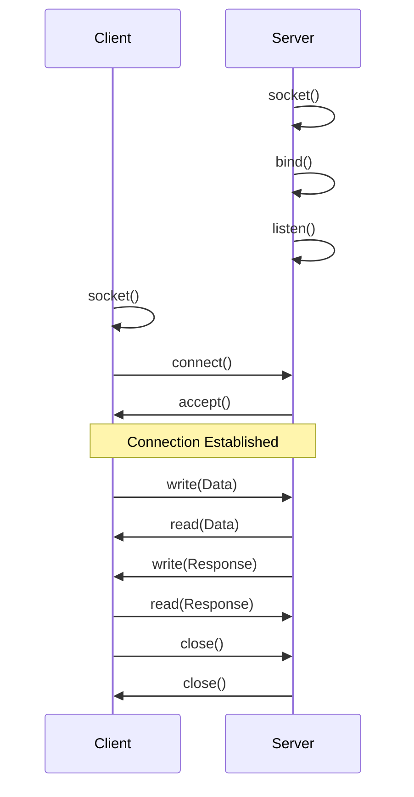
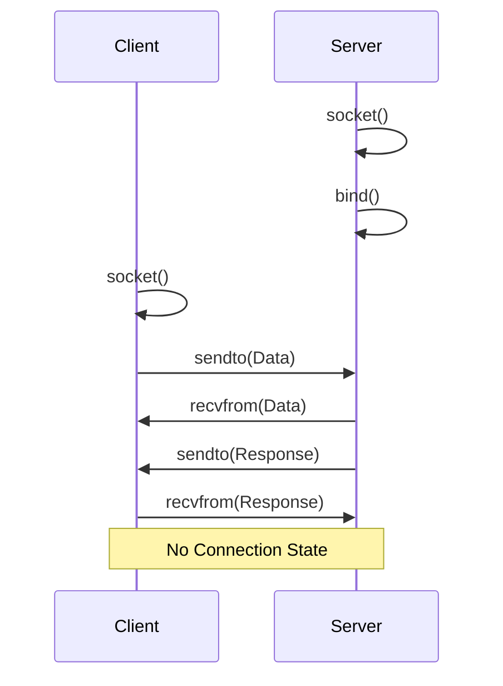

# C 语言网络编程

使用 Socket API 进行网络通信。

## Socket 基础

### 基本概念

```c
// Socket 地址结构
struct sockaddr_in {
    sa_family_t    sin_family;  // AF_INET
    in_port_t      sin_port;    // 端口号 (网络字节序)
    struct in_addr sin_addr;    // IP 地址
};

// 字节序转换
htons(port)    // 主机序 -> 网络序 (16位)
htonl(addr)    // 主机序 -> 网络序 (32位)
ntohs(port)    // 网络序 -> 主机序 (16位)
ntohl(addr)    // 网络序 -> 主机序 (32位)

// IP 地址转换
inet_pton(AF_INET, "192.168.1.1", &addr);  // 字符串 -> 二进制
inet_ntop(AF_INET, &addr, buf, sizeof(buf)); // 二进制 -> 字符串
```

## TCP 服务器



```c
#include <stdio.h>
#include <stdlib.h>
#include <string.h>
#include <unistd.h>
#include <sys/socket.h>
#include <netinet/in.h>
#include <arpa/inet.h>

#define PORT 8080
#define BUFFER_SIZE 1024

int main(void) {
    int server_fd, client_fd;
    struct sockaddr_in address;
    socklen_t addrlen = sizeof(address);
    char buffer[BUFFER_SIZE] = {0};

    // 1. 创建 socket
    server_fd = socket(AF_INET, SOCK_STREAM, 0);
    if (server_fd < 0) {
        perror("socket");
        exit(1);
    }

    // 设置地址重用
    int opt = 1;
    setsockopt(server_fd, SOL_SOCKET, SO_REUSEADDR, &opt, sizeof(opt));

    // 2. 绑定地址
    address.sin_family = AF_INET;
    address.sin_addr.s_addr = INADDR_ANY;
    address.sin_port = htons(PORT);

    if (bind(server_fd, (struct sockaddr*)&address, sizeof(address)) < 0) {
        perror("bind");
        exit(1);
    }

    // 3. 监听
    if (listen(server_fd, 5) < 0) {
        perror("listen");
        exit(1);
    }

    printf("服务器启动，监听端口 %d...\n", PORT);

    while (1) {
        // 4. 接受连接
        client_fd = accept(server_fd, (struct sockaddr*)&address, &addrlen);
        if (client_fd < 0) {
            perror("accept");
            continue;
        }

        printf("客户端连接: %s:%d\n",
               inet_ntoa(address.sin_addr), ntohs(address.sin_port));

        // 5. 接收和发送数据
        ssize_t bytes = read(client_fd, buffer, BUFFER_SIZE - 1);
        if (bytes > 0) {
            buffer[bytes] = '\0';
            printf("收到: %s\n", buffer);

            const char *response = "HTTP/1.1 200 OK\r\n\r\nHello from C Server!";
            write(client_fd, response, strlen(response));
        }

        close(client_fd);
    }

    close(server_fd);
    return 0;
}
```

## TCP 客户端

```c
#include <stdio.h>
#include <stdlib.h>
#include <string.h>
#include <unistd.h>
#include <sys/socket.h>
#include <netinet/in.h>
#include <arpa/inet.h>

#define PORT 8080
#define BUFFER_SIZE 1024

int main(void) {
    int sock;
    struct sockaddr_in server_addr;
    char buffer[BUFFER_SIZE] = {0};

    // 1. 创建 socket
    sock = socket(AF_INET, SOCK_STREAM, 0);
    if (sock < 0) {
        perror("socket");
        exit(1);
    }

    // 2. 设置服务器地址
    server_addr.sin_family = AF_INET;
    server_addr.sin_port = htons(PORT);
    inet_pton(AF_INET, "127.0.0.1", &server_addr.sin_addr);

    // 3. 连接服务器
    if (connect(sock, (struct sockaddr*)&server_addr, sizeof(server_addr)) < 0) {
        perror("connect");
        exit(1);
    }

    printf("已连接到服务器\n");

    // 4. 发送数据
    const char *message = "GET / HTTP/1.1\r\nHost: localhost\r\n\r\n";
    write(sock, message, strlen(message));

    // 5. 接收响应
    ssize_t bytes = read(sock, buffer, BUFFER_SIZE - 1);
    if (bytes > 0) {
        buffer[bytes] = '\0';
        printf("响应:\n%s\n", buffer);
    }

    close(sock);
    return 0;
}
```

## UDP 通信



### UDP 服务器

```c
#include <stdio.h>
#include <stdlib.h>
#include <string.h>
#include <unistd.h>
#include <sys/socket.h>
#include <netinet/in.h>

#define PORT 8080
#define BUFFER_SIZE 1024

int main(void) {
    int sock;
    struct sockaddr_in server_addr, client_addr;
    socklen_t client_len = sizeof(client_addr);
    char buffer[BUFFER_SIZE];

    sock = socket(AF_INET, SOCK_DGRAM, 0);

    server_addr.sin_family = AF_INET;
    server_addr.sin_addr.s_addr = INADDR_ANY;
    server_addr.sin_port = htons(PORT);

    bind(sock, (struct sockaddr*)&server_addr, sizeof(server_addr));

    printf("UDP 服务器启动...\n");

    while (1) {
        ssize_t bytes = recvfrom(sock, buffer, BUFFER_SIZE - 1, 0,
                                  (struct sockaddr*)&client_addr, &client_len);
        if (bytes > 0) {
            buffer[bytes] = '\0';
            printf("收到: %s\n", buffer);

            // 回复
            sendto(sock, "OK", 2, 0,
                   (struct sockaddr*)&client_addr, client_len);
        }
    }

    return 0;
}
```

### UDP 客户端

```c
#include <stdio.h>
#include <string.h>
#include <unistd.h>
#include <sys/socket.h>
#include <netinet/in.h>
#include <arpa/inet.h>

#define PORT 8080
#define BUFFER_SIZE 1024

int main(void) {
    int sock;
    struct sockaddr_in server_addr;
    socklen_t addr_len = sizeof(server_addr);
    char buffer[BUFFER_SIZE];

    sock = socket(AF_INET, SOCK_DGRAM, 0);

    server_addr.sin_family = AF_INET;
    server_addr.sin_port = htons(PORT);
    inet_pton(AF_INET, "127.0.0.1", &server_addr.sin_addr);

    // 发送
    const char *msg = "Hello UDP!";
    sendto(sock, msg, strlen(msg), 0,
           (struct sockaddr*)&server_addr, sizeof(server_addr));

    // 接收
    ssize_t bytes = recvfrom(sock, buffer, BUFFER_SIZE - 1, 0,
                              (struct sockaddr*)&server_addr, &addr_len);
    if (bytes > 0) {
        buffer[bytes] = '\0';
        printf("响应: %s\n", buffer);
    }

    close(sock);
    return 0;
}
```

## 多客户端处理

### select 多路复用

```c
#include <sys/select.h>

void server_with_select(int server_fd) {
    fd_set readfds, master;
    int max_fd = server_fd;
    int client_fds[FD_SETSIZE] = {0};

    FD_ZERO(&master);
    FD_SET(server_fd, &master);

    while (1) {
        readfds = master;

        if (select(max_fd + 1, &readfds, NULL, NULL, NULL) < 0) {
            continue;
        }

        // 检查新连接
        if (FD_ISSET(server_fd, &readfds)) {
            int client = accept(server_fd, NULL, NULL);
            FD_SET(client, &master);
            if (client > max_fd) max_fd = client;
        }

        // 检查客户端数据
        for (int fd = 0; fd <= max_fd; fd++) {
            if (fd != server_fd && FD_ISSET(fd, &readfds)) {
                char buf[1024];
                ssize_t n = read(fd, buf, sizeof(buf));
                if (n <= 0) {
                    close(fd);
                    FD_CLR(fd, &master);
                } else {
                    // 处理数据
                    write(fd, buf, n);  // echo
                }
            }
        }
    }
}
```

## 编译

```bash
# Linux
gcc server.c -o server
gcc client.c -o client

# macOS 相同

# 运行
./server &
./client
```

掌握 Socket 编程，构建网络应用！
