# C 语言性能优化

提升 C 程序性能的技巧和最佳实践。

## 编译器优化

### 优化级别

```bash
gcc -O0 program.c  # 无优化（调试用）
gcc -O1 program.c  # 基本优化
gcc -O2 program.c  # 推荐的生产环境优化
gcc -O3 program.c  # 激进优化（可能增大代码体积）
gcc -Os program.c  # 优化代码大小
gcc -Ofast program.c  # O3 + 快速数学（可能牺牲精度）
```

### 常用优化选项

```bash
# 启用链接时优化
gcc -flto -O2 program.c -o program

# 使用 Profile-Guided Optimization
gcc -fprofile-generate program.c -o program
./program  # 运行生成 profile
gcc -fprofile-use program.c -o program_optimized

# 指定目标架构
gcc -march=native -O2 program.c  # 针对当前 CPU 优化
```

## 代码层面优化

### 循环优化

```c
// 1. 循环不变量外提
// 差
for (int i = 0; i < n; i++) {
    result[i] = data[i] * strlen(str);  // strlen 每次都计算
}
// 好
int len = strlen(str);
for (int i = 0; i < n; i++) {
    result[i] = data[i] * len;
}

// 2. 循环展开
// 差
for (int i = 0; i < 1000; i++) {
    sum += arr[i];
}
// 好
for (int i = 0; i < 1000; i += 4) {
    sum += arr[i] + arr[i+1] + arr[i+2] + arr[i+3];
}

// 3. 减少循环内的函数调用
// 差
for (int i = 0; i < get_size(); i++) { }
// 好
int size = get_size();
for (int i = 0; i < size; i++) { }
```

### 分支优化

```c
// 1. 使用 likely/unlikely 提示
#define likely(x)   __builtin_expect(!!(x), 1)
#define unlikely(x) __builtin_expect(!!(x), 0)

if (unlikely(error_condition)) {
    handle_error();
}

// 2. 查表代替 switch
// 差
int get_days(int month) {
    switch (month) {
        case 1: return 31;
        case 2: return 28;
        // ...
    }
}
// 好
const int days[] = {31, 28, 31, 30, 31, 30, 31, 31, 30, 31, 30, 31};
int get_days(int month) {
    return days[month - 1];
}

// 3. 避免不必要的分支
// 差
int max = (a > b) ? a : b;
// 某些情况更快（无分支）
int max = a ^ ((a ^ b) & -(a < b));
```

### 内存访问优化

```c
// 1. 缓存友好的访问模式（行优先）
// 差
for (int j = 0; j < cols; j++) {
    for (int i = 0; i < rows; i++) {
        sum += matrix[i][j];  // 跳跃访问
    }
}
// 好
for (int i = 0; i < rows; i++) {
    for (int j = 0; j < cols; j++) {
        sum += matrix[i][j];  // 顺序访问
    }
}

// 2. 结构体内存对齐
struct Bad {
    char a;   // 1 + 7 填充
    double b; // 8
    char c;   // 1 + 7 填充
};  // 24 字节

struct Good {
    double b; // 8
    char a;   // 1
    char c;   // 1 + 6 填充
};  // 16 字节

// 3. 预取数据
for (int i = 0; i < n; i++) {
    __builtin_prefetch(&data[i + 16], 0, 3);
    process(data[i]);
}
```



```mermaid
block-beta
    columns 4
    block:good
        label("Row-Major (Good)")
        A1["(0,0)"] A2["(0,1)"] A3["(0,2)"] A4["(0,3)"]
    end
    space
    block:bad
        label("Col-Major (Bad)")
        B1["(0,0)"] B2["(1,0)"] B3["(2,0)"] B4["(3,0)"]
    end

    style good fill:#dfd,stroke:#333
    style bad fill:#fdd,stroke:#333
```

### 算术优化

```c
// 1. 用位运算代替乘除
x * 2   ->  x << 1
x / 4   ->  x >> 2
x % 8   ->  x & 7  (仅对 2 的幂次)

// 2. 避免整数除法
// 差
for (int i = 0; i < n; i++) {
    result[i] = data[i] / 255;
}
// 好（乘法 + 移位近似）
for (int i = 0; i < n; i++) {
    result[i] = (data[i] * 257) >> 16;
}

// 3. 减少浮点运算
// 差
for (int i = 0; i < n; i++) {
    result[i] = data[i] / 3.0;
}
// 好
double inv = 1.0 / 3.0;
for (int i = 0; i < n; i++) {
    result[i] = data[i] * inv;
}
```

## 数据结构选择

```c
// 1. 数组 vs 链表
// 数组：随机访问 O(1)，缓存友好
// 链表：插入删除 O(1)，但缓存不友好

// 2. 结构体数组 vs 数组结构体
// SoA (Structure of Arrays) - 更好的 SIMD
struct SoA {
    float x[1000];
    float y[1000];
    float z[1000];
};

// AoS (Array of Structures) - 更好的局部性
struct Point { float x, y, z; };
struct Point points[1000];
```

## 内存分配优化

```c
// 1. 预分配内存
// 差：频繁 realloc
for (int i = 0; i < n; i++) {
    arr = realloc(arr, (i + 1) * sizeof(int));
    arr[i] = i;
}
// 好：一次分配
arr = malloc(n * sizeof(int));
for (int i = 0; i < n; i++) {
    arr[i] = i;
}

// 2. 使用内存池
typedef struct {
    char pool[POOL_SIZE];
    size_t offset;
} Arena;

void* arena_alloc(Arena *a, size_t size) {
    void *ptr = a->pool + a->offset;
    a->offset += size;
    return ptr;
}

// 3. 栈分配（小对象）
// 差
int *temp = malloc(100 * sizeof(int));
// ...
free(temp);
// 好
int temp[100];  // VLA 或固定大小
```

## 性能分析工具

```bash
# 时间测量
time ./program

# CPU profiling
gcc -pg program.c -o program
./program
gprof program gmon.out

# perf (Linux)
perf record ./program
perf report

# Valgrind cachegrind
valgrind --tool=cachegrind ./program
```

## 性能测量代码

```c
#include <time.h>

double get_time(void) {
    struct timespec ts;
    clock_gettime(CLOCK_MONOTONIC, &ts);
    return ts.tv_sec + ts.tv_nsec * 1e-9;
}

int main(void) {
    double start = get_time();

    // 被测代码
    for (int i = 0; i < 1000000; i++) {
        // ...
    }

    double elapsed = get_time() - start;
    printf("耗时: %.6f 秒\n", elapsed);

    return 0;
}
```

## 优化原则

1. **先测量，后优化** - 找到真正的瓶颈
2. **80/20 法则** - 20% 的代码消耗 80% 的时间
3. **算法优先** - O(n) 再怎么优化也比不上 O(log n)
4. **可读性优先** - 只在必要时牺牲可读性
5. **避免过早优化** - 让编译器先做它的工作

让程序飞起来！🚀
