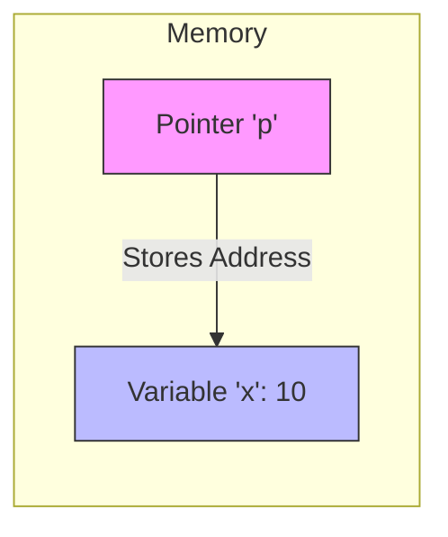
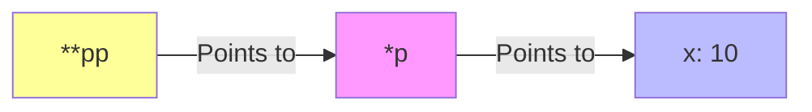

# 指针

指针是 C 语言最强大也最具挑战性的特性，它存储变量的内存地址。

## 指针基础



### 什么是指针

```c
#include <stdio.h>

int main(void) {
    int x = 10;
    int *p = &x;  // p 存储 x 的地址

    printf("x 的值: %d\n", x);
    printf("x 的地址: %p\n", (void*)&x);
    printf("p 存储的地址: %p\n", (void*)p);
    printf("p 指向的值: %d\n", *p);  // 解引用

    // 通过指针修改值
    *p = 20;
    printf("修改后 x = %d\n", x);

    return 0;
}
```

### 指针运算

```c
#include <stdio.h>

int main(void) {
    int arr[] = {10, 20, 30, 40, 50};
    int *p = arr;  // 数组名是首元素地址

    printf("*p = %d\n", *p);          // 10
    printf("*(p+1) = %d\n", *(p+1));  // 20
    printf("*(p+2) = %d\n", *(p+2));  // 30

    // 指针自增
    p++;
    printf("p++ 后 *p = %d\n", *p);   // 20

    // 指针相减
    int *q = &arr[4];
    printf("q - p = %ld\n", q - p);   // 3

    return 0;
}
```

## 指针和数组

```mermaid
graph TD
    p[Pointer 'p'] --> arr0

    subgraph Array
    arr0[arr[0]] --- arr1[arr[1]] --- arr2[arr[2]] --- arr3[arr[3]] --- arr4[arr[4]]
    end

    style p fill:#f9f,stroke:#333
    style arr0 fill:#bbf
    style arr1 fill:#bbf
    style arr2 fill:#bbf
    style arr3 fill:#bbf
    style arr4 fill:#bbf
```

```c
#include <stdio.h>

int main(void) {
    int arr[] = {1, 2, 3, 4, 5};
    int *p = arr;
    int n = sizeof(arr) / sizeof(arr[0]);

    // 三种等价的访问方式
    printf("arr[2] = %d\n", arr[2]);
    printf("*(arr+2) = %d\n", *(arr + 2));
    printf("*(p+2) = %d\n", *(p + 2));
    printf("p[2] = %d\n", p[2]);

    // 使用指针遍历数组
    printf("数组元素: ");
    for (int *ptr = arr; ptr < arr + n; ptr++) {
        printf("%d ", *ptr);
    }
    printf("\n");

    return 0;
}
```

## 指针和字符串

```c
#include <stdio.h>

int main(void) {
    // 字符串指针
    const char *str = "Hello, World!";

    // 遍历字符串
    const char *p = str;
    while (*p != '\0') {
        printf("%c", *p);
        p++;
    }
    printf("\n");

    // 字符串长度（手动实现）
    int len = 0;
    for (const char *s = str; *s; s++) {
        len++;
    }
    printf("长度: %d\n", len);

    return 0;
}
```

## 多级指针



```c
#include <stdio.h>

int main(void) {
    int x = 10;
    int *p = &x;      // 一级指针
    int **pp = &p;    // 二级指针
    int ***ppp = &pp; // 三级指针

    printf("x = %d\n", x);
    printf("*p = %d\n", *p);
    printf("**pp = %d\n", **pp);
    printf("***ppp = %d\n", ***ppp);

    // 修改值
    ***ppp = 100;
    printf("x = %d\n", x);  // 100

    return 0;
}
```

## 指针数组和数组指针

```c
#include <stdio.h>

int main(void) {
    // 指针数组：存储指针的数组
    const char *fruits[] = {"Apple", "Banana", "Cherry"};
    for (int i = 0; i < 3; i++) {
        printf("%s\n", fruits[i]);
    }

    // 数组指针：指向数组的指针
    int arr[3][4] = {
        {1, 2, 3, 4},
        {5, 6, 7, 8},
        {9, 10, 11, 12}
    };

    int (*p)[4] = arr;  // p 指向包含4个int的数组

    printf("\n二维数组:\n");
    for (int i = 0; i < 3; i++) {
        for (int j = 0; j < 4; j++) {
            printf("%3d ", p[i][j]);
        }
        printf("\n");
    }

    return 0;
}
```

## 函数指针

```c
#include <stdio.h>

int add(int a, int b) { return a + b; }
int sub(int a, int b) { return a - b; }
int mul(int a, int b) { return a * b; }

int main(void) {
    // 声明函数指针
    int (*op)(int, int);

    op = add;
    printf("add(5, 3) = %d\n", op(5, 3));

    op = mul;
    printf("mul(5, 3) = %d\n", op(5, 3));

    // 函数指针数组
    int (*ops[])(int, int) = {add, sub, mul};
    const char *names[] = {"+", "-", "*"};

    for (int i = 0; i < 3; i++) {
        printf("10 %s 3 = %d\n", names[i], ops[i](10, 3));
    }

    return 0;
}
```

## void 指针

```c
#include <stdio.h>

void printValue(void *ptr, char type) {
    switch (type) {
        case 'i':
            printf("%d\n", *(int*)ptr);
            break;
        case 'f':
            printf("%f\n", *(float*)ptr);
            break;
        case 'c':
            printf("%c\n", *(char*)ptr);
            break;
    }
}

int main(void) {
    int i = 42;
    float f = 3.14f;
    char c = 'A';

    printValue(&i, 'i');
    printValue(&f, 'f');
    printValue(&c, 'c');

    return 0;
}
```

## const 与指针

```c
#include <stdio.h>

int main(void) {
    int x = 10, y = 20;

    // 1. 指向常量的指针（不能通过指针修改值）
    const int *p1 = &x;
    // *p1 = 100;  // 错误
    p1 = &y;       // 可以改变指向

    // 2. 常量指针（不能改变指向）
    int *const p2 = &x;
    *p2 = 100;     // 可以修改值
    // p2 = &y;    // 错误

    // 3. 指向常量的常量指针（都不能改）
    const int *const p3 = &x;
    // *p3 = 100;  // 错误
    // p3 = &y;    // 错误

    printf("x = %d\n", x);

    return 0;
}
```

## 常见错误

```c
#include <stdio.h>
#include <stdlib.h>

int main(void) {
    // 1. 空指针解引用
    int *p1 = NULL;
    // *p1 = 10;  // 段错误！

    // 正确做法：检查指针
    if (p1 != NULL) {
        *p1 = 10;
    }

    // 2. 野指针（未初始化）
    int *p2;  // 指向未知位置
    // *p2 = 10;  // 未定义行为！

    // 正确做法：初始化为 NULL 或有效地址
    int *p3 = NULL;

    // 3. 悬空指针（指向已释放的内存）
    int *p4 = malloc(sizeof(int));
    *p4 = 10;
    free(p4);
    // *p4 = 20;  // 悬空指针访问！
    p4 = NULL;  // 正确做法：释放后置空

    return 0;
}
```

掌握指针后，就可以继续学习内存管理了！
