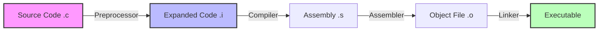
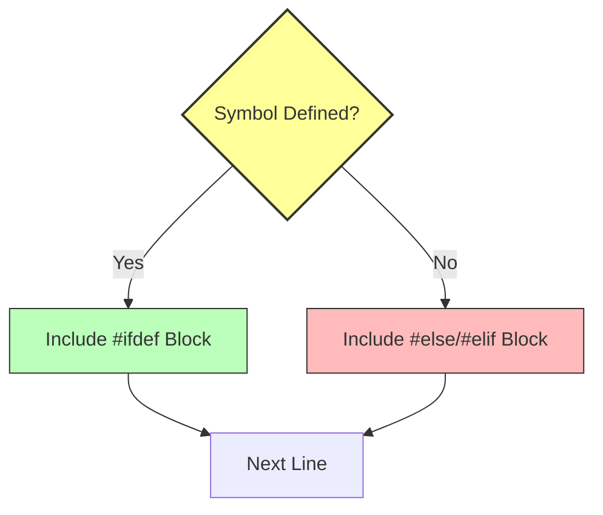

# 预处理器

预处理器在编译之前处理源代码，执行宏替换、文件包含和条件编译等操作。



## 宏定义

### 简单宏

```c
#include <stdio.h>

#define PI 3.14159
#define MAX_SIZE 100
#define MESSAGE "Hello, World!"

int main(void) {
    double area = PI * 5 * 5;
    printf("圆面积: %.2f\n", area);
    printf("%s\n", MESSAGE);

    int arr[MAX_SIZE];
    printf("数组大小: %d\n", MAX_SIZE);

    return 0;
}
```

### 带参数的宏

```c
#include <stdio.h>

#define MAX(a, b) ((a) > (b) ? (a) : (b))
#define MIN(a, b) ((a) < (b) ? (a) : (b))
#define SQUARE(x) ((x) * (x))
#define ABS(x) ((x) < 0 ? -(x) : (x))

int main(void) {
    printf("MAX(3, 7) = %d\n", MAX(3, 7));
    printf("MIN(3, 7) = %d\n", MIN(3, 7));
    printf("SQUARE(5) = %d\n", SQUARE(5));
    printf("ABS(-10) = %d\n", ABS(-10));

    // 注意括号的重要性
    printf("SQUARE(3+2) = %d\n", SQUARE(3+2));  // 25

    return 0;
}
```

### 多行宏

```c
#include <stdio.h>

#define PRINT_ARRAY(arr, n) do { \
    printf("数组: "); \
    for (int i = 0; i < (n); i++) { \
        printf("%d ", (arr)[i]); \
    } \
    printf("\n"); \
} while(0)

int main(void) {
    int arr[] = {1, 2, 3, 4, 5};
    PRINT_ARRAY(arr, 5);
    return 0;
}
```

## 条件编译

### #ifdef / #ifndef



```c
#include <stdio.h>

#define DEBUG

int main(void) {
    #ifdef DEBUG
        printf("调试模式\n");
    #endif

    #ifndef RELEASE
        printf("非发布模式\n");
    #endif

    printf("程序运行中...\n");
    return 0;
}
```

### #if / #elif / #else

```c
#include <stdio.h>

#define VERSION 2

int main(void) {
    #if VERSION == 1
        printf("版本 1\n");
    #elif VERSION == 2
        printf("版本 2\n");
    #else
        printf("其他版本\n");
    #endif

    #if defined(DEBUG) && DEBUG > 0
        printf("调试信息\n");
    #endif

    return 0;
}
```

### 平台检测

```c
#include <stdio.h>

int main(void) {
    #if defined(_WIN32)
        printf("Windows 平台\n");
    #elif defined(__linux__)
        printf("Linux 平台\n");
    #elif defined(__APPLE__)
        printf("macOS 平台\n");
    #else
        printf("其他平台\n");
    #endif

    return 0;
}
```

## 文件包含

### 头文件保护

```c
// myheader.h
#ifndef MYHEADER_H
#define MYHEADER_H

// 头文件内容
typedef struct {
    int x, y;
} Point;

void printPoint(Point p);

#endif // MYHEADER_H
```

```c
// 现代方式（部分编译器支持）
#pragma once

typedef struct {
    int x, y;
} Point;
```

## 特殊宏

```c
#include <stdio.h>

int main(void) {
    // 预定义宏
    printf("文件: %s\n", __FILE__);
    printf("行号: %d\n", __LINE__);
    printf("日期: %s\n", __DATE__);
    printf("时间: %s\n", __TIME__);
    printf("函数: %s\n", __func__);

    return 0;
}
```

## 字符串化和连接

```c
#include <stdio.h>

// # 字符串化
#define STRINGIFY(x) #x
#define TO_STRING(x) STRINGIFY(x)

// ## 标记连接
#define CONCAT(a, b) a##b
#define VAR(n) var##n

int main(void) {
    printf("%s\n", STRINGIFY(Hello));  // "Hello"

    int var1 = 10, var2 = 20;
    printf("var1 = %d\n", VAR(1));  // var1
    printf("var2 = %d\n", VAR(2));  // var2

    int CONCAT(my, Var) = 100;  // myVar
    printf("myVar = %d\n", myVar);

    return 0;
}
```

## 实用示例

### 调试宏

```c
#include <stdio.h>

#define DEBUG 1

#if DEBUG
    #define LOG(fmt, ...) \
        printf("[%s:%d] " fmt "\n", __FILE__, __LINE__, ##__VA_ARGS__)
#else
    #define LOG(fmt, ...)
#endif

#define ASSERT(cond) do { \
    if (!(cond)) { \
        fprintf(stderr, "断言失败: %s, 文件: %s, 行: %d\n", \
                #cond, __FILE__, __LINE__); \
    } \
} while(0)

int main(void) {
    LOG("程序启动");

    int x = 10;
    LOG("x = %d", x);

    ASSERT(x > 0);
    ASSERT(x < 5);  // 会打印断言失败

    return 0;
}
```

### 静态断言

```c
#include <stdio.h>

// 编译时断言
#define STATIC_ASSERT(cond, msg) \
    typedef char static_assertion_##msg[(cond) ? 1 : -1]

// C11 标准方式
// _Static_assert(sizeof(int) == 4, "int must be 4 bytes");

STATIC_ASSERT(sizeof(int) >= 4, int_size_check);

int main(void) {
    printf("编译成功\n");
    return 0;
}
```

祝贺！你已经学习了 C 语言的核心内容！
