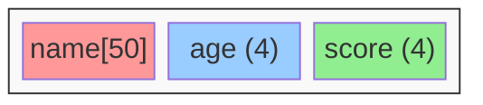
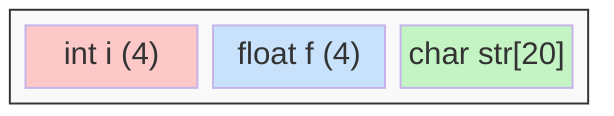

# 结构体和联合体

结构体和联合体允许将不同类型的数据组合成一个单元。

## 结构体基础



### 定义和使用

```c
#include <stdio.h>
#include <string.h>

// 结构体定义
struct Student {
    char name[50];
    int age;
    float score;
};

int main(void) {
    // 声明并初始化
    struct Student s1 = {"张三", 20, 95.5};

    // 访问成员
    printf("姓名: %s\n", s1.name);
    printf("年龄: %d\n", s1.age);
    printf("成绩: %.1f\n", s1.score);

    // 修改成员
    s1.age = 21;
    strcpy(s1.name, "李四");

    // 逐个初始化
    struct Student s2;
    strcpy(s2.name, "王五");
    s2.age = 19;
    s2.score = 88.0;

    return 0;
}
```

### typedef 简化

```c
#include <stdio.h>

typedef struct {
    int x;
    int y;
} Point;

typedef struct {
    Point topLeft;
    Point bottomRight;
} Rectangle;

int main(void) {
    Point p1 = {10, 20};
    Point p2 = {100, 200};

    Rectangle rect = {p1, p2};

    printf("矩形: (%d,%d) - (%d,%d)\n",
           rect.topLeft.x, rect.topLeft.y,
           rect.bottomRight.x, rect.bottomRight.y);

    return 0;
}
```

## 结构体和指针

```c
#include <stdio.h>
#include <stdlib.h>
#include <string.h>

typedef struct {
    char name[50];
    int age;
} Person;

void printPerson(const Person *p) {
    printf("姓名: %s, 年龄: %d\n", p->name, p->age);
}

void birthday(Person *p) {
    p->age++;
}

int main(void) {
    Person p1 = {"张三", 25};
    Person *ptr = &p1;

    // -> 运算符访问成员
    printf("姓名: %s\n", ptr->name);

    printPerson(&p1);
    birthday(&p1);
    printPerson(&p1);

    // 动态分配结构体
    Person *p2 = malloc(sizeof(Person));
    strcpy(p2->name, "李四");
    p2->age = 30;

    printPerson(p2);
    free(p2);

    return 0;
}
```

## 结构体数组

```c
#include <stdio.h>

typedef struct {
    char name[20];
    int score;
} Player;

int main(void) {
    Player players[] = {
        {"Alice", 100},
        {"Bob", 85},
        {"Charlie", 92}
    };
    int n = sizeof(players) / sizeof(players[0]);

    // 找最高分
    int maxIdx = 0;
    for (int i = 1; i < n; i++) {
        if (players[i].score > players[maxIdx].score) {
            maxIdx = i;
        }
    }

    printf("最高分: %s - %d\n",
           players[maxIdx].name, players[maxIdx].score);

    return 0;
}
```

## 联合体



```c
#include <stdio.h>

// 联合体：所有成员共享同一块内存
union Data {
    int i;
    float f;
    char str[20];
};

int main(void) {
    union Data data;

    printf("sizeof(union Data) = %zu\n", sizeof(data));

    data.i = 10;
    printf("data.i = %d\n", data.i);

    data.f = 3.14f;
    printf("data.f = %f\n", data.f);
    // 此时 data.i 的值已经被覆盖

    return 0;
}
```

## 带标签的联合体

```c
#include <stdio.h>

typedef enum { INT, FLOAT, STRING } DataType;

typedef struct {
    DataType type;
    union {
        int i;
        float f;
        char str[20];
    } value;
} Variant;

void printVariant(Variant *v) {
    switch (v->type) {
        case INT:
            printf("Int: %d\n", v->value.i);
            break;
        case FLOAT:
            printf("Float: %f\n", v->value.f);
            break;
        case STRING:
            printf("String: %s\n", v->value.str);
            break;
    }
}

int main(void) {
    Variant v1 = {INT, .value.i = 42};
    Variant v2 = {FLOAT, .value.f = 3.14f};

    printVariant(&v1);
    printVariant(&v2);

    return 0;
}
```

## 枚举

```c
#include <stdio.h>

typedef enum {
    MONDAY = 1,
    TUESDAY,
    WEDNESDAY,
    THURSDAY,
    FRIDAY,
    SATURDAY,
    SUNDAY
} Weekday;

typedef enum {
    RED = 0xFF0000,
    GREEN = 0x00FF00,
    BLUE = 0x0000FF
} Color;

int main(void) {
    Weekday today = WEDNESDAY;

    if (today >= MONDAY && today <= FRIDAY) {
        printf("工作日\n");
    } else {
        printf("周末\n");
    }

    Color c = RED;
    printf("红色: 0x%X\n", c);

    return 0;
}
```

## 位域

```c
#include <stdio.h>

// 位域：精确控制位数
struct Flags {
    unsigned int isActive : 1;   // 1 位
    unsigned int priority : 3;   // 3 位 (0-7)
    unsigned int type : 4;       // 4 位 (0-15)
};

int main(void) {
    struct Flags f = {1, 5, 10};

    printf("sizeof(Flags) = %zu\n", sizeof(f));
    printf("isActive: %u\n", f.isActive);
    printf("priority: %u\n", f.priority);
    printf("type: %u\n", f.type);

    return 0;
}
```

掌握结构体后，就可以继续学习文件操作了！
