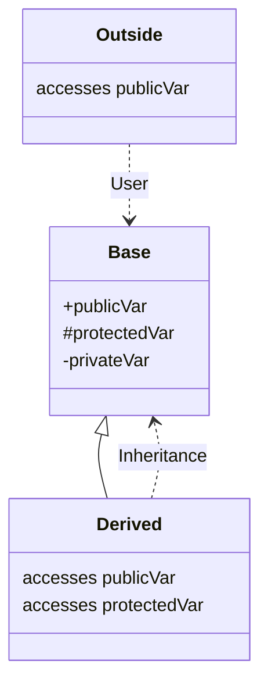

# C++ 类和对象

类是面向对象编程的核心，用于定义数据和行为的蓝图。

## 🎯 类的定义

```cpp
#include <iostream>
#include <string>

class Person {
private:  // 私有成员
    std::string name;
    int age;

public:   // 公有成员
    // 默认构造函数
    Person() : name("Unknown"), age(0) {}

    // 带参数构造函数
    Person(const std::string& n, int a) : name(n), age(a) {}

    // 成员函数
    void introduce() const {
        std::cout << "我是 " << name << "，" << age << " 岁。" << std::endl;
    }

    // Getter
    std::string getName() const { return name; }
    int getAge() const { return age; }

    // Setter
    void setAge(int a) { if (a >= 0) age = a; }
};

int main() {
    Person p1;                      // 默认构造
    Person p2("张三", 25);          // 带参构造
    Person p3{"李四", 30};          // 统一初始化

    p2.introduce();
    p3.setAge(31);

    return 0;
}
```

## 🔧 构造函数

```cpp
class Widget {
private:
    int id;
    std::string name;

public:
    // 默认构造函数
    Widget() : id(0), name("default") {}

    // 带参构造函数
    Widget(int i, const std::string& n) : id(i), name(n) {}

    // 委托构造函数 (C++11)
    Widget(int i) : Widget(i, "unnamed") {}

    // 拷贝构造函数
    Widget(const Widget& other) : id(other.id), name(other.name) {}

    // 移动构造函数 (C++11)
    Widget(Widget&& other) noexcept
        : id(other.id), name(std::move(other.name)) {}
};
```

## 💥 析构函数

```cpp
class Resource {
private:
    int* data;

public:
    Resource(int size) {
        data = new int[size];
        std::cout << "资源获取" << std::endl;
    }

    ~Resource() {
        delete[] data;
        std::cout << "资源释放" << std::endl;
    }
};

void example() {
    Resource r(10);
}  // 离开作用域，自动调用析构函数
```

## 📋 拷贝与移动

```cpp
class Buffer {
private:
    int* data;
    size_t size;

public:
    Buffer(size_t s) : size(s), data(new int[s]) {}

    // 拷贝赋值运算符
    Buffer& operator=(const Buffer& other) {
        if (this != &other) {
            delete[] data;
            size = other.size;
            data = new int[size];
            std::copy(other.data, other.data + size, data);
        }
        return *this;
    }

    // 移动赋值运算符 (C++11)
    Buffer& operator=(Buffer&& other) noexcept {
        if (this != &other) {
            delete[] data;
            data = other.data;
            size = other.size;
            other.data = nullptr;
            other.size = 0;
        }
        return *this;
    }

    ~Buffer() { delete[] data; }
};
```

## 🔒 访问控制



```cpp
class Example {
public:     // 公有：任何地方都可以访问
    int publicVar;

protected:  // 保护：本类和派生类可访问
    int protectedVar;

private:    // 私有：只有本类可访问
    int privateVar;
};
```

## 🎭 this 指针

```cpp
class Counter {
private:
    int count;

public:
    Counter() : count(0) {}

    Counter& increment() {
        count++;
        return *this;  // 返回自身引用，支持链式调用
    }

    Counter& add(int n) {
        this->count += n;
        return *this;
    }
};

int main() {
    Counter c;
    c.increment().add(5).increment();  // 链式调用
    return 0;
}
```

## 📊 静态成员

```cpp
class Counter {
private:
    static int count;  // 静态成员变量
    int id;

public:
    Counter() : id(++count) {}

    static int getCount() { return count; }  // 静态成员函数
    int getId() const { return id; }
};

int Counter::count = 0;  // 类外初始化

int main() {
    Counter c1, c2, c3;
    std::cout << Counter::getCount() << std::endl;  // 3
    return 0;
}
```

## 👥 友元

```cpp
class Box {
private:
    double width;

public:
    Box(double w) : width(w) {}

    // 友元函数
    friend void printWidth(const Box& b);

    // 友元类
    friend class BoxHelper;
};

void printWidth(const Box& b) {
    std::cout << b.width << std::endl;  // 可访问私有成员
}

class BoxHelper {
public:
    void resize(Box& b, double w) {
        b.width = w;  // 可访问私有成员
    }
};
```

## ⚡ 最佳实践

1. **使用初始化列表** - 比构造函数体内赋值更高效
2. **遵循三/五法则** - 定义析构则考虑拷贝/移动
3. **成员函数加 const** - 不修改对象状态时
4. **使用 explicit** - 防止隐式转换
5. **私有化数据** - 通过公有接口访问
