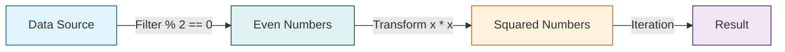
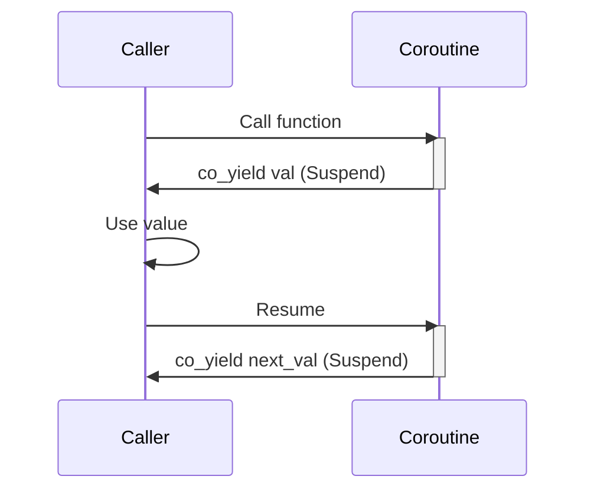

# C++20 新特性

C++20 是继 C++11 后最大的更新，引入了概念、范围、协程等重大特性。

## 🎯 Concepts (概念)

```cpp
#include <concepts>

// 定义概念
template<typename T>
concept Addable = requires(T a, T b) {
    { a + b } -> std::same_as<T>;
};

// 使用概念约束模板
template<Addable T>
T add(T a, T b) {
    return a + b;
}

// 或者使用 requires 子句
template<typename T>
    requires std::integral<T>
T multiply(T a, T b) {
    return a * b;
}

// 简写形式
auto divide(std::floating_point auto a, std::floating_point auto b) {
    return a / b;
}
```

## 📦 Ranges (范围)

```cpp
#include <ranges>
#include <vector>

std::vector<int> v = {1, 2, 3, 4, 5, 6, 7, 8, 9, 10};

// 视图组合
auto result = v
    | std::views::filter([](int x) { return x % 2 == 0; })
    | std::views::transform([](int x) { return x * x; });

// 惰性求值
for (int x : result) {
    std::cout << x << " ";  // 4 16 36 64 100
}
```



## 🔄 Coroutines (协程)

```cpp
#include <coroutine>

// 生成器示例（需要自定义返回类型）
Generator<int> range(int start, int end) {
    for (int i = start; i < end; ++i) {
        co_yield i;
    }
}
```



## 📋 三路比较 (Spaceship)

```cpp
#include <compare>

struct Point {
    int x, y;
    auto operator<=>(const Point&) const = default;
};

Point p1{1, 2}, p2{1, 3};
if (p1 < p2) { /* ... */ }
```

## 🔧 Modules (模块)

```cpp
// math.ixx
export module math;

export int add(int a, int b) {
    return a + b;
}

// main.cpp
import math;

int main() {
    return add(1, 2);
}
```

## 📌 其他特性

```cpp
// consteval - 必须编译期求值
consteval int factorial(int n) {
    return (n <= 1) ? 1 : n * factorial(n - 1);
}

// constinit - 静态初始化
constinit int global = 42;

// 格式化库
#include <format>
std::string s = std::format("{} + {} = {}", 1, 2, 3);

// std::span
void process(std::span<int> data) { /* ... */ }

// 日历和时区库
#include <chrono>
auto now = std::chrono::system_clock::now();
```

## ⚡ 核心改进

- **Concepts** - 更好的模板错误信息
- **Ranges** - 函数式编程风格
- **Coroutines** - 异步编程支持
- **Modules** - 更快的编译速度
