# C++ 数据结构实现

使用 C++ 实现常见数据结构。

## 🔗 链表


```cpp
template<typename T>
class LinkedList {
    struct Node {
        T data;
        Node* next;
        Node(const T& d) : data(d), next(nullptr) {}
    };

    Node* head = nullptr;

public:
    void push_front(const T& value) {
        Node* node = new Node(value);
        node->next = head;
        head = node;
    }

    void pop_front() {
        if (head) {
            Node* temp = head;
            head = head->next;
            delete temp;
        }
    }

    ~LinkedList() {
        while (head) pop_front();
    }
};
```

## 📚 栈

```mermaid
graph TD
    subgraph Stack Container
    top[Top] --- mid[Middle]
    mid --- bottom[Bottom]
    end

    push(Push ⬇️) --> top
    top --> pop(Pop ⬆️)

    style top fill:#ff9999
    style mid fill:#ff9999
    style bottom fill:#ff9999
```



```cpp
template<typename T>
class Stack {
    std::vector<T> data;

public:
    void push(const T& value) { data.push_back(value); }

    void pop() { data.pop_back(); }

    T& top() { return data.back(); }

    bool empty() const { return data.empty(); }

    size_t size() const { return data.size(); }
};
```

## 📮 队列


```cpp
template<typename T>
class Queue {
    std::deque<T> data;

public:
    void enqueue(const T& value) { data.push_back(value); }

    void dequeue() { data.pop_front(); }

    T& front() { return data.front(); }

    bool empty() const { return data.empty(); }
};
```

## 🌳 二叉搜索树


```cpp
template<typename T>
class BST {
    struct Node {
        T data;
        Node *left, *right;
        Node(const T& d) : data(d), left(nullptr), right(nullptr) {}
    };

    Node* root = nullptr;

    Node* insert(Node* node, const T& value) {
        if (!node) return new Node(value);
        if (value < node->data)
            node->left = insert(node->left, value);
        else
            node->right = insert(node->right, value);
        return node;
    }

    void inorder(Node* node) {
        if (node) {
            inorder(node->left);
            std::cout << node->data << " ";
            inorder(node->right);
        }
    }

public:
    void insert(const T& value) { root = insert(root, value); }
    void print() { inorder(root); }
};
```

## #️⃣ 哈希表

```cpp
template<typename K, typename V>
class HashTable {
    static const int SIZE = 1000;
    std::list<std::pair<K, V>> table[SIZE];

    int hash(const K& key) {
        return std::hash<K>{}(key) % SIZE;
    }

public:
    void put(const K& key, const V& value) {
        int idx = hash(key);
        for (auto& p : table[idx]) {
            if (p.first == key) {
                p.second = value;
                return;
            }
        }
        table[idx].push_back({key, value});
    }

    V* get(const K& key) {
        int idx = hash(key);
        for (auto& p : table[idx]) {
            if (p.first == key) return &p.second;
        }
        return nullptr;
    }
};
```

## ⚡ STL 容器对应

| 数据结构 | STL 容器               |
| -------- | ---------------------- |
| 动态数组 | `std::vector`          |
| 双向链表 | `std::list`            |
| 栈       | `std::stack`           |
| 队列     | `std::queue`           |
| 优先队列 | `std::priority_queue`  |
| 哈希表   | `std::unordered_map`   |
| 红黑树   | `std::map`, `std::set` |
