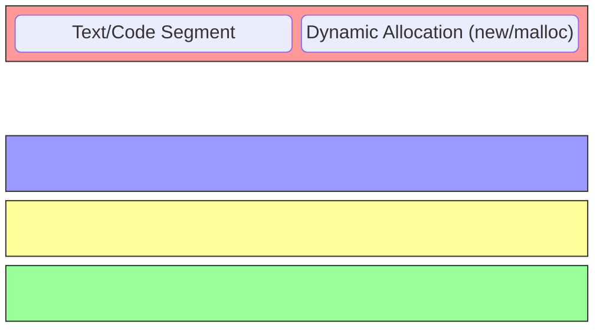
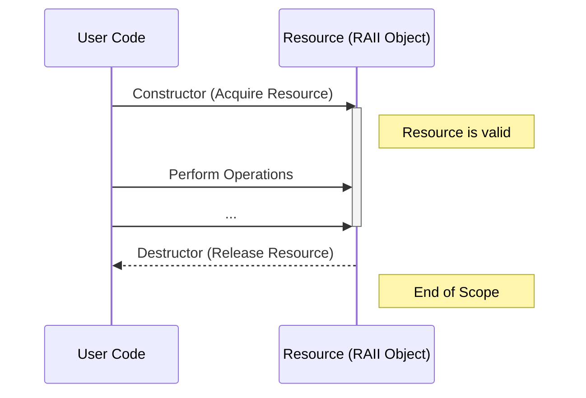

# C++ 内存管理

C++ 提供了强大的内存管理机制，从手动 new/delete 到现代智能指针。

## 🧱 内存区域

- **栈 (Stack)**: 局部变量，自动管理
- **堆 (Heap)**: 动态分配，需手动管理
- **全局/静态区**: 全局变量和静态变量
- **代码区**: 程序代码



## 📦 new 和 delete

```cpp
#include <iostream>

int main() {
    // 分配单个对象
    int* ptr = new int(42);
    std::cout << *ptr << std::endl;
    delete ptr;
    ptr = nullptr;  // 避免悬空指针

    // 分配数组
    int* arr = new int[5]{1, 2, 3, 4, 5};
    for (int i = 0; i < 5; i++) {
        std::cout << arr[i] << " ";
    }
    delete[] arr;  // 注意 []

    // 分配对象
    class MyClass {
    public:
        MyClass() { std::cout << "构造" << std::endl; }
        ~MyClass() { std::cout << "析构" << std::endl; }
    };

    MyClass* obj = new MyClass();
    delete obj;

    return 0;
}
```

## 🛡️ RAII 原则

Resource Acquisition Is Initialization（资源获取即初始化）：



```cpp
#include <fstream>
#include <mutex>

class FileHandler {
private:
    std::ofstream file;

public:
    FileHandler(const std::string& filename) {
        file.open(filename);
    }

    ~FileHandler() {
        if (file.is_open()) {
            file.close();  // 自动关闭
        }
    }

    void write(const std::string& data) {
        file << data;
    }
};

void example() {
    FileHandler fh("test.txt");
    fh.write("Hello");
}  // 离开作用域自动关闭文件

// 使用 lock_guard 管理互斥锁
std::mutex mtx;
void threadSafe() {
    std::lock_guard<std::mutex> lock(mtx);
    // 临界区代码
}  // 自动解锁
```

## 🔐 智能指针

### unique_ptr

独占所有权，不能拷贝：

```cpp
#include <memory>

int main() {
    // 创建
    auto ptr = std::make_unique<int>(42);
    std::unique_ptr<int[]> arr = std::make_unique<int[]>(5);

    // 使用
    std::cout << *ptr << std::endl;

    // 转移所有权
    auto ptr2 = std::move(ptr);
    // ptr 现在为空

    // 释放所有权
    int* raw = ptr2.release();
    delete raw;

    // 重置
    ptr2.reset(new int(100));
    ptr2.reset();  // 释放并置空

    return 0;
}
```

### shared_ptr

共享所有权，引用计数：

```cpp
#include <memory>

int main() {
    auto ptr1 = std::make_shared<int>(42);
    std::cout << "Count: " << ptr1.use_count() << std::endl;  // 1

    {
        auto ptr2 = ptr1;  // 共享所有权
        std::cout << "Count: " << ptr1.use_count() << std::endl;  // 2
    }

    std::cout << "Count: " << ptr1.use_count() << std::endl;  // 1

    return 0;
}
```

### weak_ptr

弱引用，不增加引用计数：

```cpp
#include <memory>

int main() {
    auto shared = std::make_shared<int>(42);
    std::weak_ptr<int> weak = shared;

    // 使用前检查并锁定
    if (auto locked = weak.lock()) {
        std::cout << *locked << std::endl;
    }

    // 检查是否过期
    if (!weak.expired()) {
        // 对象仍然存在
    }

    return 0;
}
```

## ⚠️ 常见问题

### 内存泄漏

```cpp
void leak() {
    int* ptr = new int(42);
    return;  // 忘记 delete
}

// 解决：使用智能指针
void noLeak() {
    auto ptr = std::make_unique<int>(42);
}  // 自动释放
```

### 悬空指针

```cpp
int* ptr;
{
    int x = 10;
    ptr = &x;
}
// ptr 现在是悬空指针

// 解决：使用智能指针或确保生命周期
```

### 双重释放

```cpp
int* ptr = new int(42);
delete ptr;
delete ptr;  // 错误！

// 解决：delete 后置空，或使用智能指针
ptr = nullptr;
```

## ⚡ 最佳实践

1. **优先使用智能指针** - 避免手动管理
2. **使用 make_unique/make_shared** - 更安全高效
3. **遵循 RAII** - 资源在构造时获取，析构时释放
4. **避免裸指针所有权** - 裸指针仅用于非所有权场景
5. **delete 后置空** - 如果必须使用裸指针
