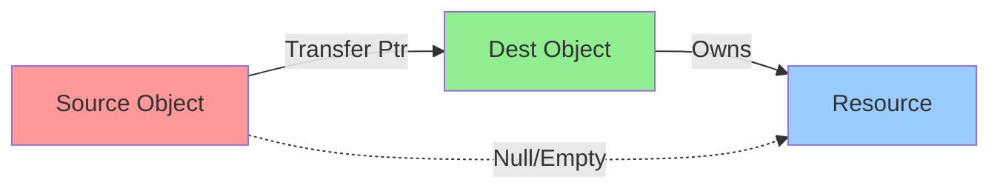

# C++ 移动语义

移动语义通过转移资源所有权来避免不必要的拷贝，提升性能。

## 🎯 左值与右值

```cpp
int x = 10;         // x 是左值
int y = x + 5;      // x + 5 是右值
int& lref = x;      // 左值引用
int&& rref = 10;    // 右值引用
int&& rref2 = x + 5;
```

## 📦 std::move



将左值转换为右值引用：

```cpp
#include <utility>
#include <string>

std::string s1 = "Hello";
std::string s2 = std::move(s1);  // s1 的资源转移到 s2
// s1 现在是空的或未定义状态
```

## 🔧 移动构造函数和移动赋值

```cpp
class Buffer {
private:
    int* data;
    size_t size;

public:
    // 构造函数
    Buffer(size_t s) : size(s), data(new int[s]) {}

    // 拷贝构造函数
    Buffer(const Buffer& other) : size(other.size) {
        data = new int[size];
        std::copy(other.data, other.data + size, data);
    }

    // 移动构造函数
    Buffer(Buffer&& other) noexcept
        : data(other.data), size(other.size) {
        other.data = nullptr;
        other.size = 0;
    }

    // 移动赋值运算符
    Buffer& operator=(Buffer&& other) noexcept {
        if (this != &other) {
            delete[] data;
            data = other.data;
            size = other.size;
            other.data = nullptr;
            other.size = 0;
        }
        return *this;
    }

    ~Buffer() { delete[] data; }
};
```

## 🔄 完美转发

```cpp
#include <utility>

template<typename T, typename... Args>
std::unique_ptr<T> makeUnique(Args&&... args) {
    return std::unique_ptr<T>(new T(std::forward<Args>(args)...));
}
```

## 📋 返回值优化

```cpp
std::vector<int> createVector() {
    std::vector<int> v = {1, 2, 3, 4, 5};
    return v;  // RVO 或 NRVO 优化，避免拷贝
}
```

## ⚡ 最佳实践

1. **移动后对象处于有效但未定义状态**
2. **移动操作标记为 noexcept** - 允许标准库优化
3. **使用 std::move** - 明确表示资源转移
4. **使用 std::forward** - 完美转发
5. **依赖 RVO** - 编译器自动优化
