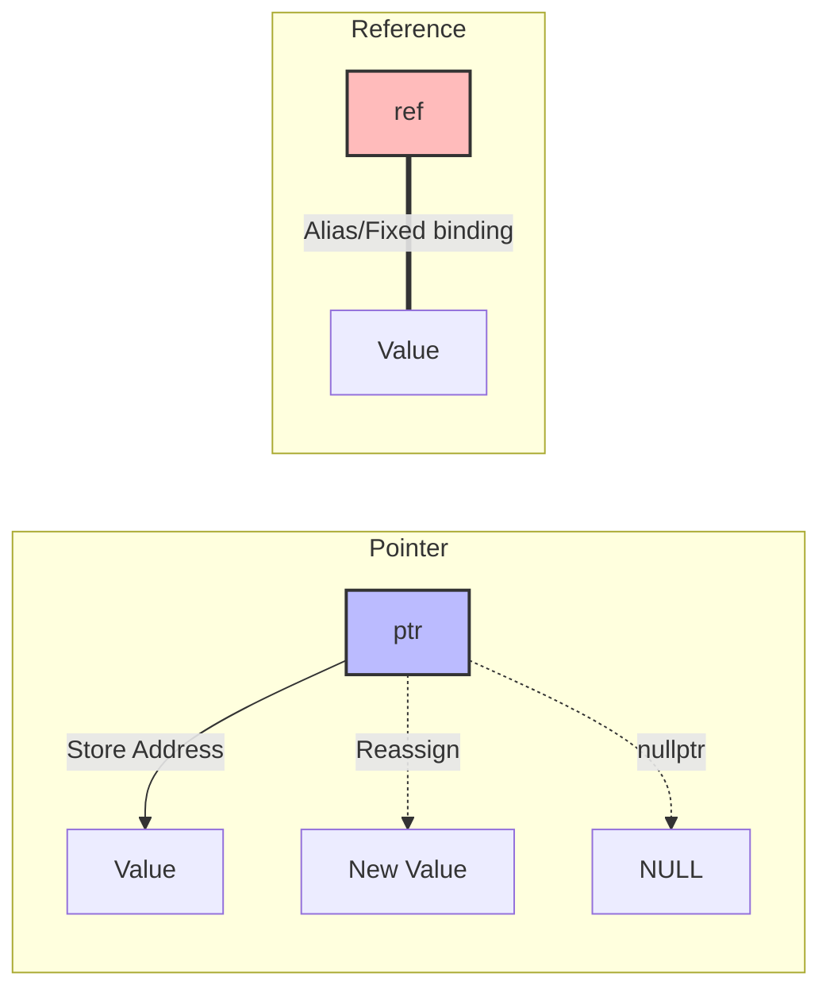

# C++ 指针和引用

指针和引用是 C++ 的核心概念，理解它们对于掌握 C++ 至关重要。

## 🎯 指针基础

```cpp
#include <iostream>

int main() {
    int x = 10;
    int* ptr = &x;     // ptr 存储 x 的地址

    std::cout << "x 的值: " << x << std::endl;
    std::cout << "x 的地址: " << &x << std::endl;
    std::cout << "ptr 的值: " << ptr << std::endl;
    std::cout << "*ptr (解引用): " << *ptr << std::endl;

    *ptr = 20;  // 通过指针修改 x
    std::cout << "x 现在是: " << x << std::endl;  // 20

    // 空指针
    int* nullPtr = nullptr;  // C++11 推荐
    int* nullPtr2 = NULL;    // C 风格

    if (nullPtr == nullptr) {
        std::cout << "指针为空" << std::endl;
    }

    return 0;
}
```

## 🔗 引用

引用是变量的别名，必须初始化且不能重新绑定：

```cpp
#include <iostream>

int main() {
    int x = 10;
    int& ref = x;  // ref 是 x 的引用

    std::cout << "x: " << x << std::endl;
    std::cout << "ref: " << ref << std::endl;

    ref = 20;  // 修改 ref 就是修改 x
    std::cout << "x 现在是: " << x << std::endl;  // 20

    // 引用必须初始化
    // int& badRef;  // 错误！

    // 引用不能重新绑定
    int y = 30;
    ref = y;  // 这是赋值，不是重新绑定

    return 0;
}
```

## 📊 指针 vs 引用

| 特性         | 指针      | 引用     |
| ------------ | --------- | -------- |
| 可为空       | ✅        | ❌       |
| 可重新赋值   | ✅        | ❌       |
| 需要解引用   | ✅ `*ptr` | ❌       |
| 支持算术运算 | ✅        | ❌       |
| 用于函数参数 | 可选参数  | 必传参数 |



## 🔒 const 修饰符

```cpp
int main() {
    int x = 10;
    int y = 20;

    // 指向 const 的指针（不能通过指针修改值）
    const int* ptr1 = &x;
    // *ptr1 = 30;  // 错误
    ptr1 = &y;      // OK

    // const 指针（指针本身不能改变）
    int* const ptr2 = &x;
    *ptr2 = 30;     // OK
    // ptr2 = &y;   // 错误

    // const 指针指向 const
    const int* const ptr3 = &x;
    // *ptr3 = 40;  // 错误
    // ptr3 = &y;   // 错误

    // const 引用
    const int& cref = x;
    // cref = 50;   // 错误

    return 0;
}
```

## 📦 指针与数组

```cpp
#include <iostream>

int main() {
    int arr[5] = {10, 20, 30, 40, 50};
    int* ptr = arr;  // 数组名就是首地址

    // 指针遍历数组
    for (int i = 0; i < 5; i++) {
        std::cout << *(ptr + i) << " ";  // 指针算术
        std::cout << ptr[i] << " ";      // 等价写法
    }

    // 指针移动
    ptr++;  // 移动到下一个元素
    std::cout << *ptr << std::endl;  // 20

    return 0;
}
```

## 🎭 函数参数传递

```cpp
#include <iostream>

// 值传递（拷贝）
void byValue(int x) {
    x = 100;  // 不影响原值
}

// 指针传递
void byPointer(int* ptr) {
    if (ptr) *ptr = 100;
}

// 引用传递
void byReference(int& ref) {
    ref = 100;
}

// const 引用（只读，避免拷贝）
void byConstRef(const std::string& str) {
    std::cout << str << std::endl;
}

int main() {
    int a = 10;

    byValue(a);
    std::cout << a << std::endl;  // 10

    byPointer(&a);
    std::cout << a << std::endl;  // 100

    a = 10;
    byReference(a);
    std::cout << a << std::endl;  // 100

    return 0;
}
```

## ↔️ 右值引用 (C++11)

```cpp
#include <iostream>
#include <utility>

int main() {
    int x = 10;

    int& lref = x;      // 左值引用
    // int& lref2 = 10; // 错误：不能绑定到右值

    int&& rref = 10;    // 右值引用
    int&& rref2 = std::move(x);  // 将左值转为右值

    // 右值引用主要用于移动语义
    return 0;
}
```

## 📋 智能指针预览

```cpp
#include <memory>

int main() {
    // unique_ptr - 独占所有权
    auto uptr = std::make_unique<int>(42);

    // shared_ptr - 共享所有权
    auto sptr = std::make_shared<int>(42);

    // weak_ptr - 弱引用
    std::weak_ptr<int> wptr = sptr;

    return 0;
}
```

## ⚡ 最佳实践

1. **优先使用引用** - 比指针更安全
2. **使用 const 引用传递大对象** - 避免拷贝
3. **使用 nullptr** - 而非 NULL 或 0
4. **使用智能指针** - 自动管理内存
5. **检查指针是否为空** - 避免空指针解引用
