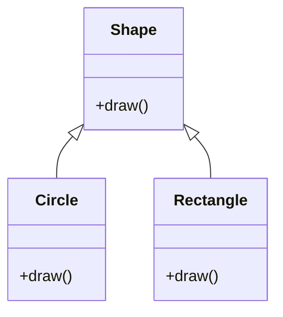
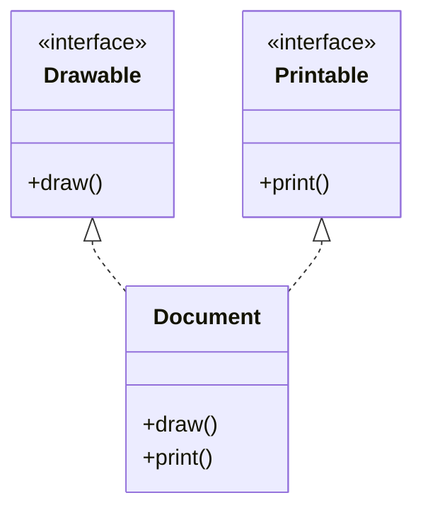

# C++ 多态

多态允许通过基类指针或引用调用派生类的方法，实现运行时动态绑定。

## 🎯 虚函数



```cpp
#include <iostream>

class Shape {
public:
    virtual void draw() const {
        std::cout << "绘制图形" << std::endl;
    }

    virtual ~Shape() = default;  // 虚析构函数
};

class Circle : public Shape {
public:
    void draw() const override {  // override 明确重写
        std::cout << "绘制圆形 ○" << std::endl;
    }
};

class Rectangle : public Shape {
public:
    void draw() const override {
        std::cout << "绘制矩形 □" << std::endl;
    }
};

int main() {
    Shape* shapes[] = {new Circle(), new Rectangle()};

    for (auto shape : shapes) {
        shape->draw();  // 动态绑定
    }

    for (auto shape : shapes) delete shape;
    return 0;
}
```

## 🔷 纯虚函数与抽象类

```cpp
// 抽象类（不能实例化）
class Animal {
public:
    virtual void speak() const = 0;  // 纯虚函数
    virtual ~Animal() = default;
};

class Dog : public Animal {
public:
    void speak() const override {
        std::cout << "汪汪" << std::endl;
    }
};

class Cat : public Animal {
public:
    void speak() const override {
        std::cout << "喵喵" << std::endl;
    }
};

int main() {
    // Animal a;  // 错误：不能实例化抽象类

    Animal* animals[] = {new Dog(), new Cat()};
    for (auto a : animals) {
        a->speak();
    }
    for (auto a : animals) delete a;
    return 0;
}
```

## 🎭 接口



```cpp
// 纯接口（只有纯虚函数）
class Drawable {
public:
    virtual void draw() const = 0;
    virtual ~Drawable() = default;
};

class Printable {
public:
    virtual void print() const = 0;
    virtual ~Printable() = default;
};

// 实现多个接口
class Document : public Drawable, public Printable {
public:
    void draw() const override {
        std::cout << "绘制文档" << std::endl;
    }

    void print() const override {
        std::cout << "打印文档" << std::endl;
    }
};
```

## 🔄 运行时类型信息 (RTTI)

```cpp
#include <typeinfo>

class Base {
public:
    virtual ~Base() = default;
};

class Derived : public Base {};

int main() {
    Base* ptr = new Derived();

    // typeid
    std::cout << typeid(*ptr).name() << std::endl;

    // dynamic_cast
    if (Derived* d = dynamic_cast<Derived*>(ptr)) {
        std::cout << "成功转换为 Derived" << std::endl;
    }

    delete ptr;
    return 0;
}
```

## 🚫 final 关键字

```cpp
class Base {
public:
    virtual void foo() final {}  // 不能被重写
};

class FinalClass final {};       // 不能被继承

// class Derived : public FinalClass {};  // 错误
```

## ⚡ 最佳实践

1. **基类需要虚析构函数** - 确保正确释放派生类资源
2. **使用 override** - 明确表示重写意图
3. **使用 final** - 防止不希望的继承或重写
4. **接口使用纯虚函数** - 定义契约
5. **谨慎使用 RTTI** - 优先考虑多态设计
