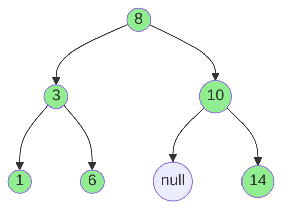

# C++ 标准模板库 (STL)

STL 提供了通用的容器、迭代器和算法。

## 📦 序列容器

```mermaid
graph LR
    subgraph Vector [Vector (Contiguous)]
    v1[1] --- v2[2] --- v3[3] --- v4[4]
    end

    subgraph List [List (Linked)]
    l1((1)) --> l2((2)) --> l3((3)) --> l4((4))
    end

    style Vector fill:#f9f9f9,stroke:#333
    style List fill:#f9f9f9,stroke:#333
    style v1 fill:#99ccff
    style v2 fill:#99ccff
    style v3 fill:#99ccff
    style v4 fill:#99ccff
    style l1 fill:#ff9999
    style l2 fill:#ff9999
    style l3 fill:#ff9999
    style l4 fill:#ff9999
```

```cpp
#include <vector>
#include <deque>
#include <list>
#include <array>
#include <forward_list>

// vector - 动态数组
std::vector<int> vec = {1, 2, 3};
vec.push_back(4);
vec[0] = 10;

// deque - 双端队列
std::deque<int> dq = {1, 2, 3};
dq.push_front(0);
dq.push_back(4);

// list - 双向链表
std::list<int> lst = {1, 2, 3};
lst.push_front(0);

// array - 固定大小数组
std::array<int, 3> arr = {1, 2, 3};
```

## 🗂️ 关联容器



```cpp
#include <set>
#include <map>
#include <unordered_set>
#include <unordered_map>

// set - 有序集合
std::set<int> s = {3, 1, 2};  // 自动排序

// map - 有序映射
std::map<std::string, int> m;
m["one"] = 1;
m["two"] = 2;

// unordered_set - 哈希集合
std::unordered_set<int> us = {1, 2, 3};

// unordered_map - 哈希映射
std::unordered_map<std::string, int> um;
um["key"] = 100;
```

## 🔄 迭代器

```cpp
std::vector<int> vec = {1, 2, 3, 4, 5};

// 正向迭代
for (auto it = vec.begin(); it != vec.end(); ++it) {
    std::cout << *it << " ";
}

// 反向迭代
for (auto it = vec.rbegin(); it != vec.rend(); ++it) {
    std::cout << *it << " ";
}

// 范围 for（推荐）
for (const auto& v : vec) {
    std::cout << v << " ";
}
```

## 🧮 常用算法

```cpp
#include <algorithm>
#include <numeric>

std::vector<int> vec = {3, 1, 4, 1, 5, 9, 2, 6};

// 排序
std::sort(vec.begin(), vec.end());
std::sort(vec.begin(), vec.end(), std::greater<>());  // 降序

// 查找
auto it = std::find(vec.begin(), vec.end(), 5);
bool found = std::binary_search(vec.begin(), vec.end(), 4);

// 变换
std::transform(vec.begin(), vec.end(), vec.begin(),
               [](int x) { return x * 2; });

// 过滤（移除）
vec.erase(std::remove_if(vec.begin(), vec.end(),
          [](int x) { return x < 3; }), vec.end());

// 累加
int sum = std::accumulate(vec.begin(), vec.end(), 0);

// 计数
int count = std::count_if(vec.begin(), vec.end(),
            [](int x) { return x > 5; });

// 最大/最小
auto [minIt, maxIt] = std::minmax_element(vec.begin(), vec.end());
```

## 📋 容器适配器

```cpp
#include <stack>
#include <queue>

// 栈
std::stack<int> stk;
stk.push(1);
stk.top();
stk.pop();

// 队列
std::queue<int> q;
q.push(1);
q.front();
q.pop();

// 优先队列（最大堆）
std::priority_queue<int> pq;
pq.push(3);
pq.push(1);
pq.top();  // 3
```

## ⚡ 最佳实践

1. **选择合适容器** - vector 是默认选择
2. **使用 emplace** - 原地构造，避免拷贝
3. **预分配容量** - reserve() 避免频繁扩容
4. **使用范围 for** - 简洁安全
5. **使用 STL 算法** - 优于手写循环
