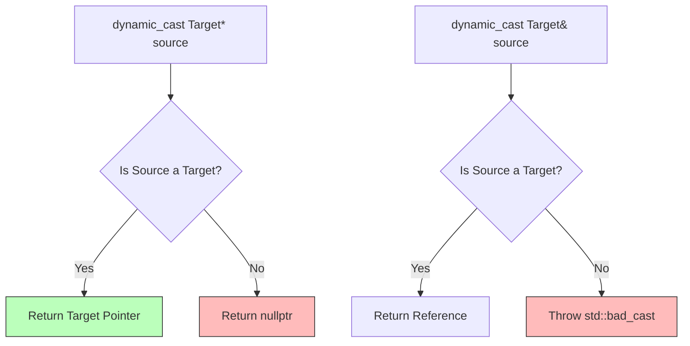

# C++ 类型转换

C++ 提供了四种显式类型转换运算符，比 C 风格转换更安全。

## 🎯 四种转换运算符

### static_cast

编译期类型转换，用于相关类型之间：

```cpp
// 数值类型转换
double d = 3.14;
int i = static_cast<int>(d);  // 3

// 指针向上/向下转换（无运行时检查）
class Base {};
class Derived : public Base {};

Derived* d = new Derived();
Base* b = static_cast<Base*>(d);      // 向上转换
Derived* d2 = static_cast<Derived*>(b); // 向下转换（需确保安全）

// void* 转换
void* ptr = &i;
int* ip = static_cast<int*>(ptr);
```

### dynamic_cast

运行时多态类型转换，用于类层次结构：

```cpp
class Base {
public:
    virtual ~Base() = default;
};

class Derived : public Base {};

Base* b = new Derived();

// 安全的向下转换
Derived* d = dynamic_cast<Derived*>(b);
if (d) {
    // 转换成功
}

// 引用版本（失败抛出 std::bad_cast）
try {
    Derived& dr = dynamic_cast<Derived&>(*b);
} catch (std::bad_cast& e) {
    // 转换失败
}
```



### const_cast

添加或移除 const/volatile：

```cpp
const int* cp = &i;
int* p = const_cast<int*>(cp);  // 移除 const

// 用于调用非 const 版本的函数
void func(int* p);
func(const_cast<int*>(cp));
```

### reinterpret_cast

底层位模式重新解释（危险）：

```cpp
int i = 42;
int* p = &i;

// 指针转整数
uintptr_t addr = reinterpret_cast<uintptr_t>(p);

// 整数转指针
int* p2 = reinterpret_cast<int*>(addr);

// 不同类型指针转换（危险）
char* cp = reinterpret_cast<char*>(p);
```

## 📊 转换对比

| 转换类型         | 用途         | 安全性 |
| ---------------- | ------------ | ------ |
| static_cast      | 相关类型转换 | 编译期 |
| dynamic_cast     | 多态类型转换 | 运行时 |
| const_cast       | 修改 const   | 编译期 |
| reinterpret_cast | 底层位转换   | 无检查 |

## ⚡ 最佳实践

1. **避免 C 风格转换** - 使用 C++ 转换运算符
2. **优先使用 static_cast** - 大多数情况足够
3. **多态用 dynamic_cast** - 安全的向下转换
4. **谨慎使用 reinterpret_cast** - 仅在必要时
5. **避免 const_cast** - 可能导致未定义行为
