# Docker 容器化技术

Docker 是一个开源的应用容器引擎，让开发者可以将应用及其依赖打包到一个可移植的容器中，然后发布到任何支持 Docker 的平台上。

## 什么是 Docker？

Docker 使用容器技术实现了操作系统级虚拟化，使得应用程序可以在隔离的环境中运行，同时共享主机的内核资源。

### 核心组件

| 组件                  | 说明                           |
| --------------------- | ------------------------------ |
| **Docker Engine**     | Docker 的核心运行时引擎        |
| **Docker Daemon**     | 后台服务进程，管理容器生命周期 |
| **Docker CLI**        | 命令行客户端工具               |
| **Docker Images**     | 只读的容器模板                 |
| **Docker Containers** | 镜像的运行实例                 |
| **Docker Registry**   | 镜像仓库（如 Docker Hub）      |
| **Docker Compose**    | 多容器编排工具                 |

## 主要功能

### 📦 容器管理

- 创建、启动、停止、删除容器
- 容器资源限制（CPU、内存）
- 容器日志和监控
- 容器网络配置

### 🏗️ 镜像构建

- Dockerfile 编写
- 多阶段构建
- 镜像层缓存优化
- 镜像推送与拉取

### 🌐 网络与存储

- Bridge/Host/Overlay 网络模式
- 容器间通信
- 数据卷（Volumes）管理
- 绑定挂载（Bind Mounts）

### 🚀 编排与部署

- Docker Compose 多容器编排
- Docker Swarm 集群管理
- 容器健康检查
- 滚动更新与回滚

## 为什么使用 Docker？

1. **环境一致性** - 开发、测试、生产环境完全一致
2. **快速部署** - 秒级启动，快速扩展
3. **资源高效** - 共享内核，比虚拟机更轻量
4. **隔离性好** - 应用间相互隔离，互不影响
5. **版本控制** - 镜像版本管理，便于回滚
6. **生态丰富** - Docker Hub 提供大量官方镜像

## Docker vs 虚拟机

| 特性     | Docker 容器 | 虚拟机       |
| -------- | ----------- | ------------ |
| 启动时间 | 秒级        | 分钟级       |
| 磁盘占用 | MB 级       | GB 级        |
| 性能     | 接近原生    | 有额外开销   |
| 隔离级别 | 进程级      | 系统级       |
| 系统支持 | 共享内核    | 独立操作系统 |

## 学习路线

```mermaid
graph TD
    A[Docker 入门] --> B[安装配置]
    B --> C[基础命令]
    C --> D[Dockerfile 编写]
    D --> E[镜像原理]
    E --> F[容器网络]
    F --> G[数据持久化]
    G --> H[Docker Compose]
    H --> I[安全与监控]
    I --> J[CI/CD 集成]
    J --> K[生产部署]
    K --> L[性能调优]
```

## 进阶主题

### 🔧 底层原理
- [容器运行时](./container-runtime) - containerd、runc 与 OCI 标准
- [镜像原理](./image-internals) - Union FS、Copy-on-Write 机制
- [多架构镜像](./multi-arch) - buildx 跨平台构建

### 🌐 高级网络与存储
- [高级网络](./advanced-networking) - IPVLAN、DNS 原理、IPv6 双栈
- [存储进阶](./storage-drivers) - 存储驱动、tmpfs、分布式存储

### 🚀 DevOps 实践
- [性能调优](./performance) - 监控、日志管理、资源配额
- [CI/CD 集成](./cicd) - GitHub Actions、GitLab CI 自动化
- [生产实践](./production) - 蓝绿部署、灾备迁移、高可用

### 💻 开发者体验
- [开发者体验](./dev-experience) - Dev Containers、Testcontainers

### 🔌 扩展与工具
- [Docker Context](./context) - 多环境管理、远程主机切换
- [Docker Plugins](./plugins) - 网络、存储、授权插件
- [Docker API](./api) - REST API 与 SDK 编程
- [Rootless Docker](./rootless) - 无 root 权限运行
- [Docker Init](./docker-init) - 自动生成 Dockerfile
- [Docker Scout](./scout) - 镜像安全扫描
- [Docker Extensions](./extensions) - Desktop 扩展开发
- [Windows Containers](./windows-containers) - Windows 容器

### 🔒 安全与合规
- [Docker Bake](./bake) - BuildKit 高级构建配置
- [Docker Bench](./bench) - CIS 安全基准检测
- [镜像签名](./signing) - Cosign、Notary 签名验证

## 文档导航

import DocCardList from '@theme/DocCardList';

<DocCardList />
