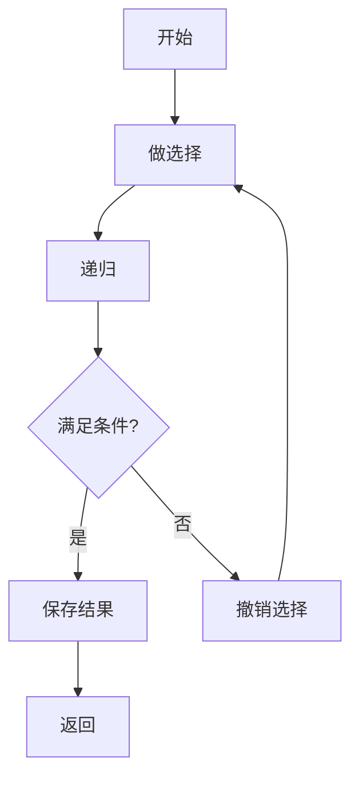

# 回溯算法

回溯算法（Backtracking）通过递归尝试所有可能的解，遇到不满足条件时**回退**（撤销选择），是一种系统性地搜索问题解空间的方法。

> [!TIP]
> 回溯 = DFS + 剪枝。本质上是暴力枚举所有可能，但通过剪枝提高效率。

## 📖 框架模板

```java
void backtrack(路径, 选择列表) {
    if (满足结束条件) {
        结果.add(路径);
        return;
    }
    for (选择 : 选择列表) {
        // 剪枝（可选）
        if (不满足条件) continue;
        
        做选择;           // 将选择加入路径
        backtrack(路径, 选择列表);  // 递归
        撤销选择;         // 将选择从路径移除
    }
}
```



---

## ✂️ 剪枝优化策略

剪枝是提高回溯效率的关键。常见剪枝策略：

| 策略 | 描述 | 适用场景 |
|------|------|----------|
| **可行性剪枝** | 当前路径已不可能产生有效解时提前终止 | 组合总和、N皇后 |
| **最优性剪枝** | 当前路径成本已超过已知最优解时终止 | 最短路径、最小代价 |
| **对称性剪枝** | 避免搜索对称的重复状态 | 全排列、N皇后 |
| **排序剪枝** | 先排序，便于跳过重复元素或提前终止 | 去重组合、子集 |

---

## 🎯 经典问题

### 1. 全排列

> [LeetCode 46. 全排列](https://leetcode.cn/problems/permutations/)

```java
public List<List<Integer>> permute(int[] nums) {
    List<List<Integer>> res = new ArrayList<>();
    backtrack(nums, new ArrayList<>(), new boolean[nums.length], res);
    return res;
}

private void backtrack(int[] nums, List<Integer> path, boolean[] used,
                       List<List<Integer>> res) {
    if (path.size() == nums.length) {
        res.add(new ArrayList<>(path));
        return;
    }
    for (int i = 0; i < nums.length; i++) {
        if (used[i]) continue;  // 剪枝：已使用的跳过
        path.add(nums[i]);
        used[i] = true;
        backtrack(nums, path, used, res);
        path.remove(path.size() - 1);  // 撤销选择
        used[i] = false;
    }
}
```

**时间复杂度**：O(n × n!) | **空间复杂度**：O(n)

---

### 2. 全排列 II（含重复元素）

> [LeetCode 47. 全排列 II](https://leetcode.cn/problems/permutations-ii/)

```java
public List<List<Integer>> permuteUnique(int[] nums) {
    List<List<Integer>> res = new ArrayList<>();
    Arrays.sort(nums);  // 排序便于去重
    backtrack(nums, new ArrayList<>(), new boolean[nums.length], res);
    return res;
}

private void backtrack(int[] nums, List<Integer> path, boolean[] used,
                       List<List<Integer>> res) {
    if (path.size() == nums.length) {
        res.add(new ArrayList<>(path));
        return;
    }
    for (int i = 0; i < nums.length; i++) {
        if (used[i]) continue;
        // 剪枝：跳过重复元素
        if (i > 0 && nums[i] == nums[i - 1] && !used[i - 1]) continue;
        
        path.add(nums[i]);
        used[i] = true;
        backtrack(nums, path, used, res);
        path.remove(path.size() - 1);
        used[i] = false;
    }
}
```

---

### 3. 子集

> [LeetCode 78. 子集](https://leetcode.cn/problems/subsets/)

```java
public List<List<Integer>> subsets(int[] nums) {
    List<List<Integer>> res = new ArrayList<>();
    backtrack(nums, 0, new ArrayList<>(), res);
    return res;
}

private void backtrack(int[] nums, int start, List<Integer> path,
                       List<List<Integer>> res) {
    res.add(new ArrayList<>(path));  // 每个路径都是一个子集
    for (int i = start; i < nums.length; i++) {
        path.add(nums[i]);
        backtrack(nums, i + 1, path, res);  // i + 1 避免重复
        path.remove(path.size() - 1);
    }
}
```

**时间复杂度**：O(n × 2ⁿ) | **空间复杂度**：O(n)

---

### 4. 组合总和

> [LeetCode 39. 组合总和](https://leetcode.cn/problems/combination-sum/)

```java
public List<List<Integer>> combinationSum(int[] candidates, int target) {
    List<List<Integer>> res = new ArrayList<>();
    Arrays.sort(candidates);  // 排序便于剪枝
    backtrack(candidates, target, 0, new ArrayList<>(), res);
    return res;
}

private void backtrack(int[] candidates, int remain, int start,
                       List<Integer> path, List<List<Integer>> res) {
    if (remain == 0) {
        res.add(new ArrayList<>(path));
        return;
    }
    for (int i = start; i < candidates.length; i++) {
        if (candidates[i] > remain) break;  // 剪枝：后面更大，无需继续
        path.add(candidates[i]);
        backtrack(candidates, remain - candidates[i], i, path, res);  // 可重复选
        path.remove(path.size() - 1);
    }
}
```

---

### 5. 括号生成

> [LeetCode 22. 括号生成](https://leetcode.cn/problems/generate-parentheses/)

```java
public List<String> generateParenthesis(int n) {
    List<String> res = new ArrayList<>();
    backtrack(n, 0, 0, new StringBuilder(), res);
    return res;
}

private void backtrack(int n, int open, int close, 
                       StringBuilder path, List<String> res) {
    if (path.length() == 2 * n) {
        res.add(path.toString());
        return;
    }
    if (open < n) {
        path.append('(');
        backtrack(n, open + 1, close, path, res);
        path.deleteCharAt(path.length() - 1);
    }
    if (close < open) {
        path.append(')');
        backtrack(n, open, close + 1, path, res);
        path.deleteCharAt(path.length() - 1);
    }
}
```

**时间复杂度**：O(4ⁿ/√n) | **空间复杂度**：O(n)

---

### 6. N 皇后

> [LeetCode 51. N 皇后](https://leetcode.cn/problems/n-queens/)

```java
public List<List<String>> solveNQueens(int n) {
    List<List<String>> res = new ArrayList<>();
    char[][] board = new char[n][n];
    for (char[] row : board) Arrays.fill(row, '.');
    backtrack(board, 0, res);
    return res;
}

private void backtrack(char[][] board, int row, List<List<String>> res) {
    if (row == board.length) {
        res.add(construct(board));
        return;
    }
    for (int col = 0; col < board.length; col++) {
        if (!isValid(board, row, col)) continue;  // 剪枝
        board[row][col] = 'Q';
        backtrack(board, row + 1, res);
        board[row][col] = '.';  // 撤销
    }
}

private boolean isValid(char[][] board, int row, int col) {
    int n = board.length;
    // 检查同一列
    for (int i = 0; i < row; i++) {
        if (board[i][col] == 'Q') return false;
    }
    // 检查左上对角线
    for (int i = row - 1, j = col - 1; i >= 0 && j >= 0; i--, j--) {
        if (board[i][j] == 'Q') return false;
    }
    // 检查右上对角线
    for (int i = row - 1, j = col + 1; i >= 0 && j < n; i--, j++) {
        if (board[i][j] == 'Q') return false;
    }
    return true;
}

private List<String> construct(char[][] board) {
    List<String> result = new ArrayList<>();
    for (char[] row : board) result.add(new String(row));
    return result;
}
```

**时间复杂度**：O(n!) | **空间复杂度**：O(n²)

---

### 7. 单词搜索

> [LeetCode 79. 单词搜索](https://leetcode.cn/problems/word-search/)

```java
public boolean exist(char[][] board, String word) {
    int m = board.length, n = board[0].length;
    for (int i = 0; i < m; i++) {
        for (int j = 0; j < n; j++) {
            if (backtrack(board, word, i, j, 0)) return true;
        }
    }
    return false;
}

private boolean backtrack(char[][] board, String word, int i, int j, int k) {
    if (k == word.length()) return true;
    if (i < 0 || i >= board.length || j < 0 || j >= board[0].length) return false;
    if (board[i][j] != word.charAt(k)) return false;
    
    char temp = board[i][j];
    board[i][j] = '#';  // 标记已访问
    
    boolean found = backtrack(board, word, i + 1, j, k + 1) ||
                    backtrack(board, word, i - 1, j, k + 1) ||
                    backtrack(board, word, i, j + 1, k + 1) ||
                    backtrack(board, word, i, j - 1, k + 1);
    
    board[i][j] = temp;  // 撤销标记
    return found;
}
```

---

## 📊 复杂度总结

| 问题 | 时间复杂度 | 空间复杂度 |
|------|-----------|-----------|
| 全排列 | O(n × n!) | O(n) |
| 子集 | O(n × 2ⁿ) | O(n) |
| 组合总和 | O(2ⁿ) | O(target) |
| 括号生成 | O(4ⁿ/√n) | O(n) |
| N 皇后 | O(n!) | O(n²) |
| 单词搜索 | O(m × n × 4^L) | O(L) |

---

## 🔗 推荐练习

| 难度 | 题目 | 类型 |
|------|------|------|
| 中等 | [46. 全排列](https://leetcode.cn/problems/permutations/) | 排列 |
| 中等 | [47. 全排列 II](https://leetcode.cn/problems/permutations-ii/) | 去重排列 |
| 中等 | [78. 子集](https://leetcode.cn/problems/subsets/) | 子集 |
| 中等 | [90. 子集 II](https://leetcode.cn/problems/subsets-ii/) | 去重子集 |
| 中等 | [39. 组合总和](https://leetcode.cn/problems/combination-sum/) | 组合 |
| 中等 | [22. 括号生成](https://leetcode.cn/problems/generate-parentheses/) | 构造 |
| 困难 | [51. N 皇后](https://leetcode.cn/problems/n-queens/) | 约束满足 |
| 中等 | [79. 单词搜索](https://leetcode.cn/problems/word-search/) | 网格搜索 |
