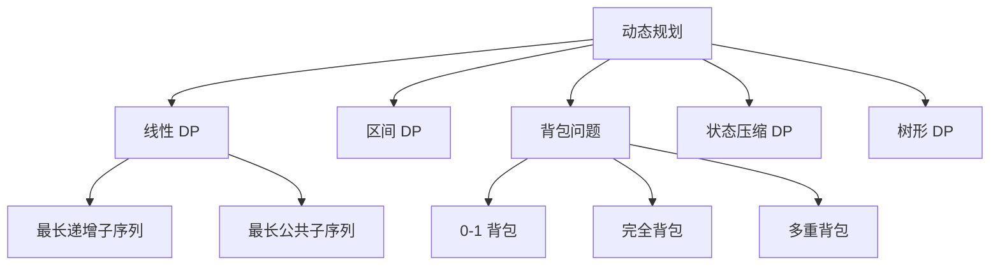
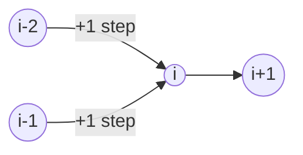

# 动态规划

动态规划（Dynamic Programming，简称 DP）通过把问题分解为子问题，并存储子问题的解来避免重复计算。它是解决**最优化问题**和**计数问题**的重要方法。

## 📖 解题步骤

1. **定义状态**：明确 `dp[i]` 或 `dp[i][j]` 表示什么
2. **确定转移方程**：找出状态之间的递推关系
3. **初始化边界**：确定 base case
4. **确定遍历顺序**：确保计算当前状态时所需的子状态已经计算过

> [!TIP]
> 动态规划的核心是**状态定义**。状态定义清晰后，转移方程往往自然而然就能推导出来。

## 🗂️ DP 问题分类



| 类型 | 特点 | 经典问题 |
|------|------|----------|
| 线性 DP | 状态沿一维或二维线性递推 | 爬楼梯、LIS、LCS |
| 区间 DP | 状态定义在区间上 | 矩阵链乘法、戳气球 |
| 背包问题 | 选择物品最大化价值 | 0-1 背包、完全背包 |
| 状态压缩 | 用位表示集合状态 | 旅行商问题、铺地砖 |
| 树形 DP | 在树结构上递推 | 树的最大独立集 |

---

## 🎯 经典问题

### 1. 爬楼梯

> [LeetCode 70. 爬楼梯](https://leetcode.cn/problems/climbing-stairs/)



**状态定义**：`dp[i]` 表示到达第 `i` 阶的方法数

**转移方程**：`dp[i] = dp[i-1] + dp[i-2]`

```java
public int climbStairs(int n) {
    if (n <= 2) return n;
    int[] dp = new int[n + 1];
    dp[1] = 1; dp[2] = 2;
    for (int i = 3; i <= n; i++) {
        dp[i] = dp[i-1] + dp[i-2];
    }
    return dp[n];
}
```

**空间优化版本**（只需要前两个状态）：

```java
public int climbStairs(int n) {
    if (n <= 2) return n;
    int prev2 = 1, prev1 = 2;
    for (int i = 3; i <= n; i++) {
        int curr = prev1 + prev2;
        prev2 = prev1;
        prev1 = curr;
    }
    return prev1;
}
```

---

### 2. 最长递增子序列 (LIS)

> [LeetCode 300. 最长递增子序列](https://leetcode.cn/problems/longest-increasing-subsequence/)

**状态定义**：`dp[i]` 表示以 `nums[i]` 结尾的最长递增子序列长度

**转移方程**：`dp[i] = max(dp[j] + 1)` 其中 `j < i` 且 `nums[j] < nums[i]`

```java
// O(n²) 解法
public int lengthOfLIS(int[] nums) {
    int[] dp = new int[nums.length];
    Arrays.fill(dp, 1);
    int maxLen = 1;
    for (int i = 1; i < nums.length; i++) {
        for (int j = 0; j < i; j++) {
            if (nums[i] > nums[j]) dp[i] = Math.max(dp[i], dp[j] + 1);
        }
        maxLen = Math.max(maxLen, dp[i]);
    }
    return maxLen;
}
```

**O(n log n) 优化**（贪心 + 二分）：

```java
public int lengthOfLIS(int[] nums) {
    List<Integer> tails = new ArrayList<>();
    for (int num : nums) {
        int pos = Collections.binarySearch(tails, num);
        if (pos < 0) pos = -(pos + 1);
        if (pos == tails.size()) tails.add(num);
        else tails.set(pos, num);
    }
    return tails.size();
}
```

---

### 3. 最长公共子序列 (LCS)

> [LeetCode 1143. 最长公共子序列](https://leetcode.cn/problems/longest-common-subsequence/)

**状态定义**：`dp[i][j]` 表示 `s1[0..i-1]` 和 `s2[0..j-1]` 的 LCS 长度

**转移方程**：

- 若 `s1[i-1] == s2[j-1]`：`dp[i][j] = dp[i-1][j-1] + 1`
- 否则：`dp[i][j] = max(dp[i-1][j], dp[i][j-1])`

```java
public int longestCommonSubsequence(String s1, String s2) {
    int m = s1.length(), n = s2.length();
    int[][] dp = new int[m + 1][n + 1];
    
    for (int i = 1; i <= m; i++) {
        for (int j = 1; j <= n; j++) {
            if (s1.charAt(i - 1) == s2.charAt(j - 1)) {
                dp[i][j] = dp[i - 1][j - 1] + 1;
            } else {
                dp[i][j] = Math.max(dp[i - 1][j], dp[i][j - 1]);
            }
        }
    }
    return dp[m][n];
}
```

---

### 4. 硬币兑换

> [LeetCode 322. 零钱兑换](https://leetcode.cn/problems/coin-change/)

**状态定义**：`dp[i]` 表示凑成金额 `i` 所需的最少硬币数

**转移方程**：`dp[i] = min(dp[i - coin] + 1)` 对所有 `coin ∈ coins`

```java
public int coinChange(int[] coins, int amount) {
    int[] dp = new int[amount + 1];
    Arrays.fill(dp, amount + 1); // 初始化为不可能的值
    dp[0] = 0;
    
    for (int i = 1; i <= amount; i++) {
        for (int coin : coins) {
            if (coin <= i) {
                dp[i] = Math.min(dp[i], dp[i - coin] + 1);
            }
        }
    }
    return dp[amount] > amount ? -1 : dp[amount];
}
```

---

### 5. 背包问题

#### 0-1 背包

每个物品只能选一次。

```java
public int knapsack01(int[] weights, int[] values, int capacity) {
    int n = weights.length;
    int[] dp = new int[capacity + 1];
    
    for (int i = 0; i < n; i++) {
        // 逆序遍历，保证每个物品只被选一次
        for (int w = capacity; w >= weights[i]; w--) {
            dp[w] = Math.max(dp[w], dp[w - weights[i]] + values[i]);
        }
    }
    return dp[capacity];
}
```

#### 完全背包

每个物品可以选无限次。

```java
public int knapsackComplete(int[] weights, int[] values, int capacity) {
    int n = weights.length;
    int[] dp = new int[capacity + 1];
    
    for (int i = 0; i < n; i++) {
        // 正序遍历，允许物品被重复选取
        for (int w = weights[i]; w <= capacity; w++) {
            dp[w] = Math.max(dp[w], dp[w - weights[i]] + values[i]);
        }
    }
    return dp[capacity];
}
```

> [!NOTE]
> 0-1 背包和完全背包的唯一区别在于**内层循环的遍历顺序**：
>
> - 0-1 背包：逆序（从大到小）
> - 完全背包：正序（从小到大）

---

### 6. 编辑距离

> [LeetCode 72. 编辑距离](https://leetcode.cn/problems/edit-distance/)

**状态定义**：`dp[i][j]` 表示将 `s1[0..i-1]` 转换为 `s2[0..j-1]` 所需的最少操作数

```java
public int minDistance(String s1, String s2) {
    int m = s1.length(), n = s2.length();
    int[][] dp = new int[m + 1][n + 1];
    
    // 初始化边界
    for (int i = 0; i <= m; i++) dp[i][0] = i; // 删除操作
    for (int j = 0; j <= n; j++) dp[0][j] = j; // 插入操作

    for (int i = 1; i <= m; i++) {
        for (int j = 1; j <= n; j++) {
            if (s1.charAt(i - 1) == s2.charAt(j - 1)) {
                dp[i][j] = dp[i - 1][j - 1]; // 无需操作
            } else {
                dp[i][j] = 1 + Math.min(dp[i - 1][j - 1], // 替换
                           Math.min(dp[i - 1][j],         // 删除
                                    dp[i][j - 1]));       // 插入
            }
        }
    }
    return dp[m][n];
}
```

---

### 7. 最长回文子序列

> [LeetCode 516. 最长回文子序列](https://leetcode.cn/problems/longest-palindromic-subsequence/)

**状态定义**：`dp[i][j]` 表示 `s[i..j]` 范围内最长回文子序列的长度

```java
public int longestPalindromeSubseq(String s) {
    int n = s.length();
    int[][] dp = new int[n][n];
    
    // 单个字符是长度为 1 的回文
    for (int i = 0; i < n; i++) dp[i][i] = 1;
    
    // 从短区间到长区间遍历
    for (int len = 2; len <= n; len++) {
        for (int i = 0; i <= n - len; i++) {
            int j = i + len - 1;
            if (s.charAt(i) == s.charAt(j)) {
                dp[i][j] = dp[i + 1][j - 1] + 2;
            } else {
                dp[i][j] = Math.max(dp[i + 1][j], dp[i][j - 1]);
            }
        }
    }
    return dp[0][n - 1];
}
```

---

## 📊 复杂度总结

| 问题 | 时间复杂度 | 空间复杂度 | 可优化空间 |
|------|-----------|-----------|-----------|
| 爬楼梯 | O(n) | O(n) | O(1) |
| LIS | O(n²) / O(n log n) | O(n) | - |
| LCS | O(mn) | O(mn) | O(n) |
| 硬币兑换 | O(amount × n) | O(amount) | - |
| 0-1 背包 | O(nW) | O(W) | - |
| 编辑距离 | O(mn) | O(mn) | O(n) |
| 最长回文子序列 | O(n²) | O(n²) | O(n) |

---

## 🔗 推荐练习

| 难度 | 题目 | 类型 |
|------|------|------|
| 简单 | [70. 爬楼梯](https://leetcode.cn/problems/climbing-stairs/) | 线性 DP |
| 简单 | [746. 使用最小花费爬楼梯](https://leetcode.cn/problems/min-cost-climbing-stairs/) | 线性 DP |
| 中等 | [300. 最长递增子序列](https://leetcode.cn/problems/longest-increasing-subsequence/) | 线性 DP |
| 中等 | [1143. 最长公共子序列](https://leetcode.cn/problems/longest-common-subsequence/) | 二维 DP |
| 中等 | [322. 零钱兑换](https://leetcode.cn/problems/coin-change/) | 完全背包 |
| 中等 | [416. 分割等和子集](https://leetcode.cn/problems/partition-equal-subset-sum/) | 0-1 背包 |
| 困难 | [72. 编辑距离](https://leetcode.cn/problems/edit-distance/) | 二维 DP |
| 困难 | [516. 最长回文子序列](https://leetcode.cn/problems/longest-palindromic-subsequence/) | 区间 DP |
