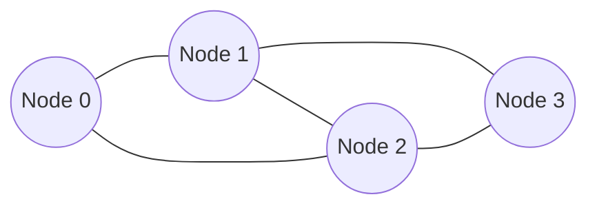

# 图

图由顶点和边组成，用于表示复杂的关系网络。

## 📖 图的表示



### 邻接矩阵

```java
int[][] graph = new int[n][n];  // n 个顶点
graph[i][j] = 1;  // i 到 j 有边
```

### 邻接表

```java
List<List<Integer>> graph = new ArrayList<>();
for (int i = 0; i < n; i++) graph.add(new ArrayList<>());
graph.get(0).add(1);  // 0 -> 1
```

## 🔍 图的遍历

### DFS 深度优先

```java
public void dfs(List<List<Integer>> graph, int node, boolean[] visited) {
    visited[node] = true;
    System.out.print(node + " ");
    for (int neighbor : graph.get(node)) {
        if (!visited[neighbor]) dfs(graph, neighbor, visited);
    }
}
```

### BFS 广度优先

```java
public void bfs(List<List<Integer>> graph, int start) {
    boolean[] visited = new boolean[graph.size()];
    Queue<Integer> queue = new LinkedList<>();
    queue.offer(start);
    visited[start] = true;

    while (!queue.isEmpty()) {
        int node = queue.poll();
        System.out.print(node + " ");
        for (int neighbor : graph.get(node)) {
            if (!visited[neighbor]) {
                visited[neighbor] = true;
                queue.offer(neighbor);
            }
        }
    }
}
```

## 🎯 经典算法

### 拓扑排序

```java
public int[] topologicalSort(int n, int[][] edges) {
    List<List<Integer>> graph = new ArrayList<>();
    int[] inDegree = new int[n];
    for (int i = 0; i < n; i++) graph.add(new ArrayList<>());

    for (int[] e : edges) {
        graph.get(e[0]).add(e[1]);
        inDegree[e[1]]++;
    }

    Queue<Integer> queue = new LinkedList<>();
    for (int i = 0; i < n; i++) {
        if (inDegree[i] == 0) queue.offer(i);
    }

    int[] result = new int[n];
    int idx = 0;
    while (!queue.isEmpty()) {
        int node = queue.poll();
        result[idx++] = node;
        for (int neighbor : graph.get(node)) {
            if (--inDegree[neighbor] == 0) queue.offer(neighbor);
        }
    }
    return idx == n ? result : new int[]{};
}
```

### Dijkstra 最短路径

```java
public int[] dijkstra(int[][] graph, int start) {
    int n = graph.length;
    int[] dist = new int[n];
    Arrays.fill(dist, Integer.MAX_VALUE);
    dist[start] = 0;

    PriorityQueue<int[]> pq = new PriorityQueue<>((a, b) -> a[1] - b[1]);
    pq.offer(new int[]{start, 0});

    while (!pq.isEmpty()) {
        int[] curr = pq.poll();
        int node = curr[0], d = curr[1];
        if (d > dist[node]) continue;

        for (int i = 0; i < n; i++) {
            if (graph[node][i] > 0 && dist[node] + graph[node][i] < dist[i]) {
                dist[i] = dist[node] + graph[node][i];
                pq.offer(new int[]{i, dist[i]});
            }
        }
    }
    return dist;
}
```
