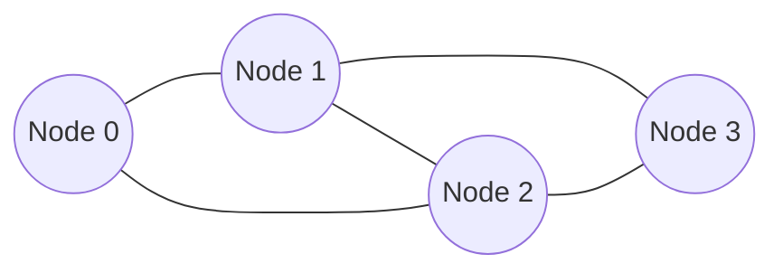

# 图

图由顶点和边组成，用于表示复杂的关系网络。

## 📖 图的表示



### 邻接矩阵

```java
int[][] graph = new int[n][n];  // n 个顶点
graph[i][j] = 1;  // i 到 j 有边
```

### 邻接表

```java
List<List<Integer>> graph = new ArrayList<>();
for (int i = 0; i < n; i++) graph.add(new ArrayList<>());
graph.get(0).add(1);  // 0 -> 1
```

## 🔍 图的遍历

### DFS 深度优先

```java
public void dfs(List<List<Integer>> graph, int node, boolean[] visited) {
    visited[node] = true;
    System.out.print(node + " ");
    for (int neighbor : graph.get(node)) {
        if (!visited[neighbor]) dfs(graph, neighbor, visited);
    }
}
```

### BFS 广度优先

```java
public void bfs(List<List<Integer>> graph, int start) {
    boolean[] visited = new boolean[graph.size()];
    Queue<Integer> queue = new LinkedList<>();
    queue.offer(start);
    visited[start] = true;

    while (!queue.isEmpty()) {
        int node = queue.poll();
        System.out.print(node + " ");
        for (int neighbor : graph.get(node)) {
            if (!visited[neighbor]) {
                visited[neighbor] = true;
                queue.offer(neighbor);
            }
        }
    }
}
```

## 🎯 经典算法

### 拓扑排序

```java
public int[] topologicalSort(int n, int[][] edges) {
    List<List<Integer>> graph = new ArrayList<>();
    int[] inDegree = new int[n];
    for (int i = 0; i < n; i++) graph.add(new ArrayList<>());

    for (int[] e : edges) {
        graph.get(e[0]).add(e[1]);
        inDegree[e[1]]++;
    }

    Queue<Integer> queue = new LinkedList<>();
    for (int i = 0; i < n; i++) {
        if (inDegree[i] == 0) queue.offer(i);
    }

    int[] result = new int[n];
    int idx = 0;
    while (!queue.isEmpty()) {
        int node = queue.poll();
        result[idx++] = node;
        for (int neighbor : graph.get(node)) {
            if (--inDegree[neighbor] == 0) queue.offer(neighbor);
        }
    }
    return idx == n ? result : new int[]{};
}
```

### Dijkstra 最短路径

```java
public int[] dijkstra(int[][] graph, int start) {
    int n = graph.length;
    int[] dist = new int[n];
    Arrays.fill(dist, Integer.MAX_VALUE);
    dist[start] = 0;

    PriorityQueue<int[]> pq = new PriorityQueue<>((a, b) -> a[1] - b[1]);
    pq.offer(new int[]{start, 0});

    while (!pq.isEmpty()) {
        int[] curr = pq.poll();
        int node = curr[0], d = curr[1];
        if (d > dist[node]) continue;

        for (int i = 0; i < n; i++) {
            if (graph[node][i] > 0 && dist[node] + graph[node][i] < dist[i]) {
                dist[i] = dist[node] + graph[node][i];
                pq.offer(new int[]{i, dist[i]});
            }
        }
    }
    return dist;
}
```

## ✅ 无权图最短路（BFS）

如果图是**无权图**（或所有边权都相同），从起点到其他点的最短路可以用 BFS 一次完成。

```java
public int[] shortestPathUnweighted(List<List<Integer>> graph, int start) {
    int n = graph.size();
    int[] dist = new int[n];
    Arrays.fill(dist, -1);
    dist[start] = 0;

    Queue<Integer> q = new LinkedList<>();
    q.offer(start);
    while (!q.isEmpty()) {
        int u = q.poll();
        for (int v : graph.get(u)) {
            if (dist[v] != -1) continue;
            dist[v] = dist[u] + 1;
            q.offer(v);
        }
    }
    return dist;
}
```

## 🎯 判环

### 无向图判环（DFS）

```java
public boolean hasCycleUndirected(List<List<Integer>> graph) {
    int n = graph.size();
    boolean[] vis = new boolean[n];
    for (int i = 0; i < n; i++) {
        if (!vis[i] && dfsCycleUndirected(graph, i, -1, vis)) return true;
    }
    return false;
}

private boolean dfsCycleUndirected(List<List<Integer>> graph, int u, int parent, boolean[] vis) {
    vis[u] = true;
    for (int v : graph.get(u)) {
        if (!vis[v]) {
            if (dfsCycleUndirected(graph, v, u, vis)) return true;
        } else if (v != parent) {
            return true;
        }
    }
    return false;
}
```

### 有向图判环（DFS 颜色标记）

`0=未访问, 1=访问中, 2=已完成`，当 DFS 遇到访问中的点表示存在回边 => 有环。

```java
public boolean hasCycleDirected(List<List<Integer>> graph) {
    int n = graph.size();
    int[] color = new int[n];
    for (int i = 0; i < n; i++) {
        if (color[i] == 0 && dfsCycleDirected(graph, i, color)) return true;
    }
    return false;
}

private boolean dfsCycleDirected(List<List<Integer>> graph, int u, int[] color) {
    color[u] = 1;
    for (int v : graph.get(u)) {
        if (color[v] == 1) return true;
        if (color[v] == 0 && dfsCycleDirected(graph, v, color)) return true;
    }
    color[u] = 2;
    return false;
}
```

## 🌓 二分图判定（BFS 染色）

二分图：可以把点分成两组，使得每条边连接的都是不同组。

```java
public boolean isBipartite(List<List<Integer>> graph) {
    int n = graph.size();
    int[] color = new int[n];
    Arrays.fill(color, -1);

    Queue<Integer> q = new LinkedList<>();
    for (int i = 0; i < n; i++) {
        if (color[i] != -1) continue;
        color[i] = 0;
        q.offer(i);
        while (!q.isEmpty()) {
            int u = q.poll();
            for (int v : graph.get(u)) {
                if (color[v] == -1) {
                    color[v] = color[u] ^ 1;
                    q.offer(v);
                } else if (color[v] == color[u]) {
                    return false;
                }
            }
        }
    }
    return true;
}
```

## 🌲 最小生成树（MST）

最小生成树只适用于**连通无向带权图**。

### Kruskal（排序 + 并查集）

```java
public int kruskal(int n, int[][] edges) {
    Arrays.sort(edges, (a, b) -> a[2] - b[2]);
    UnionFind uf = new UnionFind(n);
    int total = 0;
    for (int[] e : edges) {
        int u = e[0], v = e[1], w = e[2];
        if (uf.union(u, v)) total += w;
    }
    return total;
}

static class UnionFind {
    private final int[] parent;
    private final int[] size;

    UnionFind(int n) {
        parent = new int[n];
        size = new int[n];
        for (int i = 0; i < n; i++) {
            parent[i] = i;
            size[i] = 1;
        }
    }

    int find(int x) {
        if (parent[x] != x) parent[x] = find(parent[x]);
        return parent[x];
    }

    boolean union(int a, int b) {
        int ra = find(a), rb = find(b);
        if (ra == rb) return false;
        if (size[ra] < size[rb]) {
            int tmp = ra;
            ra = rb;
            rb = tmp;
        }
        parent[rb] = ra;
        size[ra] += size[rb];
        return true;
    }
}
```

### Prim（优先队列）

```java
public int prim(int n, List<List<int[]>> graph) {
    boolean[] vis = new boolean[n];
    PriorityQueue<int[]> pq = new PriorityQueue<>((a, b) -> a[1] - b[1]);

    pq.offer(new int[] {0, 0});
    int total = 0;
    int picked = 0;
    while (!pq.isEmpty() && picked < n) {
        int[] cur = pq.poll();
        int u = cur[0], w = cur[1];
        if (vis[u]) continue;
        vis[u] = true;
        total += w;
        picked++;

        for (int[] e : graph.get(u)) {
            int v = e[0], w2 = e[1];
            if (!vis[v]) pq.offer(new int[] {v, w2});
        }
    }
    return picked == n ? total : -1;
}
```
