# 贪心算法

贪心算法（Greedy Algorithm）每次选择当前最优解，希望通过局部最优达到全局最优。

> [!IMPORTANT]
> 贪心算法的关键在于**证明贪心选择的正确性**。并非所有问题都适用贪心策略。

## 📖 适用条件

要使用贪心算法，问题必须满足：

1. **贪心选择性质**：通过局部最优选择能够达到全局最优
2. **最优子结构**：问题的最优解包含其子问题的最优解

```mermaid
graph LR
    Problem[原问题] --> Greedy[贪心选择]
    Greedy --> SubProblem[子问题]
    SubProblem --> Greedy2[贪心选择]
    Greedy2 --> Result[最优解]
```



## 🔍 贪心正确性证明方法

### 1. 交换论证（Exchange Argument）

假设存在一个最优解 OPT，如果能够证明通过一系列交换操作可以将 OPT 转换为贪心解 G，且每次交换不会使解变差，那么贪心解也是最优的。

### 2. 归纳法

- **基础情况**：证明贪心对最小规模问题有效
- **归纳步骤**：假设贪心对规模 k 的问题有效，证明对规模 k+1 也有效

### 3. 反证法

假设贪心解不是最优解，推导出矛盾。

---

## 🎯 经典问题

### 1. 跳跃游戏

> [LeetCode 55. 跳跃游戏](https://leetcode.cn/problems/jump-game/)

**贪心策略**：维护能到达的最远位置，如果当前位置超过最远位置，则无法到达终点。

```java
public boolean canJump(int[] nums) {
    int maxReach = 0;
    for (int i = 0; i < nums.length; i++) {
        if (i > maxReach) return false;
        maxReach = Math.max(maxReach, i + nums[i]);
    }
    return true;
}
```

**时间复杂度**：O(n) | **空间复杂度**：O(1)

---

### 2. 跳跃游戏 II

> [LeetCode 45. 跳跃游戏 II](https://leetcode.cn/problems/jump-game-ii/)

**贪心策略**：在每一步的可达范围内，选择能跳得最远的位置。

```java
public int jump(int[] nums) {
    int jumps = 0, end = 0, farthest = 0;
    for (int i = 0; i < nums.length - 1; i++) {
        farthest = Math.max(farthest, i + nums[i]);
        if (i == end) {
            jumps++;
            end = farthest;
        }
    }
    return jumps;
}
```

**时间复杂度**：O(n) | **空间复杂度**：O(1)

---

### 3. 分发饼干

> [LeetCode 455. 分发饼干](https://leetcode.cn/problems/assign-cookies/)

**贪心策略**：优先用最小的饼干满足胃口最小的孩子。

```java
public int findContentChildren(int[] g, int[] s) {
    Arrays.sort(g);
    Arrays.sort(s);
    int i = 0, j = 0;
    while (i < g.length && j < s.length) {
        if (s[j] >= g[i]) i++;
        j++;
    }
    return i;
}
```

**时间复杂度**：O(n log n) | **空间复杂度**：O(1)

---

### 4. 无重叠区间

> [LeetCode 435. 无重叠区间](https://leetcode.cn/problems/non-overlapping-intervals/)

**贪心策略**：按结束时间排序，优先保留结束时间早的区间。

```java
public int eraseOverlapIntervals(int[][] intervals) {
    Arrays.sort(intervals, (a, b) -> a[1] - b[1]);
    int count = 0, end = Integer.MIN_VALUE;
    for (int[] interval : intervals) {
        if (interval[0] >= end) {
            end = interval[1];  // 保留该区间
        } else {
            count++;  // 删除该区间
        }
    }
    return count;
}
```

**时间复杂度**：O(n log n) | **空间复杂度**：O(1)

---

### 5. 加油站

> [LeetCode 134. 加油站](https://leetcode.cn/problems/gas-station/)

**贪心策略**：如果从站点 i 出发无法到达站点 j，那么从 i 和 j 之间的任何站点出发也无法到达 j。

```java
public int canCompleteCircuit(int[] gas, int[] cost) {
    int totalGas = 0, currGas = 0, start = 0;
    for (int i = 0; i < gas.length; i++) {
        totalGas += gas[i] - cost[i];
        currGas += gas[i] - cost[i];
        if (currGas < 0) {
            start = i + 1;
            currGas = 0;
        }
    }
    return totalGas >= 0 ? start : -1;
}
```

**时间复杂度**：O(n) | **空间复杂度**：O(1)

---

### 6. 买卖股票的最佳时机 II

> [LeetCode 122. 买卖股票的最佳时机 II](https://leetcode.cn/problems/best-time-to-buy-and-sell-stock-ii/)

**贪心策略**：只要今天比昨天价格高，就进行交易（收集所有上涨的利润）。

```java
public int maxProfit(int[] prices) {
    int profit = 0;
    for (int i = 1; i < prices.length; i++) {
        if (prices[i] > prices[i - 1]) {
            profit += prices[i] - prices[i - 1];
        }
    }
    return profit;
}
```

**时间复杂度**：O(n) | **空间复杂度**：O(1)

---

## 📊 复杂度总结

| 问题 | 时间复杂度 | 空间复杂度 | 核心策略 |
|------|-----------|-----------|----------|
| 跳跃游戏 | O(n) | O(1) | 最远可达位置 |
| 跳跃游戏 II | O(n) | O(1) | 范围内最远跳跃 |
| 分发饼干 | O(n log n) | O(1) | 小饼干配小胃口 |
| 无重叠区间 | O(n log n) | O(1) | 按结束时间排序 |
| 加油站 | O(n) | O(1) | 累计油量判断 |
| 股票最佳时机 II | O(n) | O(1) | 收集所有上涨 |

---

## 💡 贪心 vs 动态规划

| 特点 | 贪心 | 动态规划 |
|------|------|---------|
| 决策方式 | 局部最优 → 全局最优 | 枚举所有子问题 |
| 后悔 | 不可回退 | 可以回溯比较 |
| 效率 | 通常更高效 | 保证最优但可能更慢 |
| 适用场景 | 能证明贪心正确性 | 贪心不成立时 |

> [!TIP]
> 如果不确定贪心是否正确，可以先用动态规划求解，再观察是否存在贪心性质。

---

## 🔗 推荐练习

| 难度 | 题目 | 类型 |
|------|------|------|
| 简单 | [455. 分发饼干](https://leetcode.cn/problems/assign-cookies/) | 排序贪心 |
| 中等 | [55. 跳跃游戏](https://leetcode.cn/problems/jump-game/) | 最远可达 |
| 中等 | [45. 跳跃游戏 II](https://leetcode.cn/problems/jump-game-ii/) | 最少跳跃 |
| 中等 | [134. 加油站](https://leetcode.cn/problems/gas-station/) | 环形贪心 |
| 中等 | [435. 无重叠区间](https://leetcode.cn/problems/non-overlapping-intervals/) | 区间调度 |
| 中等 | [763. 划分字母区间](https://leetcode.cn/problems/partition-labels/) | 区间合并 |
