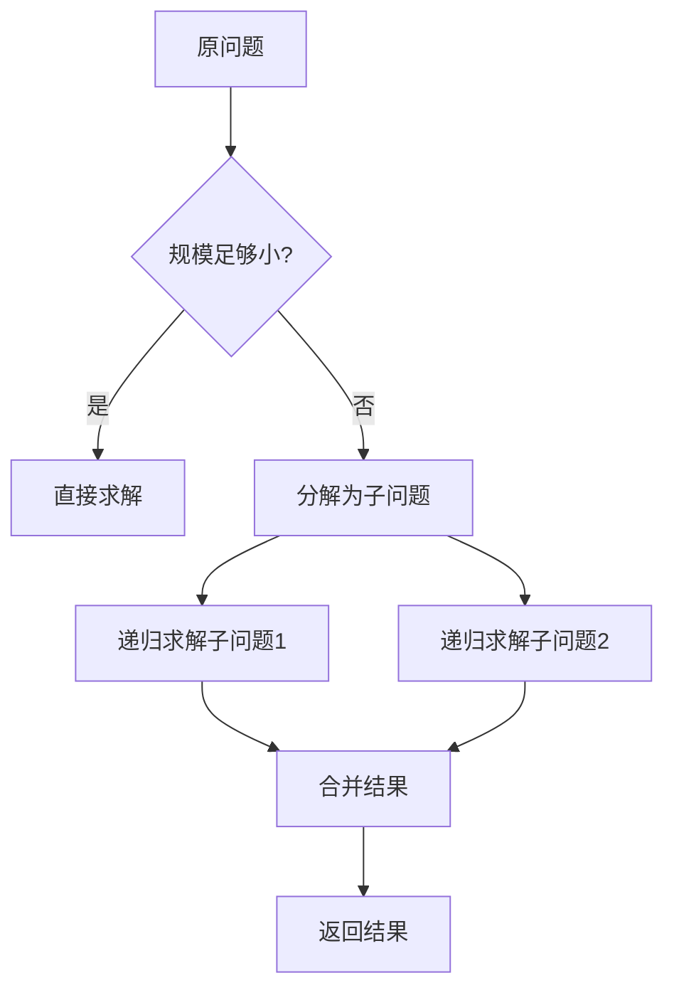
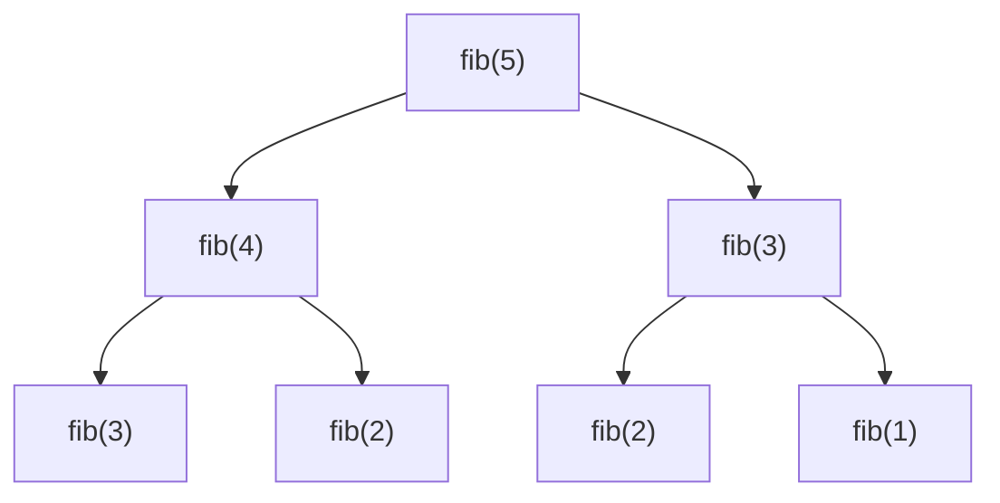

# 递归与分治

递归（Recursion）是一种通过函数调用自身来解决问题的方法。分治（Divide and Conquer）是递归的一种重要应用，将问题分解为更小的子问题分别解决，再合并结果。

## 📖 递归三要素

设计递归函数时，必须明确以下三点：

1. **终止条件**（Base Case）：何时停止递归，返回直接结果
2. **递归调用**（Recursive Case）：如何将问题规模缩小
3. **返回值**：如何组合子问题的解得到原问题的解



> [!TIP]
> 递归的关键是**信任递归调用会正确返回结果**。不要试图展开每一层递归，而是专注于单层逻辑。

---

## 🔧 经典递归

### 1. 斐波那契数列

> [LeetCode 509. 斐波那契数](https://leetcode.cn/problems/fibonacci-number/)



**朴素递归**（会有大量重复计算）：

```java
public int fib(int n) {
    if (n <= 1) return n;
    return fib(n - 1) + fib(n - 2);
}
```

**记忆化递归**（避免重复计算）：

```java
public int fib(int n) {
    int[] memo = new int[n + 1];
    Arrays.fill(memo, -1);
    return fibMemo(n, memo);
}

private int fibMemo(int n, int[] memo) {
    if (n <= 1) return n;
    if (memo[n] != -1) return memo[n];
    memo[n] = fibMemo(n - 1, memo) + fibMemo(n - 2, memo);
    return memo[n];
}
```

| 方法 | 时间复杂度 | 空间复杂度 |
|------|-----------|-----------|
| 朴素递归 | O(2ⁿ) | O(n) |
| 记忆化 | O(n) | O(n) |

---

### 2. 汉诺塔

> [LeetCode 面试题 08.06. 汉诺塔问题](https://leetcode.cn/problems/hanota-lcci/)

```java
public void hanoi(int n, char from, char to, char aux) {
    if (n == 1) {
        System.out.println(from + " -> " + to);
        return;
    }
    hanoi(n - 1, from, aux, to);  // 将 n-1 个盘子移到辅助柱
    System.out.println(from + " -> " + to);  // 移动最大盘子
    hanoi(n - 1, aux, to, from);  // 将 n-1 个盘子从辅助柱移到目标柱
}
```

**时间复杂度**：O(2ⁿ) | **空间复杂度**：O(n)

---

### 3. 反转链表

> [LeetCode 206. 反转链表](https://leetcode.cn/problems/reverse-linked-list/)

```java
public ListNode reverseList(ListNode head) {
    // 终止条件
    if (head == null || head.next == null) return head;
    
    // 递归调用（假设后面的链表已经反转好了）
    ListNode newHead = reverseList(head.next);
    
    // 当前层逻辑：把下一个节点指向自己
    head.next.next = head;
    head.next = null;
    
    return newHead;
}
```

---

## 🎯 分治策略

分治算法的核心思想：

1. **分解（Divide）**：将问题分解为若干个规模较小的子问题
2. **解决（Conquer）**：递归地解决子问题
3. **合并（Combine）**：将子问题的解合并为原问题的解

---

### 1. 归并排序

> [LeetCode 912. 排序数组](https://leetcode.cn/problems/sort-an-array/)

```java
public void mergeSort(int[] arr, int l, int r) {
    if (l >= r) return;
    
    int mid = l + (r - l) / 2;
    mergeSort(arr, l, mid);       // 分：递归排序左半部分
    mergeSort(arr, mid + 1, r);   // 分：递归排序右半部分
    merge(arr, l, mid, r);        // 治：合并两个有序数组
}

private void merge(int[] arr, int l, int mid, int r) {
    int[] temp = new int[r - l + 1];
    int i = l, j = mid + 1, k = 0;
    
    while (i <= mid && j <= r) {
        temp[k++] = arr[i] <= arr[j] ? arr[i++] : arr[j++];
    }
    while (i <= mid) temp[k++] = arr[i++];
    while (j <= r) temp[k++] = arr[j++];
    
    System.arraycopy(temp, 0, arr, l, temp.length);
}
```

**时间复杂度**：O(n log n) | **空间复杂度**：O(n)

---

### 2. 快速幂

> [LeetCode 50. Pow(x, n)](https://leetcode.cn/problems/powx-n/)

```java
public double myPow(double x, int n) {
    long exp = n;
    if (exp < 0) {
        x = 1 / x;
        exp = -exp;
    }
    return power(x, exp);
}

private double power(double base, long exp) {
    if (exp == 0) return 1;
    double half = power(base, exp / 2);
    return exp % 2 == 0 ? half * half : half * half * base;
}
```

**时间复杂度**：O(log n) | **空间复杂度**：O(log n)

---

### 3. 数组最大值

分治求最大值的简单示例：

```java
public int findMax(int[] arr, int l, int r) {
    if (l == r) return arr[l];  // 只有一个元素
    
    int mid = l + (r - l) / 2;
    int leftMax = findMax(arr, l, mid);       // 左半部分最大值
    int rightMax = findMax(arr, mid + 1, r);  // 右半部分最大值
    
    return Math.max(leftMax, rightMax);       // 合并结果
}
```

---

### 4. 逆序对计数

> [LeetCode 剑指 Offer 51. 数组中的逆序对](https://leetcode.cn/problems/shu-zu-zhong-de-ni-xu-dui-lcof/)

利用归并排序在合并时统计逆序对：

```java
private int count = 0;

public int reversePairs(int[] nums) {
    mergeSort(nums, 0, nums.length - 1);
    return count;
}

private void mergeSort(int[] arr, int l, int r) {
    if (l >= r) return;
    int mid = l + (r - l) / 2;
    mergeSort(arr, l, mid);
    mergeSort(arr, mid + 1, r);
    merge(arr, l, mid, r);
}

private void merge(int[] arr, int l, int mid, int r) {
    int[] temp = new int[r - l + 1];
    int i = l, j = mid + 1, k = 0;
    
    while (i <= mid && j <= r) {
        if (arr[i] <= arr[j]) {
            temp[k++] = arr[i++];
        } else {
            temp[k++] = arr[j++];
            count += mid - i + 1;  // 统计逆序对
        }
    }
    while (i <= mid) temp[k++] = arr[i++];
    while (j <= r) temp[k++] = arr[j++];
    
    System.arraycopy(temp, 0, arr, l, temp.length);
}
```

---

## 📐 主定理（Master Theorem）

主定理用于分析分治算法的时间复杂度。对于递推式：

$$T(n) = aT(n/b) + f(n)$$

其中 $a \geq 1$，$b > 1$，设 $c_{crit} = \log_b a$：

| 情况 | 条件 | 结果 |
|------|------|------|
| **情况 1** | $f(n) = O(n^c)$，$c < c_{crit}$ | $T(n) = \Theta(n^{c_{crit}})$ |
| **情况 2** | $f(n) = \Theta(n^{c_{crit}} \log^k n)$ | $T(n) = \Theta(n^{c_{crit}} \log^{k+1} n)$ |
| **情况 3** | $f(n) = \Omega(n^c)$，$c > c_{crit}$ | $T(n) = \Theta(f(n))$ |

**常见例子**：

| 算法 | 递推式 | 复杂度 |
|------|--------|--------|
| 二分查找 | $T(n) = T(n/2) + O(1)$ | O(log n) |
| 归并排序 | $T(n) = 2T(n/2) + O(n)$ | O(n log n) |
| 快速幂 | $T(n) = T(n/2) + O(1)$ | O(log n) |

---

## 📊 复杂度总结

| 问题 | 时间复杂度 | 空间复杂度 |
|------|-----------|-----------|
| 斐波那契（记忆化） | O(n) | O(n) |
| 汉诺塔 | O(2ⁿ) | O(n) |
| 归并排序 | O(n log n) | O(n) |
| 快速幂 | O(log n) | O(log n) |
| 逆序对 | O(n log n) | O(n) |

---

## 🔗 推荐练习

| 难度 | 题目 | 类型 |
|------|------|------|
| 简单 | [509. 斐波那契数](https://leetcode.cn/problems/fibonacci-number/) | 递归 |
| 简单 | [206. 反转链表](https://leetcode.cn/problems/reverse-linked-list/) | 递归 |
| 中等 | [912. 排序数组](https://leetcode.cn/problems/sort-an-array/) | 分治排序 |
| 中等 | [50. Pow(x, n)](https://leetcode.cn/problems/powx-n/) | 快速幂 |
| 困难 | [剑指 51. 逆序对](https://leetcode.cn/problems/shu-zu-zhong-de-ni-xu-dui-lcof/) | 分治计数 |
| 困难 | [23. 合并K个升序链表](https://leetcode.cn/problems/merge-k-sorted-lists/) | 分治合并 |
