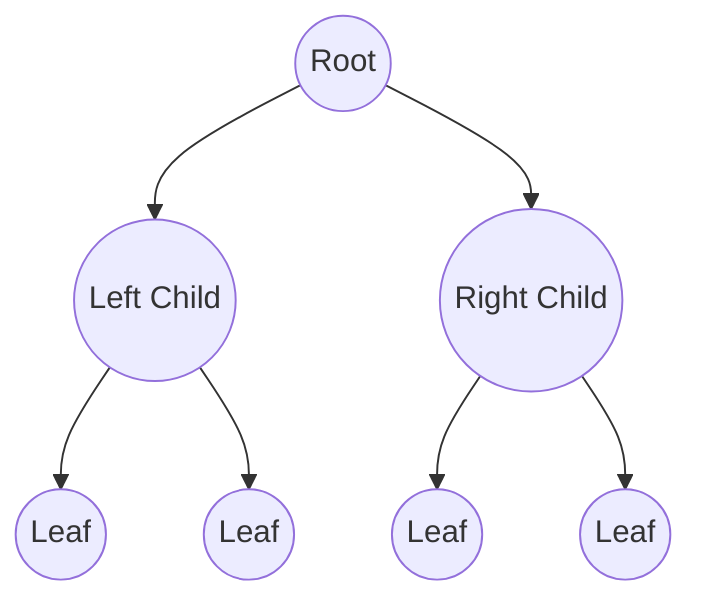

# 树结构

树是一种非线性数据结构，由节点和边组成，具有层次关系。

## 📖 二叉树基础



### 节点定义

```java
public class TreeNode {
    int val;
    TreeNode left;
    TreeNode right;

    TreeNode(int val) {
        this.val = val;
    }
}
```

### 遍历方式

```java
// 前序遍历：根-左-右
public void preorder(TreeNode root) {
    if (root == null) return;
    System.out.print(root.val + " ");
    preorder(root.left);
    preorder(root.right);
}

// 中序遍历：左-根-右
public void inorder(TreeNode root) {
    if (root == null) return;
    inorder(root.left);
    System.out.print(root.val + " ");
    inorder(root.right);
}

// 后序遍历：左-右-根
public void postorder(TreeNode root) {
    if (root == null) return;
    postorder(root.left);
    postorder(root.right);
    System.out.print(root.val + " ");
}

// 层序遍历 BFS
public List<List<Integer>> levelOrder(TreeNode root) {
    List<List<Integer>> result = new ArrayList<>();
    if (root == null) return result;

    Queue<TreeNode> queue = new LinkedList<>();
    queue.offer(root);

    while (!queue.isEmpty()) {
        int size = queue.size();
        List<Integer> level = new ArrayList<>();
        for (int i = 0; i < size; i++) {
            TreeNode node = queue.poll();
            level.add(node.val);
            if (node.left != null) queue.offer(node.left);
            if (node.right != null) queue.offer(node.right);
        }
        result.add(level);
    }
    return result;
}
```

## 🔍 二叉搜索树 (BST)

左子树 < 根 < 右子树

```java
// 查找
public TreeNode search(TreeNode root, int val) {
    if (root == null || root.val == val) return root;
    return val < root.val ? search(root.left, val) : search(root.right, val);
}

// 插入
public TreeNode insert(TreeNode root, int val) {
    if (root == null) return new TreeNode(val);
    if (val < root.val) root.left = insert(root.left, val);
    else root.right = insert(root.right, val);
    return root;
}
```

## 🎯 经典问题

### 最大深度

```java
public int maxDepth(TreeNode root) {
    if (root == null) return 0;
    return 1 + Math.max(maxDepth(root.left), maxDepth(root.right));
}
```

### 判断平衡二叉树

```java
public boolean isBalanced(TreeNode root) {
    return height(root) != -1;
}

private int height(TreeNode root) {
    if (root == null) return 0;
    int left = height(root.left);
    int right = height(root.right);
    if (left == -1 || right == -1 || Math.abs(left - right) > 1) return -1;
    return 1 + Math.max(left, right);
}
```

### 最近公共祖先

```java
public TreeNode lowestCommonAncestor(TreeNode root, TreeNode p, TreeNode q) {
    if (root == null || root == p || root == q) return root;
    TreeNode left = lowestCommonAncestor(root.left, p, q);
    TreeNode right = lowestCommonAncestor(root.right, p, q);
    if (left != null && right != null) return root;
    return left != null ? left : right;
}
```
