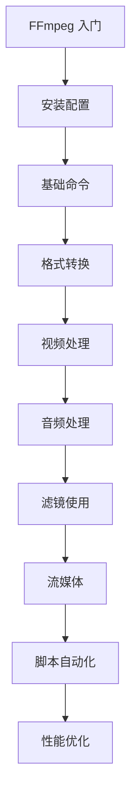

# FFmpeg 多媒体处理框架

FFmpeg 是一个开源的多媒体处理框架，可以对音频、视频进行录制、转换、流处理等操作。

## 什么是 FFmpeg？

FFmpeg 是一套可以用来记录、转换数字音频、视频，并能将其转化为流的开源计算机程序。它包含了非常先进的音频/视频编解码库 libavcodec。

### 核心组件

| 组件              | 说明                       |
| ----------------- | -------------------------- |
| **ffmpeg**        | 命令行工具，用于音视频转换 |
| **ffplay**        | 简单的媒体播放器           |
| **ffprobe**       | 多媒体流分析工具           |
| **libavcodec**    | 音视频编解码库             |
| **libavformat**   | 音视频格式处理库           |
| **libavutil**     | 通用工具库                 |
| **libswscale**    | 视频缩放库                 |
| **libswresample** | 音频重采样库               |

## 主要功能

### 🎬 视频处理

- 格式转换（MP4、AVI、MKV、MOV 等）
- 编解码转换（H.264、H.265/HEVC、VP9 等）
- 分辨率调整和缩放
- 帧率调整
- 视频裁剪和拼接

### 🎵 音频处理

- 音频格式转换（MP3、AAC、FLAC、WAV 等）
- 音频提取和分离
- 音量调节
- 音频混音

### 📡 流媒体

- RTMP/RTSP 推流
- HLS 直播流生成
- 屏幕录制
- 实时转码

## 为什么使用 FFmpeg？

1. **跨平台** - 支持 Windows、macOS、Linux
2. **功能强大** - 支持几乎所有音视频格式
3. **高性能** - 支持硬件加速
4. **开源免费** - 活跃的社区支持
5. **广泛应用** - 被众多知名软件采用

## 学习路线

## 文档导航

import DocCardList from '@theme/DocCardList';

<DocCardList />
