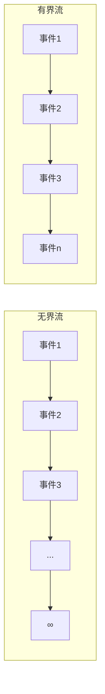
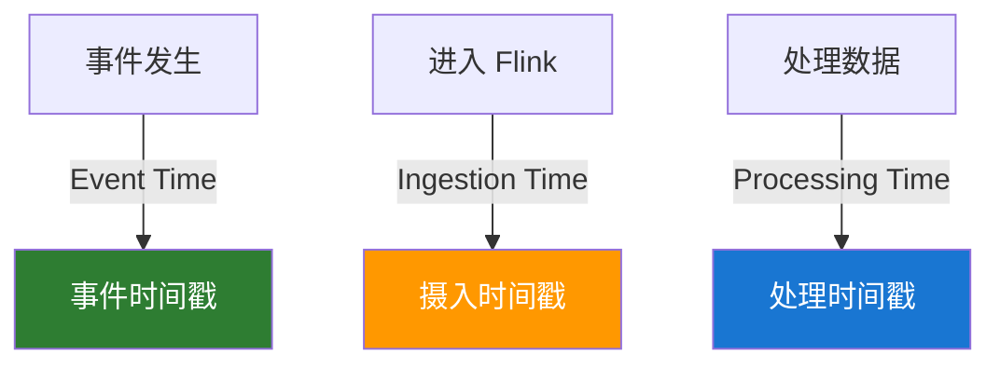

# Flink 核心概念

> 适用版本：Apache Flink v2.2.0

## 数据流模型

### 无界流 vs 有界流



- **无界流**：持续产生的数据流，没有终点
- **有界流**：有限的数据集，有明确的开始和结束

## 算子（Operators）

### 转换算子

| 算子        | 描述       | 示例                                                     |
| ----------- | ---------- | -------------------------------------------------------- |
| **map**     | 一对一转换 | `stream.map(x -> x * 2)`                                 |
| **flatMap** | 一对多转换 | `stream.flatMap(line -> Arrays.asList(line.split(" ")))` |
| **filter**  | 过滤数据   | `stream.filter(x -> x > 0)`                              |
| **keyBy**   | 按键分组   | `stream.keyBy(event -> event.getKey())`                  |

### 聚合算子

```java
// sum - 求和
keyedStream.sum("amount");

// min/max - 最小/最大值
keyedStream.min("timestamp");
keyedStream.max("price");

// reduce - 自定义聚合
keyedStream.reduce((e1, e2) -> new Event(e1.getAmount() + e2.getAmount()));
```

### 连接算子

```java
// union - 合并同类型流
stream1.union(stream2, stream3);

// connect - 连接不同类型流
stream1.connect(stream2)
    .map(new CoMapFunction<String, Integer, String>() {
        @Override
        public String map1(String value) { return value; }
        @Override
        public String map2(Integer value) { return value.toString(); }
    });
```

## 时间语义

### 三种时间类型



- **Event Time**：事件实际发生时间（推荐）
- **Processing Time**：系统处理时间
- **Ingestion Time**：数据进入 Flink 时间

### 水印（Watermark）

水印是处理乱序数据的关键机制：

```java
// 有序流
WatermarkStrategy.<Event>forMonotonousTimestamps()
    .withTimestampAssigner((event, ts) -> event.getTimestamp());

// 乱序流，允许 5 秒延迟
WatermarkStrategy.<Event>forBoundedOutOfOrderness(Duration.ofSeconds(5))
    .withTimestampAssigner((event, ts) -> event.getTimestamp());
```

## 窗口（Window）

### 滚动窗口（Tumbling Window）

固定大小，不重叠：

```java
stream
    .keyBy(event -> event.getKey())
    .window(TumblingEventTimeWindows.of(Time.minutes(5)))
    .sum("value");
```

```
|----窗口1----|----窗口2----|----窗口3----|
0            5            10           15 (分钟)
```

### 滑动窗口（Sliding Window）

固定大小，可重叠：

```java
stream
    .keyBy(event -> event.getKey())
    .window(SlidingEventTimeWindows.of(Time.minutes(10), Time.minutes(5)))
    .sum("value");
```

```
|--------窗口1--------|
     |--------窗口2--------|
          |--------窗口3--------|
0    5    10   15   20   25 (分钟)
```

### 会话窗口（Session Window）

基于活动间隙：

```java
stream
    .keyBy(event -> event.getKey())
    .window(EventTimeSessionWindows.withGap(Time.minutes(10)))
    .sum("value");
```

### 全局窗口（Global Window）

需要自定义触发器：

```java
stream
    .keyBy(event -> event.getKey())
    .window(GlobalWindows.create())
    .trigger(CountTrigger.of(100))
    .sum("value");
```

## 状态管理

### Keyed State

每个 Key 独立的状态：

```java
public class CountFunction extends RichFlatMapFunction<Event, Result> {
    private ValueState<Long> countState;

    @Override
    public void open(Configuration parameters) {
        ValueStateDescriptor<Long> descriptor =
            new ValueStateDescriptor<>("count", Long.class);
        countState = getRuntimeContext().getState(descriptor);
    }

    @Override
    public void flatMap(Event event, Collector<Result> out) throws Exception {
        Long count = countState.value();
        count = count == null ? 1L : count + 1;
        countState.update(count);
        out.collect(new Result(event.getKey(), count));
    }
}
```

### 状态类型

| 状态类型             | 描述       | 使用场景       |
| -------------------- | ---------- | -------------- |
| **ValueState**       | 单个值     | 计数器、标志位 |
| **ListState**        | 列表       | 事件缓存       |
| **MapState**         | 映射       | 索引数据       |
| **ReducingState**    | 聚合值     | 求和、求平均   |
| **AggregatingState** | 自定义聚合 | 复杂聚合逻辑   |

## 并行度和任务槽

### 并行度设置

```java
// 算子级别
stream.map(...).setParallelism(4);

// 执行环境级别
env.setParallelism(8);

// 客户端提交时
flink run -p 16 myJob.jar
```

### 任务链

Flink 会自动将算子链接在一起以优化性能：

```java
// 禁用链接
stream.map(...).disableChaining();

// 开始新链
stream.filter(...).startNewChain();
```

## 检查点和保存点

### 检查点配置

```java
// 启用检查点，每 5 分钟一次
env.enableCheckpointing(300000);

// 设置精确一次语义
env.getCheckpointConfig().setCheckpointingMode(CheckpointingMode.EXACTLY_ONCE);

// 检查点超时
env.getCheckpointConfig().setCheckpointTimeout(600000);

// 同时进行的检查点数量
env.getCheckpointConfig().setMaxConcurrentCheckpoints(1);

// 检查点间最小间隔
env.getCheckpointConfig().setMinPauseBetweenCheckpoints(30000);
```

### 保存点操作

```bash
# 触发保存点
flink savepoint <jobId> hdfs:///savepoints

# 从保存点恢复
flink run -s hdfs:///savepoints/<savepoint-id> myJob.jar

# 取消作业并创建保存点
flink cancel -s hdfs:///savepoints <jobId>
```

## 侧输出（Side Output）

处理延迟数据或分流：

```java
// 定义输出标签
final OutputTag<Event> lateTag = new OutputTag<Event>("late-data"){};

SingleOutputStreamOperator<Result> result = stream
    .keyBy(event -> event.getKey())
    .window(TumblingEventTimeWindows.of(Time.minutes(5)))
    .allowedLateness(Time.minutes(1))
    .sideOutputLateData(lateTag)
    .process(new MyProcessWindowFunction());

// 获取延迟数据
DataStream<Event> lateStream = result.getSideOutput(lateTag);
```

## 下一步学习

- 💻 [DataStream API](/docs/flink/datastream-api) - 流处理编程详解
- 📊 [Table API & SQL](/docs/flink/table-sql) - 声明式数据处理
- 🚀 [快速开始](/docs/flink/quick-start) - 实际运行 Flink 作业
