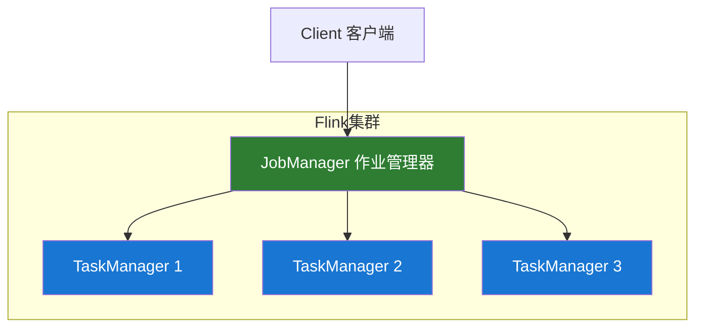

# Apache Flink 概述

## 什么是 Flink？

Apache Flink 是一个开源的分布式流处理框架，专为高吞吐量、低延迟的有状态流处理而设计。它能够处理有界和无界数据流，广泛应用于实时数据分析、事件驱动应用和数据管道等场景。

## 核心特性

### 🚀 **高吞吐低延迟**

- 毫秒级端到端延迟
- 每秒处理数百万事件
- 支持事件时间和处理时间语义

### 💪 **有状态计算**

- 内置状态管理机制
- 支持大规模状态存储（TB 级）
- 状态一致性保证

### 🔒 **精确一次语义**

- Exactly-once 状态一致性
- 端到端精确一次处理
- 可靠的检查点机制

### 🎯 **统一批流处理**

- 流批一体化 API
- 相同代码处理批和流
- DataStream 和 Table API 支持

## 主要使用场景

### 📊 实时数据分析

实时仪表板、实时报表、实时监控告警。

```java
// 简单的流处理示例
DataStream<String> stream = env.socketTextStream("localhost", 9999);
DataStream<Tuple2<String, Integer>> wordCounts = stream
    .flatMap(new Tokenizer())
    .keyBy(value -> value.f0)
    .sum(1);
wordCounts.print();
```

### 🔄 事件驱动应用

欺诈检测、异常检测、复杂事件处理（CEP）。

### 💾 ETL 数据管道

实时数据同步、数据转换、数据集成。

### 📈 机器学习流水线

实时特征计算、在线模型推理、模型训练。

## Flink 核心概念

### DataStream API

- 核心的流处理 API
- 支持各种算子转换
- 类型安全的编程接口

### Table API & SQL

- 声明式的关系型 API
- 标准 SQL 支持
- 流表二元性

### 状态管理

- Keyed State 和 Operator State
- 多种状态后端支持
- 增量检查点

### 时间语义

- Event Time：事件发生时间
- Processing Time：处理时间
- Ingestion Time：摄入时间

### 窗口（Window）

- 滚动窗口（Tumbling Window）
- 滑动窗口（Sliding Window）
- 会话窗口（Session Window）

## 架构组件



### JobManager

- 接收作业提交
- 协调任务调度
- 管理检查点和故障恢复

### TaskManager

- 执行具体的任务
- 管理本地状态
- 与 JobManager 通信

### Dispatcher

- 提供 REST 接口
- 启动 JobManager
- 负责作业提交

## Flink vs Spark Streaming

| 特性         | Flink        | Spark Streaming |
| ------------ | ------------ | --------------- |
| **处理模式** | 真正的流处理 | 微批处理        |
| **延迟**     | 毫秒级       | 秒级            |
| **状态管理** | 内置强大支持 | 需要额外组件    |
| **精确一次** | 原生支持     | 需要额外配置    |
| **窗口支持** | 灵活多样     | 基于时间        |
| **SQL 支持** | Flink SQL    | Spark SQL       |

## 版本特性

### Flink 1.17+

- 改进的 SQL 支持
- 更好的 Kubernetes 集成
- 增强的状态管理
- 新的 Table Store 支持

## 适用场景

✅ **适合使用 Flink 的场景：**

- 需要毫秒级延迟的实时处理
- 复杂的有状态计算
- 需要精确一次语义
- 实时机器学习推理
- 复杂事件处理（CEP）

❌ **不适合使用 Flink 的场景：**

- 简单的批处理任务
- 对延迟要求不高的场景
- 资源有限的小规模应用
- 简单的 ETL 任务

## 下一步

- 📖 [Flink 简介](./introduction.md) - 深入了解 Flink 的基本概念
- 🚀 [快速开始](./quick-start.md) - 快速搭建 Flink 环境
- 🎯 [核心概念](./core-concepts.md) - 理解 Flink 的核心组件
- 💻 [DataStream API](./datastream-api.md) - 学习流处理编程
- 📊 [Table API & SQL](./table-sql.md) - 声明式数据处理

## 参考资源

- [Apache Flink 官方文档](https://flink.apache.org/docs/)
- [Flink 中文社区](https://flink-learning.org.cn/)
- [Confluent Flink 教程](https://developer.confluent.io/flink/)

---

**💡 提示：** 建议从 [快速开始](./quick-start.md) 章节开始，通过实际操作来学习 Flink。
