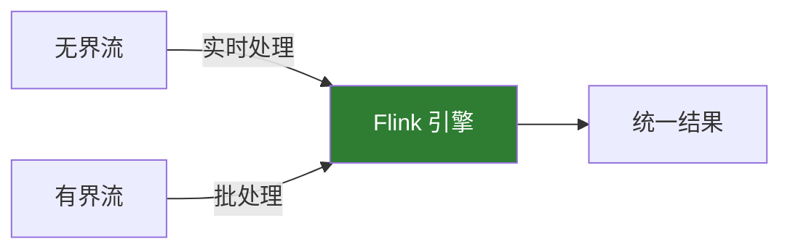
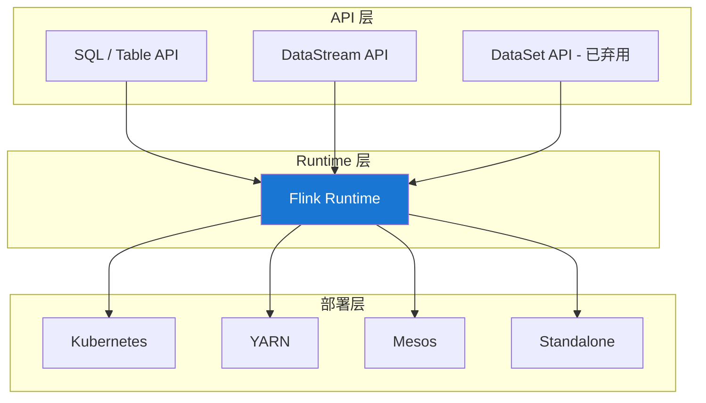

# Flink 简介

> 适用版本：Apache Flink v2.2.0

## 发展历史

Apache Flink 起源于 2010 年的柏林工业大学研究项目 **Stratosphere**。2014 年成为 Apache 孵化器项目，2015 年正式成为 Apache 顶级项目。

### 发展里程碑

- **2010 年**：Stratosphere 项目启动
- **2014 年**：成为 Apache 孵化项目，更名为 Flink
- **2015 年**：成为 Apache 顶级项目
- **2019 年**：阿里巴巴收购 Flink 商业公司
- **2023 年**：Flink 2.0 开发中，进一步增强流批一体

## 核心设计理念

### 流优先（Stream First）

Flink 的核心思想是**流优先**：一切都是流。

- **无界流**：有开始没有结束的数据流（如实时日志）
- **有界流**：有开始有结束的数据流（如历史数据）



### 有状态计算

Flink 原生支持有状态计算，状态可以是：

- **本地状态**：每个算子独立维护
- **托管状态**：由 Flink 管理，支持检查点
- **持久化状态**：写入外部存储

### 事件时间处理

Flink 支持基于事件时间的处理：

```java
// Flink 默认使用 Event Time；在 Source 上分配 WatermarkStrategy
DataStream<Event> stream = source
    .assignTimestampsAndWatermarks(
        WatermarkStrategy
            .<Event>forBoundedOutOfOrderness(Duration.ofSeconds(5))
            .withTimestampAssigner((event, timestamp) -> event.getTimestamp())
    );
```

## Flink 架构深入

### 分层架构



### 执行图转换

Flink 作业会经过多个图转换：

1. **StreamGraph**：由用户代码生成
2. **JobGraph**：优化后的执行计划
3. **ExecutionGraph**：并行化的执行图
4. **物理执行图**：实际运行的任务

## 容错机制

### 检查点（Checkpoint）

Flink 使用分布式快照算法（Chandy-Lamport）实现检查点：

```java
// 配置检查点
env.enableCheckpointing(60000); // 每60秒
env.getCheckpointConfig().setCheckpointingMode(CheckpointingMode.EXACTLY_ONCE);
env.getCheckpointConfig().setMinPauseBetweenCheckpoints(30000);
env.getCheckpointConfig().setCheckpointTimeout(600000);
```

### 保存点（Savepoint）

手动触发的检查点，用于：

- 版本升级
- 调整并行度
- A/B 测试
- 应用迁移

## 状态后端

Flink 支持多种状态后端：

| 状态后端                        | 特点             | 适用场景         |
| ------------------------------- | ---------------- | ---------------- |
| **HashMapStateBackend**         | 内存存储，速度快 | 小状态，开发测试 |
| **EmbeddedRocksDBStateBackend** | RocksDB 存储     | 大状态，生产环境 |

```java
// 配置 RocksDB 状态后端
env.setStateBackend(new EmbeddedRocksDBStateBackend());
env.getCheckpointConfig().setCheckpointStorage("hdfs:///checkpoints");
```

## 部署模式

### Session 模式

- 预先启动集群
- 多个作业共享资源
- 适合开发测试

### Per-Job 模式

- 每个作业独立集群
- 资源隔离好
- 适合生产环境

### Application 模式

- main() 方法在集群执行
- 最新推荐模式
- 启动速度快

## 与大数据生态集成

### 数据源连接器

- **Apache Kafka**：最常用的流数据源
- **Amazon Kinesis**：AWS 流数据
- **Apache Pulsar**：新一代消息系统
- **JDBC**：关系型数据库
- **Elasticsearch**：搜索引擎

### 数据接收器

- **Kafka**：写入消息队列
- **HDFS/S3**：写入分布式存储
- **HBase/Cassandra**：写入 NoSQL
- **Elasticsearch**：写入搜索引擎

## 生态系统

### Flink SQL

```sql
-- 创建源表
CREATE TABLE orders (
    order_id STRING,
    user_id STRING,
    amount DECIMAL(10, 2),
    order_time TIMESTAMP(3),
    WATERMARK FOR order_time AS order_time - INTERVAL '5' SECOND
) WITH (
    'connector' = 'kafka',
    'topic' = 'orders',
    'properties.bootstrap.servers' = 'localhost:9092',
    'format' = 'json'
);

-- 实时聚合
SELECT
    user_id,
    TUMBLE_START(order_time, INTERVAL '1' HOUR) AS window_start,
    SUM(amount) AS total_amount
FROM orders
GROUP BY user_id, TUMBLE(order_time, INTERVAL '1' HOUR);
```

### Flink CEP

复杂事件处理，用于模式匹配：

```java
Pattern<Event, ?> pattern = Pattern.<Event>begin("start")
    .where(event -> event.getType().equals("login"))
    .followedBy("middle")
    .where(event -> event.getType().equals("browse"))
    .within(Time.minutes(10));
```

## 下一步学习

- 🚀 [快速开始](/docs/flink/quick-start) - 实际搭建和运行 Flink
- 🎯 [核心概念](/docs/flink/core-concepts) - 深入理解核心组件
- 💻 [DataStream API](/docs/flink/datastream-api) - 流处理编程实战
