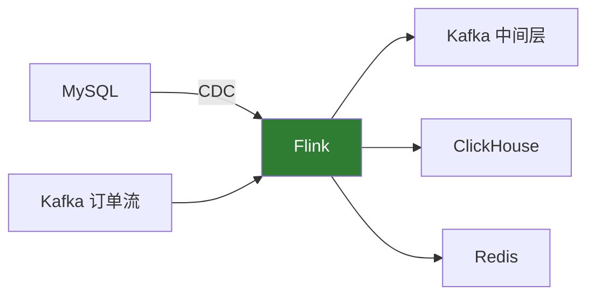
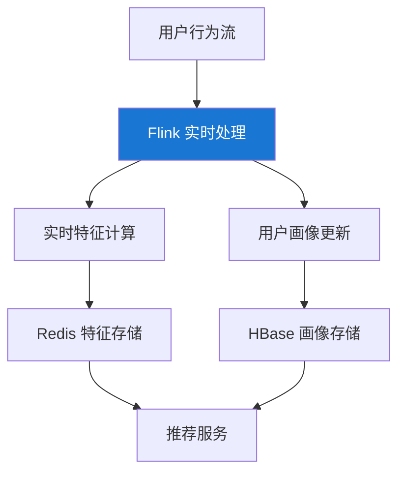

# Flink 实战案例

> 适用版本：Apache Flink v2.2.0

## 案例一：实时电商数仓

### 业务场景

构建实时数据仓库，实现订单数据的实时统计分析。



### 核心实现

#### 数据源定义

```sql
-- 订单事实表（CDC）
CREATE TABLE orders (
    order_id STRING,
    user_id STRING,
    product_id STRING,
    amount DECIMAL(10, 2),
    status STRING,
    create_time TIMESTAMP(3),
    update_time TIMESTAMP(3),
    WATERMARK FOR create_time AS create_time - INTERVAL '5' SECOND,
    PRIMARY KEY (order_id) NOT ENFORCED
) WITH (
    'connector' = 'mysql-cdc',
    'hostname' = 'mysql-host',
    'port' = '3306',
    'username' = 'flink',
    'password' = 'password',
    'database-name' = 'ecommerce',
    'table-name' = 'orders'
);

-- 商品维表
CREATE TABLE products (
    product_id STRING,
    product_name STRING,
    category STRING,
    price DECIMAL(10, 2),
    PRIMARY KEY (product_id) NOT ENFORCED
) WITH (
    'connector' = 'jdbc',
    'url' = 'jdbc:mysql://mysql-host:3306/ecommerce',
    'table-name' = 'products',
    'lookup.cache.max-rows' = '5000',
    'lookup.cache.ttl' = '10min'
);
```

#### 实时聚合

```sql
-- 每小时销售统计
INSERT INTO hourly_sales
SELECT
    DATE_FORMAT(create_time, 'yyyy-MM-dd HH:00:00') AS hour_time,
    p.category,
    COUNT(*) AS order_count,
    SUM(o.amount) AS total_amount,
    COUNT(DISTINCT o.user_id) AS user_count
FROM orders o
JOIN products FOR SYSTEM_TIME AS OF o.create_time AS p
    ON o.product_id = p.product_id
WHERE o.status = 'PAID'
GROUP BY
    DATE_FORMAT(create_time, 'yyyy-MM-dd HH:00:00'),
    p.category;
```

---

## 案例二：实时风控系统

### 业务场景

检测异常交易行为，包括：

- 短时间内多次交易
- 异地登录后立即交易
- 大额异常交易

### 核心实现

#### 使用 CEP 检测异常模式

```java
// 定义异常交易模式：5分钟内超过3次交易
Pattern<Transaction, ?> pattern = Pattern.<Transaction>begin("first")
    .where(SimpleCondition.of(t -> t.getAmount() > 1000))
    .followedBy("second")
    .where(SimpleCondition.of(t -> t.getAmount() > 1000))
    .followedBy("third")
    .where(SimpleCondition.of(t -> t.getAmount() > 1000))
    .within(Time.minutes(5));

// 应用模式
PatternStream<Transaction> patternStream = CEP.pattern(
    transactions.keyBy(Transaction::getUserId),
    pattern
);

// 生成告警
DataStream<RiskAlert> alerts = patternStream.process(
    new PatternProcessFunction<Transaction, RiskAlert>() {
        @Override
        public void processMatch(Map<String, List<Transaction>> match,
                Context ctx, Collector<RiskAlert> out) {
            List<Transaction> txns = new ArrayList<>();
            txns.addAll(match.get("first"));
            txns.addAll(match.get("second"));
            txns.addAll(match.get("third"));

            double totalAmount = txns.stream()
                .mapToDouble(Transaction::getAmount)
                .sum();

            out.collect(new RiskAlert(
                txns.get(0).getUserId(),
                "FREQUENT_LARGE_TRANSACTION",
                totalAmount,
                txns.size()
            ));
        }
    }
);
```

#### 异地登录检测

```java
public class LocationCheckFunction
        extends KeyedProcessFunction<String, LoginEvent, RiskAlert> {

    private ValueState<String> lastLocationState;
    private ValueState<Long> lastLoginTimeState;

    @Override
    public void open(Configuration parameters) {
        lastLocationState = getRuntimeContext().getState(
            new ValueStateDescriptor<>("lastLocation", String.class));
        lastLoginTimeState = getRuntimeContext().getState(
            new ValueStateDescriptor<>("lastLoginTime", Long.class));
    }

    @Override
    public void processElement(LoginEvent event, Context ctx,
            Collector<RiskAlert> out) throws Exception {
        String lastLocation = lastLocationState.value();
        Long lastLoginTime = lastLoginTimeState.value();

        if (lastLocation != null && lastLoginTime != null) {
            // 计算距离和时间差
            double distance = calculateDistance(lastLocation, event.getLocation());
            long timeDiff = event.getTimestamp() - lastLoginTime;

            // 不可能在短时间内跨越大距离
            if (distance > 500 && timeDiff < 3600000) { // 500km, 1小时
                out.collect(new RiskAlert(
                    event.getUserId(),
                    "IMPOSSIBLE_TRAVEL",
                    distance,
                    timeDiff
                ));
            }
        }

        lastLocationState.update(event.getLocation());
        lastLoginTimeState.update(event.getTimestamp());
    }
}
```

---

## 案例三：实时推荐系统

### 业务场景

基于用户实时行为，生成个性化推荐。

### 架构设计



### 实时特征计算

```java
public class UserFeatureFunction
        extends KeyedProcessFunction<String, UserAction, UserFeature> {

    // 最近浏览的商品类目（保留最近10个）
    private ListState<String> recentCategoriesState;
    // 各类目浏览次数
    private MapState<String, Long> categoryCountState;
    // 用户活跃度得分
    private ValueState<Double> activityScoreState;

    @Override
    public void open(Configuration parameters) {
        recentCategoriesState = getRuntimeContext().getListState(
            new ListStateDescriptor<>("recentCategories", String.class));
        categoryCountState = getRuntimeContext().getMapState(
            new MapStateDescriptor<>("categoryCount", String.class, Long.class));
        activityScoreState = getRuntimeContext().getState(
            new ValueStateDescriptor<>("activityScore", Double.class));
    }

    @Override
    public void processElement(UserAction action, Context ctx,
            Collector<UserFeature> out) throws Exception {
        String category = action.getCategory();

        // 更新类目计数
        Long count = categoryCountState.get(category);
        categoryCountState.put(category, count == null ? 1L : count + 1);

        // 更新最近浏览
        List<String> recent = new ArrayList<>();
        recentCategoriesState.get().forEach(recent::add);
        recent.add(category);
        if (recent.size() > 10) {
            recent = recent.subList(recent.size() - 10, recent.size());
        }
        recentCategoriesState.update(recent);

        // 计算活跃度
        Double score = activityScoreState.value();
        score = (score == null ? 0 : score * 0.9) + 1.0;
        activityScoreState.update(score);

        // 输出特征
        out.collect(new UserFeature(
            action.getUserId(),
            recent,
            getTopCategories(categoryCountState, 5),
            score
        ));
    }
}
```

---

## 案例四：日志实时分析

### 业务场景

实时分析应用日志，监控异常和性能指标。

### SQL 实现

```sql
-- 日志源表
CREATE TABLE app_logs (
    log_time TIMESTAMP(3),
    level STRING,
    service STRING,
    message STRING,
    trace_id STRING,
    duration_ms BIGINT,
    WATERMARK FOR log_time AS log_time - INTERVAL '10' SECOND
) WITH (
    'connector' = 'kafka',
    'topic' = 'app-logs',
    'properties.bootstrap.servers' = 'kafka:9092',
    'format' = 'json'
);

-- 每分钟错误统计
SELECT
    TUMBLE_START(log_time, INTERVAL '1' MINUTE) AS window_start,
    service,
    COUNT(*) FILTER (WHERE level = 'ERROR') AS error_count,
    COUNT(*) FILTER (WHERE level = 'WARN') AS warn_count,
    COUNT(*) AS total_count
FROM app_logs
GROUP BY TUMBLE(log_time, INTERVAL '1' MINUTE), service
HAVING COUNT(*) FILTER (WHERE level = 'ERROR') > 10;

-- P99 延迟监控
SELECT
    TUMBLE_START(log_time, INTERVAL '1' MINUTE) AS window_start,
    service,
    PERCENTILE_CONT(0.99) WITHIN GROUP (ORDER BY duration_ms) AS p99_latency,
    PERCENTILE_CONT(0.95) WITHIN GROUP (ORDER BY duration_ms) AS p95_latency,
    AVG(duration_ms) AS avg_latency
FROM app_logs
WHERE duration_ms IS NOT NULL
GROUP BY TUMBLE(log_time, INTERVAL '1' MINUTE), service;
```

---

## 案例五：IoT 数据处理

### 业务场景

处理海量传感器数据，实时监控设备状态。

### 实现代码

```java
// 传感器数据处理
DataStream<SensorReading> readings = env
    .addSource(new FlinkKafkaConsumer<>(
        "sensor-data",
        new SensorReadingSchema(),
        kafkaProps))
    .assignTimestampsAndWatermarks(
        WatermarkStrategy
            .<SensorReading>forBoundedOutOfOrderness(Duration.ofSeconds(5))
            .withTimestampAssigner((r, ts) -> r.getTimestamp()));

// 设备状态监控
readings
    .keyBy(SensorReading::getDeviceId)
    .window(SlidingEventTimeWindows.of(Time.minutes(5), Time.minutes(1)))
    .aggregate(new SensorStatsAggregate())
    .filter(stats -> stats.getMaxTemperature() > 80
                  || stats.getAvgTemperature() > 60)
    .addSink(new AlertSink());

// 聚合函数
public class SensorStatsAggregate
        implements AggregateFunction<SensorReading, SensorStats, SensorStats> {

    @Override
    public SensorStats createAccumulator() {
        return new SensorStats();
    }

    @Override
    public SensorStats add(SensorReading reading, SensorStats acc) {
        acc.count++;
        acc.sumTemperature += reading.getTemperature();
        acc.maxTemperature = Math.max(acc.maxTemperature, reading.getTemperature());
        acc.minTemperature = Math.min(acc.minTemperature, reading.getTemperature());
        return acc;
    }

    @Override
    public SensorStats getResult(SensorStats acc) {
        acc.avgTemperature = acc.sumTemperature / acc.count;
        return acc;
    }

    @Override
    public SensorStats merge(SensorStats a, SensorStats b) {
        a.count += b.count;
        a.sumTemperature += b.sumTemperature;
        a.maxTemperature = Math.max(a.maxTemperature, b.maxTemperature);
        a.minTemperature = Math.min(a.minTemperature, b.minTemperature);
        return a;
    }
}
```

---

## 生产环境配置建议

### 资源配置

```yaml
# 高吞吐场景
taskmanager.memory.process.size: 16g
taskmanager.numberOfTaskSlots: 4
parallelism.default: 16

# 大状态场景
state.backend: rocksdb
state.backend.incremental: true
state.backend.rocksdb.memory.managed: true
```

### 检查点配置

```java
env.enableCheckpointing(60000);
env.getCheckpointConfig().setCheckpointingMode(CheckpointingMode.EXACTLY_ONCE);
env.getCheckpointConfig().setMinPauseBetweenCheckpoints(30000);
env.getCheckpointConfig().setCheckpointTimeout(600000);
env.getCheckpointConfig().enableUnalignedCheckpoints();
```

## 下一步

- 🔌 [连接器](/docs/flink/connectors) - 更多数据源配置
- 📊 [Flink CDC](/docs/flink/flink-cdc) - CDC 详细使用
- 🚀 [性能优化](/docs/flink/performance-optimization) - 调优指南
