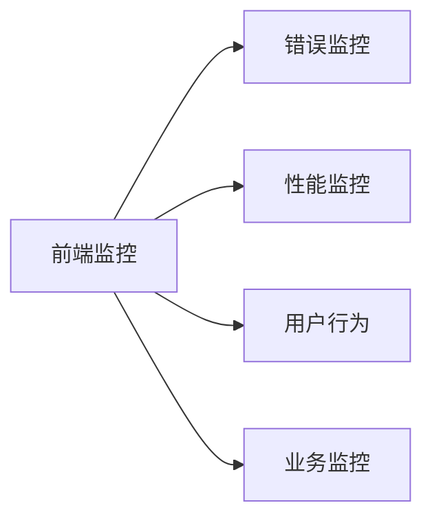

# 前端监控

> [!TIP]
> 前端监控帮助我们了解线上应用的真实表现，及时发现问题并优化体验。

## 🎯 监控类型



## 📦 错误监控

### JavaScript 错误

```javascript
// 全局错误捕获
window.onerror = function (message, source, lineno, colno, error) {
  reportError({
    type: "js_error",
    message,
    source,
    lineno,
    colno,
    stack: error?.stack,
  });
  return false; // 不阻止默认处理
};

// Promise 未捕获错误
window.addEventListener("unhandledrejection", (event) => {
  reportError({
    type: "promise_error",
    reason: event.reason,
  });
});
```

### React 错误边界

```jsx
class ErrorBoundary extends React.Component {
  state = { hasError: false };

  static getDerivedStateFromError(error) {
    return { hasError: true };
  }

  componentDidCatch(error, errorInfo) {
    reportError({
      type: "react_error",
      error: error.message,
      stack: error.stack,
      componentStack: errorInfo.componentStack,
    });
  }

  render() {
    if (this.state.hasError) {
      return <h1>出错了</h1>;
    }
    return this.props.children;
  }
}
```

### 资源加载错误

```javascript
window.addEventListener(
  "error",
  (event) => {
    const target = event.target;

    if (target.tagName === "IMG" || target.tagName === "SCRIPT") {
      reportError({
        type: "resource_error",
        tagName: target.tagName,
        src: target.src || target.href,
      });
    }
  },
  true
); // 捕获阶段
```

### 接口错误

```javascript
// 封装 fetch
const originalFetch = window.fetch;

window.fetch = async function (...args) {
  const startTime = Date.now();

  try {
    const response = await originalFetch.apply(this, args);

    if (!response.ok) {
      reportError({
        type: "api_error",
        url: args[0],
        status: response.status,
        duration: Date.now() - startTime,
      });
    }

    return response;
  } catch (error) {
    reportError({
      type: "network_error",
      url: args[0],
      error: error.message,
    });
    throw error;
  }
};
```

## ⚡ 性能监控

### Core Web Vitals

```javascript
// 使用 web-vitals 库
import { getLCP, getFID, getCLS, getFCP, getTTFB } from "web-vitals";

function reportMetric(metric) {
  console.log(metric.name, metric.value);

  sendToAnalytics({
    name: metric.name,
    value: metric.value,
    rating: metric.rating, // 'good' | 'needs-improvement' | 'poor'
  });
}

getLCP(reportMetric);
getFID(reportMetric);
getCLS(reportMetric);
getFCP(reportMetric);
getTTFB(reportMetric);
```

### Performance API

```javascript
// 页面加载性能
window.addEventListener("load", () => {
  const timing = performance.timing;

  const metrics = {
    // DNS 查询
    dns: timing.domainLookupEnd - timing.domainLookupStart,
    // TCP 连接
    tcp: timing.connectEnd - timing.connectStart,
    // 请求响应
    request: timing.responseEnd - timing.requestStart,
    // DOM 解析
    dom: timing.domComplete - timing.domInteractive,
    // 页面加载
    load: timing.loadEventEnd - timing.navigationStart,
    // 首次渲染
    fp: timing.responseStart - timing.navigationStart,
  };

  reportPerformance(metrics);
});

// 使用 PerformanceObserver
const observer = new PerformanceObserver((list) => {
  for (const entry of list.getEntries()) {
    console.log(entry.name, entry.duration);
  }
});

observer.observe({ entryTypes: ["resource", "paint", "longtask"] });
```

### 长任务监控

```javascript
const observer = new PerformanceObserver((list) => {
  for (const entry of list.getEntries()) {
    if (entry.duration > 50) {
      reportPerformance({
        type: "longtask",
        duration: entry.duration,
        startTime: entry.startTime,
      });
    }
  }
});

observer.observe({ entryTypes: ["longtask"] });
```

## 👆 用户行为监控

### 点击埋点

```javascript
document.addEventListener("click", (event) => {
  const target = event.target.closest("[data-track]");

  if (target) {
    const trackData = target.dataset.track;

    reportEvent({
      type: "click",
      data: JSON.parse(trackData),
      path: getXPath(target),
      timestamp: Date.now(),
    });
  }
});

// 使用
<button data-track='{"name": "buy_button", "page": "product"}'>购买</button>;
```

### PV/UV 统计

```javascript
// 页面访问
function reportPV() {
  const pvData = {
    type: "pv",
    url: location.href,
    referrer: document.referrer,
    title: document.title,
    timestamp: Date.now(),
    // 用户标识
    uid: getUID(),
  };

  sendToAnalytics(pvData);
}

// SPA 路由变化
window.addEventListener("popstate", reportPV);

// 或监听 history
const originalPushState = history.pushState;
history.pushState = function (...args) {
  originalPushState.apply(this, args);
  reportPV();
};
```

### 用户轨迹

```javascript
class UserTracker {
  trail = [];

  init() {
    // 记录点击
    document.addEventListener("click", (e) => {
      this.trail.push({
        type: "click",
        target: this.getSelector(e.target),
        time: Date.now(),
      });
    });

    // 记录页面切换
    window.addEventListener("beforeunload", () => {
      this.report();
    });
  }

  getSelector(el) {
    // 生成元素选择器
    return el.id || el.className || el.tagName;
  }

  report() {
    sendToAnalytics({
      type: "trail",
      data: this.trail,
    });
  }
}
```

## 📊 数据上报

### Beacon API

页面关闭时可靠上报。

```javascript
function sendBeacon(data) {
  const blob = new Blob([JSON.stringify(data)], { type: "application/json" });
  navigator.sendBeacon("/api/analytics", blob);
}

window.addEventListener("visibilitychange", () => {
  if (document.visibilityState === "hidden") {
    sendBeacon(pendingData);
  }
});
```

### 批量上报

```javascript
class Reporter {
  queue = [];
  maxSize = 10;
  interval = 5000;

  constructor() {
    setInterval(() => this.flush(), this.interval);
  }

  add(data) {
    this.queue.push(data);

    if (this.queue.length >= this.maxSize) {
      this.flush();
    }
  }

  flush() {
    if (this.queue.length === 0) return;

    const data = this.queue.splice(0, this.maxSize);

    fetch("/api/analytics", {
      method: "POST",
      body: JSON.stringify(data),
      keepalive: true, // 页面关闭后继续请求
    });
  }
}
```

## 🔧 监控平台

### 开源方案

| 工具       | 特点               |
| ---------- | ------------------ |
| Sentry     | 错误监控，功能强大 |
| Grafana    | 可视化，灵活配置   |
| Prometheus | 时序数据，告警     |

### 商业方案

- 阿里 ARMS
- 腾讯 RUM
- 字节 Datadog

## 💡 最佳实践

1. **采样上报** - 高流量时按比例采样
2. **错误聚合** - 相同错误合并上报
3. **敏感信息脱敏** - 不上报用户隐私数据
4. **性能开销最小** - 监控本身不能影响性能
5. **设置告警** - 异常时及时通知

## 🔗 相关资源

- [性能优化](/docs/frontend/advanced/performance)
- [错误处理](/docs/frontend/javascript/error-handling)

---

**恭喜！** 你已完成前端进阶学习。继续探索 [React](/docs/react) 构建现代应用！
