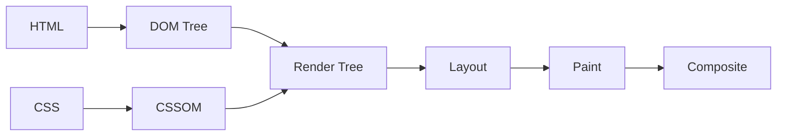

# 浏览器原理

> [!TIP]
> 理解浏览器的工作原理，能帮助你写出更高性能的前端代码。

## 🎯 浏览器架构

现代浏览器采用多进程架构：

```
┌─────────────────────────────────────────┐
│           Browser Process               │
│   (UI、网络、存储、子进程管理)            │
├─────────────┬─────────────┬─────────────┤
│  Renderer   │  Renderer   │  Renderer   │
│  Process    │  Process    │  Process    │
│  (Tab 1)    │  (Tab 2)    │  (Tab 3)    │
├─────────────┴─────────────┴─────────────┤
│           GPU Process                    │
└─────────────────────────────────────────┘
```

| 进程     | 职责                             |
| -------- | -------------------------------- |
| Browser  | 地址栏、书签、网络请求、文件访问 |
| Renderer | 页面渲染、JavaScript 执行        |
| GPU      | 图形处理、合成                   |
| Plugin   | 插件运行（如 Flash）             |

## 🖼️ 渲染流程



### 1. 解析 HTML → DOM

```html
<html>
  <body>
    <div>Hello</div>
  </body>
</html>
```

浏览器将 HTML 解析为 DOM 树：

```
Document
└── html
    └── body
        └── div
            └── "Hello"
```

### 2. 解析 CSS → CSSOM

```css
div {
  color: blue;
  font-size: 16px;
}
```

### 3. 合并 → Render Tree

Render Tree 只包含可见元素（不含 `display: none`）

### 4. Layout（布局/重排）

计算每个元素的几何信息（位置、大小）

### 5. Paint（绘制/重绘）

将元素绘制到图层

### 6. Composite（合成）

将多个图层合成最终画面

## ⚡ 重排与重绘

### 触发重排 (Reflow)

```javascript
// 这些操作会触发重排
element.style.width = "100px";
element.style.height = "200px";
element.offsetWidth; // 读取布局属性
element.getBoundingClientRect();
```

### 触发重绘 (Repaint)

```javascript
// 只改变视觉属性，不影响布局
element.style.color = "red";
element.style.backgroundColor = "blue";
```

### 优化建议

```javascript
// ❌ 多次重排
element.style.width = "100px";
element.style.height = "200px";
element.style.margin = "10px";

// ✅ 批量修改
element.style.cssText = "width: 100px; height: 200px; margin: 10px;";

// ✅ 使用 class
element.classList.add("new-styles");

// ✅ 使用 DocumentFragment
const fragment = document.createDocumentFragment();
items.forEach((item) => {
  const li = document.createElement("li");
  li.textContent = item;
  fragment.appendChild(li);
});
list.appendChild(fragment);
```

## 🔄 Event Loop

JavaScript 是单线程的，通过事件循环处理异步操作：

```
┌───────────────────────────┐
│         Call Stack        │
└───────────────────────────┘
            ↓
┌───────────────────────────┐
│      Web APIs (定时器、    │
│      事件监听、网络请求)    │
└───────────────────────────┘
            ↓
┌───────────────┬───────────┐
│  Microtask    │ Macrotask │
│  (Promise)    │(setTimeout)│
└───────────────┴───────────┘
```

### 执行顺序

1. 执行同步代码（调用栈）
2. 清空微任务队列
3. 执行一个宏任务
4. 重复 2-3

### 示例

```javascript
console.log("1"); // 同步

setTimeout(() => {
  console.log("2"); // 宏任务
}, 0);

Promise.resolve().then(() => {
  console.log("3"); // 微任务
});

console.log("4"); // 同步

// 输出: 1, 4, 3, 2
```

### 任务分类

| 类型   | 任务                                                |
| ------ | --------------------------------------------------- |
| 微任务 | Promise.then, queueMicrotask, MutationObserver      |
| 宏任务 | setTimeout, setInterval, requestAnimationFrame, I/O |

## 🎬 requestAnimationFrame

用于创建流畅动画：

```javascript
function animate() {
  // 更新动画
  element.style.left = `${position}px`;
  position++;

  if (position < 300) {
    requestAnimationFrame(animate);
  }
}

requestAnimationFrame(animate);
```

### 优势

- 与屏幕刷新率同步（通常 60fps）
- 页面不可见时自动暂停
- 比 setTimeout 更精确

## 💡 最佳实践

### 1. 避免强制同步布局

```javascript
// ❌ 强制同步布局
elements.forEach((el) => {
  el.style.width = box.offsetWidth + "px"; // 每次循环都触发重排
});

// ✅ 先读后写
const width = box.offsetWidth;
elements.forEach((el) => {
  el.style.width = width + "px";
});
```

### 2. 使用 transform 代替位置属性

```javascript
// ❌ 触发重排
element.style.left = "100px";

// ✅ 只触发合成
element.style.transform = "translateX(100px)";
```

### 3. 使用 will-change 提示

```css
.animated {
  will-change: transform;
}
```

## 🔗 相关资源

- [DOM 操作](/docs/frontend/javascript/dom)
- [浏览器存储](/docs/frontend/browser/storage)
- [HTTP 网络](/docs/frontend/browser/network)

---

**下一步**：学习 [浏览器存储](/docs/frontend/browser/storage) 了解数据持久化。
