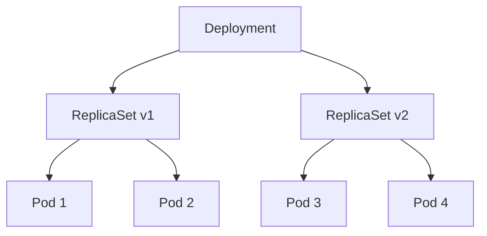
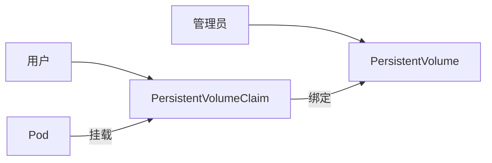
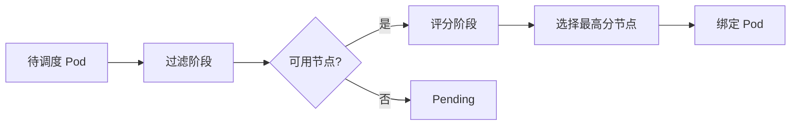

# Kubernetes 面试题

## 核心概念

### Q1: 什么是 Kubernetes？它解决了什么问题？

**答案**：

Kubernetes 是一个开源的容器编排平台，用于自动化部署、扩展和管理容器化应用程序。

**解决的问题**：

| 问题       | K8s 解决方案           |
| ---------- | ---------------------- |
| 容器编排   | 自动化调度和部署       |
| 服务发现   | 内置 DNS 和 Service    |
| 负载均衡   | Service 和 Ingress     |
| 自动扩缩容 | HPA/VPA                |
| 自愈能力   | 自动重启、替换故障容器 |
| 配置管理   | ConfigMap 和 Secret    |
| 存储编排   | PV/PVC 抽象            |

---

### Q2: Pod 和容器的区别是什么？

**答案**：

| 对比项   | Pod              | Container        |
| -------- | ---------------- | ---------------- |
| 定义     | K8s 最小部署单元 | 运行时实例       |
| 数量     | 可包含多个容器   | 单个进程         |
| 网络     | 共享网络命名空间 | 共享 Pod 网络    |
| 存储     | 可共享 Volume    | 挂载 Volume      |
| 生命周期 | 独立管理         | 随 Pod 创建/销毁 |

**Pod 内多容器通信**：

- 通过 localhost 直接通信
- 共享 Volume 交换数据
- 共享 PID 命名空间（可选）

---

### Q3: Deployment、ReplicaSet、Pod 的关系是什么？

**答案**：



- **Deployment**：声明式管理，支持滚动更新和回滚
- **ReplicaSet**：确保指定数量的 Pod 副本运行
- **Pod**：实际运行的容器组

**关系**：Deployment 管理 ReplicaSet，ReplicaSet 管理 Pod

---

### Q4: 什么是 Namespace？有什么作用？

**答案**：

Namespace 是 Kubernetes 中的虚拟集群，用于资源隔离和多租户。

**作用**：

1. **资源隔离**：不同团队/环境使用不同 Namespace
2. **权限控制**：RBAC 可按 Namespace 授权
3. **资源配额**：ResourceQuota 限制 Namespace 资源使用
4. **网络策略**：NetworkPolicy 可按 Namespace 控制流量

**默认 Namespace**：

| Namespace       | 用途         |
| --------------- | ------------ |
| default         | 默认资源位置 |
| kube-system     | 系统组件     |
| kube-public     | 公开资源     |
| kube-node-lease | 节点心跳     |

---

## 网络相关

### Q5: Service 有哪几种类型？分别用于什么场景？

**答案**：

| 类型         | 说明             | 使用场景         |
| ------------ | ---------------- | ---------------- |
| ClusterIP    | 仅集群内部访问   | 内部服务通信     |
| NodePort     | 通过节点端口暴露 | 开发测试         |
| LoadBalancer | 云厂商负载均衡器 | 生产环境外部访问 |
| ExternalName | 映射外部 DNS     | 集成外部服务     |

**选择建议**：

- 内部服务 → ClusterIP
- 外部 HTTP 服务 → LoadBalancer + Ingress
- 外部非 HTTP 服务 → LoadBalancer

---

### Q6: Ingress 和 Service 的区别？

**答案**：

| 对比项   | Service      | Ingress      |
| -------- | ------------ | ------------ |
| 层级     | L4（传输层） | L7（应用层） |
| 协议     | TCP/UDP      | HTTP/HTTPS   |
| 路由     | IP:Port      | 域名/路径    |
| TLS      | 不支持       | 支持         |
| 负载均衡 | 简单轮询     | 高级路由规则 |

**典型架构**：

```
Internet → LoadBalancer → Ingress → Service → Pod
```

---

### Q7: Pod 之间是如何通信的？

**答案**：

**同节点 Pod 通信**：

- 通过 Linux 网桥（如 cni0）直接通信
- 无需经过物理网络

**跨节点 Pod 通信**：

- CNI 插件（Calico/Flannel）建立覆盖网络
- 通过 VXLAN、IPIP 或 BGP 路由

**关键原则**：

1. 每个 Pod 有独立 IP
2. Pod 间可以直接通信（无 NAT）
3. 节点可以直接访问任意 Pod

---

## 存储相关

### Q8: PV 和 PVC 的关系是什么？

**答案**：

- **PV（PersistentVolume）**：集群级别的存储资源，由管理员创建
- **PVC（PersistentVolumeClaim）**：用户对存储的请求，绑定到 PV



**绑定规则**：

1. 容量：PV 容量 ≥ PVC 请求
2. 访问模式：必须匹配
3. StorageClass：必须匹配

---

### Q9: StorageClass 的作用是什么？

**答案**：

StorageClass 定义了如何动态创建 PV，实现存储的自动化管理。

**作用**：

1. **动态供应**：自动创建 PV，无需手动管理
2. **存储分类**：区分不同性能/类型的存储
3. **参数配置**：定义存储后端的特定参数

```yaml
apiVersion: storage.k8s.io/v1
kind: StorageClass
metadata:
  name: fast
provisioner: kubernetes.io/gce-pd
parameters:
  type: pd-ssd
reclaimPolicy: Delete
volumeBindingMode: WaitForFirstConsumer
```

---

## 调度相关

### Q10: Kubernetes 调度器是如何工作的？

**答案**：

调度过程分两个阶段：

**1. 过滤（Predicates）**：排除不满足条件的节点

- 资源是否充足
- 节点选择器匹配
- 污点/容忍匹配
- 亲和性/反亲和性

**2. 评分（Priorities）**：选择最优节点

- 资源均衡性
- 亲和性优先级
- 镜像本地化
- 节点优先级



---

### Q11: Taint 和 Toleration 是什么？

**答案**：

- **Taint（污点）**：应用在节点上，阻止 Pod 调度
- **Toleration（容忍）**：应用在 Pod 上，允许调度到有污点的节点

**效果**：

| Effect           | 说明                 |
| ---------------- | -------------------- |
| NoSchedule       | 不调度新 Pod         |
| PreferNoSchedule | 尽量不调度           |
| NoExecute        | 不调度且驱逐现有 Pod |

**使用场景**：

1. 专用节点（GPU 节点）
2. 节点维护
3. 节点故障隔离

---

## 安全相关

### Q12: RBAC 的工作原理？

**答案**：

RBAC（基于角色的访问控制）包含四个核心概念：

| 资源                           | 说明                    |
| ------------------------------ | ----------------------- |
| ServiceAccount                 | 身份标识                |
| Role/ClusterRole               | 权限定义（动词 + 资源） |
| RoleBinding/ClusterRoleBinding | 将角色绑定到主体        |

**权限检查流程**：

```
请求 → 认证（谁？）→ 授权（RBAC 检查）→ 准入控制 → API Server
```

---

### Q13: Pod 安全的最佳实践有哪些？

**答案**：

1. **运行非 root 用户**

```yaml
securityContext:
  runAsNonRoot: true
  runAsUser: 1000
```

2. **只读文件系统**

```yaml
securityContext:
  readOnlyRootFilesystem: true
```

3. **禁止特权升级**

```yaml
securityContext:
  allowPrivilegeEscalation: false
```

4. **删除不必要的能力**

```yaml
securityContext:
  capabilities:
    drop:
      - ALL
```

5. **使用 NetworkPolicy 隔离网络**
6. **使用 Secret 管理敏感信息**
7. **禁用自动挂载 ServiceAccount Token**

---

## 运维相关

### Q14: 如何实现零停机部署？

**答案**：

**1. 滚动更新策略**

```yaml
spec:
  strategy:
    type: RollingUpdate
    rollingUpdate:
      maxSurge: 1
      maxUnavailable: 0
```

**2. 配置就绪探针**

```yaml
readinessProbe:
  httpGet:
    path: /ready
    port: 8080
```

**3. 优雅终止**

```yaml
spec:
  terminationGracePeriodSeconds: 60
  containers:
    - lifecycle:
        preStop:
          exec:
            command: ["/bin/sh", "-c", "sleep 10"]
```

**4. PodDisruptionBudget**

```yaml
spec:
  minAvailable: 2
```

---

### Q15: 如何排查 Pod CrashLoopBackOff？

**答案**：

**排查步骤**：

```bash
# 1. 查看 Pod 事件
kubectl describe pod <pod-name>

# 2. 查看当前日志
kubectl logs <pod-name>

# 3. 查看上一个容器的日志
kubectl logs <pod-name> --previous

# 4. 检查退出码
kubectl get pod <pod-name> -o jsonpath='{.status.containerStatuses[0].lastState.terminated.exitCode}'
```

**常见原因**：

| 原因            | 解决方案                 |
| --------------- | ------------------------ |
| 应用配置错误    | 检查 ConfigMap/Secret    |
| 依赖服务不可用  | 添加 Init Container 等待 |
| 资源不足（OOM） | 增加内存限制             |
| 健康检查失败    | 调整 Probe 参数          |
| 镜像问题        | 验证镜像是否正确         |

---

## 架构设计

### Q16: 如何设计高可用的 Kubernetes 应用？

**答案**：

**1. 多副本部署**

```yaml
spec:
  replicas: 3
```

**2. 跨可用区分布**

```yaml
topologySpreadConstraints:
  - maxSkew: 1
    topologyKey: topology.kubernetes.io/zone
    whenUnsatisfiable: DoNotSchedule
```

**3. Pod 反亲和性**

```yaml
affinity:
  podAntiAffinity:
    requiredDuringSchedulingIgnoredDuringExecution:
      - labelSelector:
          matchLabels:
            app: my-app
        topologyKey: kubernetes.io/hostname
```

**4. PodDisruptionBudget**

**5. 健康检查和自动恢复**

**6. HPA 自动扩缩容**

---

### Q17: Kubernetes 控制平面组件有哪些？各自作用？

**答案**：

| 组件                         | 作用                                        |
| ---------------------------- | ------------------------------------------- |
| **API Server**               | 所有请求的入口，负责认证授权、数据校验      |
| **etcd**                     | 分布式键值存储，保存集群状态                |
| **Scheduler**                | 调度 Pod 到合适的节点                       |
| **Controller Manager**       | 运行各种控制器（Deployment、ReplicaSet 等） |
| **Cloud Controller Manager** | 与云平台集成（可选）                        |

**数据流**：

```
kubectl → API Server → etcd
           ↓
    Controller Manager
           ↓
       Scheduler
           ↓
    Kubelet (Node)
```

---

## 场景题

### Q18: 描述一次完整的 Pod 创建流程

**答案**：

1. **kubectl 提交请求** → API Server
2. **API Server 验证** → 认证、授权、准入控制
3. **写入 etcd** → Pod 状态变为 Pending
4. **Scheduler 监听** → 选择最优节点
5. **更新 etcd** → Pod 绑定到节点
6. **Kubelet 监听** → 拉取镜像，创建容器
7. **容器运行时执行** → Docker/containerd 启动容器
8. **Kubelet 上报状态** → Pod 状态变为 Running

---

### Q19: 如果 API Server 挂了会怎样？

**答案**：

**影响**：

1. 无法执行 kubectl 命令
2. 无法创建/修改/删除资源
3. 控制器无法工作（无法自愈）
4. Scheduler 无法调度新 Pod

**现有工作负载**：

- **已运行的 Pod 不受影响**
- kubelet 继续运行和监控本地容器
- 但无法重新拉起失败的 Pod

**高可用方案**：

- 多 API Server 实例
- 前置负载均衡器
- etcd 集群（3 或 5 节点）

---

### Q20: 如何限制某个 Namespace 的资源使用？

**答案**：

**1. ResourceQuota**

```yaml
apiVersion: v1
kind: ResourceQuota
metadata:
  name: team-quota
  namespace: team-a
spec:
  hard:
    requests.cpu: "10"
    requests.memory: "20Gi"
    limits.cpu: "20"
    limits.memory: "40Gi"
    pods: "50"
```

**2. LimitRange**

```yaml
apiVersion: v1
kind: LimitRange
metadata:
  name: default-limits
  namespace: team-a
spec:
  limits:
    - default:
        cpu: "500m"
        memory: "512Mi"
      defaultRequest:
        cpu: "100m"
        memory: "128Mi"
      type: Container
```

**3. NetworkPolicy**

限制网络访问范围。
