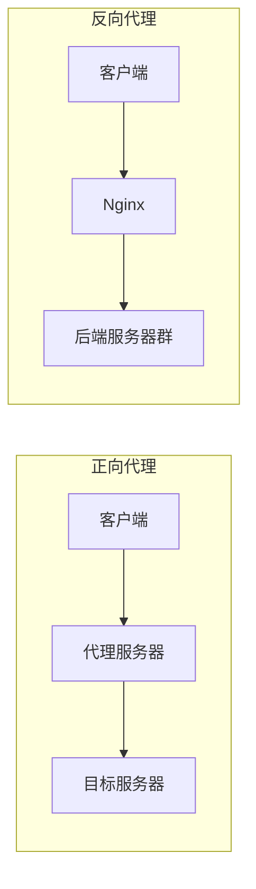
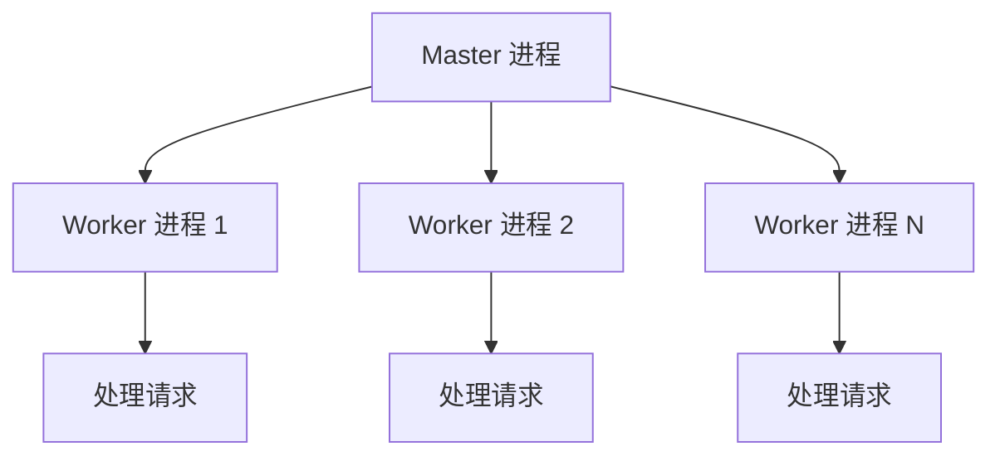

# Nginx 面试问题

## 基础概念

### 什么是 Nginx？它有哪些主要特点？

**参考答案**：

Nginx 是一个高性能的 HTTP 和反向代理服务器，同时也支持 IMAP/POP3/SMTP 代理。主要特点包括：

- **高并发**：采用事件驱动、异步非阻塞架构，单机支持数万并发连接
- **低内存**：相比传统服务器，内存占用更低
- **模块化**：核心功能模块化，易于扩展
- **热部署**：支持热加载配置，不中断服务
- **高可靠**：master-worker 进程模型，一个 worker 崩溃不影响其他

### 正向代理与反向代理的区别？

**参考答案**：

| 特性           | 正向代理       | 反向代理                 |
| -------------- | -------------- | ------------------------ |
| **代理对象**   | 客户端         | 服务端                   |
| **客户端感知** | 知道代理存在   | 不知道代理存在           |
| **典型用途**   | 翻墙、缓存加速 | 负载均衡、隐藏后端服务器 |
| **配置位置**   | 客户端配置     | 服务端配置               |



### Nginx 的进程模型？

**参考答案**：

Nginx 采用 **master-worker** 进程模型：

- **Master 进程**：管理进程，负责读取配置、管理 worker 进程
- **Worker 进程**：实际处理请求的进程，数量通常设为 CPU 核心数
- **优势**：worker 进程独立运行，一个崩溃不影响其他；支持热升级



### 为什么 Nginx 性能高？

**参考答案**：

1. **事件驱动架构**：使用 epoll（Linux）/kqueue（BSD）多路复用
2. **异步非阻塞**：不会因等待 I/O 而阻塞进程
3. **内存池设计**：减少内存碎片，提高分配效率
4. **零拷贝技术**：sendfile 直接在内核空间传输文件
5. **连接复用**：keepalive 减少连接建立开销

## 配置相关

### location 匹配优先级是怎样的？

**参考答案**：

匹配优先级从高到低：

1. `= /path` - 精确匹配（最高优先级）
2. `^~ /path` - 前缀匹配，匹配后不再检查正则
3. `~ regex` - 正则匹配（区分大小写）
4. `~* regex` - 正则匹配（不区分大小写）
5. `/path` - 普通前缀匹配
6. `/` - 默认匹配（最低优先级）

```nginx
# 示例
location = / { }         # 精确匹配 /
location ^~ /static/ { } # 优先匹配 /static/ 开头
location ~ \.php$ { }    # 正则匹配 .php 结尾
location / { }           # 默认匹配
```

### proxy_pass 末尾加不加斜杠的区别？

**参考答案**：

```nginx
# 不带斜杠：URI 会被追加到 proxy_pass 地址
location /api/ {
    proxy_pass http://backend;
}
# 访问 /api/user → http://backend/api/user

# 带斜杠：location 匹配部分会被替换
location /api/ {
    proxy_pass http://backend/;
}
# 访问 /api/user → http://backend/user
```

### rewrite 的 flag 有哪些区别？

**参考答案**：

| Flag        | 说明                                     |
| ----------- | ---------------------------------------- |
| `last`      | 停止当前 rewrite，重新发起 location 匹配 |
| `break`     | 停止 rewrite，在当前 location 继续执行   |
| `redirect`  | 302 临时重定向，浏览器地址会改变         |
| `permanent` | 301 永久重定向，浏览器地址会改变         |

## 负载均衡

### Nginx 支持哪些负载均衡策略？

**参考答案**：

| 策略           | 配置方式              | 说明                       |
| -------------- | --------------------- | -------------------------- |
| **轮询**       | 默认                  | 请求依次分发               |
| **加权轮询**   | `weight=N`            | 按权重比例分发             |
| **IP Hash**    | `ip_hash`             | 同一 IP 固定到同一后端     |
| **最少连接**   | `least_conn`          | 请求发到连接数最少的服务器 |
| **一致性哈希** | `hash key consistent` | 基于 key 的哈希分配        |

```nginx
upstream backend {
    least_conn;
    server 10.0.0.1:8080 weight=5;
    server 10.0.0.2:8080 weight=3;
    server 10.0.0.3:8080 backup;
}
```

### 如何配置健康检查？

**参考答案**：

**被动健康检查**（开源版支持）：

```nginx
upstream backend {
    server 10.0.0.1:8080 max_fails=3 fail_timeout=30s;
    server 10.0.0.2:8080 max_fails=3 fail_timeout=30s;
}

location / {
    proxy_pass http://backend;
    proxy_next_upstream error timeout http_500 http_502;
}
```

**主动健康检查**（Nginx Plus）：

```nginx
upstream backend {
    zone backend 64k;
    server 10.0.0.1:8080;

    health_check interval=5s fails=3 passes=2;
}
```

### 如何实现会话保持？

**参考答案**：

```nginx
# 方法 1：IP Hash
upstream backend {
    ip_hash;
    server 10.0.0.1:8080;
    server 10.0.0.2:8080;
}

# 方法 2：基于 Cookie Hash
upstream backend {
    hash $cookie_sessionid consistent;
    server 10.0.0.1:8080;
    server 10.0.0.2:8080;
}

# 方法 3：Sticky Cookie（Nginx Plus）
upstream backend {
    server 10.0.0.1:8080;
    sticky cookie srv_id expires=1h;
}
```

## 性能优化

### 如何优化 Nginx 性能？

**参考答案**：

1. **Worker 进程优化**

   ```nginx
   worker_processes auto;          # CPU 核心数
   worker_rlimit_nofile 65535;     # 文件描述符限制
   worker_connections 10240;       # 每个 worker 最大连接数
   ```

2. **连接优化**

   ```nginx
   sendfile on;
   tcp_nopush on;
   tcp_nodelay on;
   keepalive_timeout 65;
   ```

3. **Gzip 压缩**

   ```nginx
   gzip on;
   gzip_comp_level 5;
   gzip_types text/plain text/css application/json application/javascript;
   ```

4. **缓存优化**
   ```nginx
   open_file_cache max=10000 inactive=20s;
   proxy_cache_path /var/cache levels=1:2 keys_zone=cache:10m;
   ```

### 什么是惊群效应？如何解决？

**参考答案**：

**惊群效应**：多个 worker 进程同时被唤醒抢占一个新连接，但只有一个能成功，其他白白消耗资源。

**解决方案**：

```nginx
events {
    accept_mutex on;      # 旧版本：互斥锁
    accept_mutex off;     # 新版本 Linux：使用 EPOLLEXCLUSIVE
}
```

新版 Linux 内核（3.9+）通过 `SO_REUSEPORT` 解决：

```nginx
listen 80 reuseport;
```

## 安全相关

### 如何配置限流限速？

**参考答案**：

```nginx
# 限制请求速率
http {
    limit_req_zone $binary_remote_addr zone=req_limit:10m rate=10r/s;

    server {
        location /api/ {
            limit_req zone=req_limit burst=20 nodelay;
            limit_req_status 429;
        }
    }
}

# 限制并发连接
http {
    limit_conn_zone $binary_remote_addr zone=conn_limit:10m;

    server {
        limit_conn conn_limit 10;
    }
}
```

### 常见的安全响应头有哪些？

**参考答案**：

```nginx
# 防止点击劫持
add_header X-Frame-Options "SAMEORIGIN" always;

# 防止 XSS
add_header X-XSS-Protection "1; mode=block" always;

# 防止 MIME 类型嗅探
add_header X-Content-Type-Options "nosniff" always;

# 强制 HTTPS
add_header Strict-Transport-Security "max-age=31536000; includeSubDomains" always;

# 内容安全策略
add_header Content-Security-Policy "default-src 'self'" always;
```

## 运维排障

### 502 和 504 错误的区别和排查？

**参考答案**：

| 错误码  | 含义                    | 常见原因                         |
| ------- | ----------------------- | -------------------------------- |
| **502** | Bad Gateway（网关错误） | 后端宕机、连接拒绝、返回格式错误 |
| **504** | Gateway Timeout         | 后端响应太慢、超时配置太短       |

**排查步骤**：

1. 查看错误日志：`tail -f /var/log/nginx/error.log`
2. 检查后端服务：`curl http://backend_ip:port`
3. 检查网络连通性：`telnet backend_ip port`
4. 调整超时配置：
   ```nginx
   proxy_connect_timeout 60s;
   proxy_read_timeout 300s;
   proxy_send_timeout 60s;
   ```

### 如何平滑升级 Nginx？

**参考答案**：

```bash
# 1. 备份旧版本
cp /usr/sbin/nginx /usr/sbin/nginx.old

# 2. 编译新版本（不安装）
./configure --prefix=/etc/nginx ...
make

# 3. 替换二进制文件
cp objs/nginx /usr/sbin/nginx

# 4. 发送 USR2 信号，启动新进程
kill -USR2 `cat /var/run/nginx.pid`

# 5. 旧 master 收到 QUIT 信号，优雅退出
kill -QUIT `cat /var/run/nginx.pid.oldbin`

# 回滚（如果需要）
kill -HUP `cat /var/run/nginx.pid.oldbin`
```

### nginx -s reload 的工作原理？

**参考答案**：

1. Master 进程接收到 SIGHUP 信号
2. Master 检查配置文件语法
3. 如果语法正确，Master 创建新的 worker 进程
4. Master 向旧 worker 发送 QUIT 信号
5. 旧 worker 处理完当前请求后退出
6. 整个过程不中断服务

## 高频综合问题

### Nginx 与 Apache 的区别？

**参考答案**：

| 特性           | Nginx        | Apache       |
| -------------- | ------------ | ------------ |
| **架构**       | 事件驱动     | 进程/线程    |
| **并发能力**   | 高（数万级） | 中（数千级） |
| **内存消耗**   | 低           | 高           |
| **静态资源**   | 优秀         | 一般         |
| **动态内容**   | 需要代理     | 模块直接支持 |
| **配置热加载** | 支持         | 需要重启     |
| **生态**       | 相对简单     | 模块丰富     |

### 如何配置 WebSocket 代理？

**参考答案**：

```nginx
map $http_upgrade $connection_upgrade {
    default upgrade;
    '' close;
}

server {
    location /ws/ {
        proxy_pass http://websocket_backend;
        proxy_http_version 1.1;
        proxy_set_header Upgrade $http_upgrade;
        proxy_set_header Connection $connection_upgrade;
        proxy_set_header Host $host;
        proxy_read_timeout 3600s;  # 长连接超时
    }
}
```

### 如何使用 Nginx 实现灰度发布？

**参考答案**：

```nginx
# 基于 Cookie 分流
map $cookie_version $backend {
    default backend_stable;
    "beta" backend_canary;
}

upstream backend_stable {
    server 10.0.0.1:8080;
    server 10.0.0.2:8080;
}

upstream backend_canary {
    server 10.0.0.3:8080;
}

server {
    location / {
        proxy_pass http://$backend;
    }
}

# 基于权重分流
split_clients "${remote_addr}" $variant {
    10% "canary";
    *   "stable";
}
```
