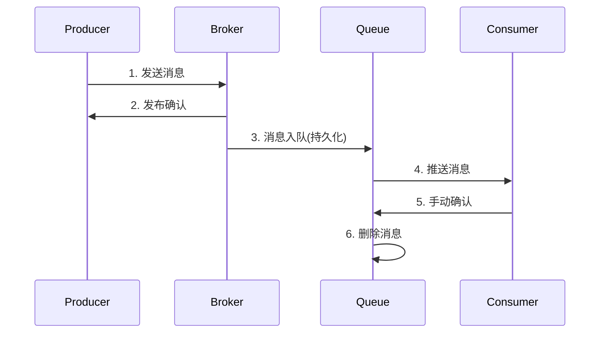
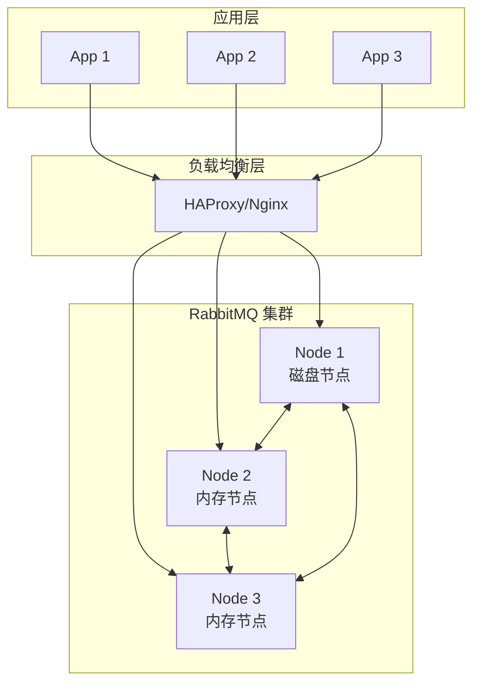

# RabbitMQ 面试题集

## 基础概念

### 1. 什么是 RabbitMQ？

RabbitMQ 是一个开源的消息代理软件，实现了 AMQP 协议，用于在分布式系统中进行消息传递。

**核心特点：**

- 可靠性：支持持久化、确认机制
- 灵活路由：多种交换机类型
- 高可用：集群和镜像队列
- 多协议：AMQP、STOMP、MQTT

### 2. RabbitMQ 的核心组件？

| 组件     | 说明             |
| -------- | ---------------- |
| Producer | 消息生产者       |
| Exchange | 交换机，路由消息 |
| Binding  | 绑定规则         |
| Queue    | 消息队列         |
| Consumer | 消息消费者       |

### 3. 四种交换机类型的区别？

- **Direct**：精确匹配路由键
- **Fanout**：广播到所有绑定队列
- **Topic**：模式匹配（`*` 匹配一个词，`#` 匹配多个词）
- **Headers**：根据消息头属性匹配

### 4. 如何保证消息可靠性？

```java
// 1. 持久化队列
channel.queueDeclare("queue", true, false, false, null);

// 2. 持久化消息
channel.basicPublish("", "queue", MessageProperties.PERSISTENT_TEXT_PLAIN, msg);

// 3. 发布确认
channel.confirmSelect();
channel.waitForConfirms();

// 4. 手动确认
channel.basicAck(deliveryTag, false);
```

### 5. 消息确认机制？

**生产者确认：**

- `confirmSelect()`：启用确认模式
- `waitForConfirms()`：同步确认
- `addConfirmListener()`：异步确认

**消费者确认：**

- `basicAck()`：确认消息
- `basicNack()`：拒绝消息
- `basicReject()`：拒绝单条

## 进阶问题

### 6. 如何处理消息重复消费？

**幂等性方案：**

```java
// 方案1: Redis 去重
String msgId = properties.getMessageId();
if (!redis.setIfAbsent("msg:" + msgId, "1", 24, TimeUnit.HOURS)) {
    return; // 已处理
}
processMessage(body);

// 方案2: 数据库唯一约束
@Transactional
public void process(String msgId, String content) {
    if (messageLogRepository.existsById(msgId)) {
        return; // 已处理
    }
    processMessage(content);
    messageLogRepository.save(new MessageLog(msgId));
}
```

### 7. 死信队列的使用场景？

消息进入死信的情况：

1. 被拒绝且不重新入队
2. 消息 TTL 过期
3. 队列达到最大长度

```java
Map<String, Object> args = new HashMap<>();
args.put("x-dead-letter-exchange", "dlx");
args.put("x-dead-letter-routing-key", "dead");
channel.queueDeclare("queue", true, false, false, args);
```

**应用场景：**

- 异常消息收集
- 延迟消息实现
- 消息重试机制

### 8. 如何实现延迟消息？

**方案 1：TTL + 死信**

```java
// 设置队列 TTL，过期后转发到目标交换机
args.put("x-message-ttl", 60000);
args.put("x-dead-letter-exchange", "target");
```

**方案 2：延迟插件（推荐）**

```java
// 声明延迟交换机
Map<String, Object> args = new HashMap<>();
args.put("x-delayed-type", "direct");
channel.exchangeDeclare("delayed", "x-delayed-message", true, false, args);

// 发送时设置延迟时间
headers.put("x-delay", 60000);
```

### 9. 镜像队列和 Quorum 队列的区别？

| 特性     | 镜像队列 | Quorum 队列  |
| -------- | -------- | ------------ |
| 一致性   | 弱一致   | 强一致(Raft) |
| 性能     | 较高     | 中等         |
| 数据安全 | 一般     | 更好         |
| 推荐场景 | 老版本   | 3.8+新项目   |

### 10. 如何保证消息顺序？

1. **单队列单消费者**
2. **业务分区**：按业务键路由到固定队列
3. **消息携带序号**：消费端排序处理

## 高级问题

### 11. RabbitMQ 如何实现分布式事务？

**方案：可靠消息最终一致性**

```java
// 1. 业务操作前，先发送"待确认"消息
messageService.sendPending(orderId, message);

// 2. 执行本地事务
@Transactional
public void createOrder(Order order) {
    orderRepository.save(order);
    // 3. 事务成功后，确认消息
    messageService.confirmMessage(orderId);
}

// 4. 定时任务检查未确认消息，进行补偿
@Scheduled(fixedRate = 60000)
public void checkPendingMessages() {
    List<PendingMessage> list = messageService.findPending();
    for (PendingMessage msg : list) {
        if (orderService.exists(msg.getOrderId())) {
            messageService.confirm(msg);
        } else {
            messageService.cancel(msg);
        }
    }
}
```

### 12. RabbitMQ 消息积压处理方案？

1. **紧急扩容**：增加消费者数量
2. **提高预取值**：`basicQos(100)`
3. **跳过非关键消息**：设置消息 TTL
4. **临时存储**：将消息转存到数据库/文件
5. **降级处理**：丢弃低优先级消息

```java
// 批量处理提升吞吐
@RabbitListener(queues = "queue", concurrency = "10-20")
public void batchHandle(List<Message> messages, Channel channel) {
    // 批量处理
    processInBatch(messages);
    // 批量确认
    channel.basicAck(messages.get(messages.size()-1).getMessageProperties()
        .getDeliveryTag(), true);
}
```

### 13. 消息可靠性传输的完整流程？



**保障措施：**

| 环节           | 保障措施                |
| -------------- | ----------------------- |
| 生产者 →Broker | 发布确认 + 重试         |
| Broker 存储    | 队列持久化 + 消息持久化 |
| Broker→ 消费者 | 手动确认 + 死信队列     |
| 消费者处理     | 幂等性 + 事务           |

### 14. RabbitMQ 集群架构设计？



**设计要点：**

- 至少 3 个节点，奇数个
- 至少 1 个磁盘节点
- 使用 Quorum 队列保证数据安全
- 配置负载均衡和健康检查

### 15. RabbitMQ vs Kafka 深入对比？

| 维度         | RabbitMQ      | Kafka            |
| ------------ | ------------- | ---------------- |
| **设计目标** | 消息代理      | 分布式日志       |
| **消息模型** | 推送模式      | 拉取模式         |
| **消息顺序** | 队列内有序    | 分区内有序       |
| **消息路由** | 灵活强大      | 简单按 Topic     |
| **消息回溯** | 不支持        | 支持             |
| **吞吐量**   | 万级/秒       | 百万级/秒        |
| **延迟**     | 微秒级        | 毫秒级           |
| **消息确认** | 支持          | 支持             |
| **事务**     | 支持          | 支持(0.11+)      |
| **适用场景** | 任务队列、RPC | 日志收集、流处理 |

### 16. 如何实现消息优先级？

```java
// 1. 声明优先级队列
Map<String, Object> args = new HashMap<>();
args.put("x-max-priority", 10);
channel.queueDeclare("priority_queue", true, false, false, args);

// 2. 发送带优先级的消息
AMQP.BasicProperties props = new AMQP.BasicProperties.Builder()
    .priority(9)  // 高优先级
    .build();
channel.basicPublish("", "priority_queue", props, message.getBytes());
```

**注意事项：**

- 优先级范围 0-255，建议 1-10
- 只有消息积压时优先级才生效
- 会增加内存和 CPU 开销

### 17. Spring Boot 中如何优雅地处理消息？

```java
@Configuration
public class RabbitConfig {

    @Bean
    public SimpleRabbitListenerContainerFactory rabbitListenerContainerFactory(
            ConnectionFactory connectionFactory) {
        SimpleRabbitListenerContainerFactory factory =
            new SimpleRabbitListenerContainerFactory();
        factory.setConnectionFactory(connectionFactory);
        factory.setConcurrentConsumers(5);
        factory.setMaxConcurrentConsumers(20);
        factory.setPrefetchCount(10);
        factory.setAcknowledgeMode(AcknowledgeMode.MANUAL);

        // 配置重试
        RetryTemplate retryTemplate = new RetryTemplate();
        retryTemplate.setRetryPolicy(new SimpleRetryPolicy(3));
        factory.setRetryTemplate(retryTemplate);

        return factory;
    }
}

@Component
public class OrderConsumer {

    @RabbitListener(queues = "order.queue")
    public void handleOrder(Order order, Message message, Channel channel,
                            @Header(AmqpHeaders.DELIVERY_TAG) long tag) {
        String msgId = message.getMessageProperties().getMessageId();

        try {
            // 幂等性检查
            if (idempotencyService.isDuplicate(msgId)) {
                channel.basicAck(tag, false);
                return;
            }

            // 业务处理
            orderService.process(order);

            // 标记已处理
            idempotencyService.markProcessed(msgId);
            channel.basicAck(tag, false);

        } catch (RecoverableException e) {
            // 可恢复，重新入队
            channel.basicNack(tag, false, true);
        } catch (Exception e) {
            // 不可恢复，进入死信
            channel.basicNack(tag, false, false);
        }
    }
}
```

### 18. 如何监控 RabbitMQ？

**监控指标：**

| 类型 | 指标                         |
| ---- | ---------------------------- |
| 队列 | 消息数、消费者数、内存占用   |
| 连接 | 连接数、通道数               |
| 节点 | CPU、内存、磁盘              |
| 消息 | 发送速率、消费速率、确认速率 |

**监控方案：**

```bash
# 启用 Prometheus 插件
rabbitmq-plugins enable rabbitmq_prometheus

# 访问指标端点
curl http://localhost:15692/metrics
```

### 19. RabbitMQ 的内存管理机制？

**内存告警机制：**

```ini
# 内存阈值（默认 40%）
vm_memory_high_watermark.relative = 0.4

# 到达阈值时的行为
# 1. 阻塞生产者
# 2. 触发 GC
# 3. 将消息转存到磁盘
```

**Lazy Queue：**

```java
// 消息直接存储到磁盘，减少内存使用
Map<String, Object> args = new HashMap<>();
args.put("x-queue-mode", "lazy");
channel.queueDeclare("lazy_queue", true, false, false, args);
```

### 20. 生产环境部署最佳实践？

1. **集群部署**：至少 3 节点
2. **使用 Quorum 队列**：替代镜像队列
3. **启用 TLS**：加密传输
4. **禁用 guest**：创建专用账户
5. **资源限制**：设置连接数、队列数限制
6. **监控告警**：Prometheus + Grafana
7. **日志收集**：ELK 或类似方案
8. **备份策略**：定期导出 definitions

## 场景设计

### 21. 设计一个订单系统的消息队列？

```
订单服务 -> [订单交换机] -> 库存队列 -> 库存服务
                        -> 支付队列 -> 支付服务
                        -> 通知队列 -> 通知服务
```

**关键点：**

- 订单消息持久化
- 死信队列处理失败订单
- 幂等性保证
- 分布式事务处理

### 22. 高并发场景如何优化？

1. 多消费者并发消费
2. 调大预取值
3. 批量确认
4. 消息压缩
5. 集群部署
6. 使用 Lazy Queue

## 参考资料

- [RabbitMQ 官方文档](https://www.rabbitmq.com/documentation.html)
- [Spring AMQP 文档](https://docs.spring.io/spring-amqp/docs/current/reference/html/)
