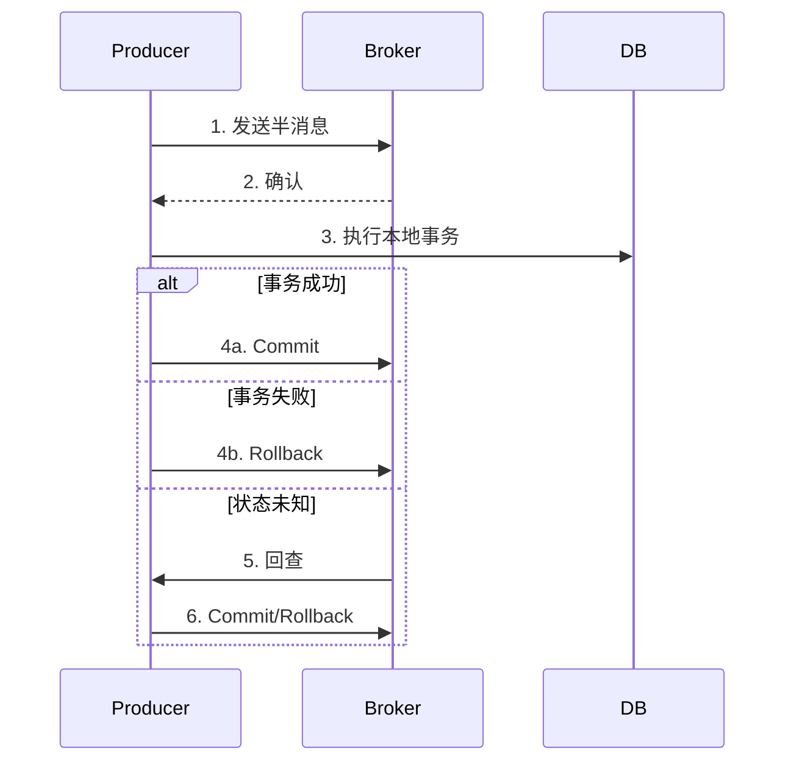

# RocketMQ 面试题集

## 基础概念

### 1. 什么是 RocketMQ？它的核心特性是什么？

**答案：**

RocketMQ 是阿里巴巴开源的分布式消息中间件，后捐赠给 Apache 基金会。

**核心特性：**

- **高性能**：单机支持亿级消息堆积，毫秒级延迟
- **高可用**：支持主从同步、Dledger 模式
- **丰富的消息类型**：普通、顺序、延迟、事务消息
- **消息可靠**：同步/异步刷盘、同步/异步复制
- **消息过滤**：支持 Tag 和 SQL92 过滤
- **消息轨迹**：支持消息追踪和查询

### 2. RocketMQ 的架构组成是什么？

**答案：**

```
┌──────────────┐     ┌──────────────┐
│   Producer   │     │   Consumer   │
└──────┬───────┘     └──────┬───────┘
       │                     │
       ▼                     ▼
┌──────────────────────────────────┐
│           NameServer             │
└──────────────────────────────────┘
                 │
       ┌─────────┴─────────┐
       ▼                   ▼
┌─────────────┐     ┌─────────────┐
│   Broker    │     │   Broker    │
│   Master    │────▶│   Slave     │
└─────────────┘     └─────────────┘
```

- **NameServer**：路由注册中心，无状态，可集群部署
- **Broker**：消息存储和转发，支持主从架构
- **Producer**：消息生产者
- **Consumer**：消息消费者

### 3. RocketMQ 和 Kafka 的区别？

**答案：**

| 维度     | RocketMQ  | Kafka       |
| -------- | --------- | ----------- |
| 开发语言 | Java      | Scala       |
| 事务消息 | 原生支持  | 0.11+       |
| 延迟消息 | 18 个级别 | 不支持      |
| 消息过滤 | Tag/SQL92 | 不支持      |
| 消息查询 | 支持      | 不支持      |
| 消息回溯 | 按时间    | 按 Offset   |
| 适用场景 | 电商/金融 | 大数据/日志 |

## 消息可靠性

### 4. RocketMQ 如何保证消息不丢失？

**答案：**

**1. 发送端：**

```java
// 同步发送 + 检查返回值
SendResult result = producer.send(msg);
if (result.getSendStatus() != SendStatus.SEND_OK) {
    // 重试或记录
}

// 重试机制
producer.setRetryTimesWhenSendFailed(3);
```

**2. 存储端：**

```properties
# 同步刷盘
flushDiskType=SYNC_FLUSH

# 同步复制
brokerRole=SYNC_MASTER
```

**3. 消费端：**

```java
// 消费成功才返回 ACK
return ConsumeConcurrentlyStatus.CONSUME_SUCCESS;

// 失败返回 RECONSUME_LATER 自动重试
return ConsumeConcurrentlyStatus.RECONSUME_LATER;
```

### 5. RocketMQ 如何保证消息不重复消费？

**答案：**

RocketMQ 不保证消息不重复，需要**消费端实现幂等**：

```java
// 方法1：数据库唯一键
INSERT INTO orders (...) VALUES (...)
ON DUPLICATE KEY UPDATE ...

// 方法2：Redis 去重
if (redis.setNx("msg:" + msgId, "1")) {
    // 首次消费，处理业务
} else {
    // 重复消息，跳过
}

// 方法3：业务状态判断
if (order.getStatus() == PAID) {
    // 已处理，跳过
}
```

### 6. RocketMQ 的刷盘机制？

**答案：**

| 刷盘方式 | 配置        | 特点             | 使用场景 |
| -------- | ----------- | ---------------- | -------- |
| 同步刷盘 | SYNC_FLUSH  | 可靠性高，性能低 | 金融场景 |
| 异步刷盘 | ASYNC_FLUSH | 性能高，可能丢失 | 一般场景 |

```properties
# broker.conf
flushDiskType=SYNC_FLUSH
```

## 消息类型

### 7. RocketMQ 支持哪些消息类型？

**答案：**

1. **普通消息**：无特殊处理
2. **顺序消息**：保证消费顺序
3. **延迟消息**：延迟投递（18 个级别）
4. **事务消息**：分布式事务
5. **批量消息**：批量发送

### 8. 顺序消息如何实现？

**答案：**

**发送端**：相同 Key 发送到同一 Queue

```java
producer.send(msg, (mqs, message, arg) -> {
    int index = Math.abs(arg.hashCode() % mqs.size());
    return mqs.get(index);
}, orderId);
```

**消费端**：使用顺序监听器

```java
consumer.registerMessageListener((MessageListenerOrderly) (msgs, ctx) -> {
    return ConsumeOrderlyStatus.SUCCESS;
});
```

### 9. 事务消息的实现原理？

**答案：**



**关键点：**

- 半消息对消费者不可见
- 回查机制保证最终一致性
- 最多回查 15 次

### 10. 延迟消息的实现原理？

**答案：**

1. 消息发送到延迟队列 `SCHEDULE_TOPIC_XXXX`
2. 定时任务扫描到期消息
3. 到期后投递到目标 Topic

**支持的延迟级别：**

```
1s 5s 10s 30s 1m 2m 3m 4m 5m 6m 7m 8m 9m 10m 20m 30m 1h 2h
```

## 消费模式

### 11. Push 和 Pull 消费的区别？

**答案：**

| 特性     | Push 模式  | Pull 模式      |
| -------- | ---------- | -------------- |
| 实现     | 长轮询实现 | 主动拉取       |
| 实时性   | 高         | 取决于拉取频率 |
| 控制力   | 低         | 高             |
| 适用场景 | 一般业务   | 需精细控制     |

**Push 本质是长轮询**：

```java
// Push 模式
consumer.registerMessageListener(...);

// Pull 模式
List<MessageExt> msgs = consumer.poll(3000);
```

### 12. 集群消费和广播消费的区别？

**答案：**

| 特性        | 集群消费                   | 广播消费         |
| ----------- | -------------------------- | ---------------- |
| 消息分发    | 负载均衡，一条消息消费一次 | 每个消费者都收到 |
| Offset 存储 | Broker                     | 消费者本地       |
| 失败重试    | 支持                       | 不支持           |
| 使用场景    | 业务处理                   | 缓存同步         |

```java
// 集群消费（默认）
consumer.setMessageModel(MessageModel.CLUSTERING);

// 广播消费
consumer.setMessageModel(MessageModel.BROADCASTING);
```

### 13. Consumer 的负载均衡是如何实现的？

**答案：**

- 默认使用**平均分配策略**
- 每 20 秒触发一次重新均衡
- Queue 数量应 >= 消费者数量

```
8 个 Queue，3 个 Consumer：
Consumer1: Queue 0,1,2
Consumer2: Queue 3,4,5
Consumer3: Queue 6,7
```

## 存储机制

### 14. RocketMQ 的存储结构是什么？

**答案：**

```
store/
├── commitlog/          # 所有消息顺序存储
│   └── 00000000000000000000
├── consumequeue/       # 消息索引（Queue 维度）
│   └── TopicA/
│       ├── 0/
│       └── 1/
└── index/              # 消息索引（Key 维度）
```

- **CommitLog**：顺序写入，所有 Topic 混存
- **ConsumeQueue**：消息的逻辑队列，存储位置信息
- **IndexFile**：根据 Key 查询消息

### 15. 为什么 RocketMQ 性能高？

**答案：**

1. **顺序写**：CommitLog 顺序写入，避免随机 IO
2. **零拷贝**：使用 mmap + write 减少数据拷贝
3. **PageCache**：利用操作系统页缓存
4. **异步刷盘**：默认异步刷盘提高性能

## 高可用

### 16. RocketMQ 的高可用架构？

**答案：**

**NameServer 高可用：**

- 无状态，多节点部署
- 各节点互不通信

**Broker 高可用：**

- 主从架构：Master 负责读写，Slave 负责备份
- Dledger 模式：基于 Raft 协议的自动选主

```
               ┌─────────────┐
               │ NameServer  │
               │   Cluster   │
               └──────┬──────┘
       ┌──────────────┼──────────────┐
       ▼              ▼              ▼
┌─────────────┐ ┌─────────────┐ ┌─────────────┐
│  Broker-a   │ │  Broker-b   │ │  Broker-c   │
│   Master    │ │   Master    │ │   Master    │
└──────┬──────┘ └──────┬──────┘ └──────┬──────┘
       │               │               │
┌──────▼──────┐ ┌──────▼──────┐ ┌──────▼──────┐
│  Broker-a   │ │  Broker-b   │ │  Broker-c   │
│   Slave     │ │   Slave     │ │   Slave     │
└─────────────┘ └─────────────┘ └─────────────┘
```

### 17. Broker 主从同步机制？

**答案：**

| 同步方式 | 配置         | 特点             |
| -------- | ------------ | ---------------- |
| 同步复制 | SYNC_MASTER  | 可靠性高，性能低 |
| 异步复制 | ASYNC_MASTER | 性能高，可能丢失 |

```properties
# Master 配置
brokerRole=SYNC_MASTER

# Slave 配置
brokerRole=SLAVE
```

## 实战问题

### 18. 消息堆积如何处理？

**答案：**

**临时方案：**

```bash
# 增加 Queue 数量
sh bin/mqadmin updateTopic -n localhost:9876 -t Topic -r 16 -w 16

# 增加消费者实例
```

**长期方案：**

- 优化消费逻辑
- 异步处理耗时操作
- 增加消费线程

```java
consumer.setConsumeThreadMin(20);
consumer.setConsumeThreadMax(64);
```

### 19. 如何保证消息顺序性又要高可用？

**答案：**

- 使用**分区顺序**而非全局顺序
- 同一业务 Key 发送到同一 Queue
- 消费端使用 `MessageListenerOrderly`

### 20. 如何做消息灰度发布？

**答案：**

```java
// 方法1：使用不同 Tag
Message msg = new Message("Topic", "gray", body);

// 方法2：使用消息属性
msg.putUserProperty("env", "gray");

// 消费端 SQL 过滤
consumer.subscribe("Topic", MessageSelector.bySql("env = 'gray'"));
```

## 参考资料

- [RocketMQ 官方文档](https://rocketmq.apache.org/docs/)
- [RocketMQ GitHub](https://github.com/apache/rocketmq)
