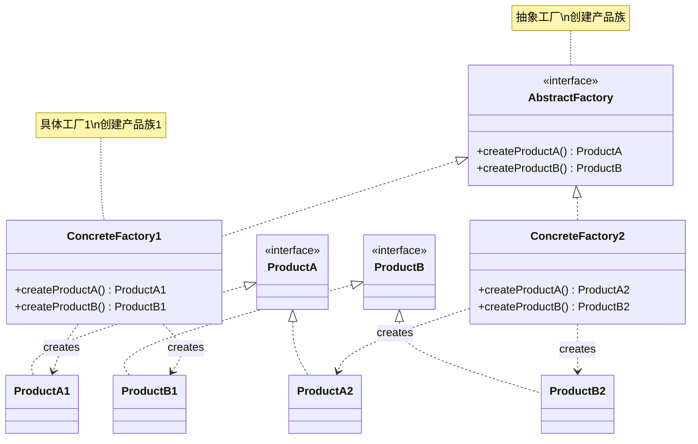
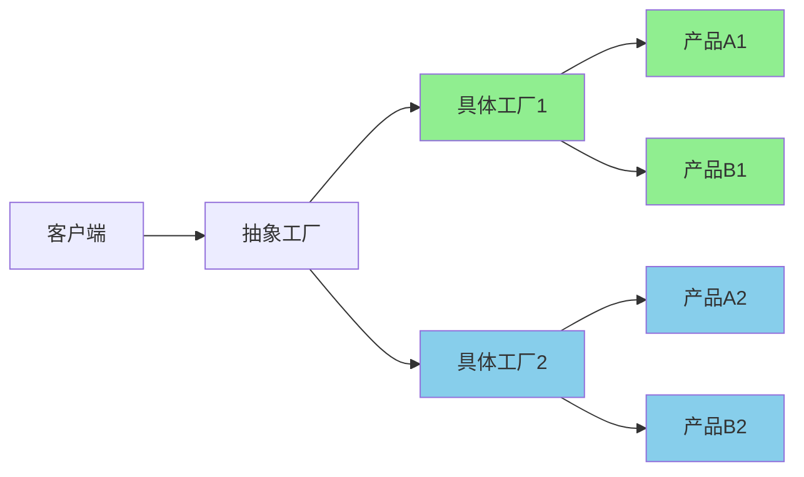
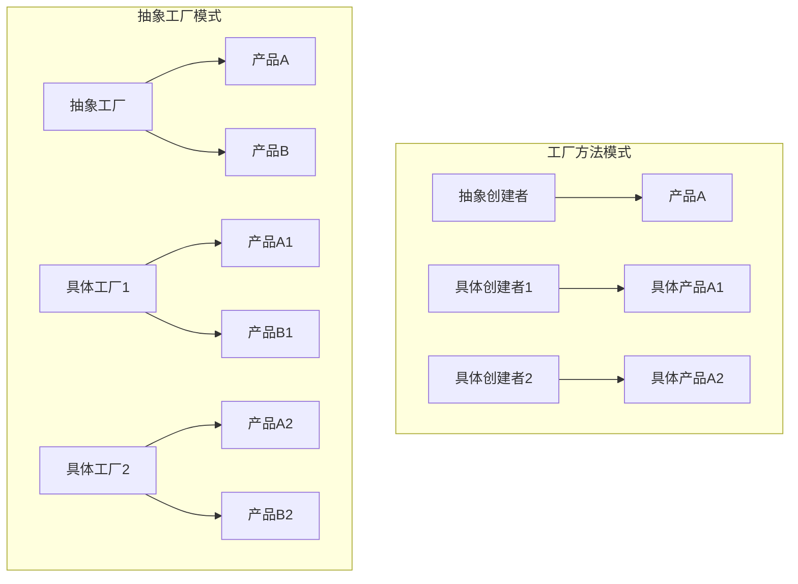

# 抽象工厂模式 (Abstract Factory Pattern)

## 模式定义

**抽象工厂模式**是一种创建型设计模式，它提供了一个接口来创建**相关或相依对象的族**，而不需要明确指定它们的具体类。



## 问题分析

当系统需要独立于具体产品的创建，且系统中有多个产品族时，直接创建会导致：

- ❌ 代码与具体产品类紧耦合
- ❌ 新增产品族时需要修改大量代码
- ❌ 难以切换不同的产品族
- ❌ 无法保证产品族的一致性

> [!NOTE] > **产品族 vs 产品等级**：
>
> - **产品族**：一组相关的产品（如 Windows 风格的按钮、复选框、文本框）
> - **产品等级**：产品的继承结构（如所有按钮为一个等级）
>
> 抽象工厂关注产品族，工厂方法关注产品等级。

## 解决方案

抽象工厂通过定义抽象的产品接口和工厂接口，让具体工厂负责创建相关的产品族：



> [!IMPORTANT] > **关键点**：一个具体工厂创建的所有产品属于同一个产品族，保证了产品之间的兼容性。

## 代码实现

### 1. 定义抽象产品接口

```java
/**
 * 抽象产品A：按钮
 * 产品等级结构
 */
public interface Button {
    /**
     * 渲染按钮
     */
    void render();

    /**
     * 处理点击事件
     */
    void onClick();
}

/**
 * 抽象产品B：复选框
 * 产品等级结构
 */
public interface Checkbox {
    /**
     * 渲染复选框
     */
    void render();

    /**
     * 处理勾选事件
     */
    void onCheck();
}

/**
 * 抽象产品C：文本框
 * 产品等级结构
 */
public interface TextField {
    /**
     * 渲染文本框
     */
    void render();

    /**
     * 获取文本内容
     */
    String getText();
}
```

### 2. 具体产品实现

```java
// ==================== Windows 产品族 ====================

/**
 * Windows 风格按钮（产品族：Windows）
 */
public class WindowsButton implements Button {
    @Override
    public void render() {
        System.out.println("渲染 Windows 风格按钮");
        System.out.println("┌──────────┐");
        System.out.println("│  确定    │");
        System.out.println("└──────────┘");
    }

    @Override
    public void onClick() {
        System.out.println("Windows 按钮点击事件");
    }
}

/**
 * Windows 风格复选框（产品族：Windows）
 */
public class WindowsCheckbox implements Checkbox {
    @Override
    public void render() {
        System.out.println("渲染 Windows 风格复选框");
        System.out.println("☑ 选项");
    }

    @Override
    public void onCheck() {
        System.out.println("Windows 复选框勾选事件");
    }
}

/**
 * Windows 风格文本框（产品族：Windows）
 */
public class WindowsTextField implements TextField {
    private String text = "";

    @Override
    public void render() {
        System.out.println("渲染 Windows 风格文本框");
        System.out.println("┌────────────────┐");
        System.out.println("│                │");
        System.out.println("└────────────────┘");
    }

    @Override
    public String getText() {
        return text;
    }
}

// ==================== Mac 产品族 ====================

/**
 * Mac 风格按钮（产品族：Mac）
 */
public class MacButton implements Button {
    @Override
    public void render() {
        System.out.println("渲染 Mac 风格按钮");
        System.out.println("╭──────────╮");
        System.out.println("│  确定    │");
        System.out.println("╰──────────╯");
    }

    @Override
    public void onClick() {
        System.out.println("Mac 按钮点击事件");
    }
}

/**
 * Mac 风格复选框（产品族：Mac）
 */
public class MacCheckbox implements Checkbox {
    @Override
    public void render() {
        System.out.println("渲染 Mac 风格复选框");
        System.out.println("✓ 选项");
    }

    @Override
    public void onCheck() {
        System.out.println("Mac 复选框勾选事件");
    }
}

/**
 * Mac 风格文本框（产品族：Mac）
 */
public class MacTextField implements TextField {
    private String text = "";

    @Override
    public void render() {
        System.out.println("渲染 Mac 风格文本框");
        System.out.println("╭────────────────╮");
        System.out.println("│                │");
        System.out.println("╰────────────────╯");
    }

    @Override
    public String getText() {
        return text;
    }
}

// ==================== Linux 产品族 ====================

/**
 * Linux 风格按钮（产品族：Linux）
 */
public class LinuxButton implements Button {
    @Override
    public void render() {
        System.out.println("渲染 Linux 风格按钮");
        System.out.println("[  确定  ]");
    }

    @Override
    public void onClick() {
        System.out.println("Linux 按钮点击事件");
    }
}

/**
 * Linux 风格复选框（产品族：Linux）
 */
public class LinuxCheckbox implements Checkbox {
    @Override
    public void render() {
        System.out.println("渲染 Linux 风格复选框");
        System.out.println("[X] 选项");
    }

    @Override
    public void onCheck() {
        System.out.println("Linux 复选框勾选事件");
    }
}

/**
 * Linux 风格文本框（产品族：Linux）
 */
public class LinuxTextField implements TextField {
    private String text = "";

    @Override
    public void render() {
        System.out.println("渲染 Linux 风格文本框");
        System.out.println("[________________]");
    }

    @Override
    public String getText() {
        return text;
    }
}
```

> [!TIP] > **注意产品族的概念**：Windows、Mac、Linux 各自是一个产品族，每个族包含按钮、复选框、文本框等产品。这些产品在视觉风格上保持一致。

### 3. 定义抽象工厂

```java
/**
 * 抽象 UI 工厂
 * 定义创建产品族的接口
 */
public interface UIFactory {
    /**
     * 创建按钮
     * @return 具体的按钮产品
     */
    Button createButton();

    /**
     * 创建复选框
     * @return 具体的复选框产品
     */
    Checkbox createCheckbox();

    /**
     * 创建文本框
     * @return 具体的文本框产品
     */
    TextField createTextField();
}
```

### 4. 具体工厂实现

```java
/**
 * Windows 工厂
 * 创建 Windows 产品族的所有产品
 */
public class WindowsFactory implements UIFactory {
    @Override
    public Button createButton() {
        return new WindowsButton();
    }

    @Override
    public Checkbox createCheckbox() {
        return new WindowsCheckbox();
    }

    @Override
    public TextField createTextField() {
        return new WindowsTextField();
    }
}

/**
 * Mac 工厂
 * 创建 Mac 产品族的所有产品
 */
public class MacFactory implements UIFactory {
    @Override
    public Button createButton() {
        return new MacButton();
    }

    @Override
    public Checkbox createCheckbox() {
        return new MacCheckbox();
    }

    @Override
    public TextField createTextField() {
        return new MacTextField();
    }
}

/**
 * Linux 工厂
 * 创建 Linux 产品族的所有产品
 */
public class LinuxFactory implements UIFactory {
    @Override
    public Button createButton() {
        return new LinuxButton();
    }

    @Override
    public Checkbox createCheckbox() {
        return new LinuxCheckbox();
    }

    @Override
    public TextField createTextField() {
        return new LinuxTextField();
    }
}
```

> [!IMPORTANT] > **保证一致性**：每个具体工厂创建的所有产品都属于同一个产品族，确保 UI 风格的一致性。例如 WindowsFactory 只创建 Windows 风格的组件。

### 5. 客户端使用

```java
/**
 * 应用程序类
 * 客户端代码不依赖具体的产品类
 */
public class Application {
    private UIFactory factory;
    private Button button;
    private Checkbox checkbox;
    private TextField textField;

    /**
     * 构造函数：注入工厂
     * 这是唯一需要知道具体工厂类型的地方
     */
    public Application(UIFactory factory) {
        this.factory = factory;
    }

    /**
     * 创建 UI 组件
     * 使用工厂创建产品，不关心具体类型
     */
    public void createUI() {
        button = factory.createButton();
        checkbox = factory.createCheckbox();
        textField = factory.createTextField();
    }

    /**
     * 渲染界面
     */
    public void render() {
        System.out.println("========== 渲染 UI ==========");
        button.render();
        checkbox.render();
        textField.render();
        System.out.println("============================\n");
    }

    /**
     * 主函数
     */
    public static void main(String[] args) {
        // 根据配置或运行环境选择工厂
        String osType = getOperatingSystem();
        UIFactory factory = getFactory(osType);

        // 创建应用
        Application app = new Application(factory);
        app.createUI();
        app.render();

        // 模拟交互
        app.button.onClick();
        app.checkbox.onCheck();
    }

    /**
     * 获取操作系统类型
     */
    private static String getOperatingSystem() {
        String os = System.getProperty("os.name").toLowerCase();
        if (os.contains("win")) {
            return "Windows";
        } else if (os.contains("mac")) {
            return "Mac";
        } else {
            return "Linux";
        }
    }

    /**
     * 工厂选择器
     * 根据配置创建相应的工厂
     */
    private static UIFactory getFactory(String osType) {
        switch (osType) {
            case "Windows":
                return new WindowsFactory();
            case "Mac":
                return new MacFactory();
            case "Linux":
                return new LinuxFactory();
            default:
                throw new IllegalArgumentException("不支持的操作系统: " + osType);
        }
    }
}
```

**输出示例（Windows 系统）：**

```
========== 渲染 UI ==========
渲染 Windows 风格按钮
┌──────────┐
│  确定    │
└──────────┘
渲染 Windows 风格复选框
☑ 选项
渲染 Windows 风格文本框
┌────────────────┐
│                │
└────────────────┘
============================

Windows 按钮点击事件
Windows 复选框勾选事件
```

## 实际应用示例

### 示例 1：数据库访问层工厂

```java
/**
 * 数据库连接接口
 */
public interface Connection {
    void connect();
    void disconnect();
    String getConnectionInfo();
}

/**
 * SQL 语句接口
 */
public interface Statement {
    void execute(String sql);
    void executeQuery(String sql);
}

/**
 * 事务接口
 */
public interface Transaction {
    void begin();
    void commit();
    void rollback();
}

// ==================== MySQL 产品族 ====================

public class MySQLConnection implements Connection {
    @Override
    public void connect() {
        System.out.println("连接到 MySQL 数据库");
    }

    @Override
    public void disconnect() {
        System.out.println("断开 MySQL 连接");
    }

    @Override
    public String getConnectionInfo() {
        return "MySQL Connection: jdbc:mysql://localhost:3306/mydb";
    }
}

public class MySQLStatement implements Statement {
    @Override
    public void execute(String sql) {
        System.out.println("[MySQL] 执行: " + sql);
    }

    @Override
    public void executeQuery(String sql) {
        System.out.println("[MySQL] 查询: " + sql);
    }
}

public class MySQLTransaction implements Transaction {
    @Override
    public void begin() {
        System.out.println("[MySQL] 开始事务");
    }

    @Override
    public void commit() {
        System.out.println("[MySQL] 提交事务");
    }

    @Override
    public void rollback() {
        System.out.println("[MySQL] 回滚事务");
    }
}

// ==================== PostgreSQL 产品族 ====================

public class PostgreSQLConnection implements Connection {
    @Override
    public void connect() {
        System.out.println("连接到 PostgreSQL 数据库");
    }

    @Override
    public void disconnect() {
        System.out.println("断开 PostgreSQL 连接");
    }

    @Override
    public String getConnectionInfo() {
        return "PostgreSQL Connection: jdbc:postgresql://localhost:5432/mydb";
    }
}

public class PostgreSQLStatement implements Statement {
    @Override
    public void execute(String sql) {
        System.out.println("[PostgreSQL] 执行: " + sql);
    }

    @Override
    public void executeQuery(String sql) {
        System.out.println("[PostgreSQL] 查询: " + sql);
    }
}

public class PostgreSQLTransaction implements Transaction {
    @Override
    public void begin() {
        System.out.println("[PostgreSQL] BEGIN");
    }

    @Override
    public void commit() {
        System.out.println("[PostgreSQL] COMMIT");
    }

    @Override
    public void rollback() {
        System.out.println("[PostgreSQL] ROLLBACK");
    }
}

// ==================== Oracle 产品族 ====================

public class OracleConnection implements Connection {
    @Override
    public void connect() {
        System.out.println("连接到 Oracle 数据库");
    }

    @Override
    public void disconnect() {
        System.out.println("断开 Oracle 连接");
    }

    @Override
    public String getConnectionInfo() {
        return "Oracle Connection: jdbc:oracle:thin:@localhost:1521:orcl";
    }
}

public class OracleStatement implements Statement {
    @Override
    public void execute(String sql) {
        System.out.println("[Oracle] 执行: " + sql);
    }

    @Override
    public void executeQuery(String sql) {
        System.out.println("[Oracle] 查询: " + sql);
    }
}

public class OracleTransaction implements Transaction {
    @Override
    public void begin() {
        System.out.println("[Oracle] SET TRANSACTION");
    }

    @Override
    public void commit() {
        System.out.println("[Oracle] COMMIT");
    }

    @Override
    public void rollback() {
        System.out.println("[Oracle] ROLLBACK");
    }
}

/**
 * 抽象数据库工厂
 */
public interface DatabaseFactory {
    Connection createConnection();
    Statement createStatement();
    Transaction createTransaction();
}

/**
 * MySQL 工厂
 */
public class MySQLFactory implements DatabaseFactory {
    @Override
    public Connection createConnection() {
        return new MySQLConnection();
    }

    @Override
    public Statement createStatement() {
        return new MySQLStatement();
    }

    @Override
    public Transaction createTransaction() {
        return new MySQLTransaction();
    }
}

/**
 * PostgreSQL 工厂
 */
public class PostgreSQLFactory implements DatabaseFactory {
    @Override
    public Connection createConnection() {
        return new PostgreSQLConnection();
    }

    @Override
    public Statement createStatement() {
        return new PostgreSQLStatement();
    }

    @Override
    public Transaction createTransaction() {
        return new PostgreSQLTransaction();
    }
}

/**
 * Oracle 工厂
 */
public class OracleFactory implements DatabaseFactory {
    @Override
    public Connection createConnection() {
        return new OracleConnection();
    }

    @Override
    public Statement createStatement() {
        return new OracleStatement();
    }

    @Override
    public Transaction createTransaction() {
        return new OracleTransaction();
    }
}

/**
 * 数据访问层
 * 使用抽象工厂，不依赖具体数据库
 */
public class UserDAO {
    private DatabaseFactory factory;

    public UserDAO(DatabaseFactory factory) {
        this.factory = factory;
    }

    public void saveUser(String name) {
        Connection conn = factory.createConnection();
        Statement stmt = factory.createStatement();
        Transaction trans = factory.createTransaction();

        try {
            conn.connect();
            trans.begin();
            stmt.execute("INSERT INTO users (name) VALUES ('" + name + "')");
            trans.commit();
            System.out.println("用户保存成功: " + name);
        } catch (Exception e) {
            trans.rollback();
            System.out.println("保存失败，事务回滚");
        } finally {
            conn.disconnect();
        }
    }
}

// 使用示例
class DatabaseDemo {
    public static void main(String[] args) {
        // 从配置文件读取数据库类型
        String dbType = "MySQL"; // 实际应从配置文件读取

        DatabaseFactory factory = getDatabaseFactory(dbType);
        UserDAO userDAO = new UserDAO(factory);

        userDAO.saveUser("张三");

        // 切换到 PostgreSQL
        System.out.println("\n========== 切换到 PostgreSQL ==========\n");
        factory = new PostgreSQLFactory();
        userDAO = new UserDAO(factory);
        userDAO.saveUser("李四");
    }

    private static DatabaseFactory getDatabaseFactory(String dbType) {
        switch (dbType) {
            case "MySQL":
                return new MySQLFactory();
            case "PostgreSQL":
                return new PostgreSQLFactory();
            case "Oracle":
                return new OracleFactory();
            default:
                throw new IllegalArgumentException("不支持的数据库类型: " + dbType);
        }
    }
}
```

### 示例 2：文档处理工厂

```java
/**
 * 文档接口
 */
public interface Document {
    void create();
    void save(String filename);
    void open(String filename);
}

/**
 * 导出器接口
 */
public interface Exporter {
    void export(Document doc, String format);
}

/**
 * 格式化器接口
 */
public interface Formatter {
    void format(String content);
}

// ==================== PDF 产品族 ====================

public class PDFDocument implements Document {
    @Override
    public void create() {
        System.out.println("创建 PDF 文档");
    }

    @Override
    public void save(String filename) {
        System.out.println("保存 PDF: " + filename);
    }

    @Override
    public void open(String filename) {
        System.out.println("打开 PDF: " + filename);
    }
}

public class PDFExporter implements Exporter {
    @Override
    public void export(Document doc, String format) {
        System.out.println("导出为 PDF 格式");
    }
}

public class PDFFormatter implements Formatter {
    @Override
    public void format(String content) {
        System.out.println("使用 PDF 格式化器");
    }
}

// ==================== Word 产品族 ====================

public class WordDocument implements Document {
    @Override
    public void create() {
        System.out.println("创建 Word 文档");
    }

    @Override
    public void save(String filename) {
        System.out.println("保存 Word: " + filename);
    }

    @Override
    public void open(String filename) {
        System.out.println("打开 Word: " + filename);
    }
}

public class WordExporter implements Exporter {
    @Override
    public void export(Document doc, String format) {
        System.out.println("导出为 Word 格式");
    }
}

public class WordFormatter implements Formatter {
    @Override
    public void format(String content) {
        System.out.println("使用 Word 格式化器");
    }
}

/**
 * 抽象文档工厂
 */
public interface DocumentFactory {
    Document createDocument();
    Exporter createExporter();
    Formatter createFormatter();
}

/**
 * PDF 工厂
 */
public class PDFFactory implements DocumentFactory {
    @Override
    public Document createDocument() {
        return new PDFDocument();
    }

    @Override
    public Exporter createExporter() {
        return new PDFExporter();
    }

    @Override
    public Formatter createFormatter() {
        return new PDFFormatter();
    }
}

/**
 * Word 工厂
 */
public class WordFactory implements DocumentFactory {
    @Override
    public Document createDocument() {
        return new WordDocument();
    }

    @Override
    public Exporter createExporter() {
        return new WordExporter();
    }

    @Override
    public Formatter createFormatter() {
        return new WordFormatter();
    }
}
```

## 抽象工厂 vs 工厂方法



| 特性             | 抽象工厂               | 工厂方法           |
| ---------------- | ---------------------- | ------------------ |
| **创建对象**     | 产品族（多个相关产品） | 单一产品           |
| **工厂方法数量** | 多个                   | 一个               |
| **产品关系**     | 强调产品之间的关联     | 产品独立           |
| **扩展性**       | 添加新产品族容易       | 添加新产品容易     |
| **复杂度**       | ⭐⭐⭐⭐ 高            | ⭐⭐ 中等          |
| **适用场景**     | UI 主题、数据库驱动    | 日志记录器、解析器 |

> [!WARNING] > **添加新产品类型的问题**：如果需要在产品族中添加新的产品类型（如添加 ScrollBar），需要修改抽象工厂接口和所有具体工厂，违反开闭原则。这是抽象工厂模式的主要缺点。

### 何时选择

- **使用工厂方法**：只需要创建一种类型的产品，产品之间没有关联
- **使用抽象工厂**：需要创建多个相关的产品，保证产品族的一致性

## Java 标准库中的应用

### 1. AWT Toolkit

```java
/**
 * Java AWT 使用抽象工厂模式
 * Toolkit 是抽象工厂，不同平台有不同的实现
 */
import java.awt.*;

public class AWTExample {
    public static void main(String[] args) {
        // 获取当前平台的工厂
        Toolkit toolkit = Toolkit.getDefaultToolkit();

        // 使用工厂创建平台相关的组件
        // Windows 上返回 WToolkit
        // Mac 上返回 CToolkit
        // Linux 上返回 XToolkit

        Dimension screenSize = toolkit.getScreenSize();
        System.out.println("屏幕尺寸: " + screenSize);
    }
}
```

### 2. JDBC DriverManager

```java
import java.sql.*;

/**
 * JDBC 也采用了抽象工厂的思想
 */
public class JDBCExample {
    public static void main(String[] args) throws SQLException {
        // 不同的驱动是不同的工厂
        // com.mysql.jdbc.Driver - MySQL 工厂
        // org.postgresql.Driver - PostgreSQL 工厂

        Connection conn = DriverManager.getConnection(
            "jdbc:mysql://localhost:3306/mydb",
            "user",
            "password"
        );

        // 创建产品族
        Statement stmt = conn.createStatement();
        PreparedStatement pstmt = conn.prepareStatement("SELECT * FROM users");
        CallableStatement cstmt = conn.prepareCall("{call myProcedure()}");
    }
}
```

### 3. Swing LookAndFeel

```java
import javax.swing.*;

/**
 * Swing 的 LookAndFeel 是抽象工厂模式的应用
 */
public class SwingExample {
    public static void main(String[] args) throws Exception {
        // 设置不同的 LookAndFeel（产品族）
        // Metal LookAndFeel
        UIManager.setLookAndFeel(new javax.swing.plaf.metal.MetalLookAndFeel());

        // Windows LookAndFeel
        // UIManager.setLookAndFeel("com.sun.java.swing.plaf.windows.WindowsLookAndFeel");

        // Nimbus LookAndFeel
        // UIManager.setLookAndFeel("javax.swing.plaf.nimbus.NimbusLookAndFeel");

        // 创建 UI 组件，自动使用当前 LookAndFeel 的样式
        JFrame frame = new JFrame("抽象工厂示例");
        JButton button = new JButton("按钮");
        JCheckBox checkbox = new JCheckBox("复选框");

        frame.add(button);
        frame.setSize(300, 200);
        frame.setVisible(true);
    }
}
```

## Spring 框架中的应用

```java
import org.springframework.beans.factory.FactoryBean;
import org.springframework.context.annotation.Bean;
import org.springframework.context.annotation.Configuration;

/**
 * Spring 的 FactoryBean 可以用来实现抽象工厂
 */
@Configuration
public class DatabaseConfig {

    /**
     * 根据配置创建不同的数据库工厂
     */
    @Bean
    public DatabaseFactory databaseFactory() {
        String dbType = getDatabaseType();
        switch (dbType) {
            case "mysql":
                return new MySQLFactory();
            case "postgresql":
                return new PostgreSQLFactory();
            default:
                throw new IllegalArgumentException("不支持的数据库: " + dbType);
        }
    }

    /**
     * 使用工厂创建 Connection Bean
     */
    @Bean
    public Connection connection(DatabaseFactory factory) {
        return factory.createConnection();
    }

    private String getDatabaseType() {
        // 从配置文件读取
        return "mysql";
    }
}
```

## 优缺点

### 优点

- ✅ **保证产品族一致性** - 确保同一族的产品被一起使用
- ✅ **易于切换产品族** - 只需切换工厂即可切换整个产品族
- ✅ **符合开闭原则** - 添加新产品族无需修改现有代码
- ✅ **符合单一职责原则** - 每个工厂只负责创建一个产品族
- ✅ **解耦客户端和具体产品** - 客户端通过接口使用产品

### 缺点

- ❌ **代码复杂度高** - 需要大量的接口和类
- ❌ **类的数量成倍增加** - 每个产品族需要一组类
- ❌ **难以扩展新产品** - 添加新产品类型需要修改所有工厂
- ❌ **理解和维护成本高** - 结构复杂，不易理解

> [!CAUTION] > **扩展新产品的难题**：如果要在所有产品族中添加一个新产品（如 ScrollBar），需要：
>
> 1. 修改抽象工厂接口，添加 createScrollBar()
> 2. 修改所有具体工厂，实现该方法
> 3. 创建所有产品族的 ScrollBar 实现
>
> 这违反了开闭原则，是抽象工厂的固有缺陷。

## 适用场景

### 何时使用抽象工厂

- ✓ **多个产品族** - 系统中有多组相关的产品
- ✓ **需要一致性** - 产品之间必须配套使用
- ✓ **需要切换** - 需要在不同产品族之间切换
- ✓ **隔离具体类** - 客户端不应依赖具体实现

### 实际应用场景

- 🎨 **UI 主题系统** - 不同风格的 UI 组件（Windows、Mac、Material Design）
- 💾 **数据库访问层** - 支持多种数据库（MySQL、PostgreSQL、Oracle）
- 📄 **文档处理** - 不同格式的文档系统（PDF、Word、Excel）
- 🎮 **游戏开发** - 不同难度级别的游戏元素
- 🌐 **跨平台开发** - 不同操作系统的组件

## 最佳实践

### 1. 使用配置文件

```java
/**
 * 从配置文件读取工厂类型
 */
public class FactoryConfig {
    private static Properties props = new Properties();

    static {
        try {
            props.load(new FileInputStream("factory.properties"));
        } catch (IOException e) {
            e.printStackTrace();
        }
    }

    public static UIFactory getUIFactory() {
        String factoryClass = props.getProperty("ui.factory");
        try {
            return (UIFactory) Class.forName(factoryClass).newInstance();
        } catch (Exception e) {
            return new WindowsFactory(); // 默认工厂
        }
    }
}

// factory.properties
// ui.factory=com.example.WindowsFactory
```

### 2. 使用依赖注入

```java
/**
 * Spring 依赖注入
 */
@Configuration
public class AppConfig {

    @Bean
    @ConditionalOnProperty(name = "ui.theme", havingValue = "windows")
    public UIFactory windowsFactory() {
        return new WindowsFactory();
    }

    @Bean
    @ConditionalOnProperty(name = "ui.theme", havingValue = "mac")
    public UIFactory macFactory() {
        return new MacFactory();
    }
}

@Service
public class UIService {
    private final UIFactory factory;

    // 通过构造器注入
    public UIService(UIFactory factory) {
        this.factory = factory;
    }
}
```

### 3. 提供默认实现

```java
/**
 * 抽象工厂提供默认实现
 */
public abstract class AbstractUIFactory implements UIFactory {

    // 提供默认实现
    @Override
    public Button createButton() {
        return new DefaultButton();
    }

    // 子类只需覆盖需要定制的方法
    @Override
    public abstract Checkbox createCheckbox();
}
```

### 4. 结合工厂方法

```java
/**
 * 在抽象工厂中使用工厂方法
 */
public abstract class AbstractDatabaseFactory implements DatabaseFactory {

    @Override
    public Connection createConnection() {
        Connection conn = doCreateConnection();
        // 可以在这里添加通用逻辑
        initializeConnection(conn);
        return conn;
    }

    // 工厂方法，由子类实现
    protected abstract Connection doCreateConnection();

    // 通用逻辑
    protected void initializeConnection(Connection conn) {
        // 设置连接参数
    }
}
```

## 与其他模式的关系

- **抽象工厂 + 单例** - 工厂通常实现为单例
- **抽象工厂 + 工厂方法** - 内部使用工厂方法创建产品
- **抽象工厂 + 原型** - 工厂可以通过克隆创建产品
- **抽象工厂 + 建造者** - 都用于创建复杂对象

## 总结

抽象工厂模式是最复杂的创建型模式之一：

- **核心思想** - 创建相关产品族，保证产品一致性
- **关键优势** - 易于切换产品族，保证产品兼容
- **主要缺点** - 难以扩展新产品类型
- **适用场景** - UI 主题、数据库驱动、跨平台开发
- **实际应用** - AWT、JDBC、Swing LookAndFeel

> [!TIP]
> 在现代开发中，可以结合依赖注入（Spring）和配置文件来简化抽象工厂的实现和使用，避免硬编码工厂选择逻辑。

**下一步优化：** `builder-pattern.md`（建造者模式）
