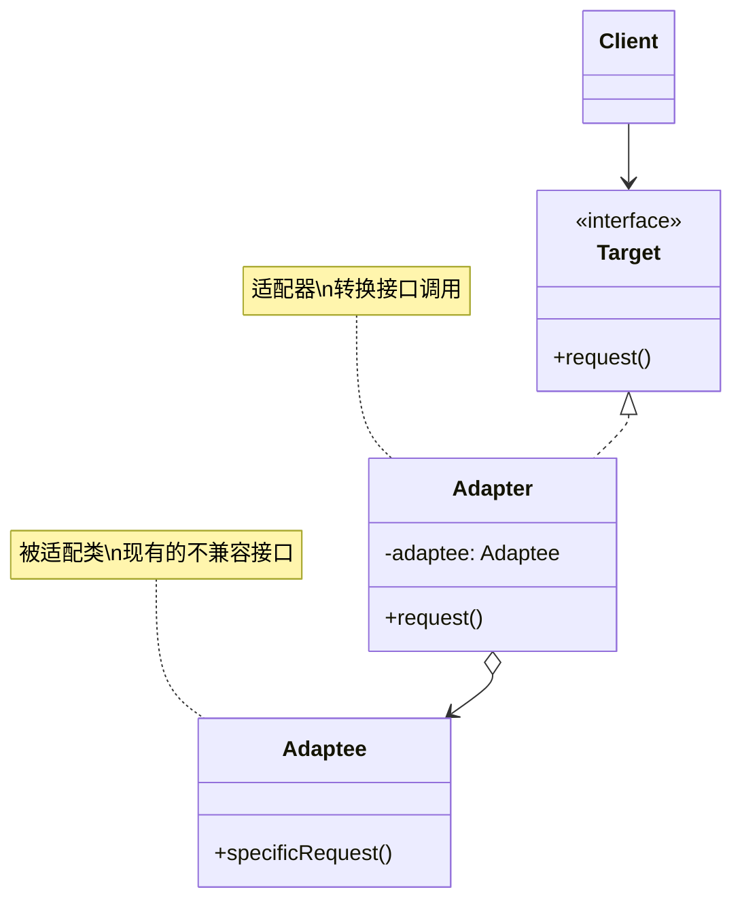
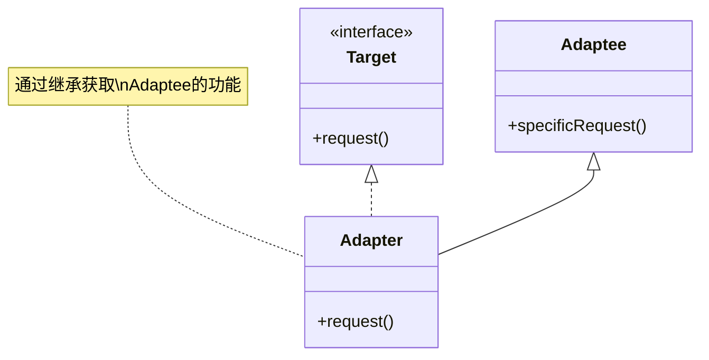
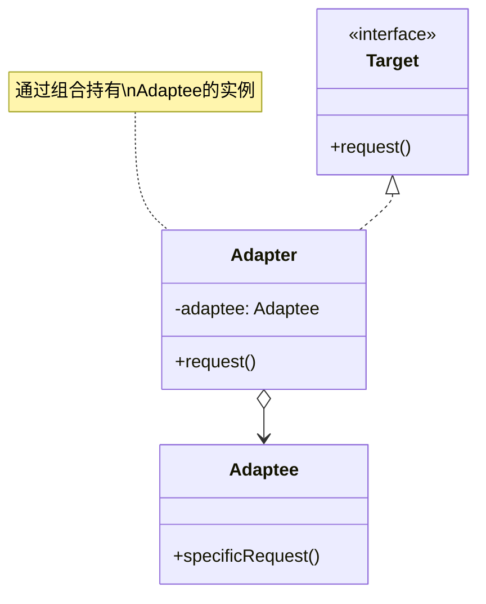
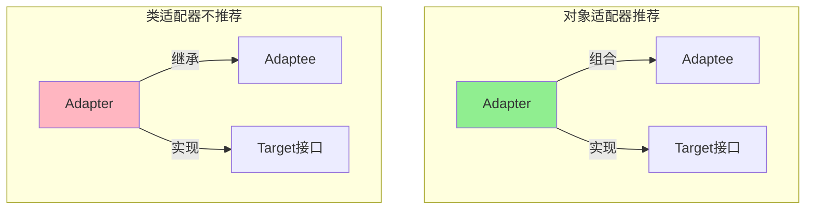

# 适配器模式 (Adapter Pattern)

## 模式定义

**适配器模式**是一种结构型设计模式，它允许将一个类的接口转换成客户端所期望的另一个接口，使得原本由于接口不兼容而不能一起工作的类可以协同工作。



## 问题分析

在实际开发中，经常遇到接口不兼容的问题：

- ❌ 新系统需要集成第三方库，但接口不匹配
- ❌ 现有类的接口不符合新的需求
- ❌ 需要兼容多个版本的 API
- ❌ 遗留系统与新系统接口不一致

**现实类比：**

> 就像你的手机充电器（美标两孔）到了欧洲（欧标圆孔）无法使用，需要一个**转换插头（适配器）**才能正常充电。

```java
// 问题示例：接口不兼容
public class OldSystem {
    public void oldMethod(String data) {
        // 旧系统的方法
    }
}

// 新系统期望的接口
public interface NewInterface {
    void newMethod(Data data);  // 参数类型不同！
}

// 无法直接使用 OldSystem，需要适配器
```

> [!NOTE] > **适配器模式的别名**：
>
> - Wrapper（包装器）
> - Translator（转换器）

## 适配器模式的两种实现

### 1. 类适配器（Class Adapter）- 继承方式



**特点**：使用继承（extends）

### 2. 对象适配器（Object Adapter）- 组合方式



**特点**：使用组合（has-a）

> [!IMPORTANT] > **推荐使用对象适配器**：
>
> - Java 只支持单继承，类适配器限制大
> - 组合优于继承（《Effective Java》原则）
> - 对象适配器更灵活，可以适配多个 Adaptee

## 代码实现

### 场景：支付系统集成

假设我们的系统有一个标准的支付接口，但需要集成多个第三方支付平台，它们的接口各不相同。

#### 1. 定义系统的目标接口

```java
/**
 * 系统的标准支付接口（Target）
 * 所有支付方式都应该实现此接口
 */
public interface PaymentGateway {
    /**
     * 处理支付
     * @param amount 支付金额
     * @return 是否成功
     */
    boolean processPayment(double amount);

    /**
     * 获取交易ID
     * @return 交易ID
     */
    String getTransactionId();

    /**
     * 退款
     * @param transactionId 交易ID
     * @param amount 退款金额
     * @return 是否成功
     */
    boolean refund(String transactionId, double amount);
}
```

#### 2. 第三方支付库（Adaptee - 不能修改）

```java
/**
 * 支付宝支付服务（第三方库，不能修改）
 * 接口与我们的系统不兼容
 */
public class AlipayService {
    /**
     * 支付宝的支付方法
     * 参数和返回值与我们的接口不同
     */
    public String pay(double money, String currency, String orderId) {
        System.out.println("支付宝支付: " + money + " " + currency);
        System.out.println("订单号: " + orderId);
        // 返回支付宝的交易号
        return "ALIPAY_" + System.currentTimeMillis();
    }

    /**
     * 支付宝的退款方法
     */
    public boolean doRefund(String tradeNo, double refundAmount) {
        System.out.println("支付宝退款: " + refundAmount + ", 交易号: " + tradeNo);
        return true;
    }
}

/**
 * 微信支付服务（第三方库，不能修改）
 */
public class WeChatPayService {
    /**
     * 微信的支付方法
     */
    public int wxPay(int amountInCents) {
        System.out.println("微信支付: " + (amountInCents / 100.0) + " 元");
        // 返回微信的交易码
        return (int) (Math.random() * 1000000);
    }

    /**
     * 微信的退款方法
     */
    public boolean wxRefund(int transactionCode, int refundInCents) {
        System.out.println("微信退款: " + (refundInCents / 100.0) + " 元");
        return true;
    }
}
```

> [!WARNING] > **第三方库不能修改**：这些是来自外部的代码，我们无权修改，只能通过适配器来适配它们的接口。

#### 3. 对象适配器实现

```java
/**
 * 支付宝支付适配器（推荐方式：对象适配器）
 * 将支付宝的接口适配成系统标准接口
 */
public class AlipayAdapter implements PaymentGateway {
    // 持有被适配对象的引用（组合）
    private final AlipayService alipayService;
    private String lastTransactionId;

    /**
     * 构造函数：注入被适配对象
     */
    public AlipayAdapter(AlipayService alipayService) {
        this.alipayService = alipayService;
    }

    /**
     * 适配 processPayment 方法
     * 将系统的接口转换为支付宝的接口调用
     */
    @Override
    public boolean processPayment(double amount) {
        try {
            // 生成订单号
            String orderId = "ORDER_" + System.currentTimeMillis();

            // 调用支付宝的 pay 方法（参数不同）
            lastTransactionId = alipayService.pay(amount, "CNY", orderId);

            System.out.println("支付宝交易成功，交易号: " + lastTransactionId);
            return true;
        } catch (Exception e) {
            System.out.println("支付宝支付失败: " + e.getMessage());
            return false;
        }
    }

    /**
     * 适配 getTransactionId 方法
     */
    @Override
    public String getTransactionId() {
        return lastTransactionId;
    }

    /**
     * 适配 refund 方法
     */
    @Override
    public boolean refund(String transactionId, double amount) {
        return alipayService.doRefund(transactionId, amount);
    }
}

/**
 * 微信支付适配器
 */
public class WeChatPayAdapter implements PaymentGateway {
    private final WeChatPayService weChatPayService;
    private int lastTransactionCode;

    public WeChatPayAdapter(WeChatPayService weChatPayService) {
        this.weChatPayService = weChatPayService;
    }

    /**
     * 适配微信支付
     * 注意：微信使用分为单位，需要转换
     */
    @Override
    public boolean processPayment(double amount) {
        try {
            // 元转换为分
            int amountInCents = (int) (amount * 100);

            // 调用微信支付接口
            lastTransactionCode = weChatPayService.wxPay(amountInCents);

            System.out.println("微信支付成功，交易码: " + lastTransactionCode);
            return true;
        } catch (Exception e) {
            System.out.println("微信支付失败: " + e.getMessage());
            return false;
        }
    }

    @Override
    public String getTransactionId() {
        return "WX_" + lastTransactionCode;
    }

    @Override
    public boolean refund(String transactionId, double amount) {
        // 提取交易码
        int code = Integer.parseInt(transactionId.replace("WX_", ""));
        int refundInCents = (int) (amount * 100);

        return weChatPayService.wxRefund(code, refundInCents);
    }
}
```

> [!TIP] > **适配器的职责**：
>
> 1. 转换方法调用（`pay()` → `processPayment()`）
> 2. 转换参数类型和格式（元 → 分）
> 3. 转换返回值格式（支付宝交易号 → 标准交易 ID）

#### 4. 客户端使用

```java
/**
 * 支付处理器（客户端）
 * 只依赖 PaymentGateway 接口，不知道具体实现
 */
public class PaymentProcessor {
    private PaymentGateway paymentGateway;

    public PaymentProcessor(PaymentGateway paymentGateway) {
        this.paymentGateway = paymentGateway;
    }

    /**
     * 结账
     */
    public void checkout(double amount) {
        System.out.println("========== 开始支付 ==========");

        if (paymentGateway.processPayment(amount)) {
            String txnId = paymentGateway.getTransactionId();
            System.out.println("✅ 支付成功！");
            System.out.println("交易ID: " + txnId);
            System.out.println("金额: ¥" + amount);
        } else {
            System.out.println("❌ 支付失败！");
        }

        System.out.println("============================\n");
    }

    /**
     * 退款
     */
    public void doRefund(String transactionId, double amount) {
        System.out.println("========== 开始退款 ==========");

        if (paymentGateway.refund(transactionId, amount)) {
            System.out.println("✅ 退款成功！金额: ¥" + amount);
        } else {
            System.out.println("❌ 退款失败！");
        }

        System.out.println("============================\n");
    }
}

/**
 * 演示
 */
public class Demo {
    public static void main(String[] args) {
        // 使用支付宝支付
        AlipayService alipayService = new AlipayService();
        PaymentGateway alipayGateway = new AlipayAdapter(alipayService);

        PaymentProcessor processor1 = new PaymentProcessor(alipayGateway);
        processor1.checkout(100.50);
        processor1.doRefund(alipayGateway.getTransactionId(), 50.00);

        // 切换到微信支付（无需修改 PaymentProcessor）
        WeChatPayService weChatService = new WeChatPayService();
        PaymentGateway weChatGateway = new WeChatPayAdapter(weChatService);

        PaymentProcessor processor2 = new PaymentProcessor(weChatGateway);
        processor2.checkout(200.00);
    }
}
```

**输出：**

```
========== 开始支付 ==========
支付宝支付: 100.5 CNY
订单号: ORDER_1702345678901
支付宝交易成功，交易号: ALIPAY_1702345678901
✅ 支付成功！
交易ID: ALIPAY_1702345678901
金额: ¥100.5
============================

========== 开始退款 ==========
支付宝退款: 50.0, 交易号: ALIPAY_1702345678901
✅ 退款成功！金额: ¥50.0
============================

========== 开始支付 ==========
微信支付: 200.0 元
微信支付成功，交易码: 123456
✅ 支付成功！
交易ID: WX_123456
金额: ¥200.0
============================
```

## 类适配器 vs 对象适配器

### 类适配器实现（不推荐）

```java
/**
 * 类适配器（使用继承）
 * ❌ 不推荐：Java 单继承限制
 */
public class AlipayClassAdapter extends AlipayService implements PaymentGateway {
    private String lastTransactionId;

    @Override
    public boolean processPayment(double amount) {
        try {
            String orderId = "ORDER_" + System.currentTimeMillis();
            // 直接调用父类方法
            lastTransactionId = pay(amount, "CNY", orderId);
            return true;
        } catch (Exception e) {
            return false;
        }
    }

    @Override
    public String getTransactionId() {
        return lastTransactionId;
    }

    @Override
    public boolean refund(String transactionId, double amount) {
        return doRefund(transactionId, amount);
    }
}
```

### 全面对比



| 特性             | 类适配器        | 对象适配器    |
| ---------------- | --------------- | ------------- |
| **实现方式**     | 继承（extends） | 组合（has-a） |
| **Java 支持**    | ❌ 单继承限制   | ✅ 无限制     |
| **灵活性**       | ⭐⭐ 低         | ⭐⭐⭐⭐⭐ 高 |
| **代码量**       | ⭐⭐⭐ 少       | ⭐⭐ 多一些   |
| **可适配多个类** | ❌ 不行         | ✅ 可以       |
| **运行时替换**   | ❌ 不行         | ✅ 可以       |
| **推荐度**       | ❌ 不推荐       | ✅ 强烈推荐   |

> [!IMPORTANT] > **为什么推荐对象适配器**：
>
> 1. Java 只支持单继承，如果 Adaptee 已经继承了其他类，就无法使用类适配器
> 2. 对象适配器可以适配一个类及其所有子类
> 3. 符合"组合优于继承"的设计原则

## 实际应用示例

### 示例 1：日志系统适配

```java
/**
 * 系统的日志接口（Target）
 */
public interface Logger {
    void debug(String message);
    void info(String message);
    void warn(String message);
    void error(String message);
}

/**
 * 第三方日志库：Log4j（Adaptee）
 */
public class Log4j {
    public void logDebug(String msg) {
        System.out.println("[DEBUG] " + msg);
    }

    public void logInfo(String msg) {
        System.out.println("[INFO] " + msg);
    }

    public void logWarning(String msg) {
        System.out.println("[WARN] " + msg);
    }

    public void logError(String msg) {
        System.out.println("[ERROR] " + msg);
    }
}

/**
 * Log4j 适配器
 */
public class Log4jAdapter implements Logger {
    private final Log4j log4j;

    public Log4jAdapter(Log4j log4j) {
        this.log4j = log4j;
    }

    @Override
    public void debug(String message) {
        log4j.logDebug(message);
    }

    @Override
    public void info(String message) {
        log4j.logInfo(message);
    }

    @Override
    public void warn(String message) {
        log4j.logWarning(message);
    }

    @Override
    public void error(String message) {
        log4j.logError(message);
    }
}

// 使用
Logger logger = new Log4jAdapter(new Log4j());
logger.info("应用启动");
logger.error("发生错误");
```

### 示例 2：数据格式适配器

```java
/**
 * 系统接口：JSON 数据处理
 */
public interface JsonDataProcessor {
    String toJson();
    void fromJson(String json);
}

/**
 * 现有类：XML 数据处理（Adaptee）
 */
public class XmlDataHandler {
    private String xmlData;

    public void setXml(String xml) {
        this.xmlData = xml;
    }

    public String getXml() {
        return xmlData;
    }
}

/**
 * XML 到 JSON 适配器
 */
public class XmlToJsonAdapter implements JsonDataProcessor {
    private final XmlDataHandler xmlHandler;

    public XmlToJsonAdapter(XmlDataHandler xmlHandler) {
        this.xmlHandler = xmlHandler;
    }

    @Override
    public String toJson() {
        String xml = xmlHandler.getXml();
        // 简化示例：实际应使用 XML 解析库
        return convertXmlToJson(xml);
    }

    @Override
    public void fromJson(String json) {
        String xml = convertJsonToXml(json);
        xmlHandler.setXml(xml);
    }

    /**
     * XML 转 JSON（简化示例）
     */
    private String convertXmlToJson(String xml) {
        // 实际应使用 Jackson 或 Gson
        if (xml.contains("<user>")) {
            return "{\"user\": {...}}";
        }
        return "{}";
    }

    /**
     * JSON 转 XML（简化示例）
     */
    private String convertJsonToXml(String json) {
        // 实际应使用 Jackson XML 或类似库
        if (json.contains("\"user\"")) {
            return "<user>...</user>";
        }
        return "<root></root>";
    }
}
```

### 示例 3：数据库驱动适配器

```java
/**
 * 系统的数据库接口（Target）
 */
public interface Database {
    void connect(String url);
    void execute(String sql);
    void disconnect();
}

/**
 * MySQL 驱动（Adaptee）
 */
public class MySQLDriver {
    public void mysqlConnect(String host, int port, String db) {
        System.out.println("连接 MySQL: " + host + ":" + port + "/" + db);
    }

    public void runQuery(String query) {
        System.out.println("执行 MySQL 查询: " + query);
    }

    public void close() {
        System.out.println("关闭 MySQL 连接");
    }
}

/**
 * PostgreSQL 驱动（Adaptee）
 */
public class PostgreSQLDriver {
    public boolean pgConnect(String connectionString) {
        System.out.println("连接 PostgreSQL: " + connectionString);
        return true;
    }

    public void execSQL(String sql) {
        System.out.println("执行 PostgreSQL SQL: " + sql);
    }

    public void terminate() {
        System.out.println("断开 PostgreSQL");
    }
}

/**
 * MySQL 适配器
 */
public class MySQLAdapter implements Database {
    private final MySQLDriver driver;

    public MySQLAdapter(MySQLDriver driver) {
        this.driver = driver;
    }

    @Override
    public void connect(String url) {
        // 解析 URL: jdbc:mysql://localhost:3306/mydb
        String[] parts = url.split("/");
        String[] hostPort = parts[2].split(":");
        String host = hostPort[0];
        int port = Integer.parseInt(hostPort[1]);
        String db = parts[3];

        driver.mysqlConnect(host, port, db);
    }

    @Override
    public void execute(String sql) {
        driver.runQuery(sql);
    }

    @Override
    public void disconnect() {
        driver.close();
    }
}

/**
 * PostgreSQL 适配器
 */
public class PostgreSQLAdapter implements Database {
    private final PostgreSQLDriver driver;

    public PostgreSQLAdapter(PostgreSQLDriver driver) {
        this.driver = driver;
    }

    @Override
    public void connect(String url) {
        driver.pgConnect(url);
    }

    @Override
    public void execute(String sql) {
        driver.execSQL(sql);
    }

    @Override
    public void disconnect() {
        driver.terminate();
    }
}

// 使用：统一接口访问不同数据库
class DatabaseDemo {
    public static void main(String[] args) {
        // MySQL
        Database mysqlDB = new MySQLAdapter(new MySQLDriver());
        mysqlDB.connect("jdbc:mysql://localhost:3306/mydb");
        mysqlDB.execute("SELECT * FROM users");
        mysqlDB.disconnect();

        System.out.println();

        // PostgreSQL
        Database pgDB = new PostgreSQLAdapter(new PostgreSQLDriver());
        pgDB.connect("postgresql://localhost:5432/mydb");
        pgDB.execute("SELECT * FROM users");
        pgDB.disconnect();
    }
}
```

## Java 标准库中的适配器

### 1. InputStreamReader

```java
/**
 * InputStreamReader 是经典的适配器
 * 将 InputStream（字节流）适配为 Reader（字符流）
 */
InputStream inputStream = new FileInputStream("file.txt");

// 字节流 → 字符流（适配）
Reader reader = new InputStreamReader(inputStream, "UTF-8");
```

> [!TIP] > **InputStreamReader 的作用**：
>
> - Target：Reader（字符流接口）
> - Adaptee：InputStream（字节流）
> - Adapter：InputStreamReader（适配器）

### 2. Arrays.asList()

```java
/**
 * Arrays.asList() 将数组适配为 List
 */
String[] array = {"a", "b", "c"};

// 数组 → List（适配）
List<String> list = Arrays.asList(array);
```

> [!WARNING] > **Arrays.asList() 的限制**：返回的 List 是固定大小的，不能添加或删除元素。

### 3. Collections 包装器

```java
/**
 * Collections 的各种适配器
 */
List<String> list = new ArrayList<>();

// 适配为线程安全的 List
List<String> syncList = Collections.synchronizedList(list);

// 适配为只读 List
List<String> readOnlyList = Collections.unmodifiableList(list);

// 适配为单元素 List
List<String> singletonList = Collections.singletonList("item");
```

### 4. WindowAdapter

```java
import java.awt.event.*;

/**
 * WindowAdapter 是抽象适配器
 * 为所有方法提供空实现，子类只需覆盖需要的方法
 */
frame.addWindowListener(new WindowAdapter() {
    @Override
    public void windowClosing(WindowEvent e) {
        System.out.println("窗口关闭");
        System.exit(0);
    }
    // 其他方法使用空实现，无需全部覆盖
});
```

## 优缺点

### 优点

- ✅ **提高类的复用性** - 可以使用现有的类而无需修改
- ✅ **目标类和适配者类解耦** - 增加了中间层
- ✅ **符合开闭原则** - 不修改现有代码，通过扩展实现
- ✅ **灵活性高** - 可以适配多个不兼容的接口
- ✅ **透明性好** - 客户端不知道适配过程

### 缺点

- ❌ **增加系统复杂度** - 增加了类和对象的数量
- ❌ **降低代码可读性** - 增加了调用层次
- ❌ **可能影响性能** - 额外的方法调用和转换

> [!WARNING] > **过度使用适配器**：如果系统中存在大量适配器，说明设计可能有问题，应考虑重新设计接口。

## 适用场景

### 何时使用适配器模式

- ✓ **系统需要使用现有的类** - 但接口不符合需求
- ✓ **与第三方库集成** - 第三方库的接口与系统不兼容
- ✓ **需要兼容多个版本** - 旧版本 API 与新版本不兼容
- ✓ **接口转换** - 将一个接口转换为另一个接口
- ✓ **数据格式转换** - XML ↔ JSON、字节流 ↔ 字符流

### 实际应用场景

- 💳 **支付系统** - 适配不同的支付平台（支付宝、微信、PayPal）
- 📝 **日志系统** - 适配不同的日志库（Log4j、Logback、SLF4J）
- 💾 **数据库** - 适配不同的数据库驱动（MySQL、Oracle、PostgreSQL）
- 📊 **数据格式** - XML、JSON、Protocol Buffers 之间的转换
- 🔌 **API 版本** - 适配不同版本的 API

## 适配器 vs 其他模式

### 适配器 vs 装饰器

| 特性         | 适配器     | 装饰器       |
| ------------ | ---------- | ------------ |
| **目的**     | 接口转换   | 功能增强     |
| **接口**     | 改变接口   | 保持接口     |
| **使用时机** | 接口不兼容 | 需要扩展功能 |
| **层次**     | 通常一层   | 可多层嵌套   |

### 适配器 vs 代理

| 特性       | 适配器   | 代理     |
| ---------- | -------- | -------- |
| **目的**   | 接口转换 | 控制访问 |
| **接口**   | 不同接口 | 相同接口 |
| **关注点** | 兼容性   | 访问控制 |

### 适配器 vs 外观

| 特 性        | 适配器       | 外观       |
| ------------ | ------------ | ---------- |
| **目的**     | 转换接口     | 简化接口   |
| **对象数量** | 通常一个     | 通常多个   |
| **新接口**   | 匹配已有接口 | 定义新接口 |

## 最佳实践

### 1. 优先使用对象适配器

```java
// ✅ 推荐：对象适配器
public class Adapter implements Target {
    private Adaptee adaptee;

    public Adapter(Adaptee adaptee) {
        this.adaptee = adaptee;
    }
}

// ❌ 不推荐：类适配器（除非有特殊需求）
public class Adapter extends Adaptee implements Target {
    // ...
}
```

### 2. 适配器应该轻量级

```java
/**
 * 适配器应只做接口转换，不添加额外逻辑
 */
public class GoodAdapter implements Target {
    private Adaptee adaptee;

    @Override
    public void request() {
        // ✅ 只做转换
        adaptee.specificRequest();
    }
}

public class BadAdapter implements Target {
    private Adaptee adaptee;

    @Override
    public void request() {
        // ❌ 不应该在适配器中添加业务逻辑
        doSomeBusinessLogic();
        adaptee.specificRequest();
        doMoreBusinessLogic();
    }
}
```

### 3. 考虑双向适配器

```java
/**
 * 双向适配器：可以适配两个不同的接口
 */
public class TwoWayAdapter implements TargetA, TargetB {
    private AdapteeA adapteeA;
    private AdapteeB adapteeB;

    // 实现 TargetA 的方法，委托给 AdapteeB
    @Override
    public void methodA() {
        adapteeB.methodB();
    }

    // 实现 TargetB 的方法，委托给 AdapteeA
    @Override
    public void methodB() {
        adapteeA.methodA();
    }
}
```

### 4. 使用默认适配器/抽象适配器

```java
/**
 * 抽象适配器：为接口提供默认实现
 * 子类只需覆盖需要的方法
 */
public interface MultiMethodInterface {
    void method1();
    void method2();
    void method3();
    void method4();
    void method5();
}

/**
 * 默认适配器
 */
public abstract class MultiMethodAdapter implements MultiMethodInterface {
    @Override
    public void method1() {}
    @Override
    public void method2() {}
    @Override
    public void method3() {}
    @Override
    public void method4() {}
    @Override
    public void method5() {}
}

// 使用：只覆盖需要的方法
MultiMethodInterface impl = new MultiMethodAdapter() {
    @Override
    public void method2() {
        System.out.println("只实现 method2");
    }
};
```

## 与其他模式的关系

- **适配器 + 工厂** - 工厂可以创建合适的适配器
- **适配器 + 单例** - 适配器通常是无状态的，可以是单例
- **适配器 + 策略** - 策略的不同实现可能需要适配器
- **适配器 + 桥接** - 都涉及接口和实现的分离

## 总结

适配器模式是一个非常实用的结构型模式：

- **核心思想** - 通过中间层转换接口，使不兼容的类能够协同工作
- **关键角色** - Target（目标接口）、Adapter（适配器）、Adaptee（被适配者）
- **两种实现** - 类适配器（继承）vs 对象适配器（组合，推荐）
- **主要优势** - 提高复用性、解耦、符合开闭原则
- **实际应用** - 第三方库集成、数据格式转换、版本兼容

> [!TIP] > **现代开发建议**：
>
> - 优先使用对象适配器
> - 保持适配器简单，只做接口转换
> - 考虑使用第三方库简化转换（如 Gson、Jackson）
> - 如果需要大量适配器，考虑重新设计接口

**下一步优化：** `decorator-pattern.md`（装饰器模式）
