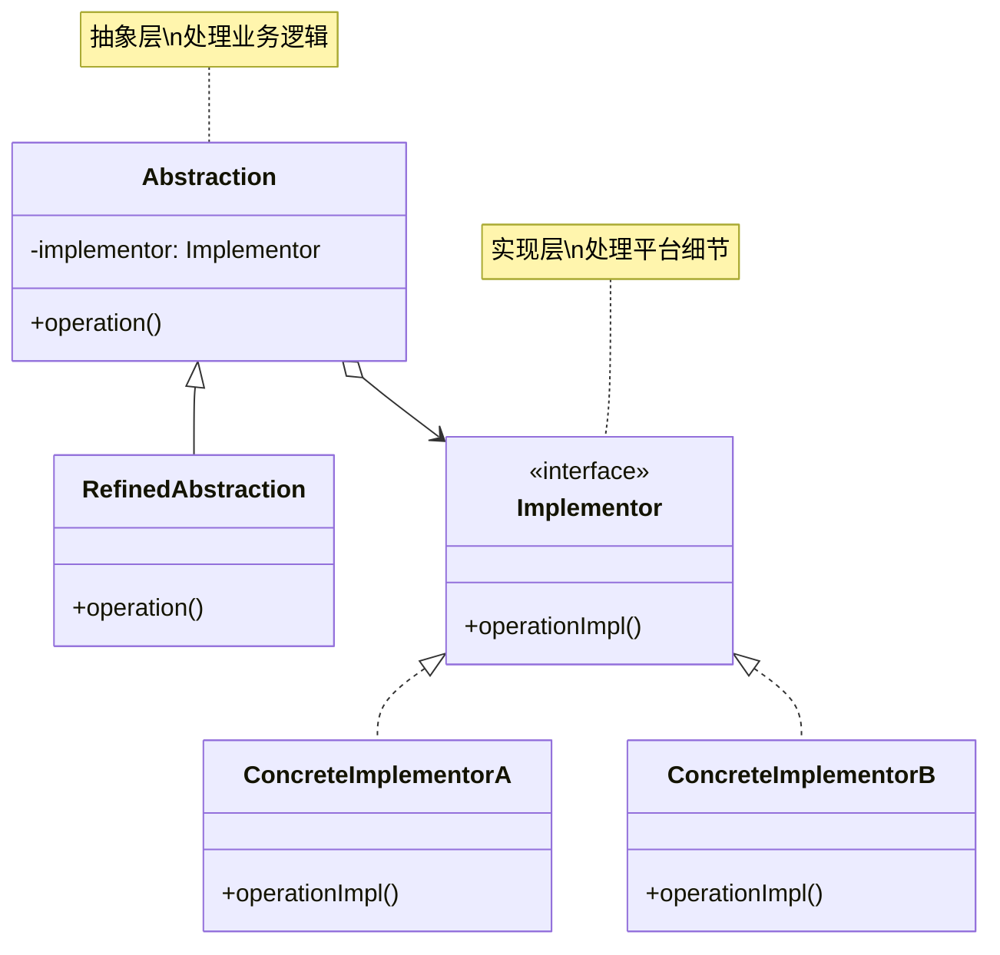
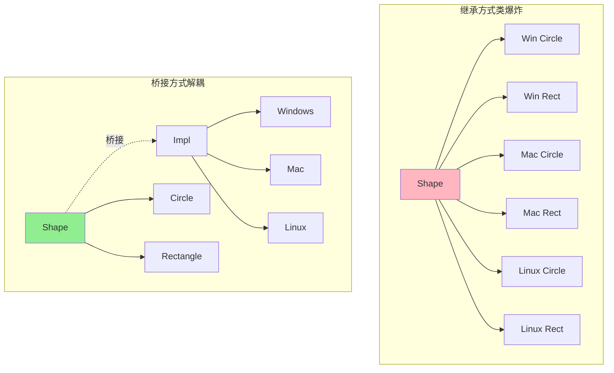
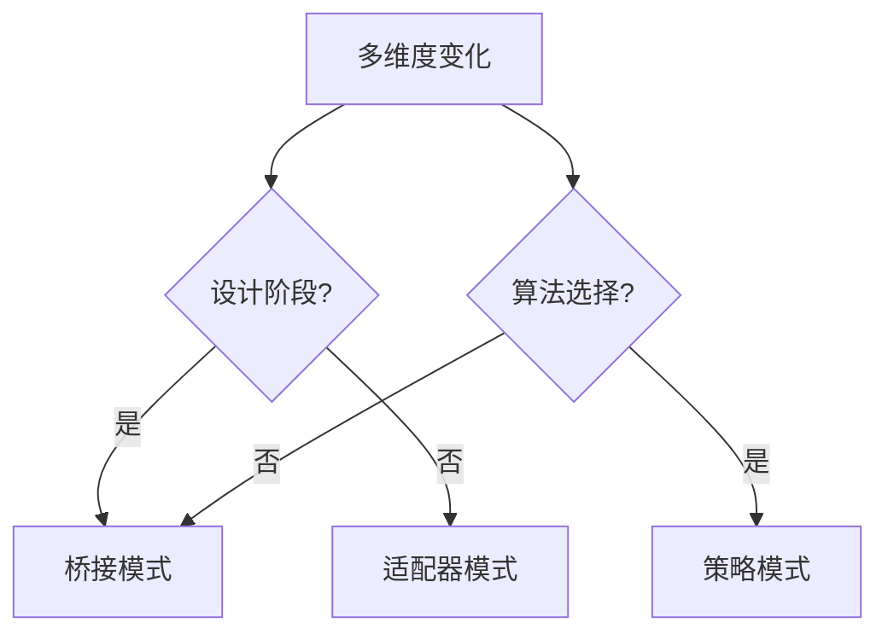

# 桥接模式 (Bridge Pattern)

## 模式定义

**桥接模式**是一种结构型设计模式，用于将抽象与实现分离，使它们可以独立变化。通过组合而非继承，桥接模式避免了因多维度变化导致的类爆炸问题。



## 问题分析

当一个类有多个独立变化维度时，使用继承会导致**类爆炸**：

```java
// ❌ 不好的做法：每个组合都要一个类
class WindowsCircle extends Circle { }
class WindowsRectangle extends Rectangle { }
class MacCircle extends Circle { }
class MacRectangle extends Rectangle { }
class LinuxCircle extends Circle { }
class LinuxRectangle extends Rectangle { }

// 2个形状 × 3个平台 = 6个类！
// 如果增加一个三角形，又要3个类
// 如果增加一个 Android 平台，又要 4 个类
```

**类爆炸公式**：N 个抽象 × M 个实现 = **N×M 个类！**

> [!WARNING] > **类爆炸问题**：
>
> - 5 个形状 × 4 个平台 = 20 个类
> - 10 个数据库 × 5 个连接池 = 50 个类
> - 难以维护和扩展

## 解决方案

将两个独立变化的维度分离，通过桥（组合）连接：



> [!IMPORTANT] > **桥接模式的核心**：
>
> - 识别两个独立变化的维度
> - 抽象层持有实现层的引用（桥）
> - 两个维度可以独立扩展
> - 通过组合替代继承

**优化结果**：

- 继承方式：2 shapes × 3 platforms = **6 classes**
- 桥接方式：2 shapes + 3 platforms = **5 classes** ✅

## 代码实现

### 场景：跨平台图形绘制

形状（圆形、矩形）需要在不同平台（Windows、Mac、Linux）上绘制。

#### 1. 定义实现接口（Implementor）

```java
/**
 * 图形绘制接口（Implementor）
 * 定义平台相关的绘制操作
 */
public interface DrawingAPI {
    /**
     * 绘制圆形
     */
    void drawCircle(double x, double y, double radius);

    /**
     * 绘制矩形
     */
    void drawRectangle(double x, double y, double width, double height);
}
```

#### 2. 具体实现（ConcreteImplementor）

```java
/**
 * Windows 平台实现
 */
public class WindowsDrawingAPI implements DrawingAPI {
    @Override
    public void drawCircle(double x, double y, double radius) {
        System.out.println("🪟 [Windows] 绘制圆形 at (" + x + "," + y + ") 半径:" + radius);
    }

    @Override
    public void drawRectangle(double x, double y, double width, double height) {
        System.out.println("🪟 [Windows] 绘制矩形 at (" + x + "," + y + ") " +
            width + "x" + height);
    }
}

/**
 * Mac 平台实现
 */
public class MacDrawingAPI implements DrawingAPI {
    @Override
    public void drawCircle(double x, double y, double radius) {
        System.out.println("🍎 [Mac] 绘制圆形 at (" + x + "," + y + ") 半径:" + radius);
    }

    @Override
    public void drawRectangle(double x, double y, double width, double height) {
        System.out.println("🍎 [Mac] 绘制矩形 at (" + x + "," + y + ") " +
            width + "x" + height);
    }
}

/**
 * Linux 平台实现
 */
public class LinuxDrawingAPI implements DrawingAPI {
    @Override
    public void drawCircle(double x, double y, double radius) {
        System.out.println("🐧 [Linux] 绘制圆形 at (" + x + "," + y + ") 半径:" + radius);
    }

    @Override
    public void drawRectangle(double x, double y, double width, double height) {
        System.out.println("🐧 [Linux] 绘制矩形 at (" + x + "," + y + ") " +
            width + "x" + height);
    }
}
```

#### 3. 抽象层（Abstraction）

```java
/**
 * 形状抽象类（Abstraction）
 * 持有 DrawingAPI 的引用（桥）
 */
public abstract class Shape {
    // 桥：持有实现层的引用
    protected DrawingAPI drawingAPI;

    /**
     * 构造函数：注入实现
     */
    protected Shape(DrawingAPI drawingAPI) {
        this.drawingAPI = drawingAPI;
    }

    /**
     * 抽象方法：由子类实现
     */
    public abstract void draw();

    /**
     * 计算面积（可选方法）
     */
    public abstract double getArea();
}
```

#### 4. 扩展抽象（RefinedAbstraction）

```java
/**
 * 圆形（RefinedAbstraction）
 */
public class Circle extends Shape {
    private double x;
    private double y;
    private double radius;

    public Circle(double x, double y, double radius, DrawingAPI drawingAPI) {
        super(drawingAPI);
        this.x = x;
        this.y = y;
        this.radius = radius;
    }

    @Override
    public void draw() {
        // 委托给实现层
        drawingAPI.drawCircle(x, y, radius);
    }

    @Override
    public double getArea() {
        return Math.PI * radius * radius;
    }
}

/**
 * 矩形（RefinedAbstraction）
 */
public class Rectangle extends Shape {
    private double x;
    private double y;
    private double width;
    private double height;

    public Rectangle(double x, double y, double width, double height, DrawingAPI drawingAPI) {
        super(drawingAPI);
        this.x = x;
        this.y = y;
        this.width = width;
        this.height = height;
    }

    @Override
    public void draw() {
        // 委托给实现层
        drawingAPI.drawRectangle(x, y, width, height);
    }

    @Override
    public double getArea() {
        return width * height;
    }
}
```

#### 5. 客户端使用

```java
/**
 * 客户端演示
 */
public class BridgePatternDemo {
    public static void main(String[] args) {
        System.out.println("========== 跨平台图形绘制 ==========\n");

        // 在 Windows 上绘制圆形
        Shape winCircle = new Circle(10, 10, 5, new WindowsDrawingAPI());
        winCircle.draw();
        System.out.println("面积: " + winCircle.getArea() + "\n");

        // 在 Mac 上绘制矩形
        Shape macRect = new Rectangle(5, 5, 20, 10, new MacDrawingAPI());
        macRect.draw();
        System.out.println("面积: " + macRect.getArea() + "\n");

        // 在 Linux 上绘制圆形
        Shape linuxCircle = new Circle(15, 15, 8, new LinuxDrawingAPI());
        linuxCircle.draw();
        System.out.println("面积: " + linuxCircle.getArea() + "\n");

        // 在 Windows 上绘制矩形
        Shape winRect = new Rectangle(0, 0, 30, 15, new WindowsDrawingAPI());
        winRect.draw();
        System.out.println("面积: " + winRect.getArea());
    }
}
```

**输出：**

```
========== 跨平台图形绘制 ==========

🪟 [Windows] 绘制圆形 at (10.0,10.0) 半径:5.0
面积: 78.53981633974483

🍎 [Mac] 绘制矩形 at (5.0,5.0) 20.0x10.0
面积: 200.0

🐧 [Linux] 绘制圆形 at (15.0,15.0) 半径:8.0
面积: 201.06192982974676

🪟 [Windows] 绘制矩形 at (0.0,0.0) 30.0x15.0
面积: 450.0
```

> [!TIP] > **桥接模式的优势**：
>
> - 新增形状：只需继承 `Shape`
> - 新增平台：只需实现 `DrawingAPI`
> - 任意组合：形状和平台可以自由搭配

## 实际应用示例

### 示例 1：消息发送系统

```java
/**
 * 消息发送接口（Implementor）
 */
public interface MessageSender {
    void send(String message, String recipient);
}

/**
 * 邮件发送实现
 */
public class EmailSender implements MessageSender {
    @Override
    public void send(String message, String recipient) {
        System.out.println("📧 发送邮件到 " + recipient + ": " + message);
    }
}

/**
 * 短信发送实现
 */
public class SMSSender implements MessageSender {
    @Override
    public void send(String message, String recipient) {
        System.out.println("📱 发送短信到 " + recipient + ": " + message);
    }
}

/**
 * 推送通知实现
 */
public class PushNotificationSender implements MessageSender {
    @Override
    public void send(String message, String recipient) {
        System.out.println("🔔 推送通知给 " + recipient + ": " + message);
    }
}

/**
 * 消息抽象类（Abstraction）
 */
public abstract class Message {
    protected MessageSender sender;

    public Message(MessageSender sender) {
        this.sender = sender;
    }

    public abstract void send(String recipient);
}

/**
 * 普通消息（RefinedAbstraction）
 */
public class TextMessage extends Message {
    private String content;

    public TextMessage(String content, MessageSender sender) {
        super(sender);
        this.content = content;
    }

    @Override
    public void send(String recipient) {
        sender.send(content, recipient);
    }
}

/**
 * 紧急消息（RefinedAbstraction）
 */
public class UrgentMessage extends Message {
    private String content;

    public UrgentMessage(String content, MessageSender sender) {
        super(sender);
        this.content = content;
    }

    @Override
    public void send(String recipient) {
        sender.send("【紧急】" + content, recipient);
    }
}

// 使用示例
class MessageDemo {
    public static void main(String[] args) {
        // 通过邮件发送普通消息
        Message email = new TextMessage("会议通知", new EmailSender());
        email.send("user@example.com");

        // 通过短信发送紧急消息
        Message urgentSMS = new UrgentMessage("系统故障", new SMSSender());
        urgentSMS.send("138****8888");

        // 通过推送发送普通消息
        Message push = new TextMessage("新消息", new PushNotificationSender());
        push.send("user123");
    }
}
```

### 示例 2：支付系统

```java
/**
 * 支付渠道接口（Implementor）
 */
public interface PaymentChannel {
    boolean processPay(String orderId, double amount);
}

/**
 * 支付宝渠道
 */
public class AlipayChannel implements PaymentChannel {
    @Override
    public boolean processPay(String orderId, double amount) {
        System.out.println("💰 支付宝支付: 订单" + orderId + " 金额¥" + amount);
        return true;
    }
}

/**
 * 微信支付渠道
 */
public class WeChatPayChannel implements PaymentChannel {
    @Override
    public boolean processPay(String orderId, double amount) {
        System.out.println("💚 微信支付: 订单" + orderId + " 金额¥" + amount);
        return true;
    }
}

/**
 * 银行卡渠道
 */
public class BankCardChannel implements PaymentChannel {
    @Override
    public boolean processPay(String orderId, double amount) {
        System.out.println("🏦 银行卡支付: 订单" + orderId + " 金额¥" + amount);
        return true;
    }
}

/**
 * 支付方式抽象（Abstraction）
 */
public abstract class PaymentMethod {
    protected PaymentChannel channel;

    public PaymentMethod(PaymentChannel channel) {
        this.channel = channel;
    }

    public abstract boolean pay(String orderId, double amount);
}

/**
 * 在线支付（RefinedAbstraction）
 */
public class OnlinePayment extends PaymentMethod {
    public OnlinePayment(PaymentChannel channel) {
        super(channel);
    }

    @Override
    public boolean pay(String orderId, double amount) {
        System.out.println("在线支付开始...");
        return channel.processPay(orderId, amount);
    }
}

/**
 * 分期付款（RefinedAbstraction）
 */
public class InstallmentPayment extends PaymentMethod {
    private int installments;  // 分期数

    public InstallmentPayment(PaymentChannel channel, int installments) {
        super(channel);
        this.installments = installments;
    }

    @Override
    public boolean pay(String orderId, double amount) {
        double eachAmount = amount / installments;
        System.out.println("分期付款: " + installments + " 期，每期¥" +
            String.format("%.2f", eachAmount));
        return channel.processPay(orderId, amount);
    }
}

// 使用示例
class PaymentDemo {
    public static void main(String[] args) {
        // 通过支付宝在线支付
        PaymentMethod alipay = new OnlinePayment(new AlipayChannel());
        alipay.pay("ORDER001", 299.99);

        // 通过微信分期付款
        PaymentMethod wechatInstall = new InstallmentPayment(new WeChatPayChannel(), 3);
        wechatInstall.pay("ORDER002", 1499.00);

        // 通过银行卡在线支付
        PaymentMethod bankCard = new OnlinePayment(new BankCardChannel());
        bankCard.pay("ORDER003", 599.00);
    }
}
```

### 示例 3：JDBC 驱动（真实案例）

```java
/**
 * JDBC 是桥接模式的经典应用
 *
 * Abstraction: DriverManager, Connection, Statement
 * Implementor: 各数据库的驱动实现（MySQL Driver, Oracle Driver）
 */

// 抽象层：JDBC API
Connection conn = DriverManager.getConnection(url, user, password);
Statement stmt = conn.createStatement();
ResultSet rs = stmt.executeQuery("SELECT * FROM users");

// 实现层：可以切换不同的数据库驱动
// MySQL: com.mysql.cj.jdbc.Driver
// PostgreSQL: org.postgresql.Driver
// Oracle: oracle.jdbc.driver.OracleDriver

// 客户端代码不需要修改！
```

## Java 标准库中的应用

### 1. JDBC

```java
/**
 * JDBC Driver 是桥接模式
 * - Abstraction: Connection, Statement, ResultSet
 * - Implementor: MySQL Driver, Oracle Driver, PostgreSQL Driver
 */
Class.forName("com.mysql.cj.jdbc.Driver");  // 切换驱动
Connection conn = DriverManager.getConnection(url, user, pass);
```

### 2. AWT/Swing

```java
/**
 * AWT 组件使用桥接模式
 * - Abstraction: Component (Button, TextField)
 * - Implementor: Peer (WindowsPeer, MotifPeer, MacPeer)
 */
Button button = new Button("Click");  // 抽象层
// 底层会根据操作系统选择不同的 Peer 实现
```

### 3. Collections

```java
/**
 * Collections.newSetFromMap 使用桥接思想
 */
Set<String> set = Collections.newSetFromMap(new ConcurrentHashMap<>());
// Set (抽象) + Map (实现)
```

## 桥接模式 vs 其他模式



| 模式         | 目的          | 时机       | 关系         |
| ------------ | ------------- | ---------- | ------------ |
| **桥接**     | 分离抽象/实现 | 设计阶段   | 解耦两个维度 |
| **适配器**   | 接口转换      | 事后补救   | 解决不兼容   |
| **策略**     | 算法选择      | 运行时切换 | 行为选择     |
| **抽象工厂** | 创建对象族    | 创建阶段   | 创建相关对象 |

## 优缺点

### 优点

- ✅ **解耦抽象与实现** - 两个维度独立变化
- ✅ **避免类爆炸** - N+M 而不是 N×M
- ✅ **灵活组合** - 抽象和实现可以任意搭配
- ✅ **符合开闭原则** - 易于扩展
- ✅ **提高可扩展性** - 新增维度不影响现有代码

### 缺点

- ❌ **增加复杂度** - 引入额外的抽象层
- ❌ **理解困难** - 需要识别两个维度
- ❌ **设计难度高** - 需要提前规划

## 适用场景

### 何时使用桥接模式

- ✓ **多维度变化** - 有两个或多个独立变化的维度
- ✓ **避免类爆炸** - 继承会导致大量子类
- ✓ **抽象实现分离** - 需要分离平台无关和平台相关代码
- ✓ **动态切换实现** - 运行时决定使用哪个实现

### 实际应用场景

- 💻 **跨平台应用** - Windows/Mac/Linux
- 💳 **支付系统** - 支付方式 × 支付渠道
- 📊 **图表库** - 图表类型 × 渲染方式
- 📱 **消息系统** - 消息类型 × 发送渠道
- 🗄️ **数据库** - 数据库类型 × 连接池

## 最佳实践

### 1. 提前识别两个维度

```java
// ✅ 好的实践：明确两个维度
// 维度1：形状（Circle, Rectangle, Triangle）
// 维度2：渲染（Windows, Mac, Linux）

Shape shape = new Circle(5, new WindowsRenderer());
```

### 2. 使用工厂创建桥接对象

```java
/**
 * 结合工厂模式
 */
public class ShapeFactory {
    public static Shape createShape(String type, DrawingAPI api) {
        switch (type) {
            case "circle":
                return new Circle(0, 0, 10, api);
            case "rectangle":
                return new Rectangle(0, 0, 20, 10, api);
            default:
                throw new IllegalArgumentException("Unknown shape");
        }
    }
}
```

### 3. 保持接口简单

```java
// ✅ 好的实现接口：职责单一
public interface DrawingAPI {
    void drawCircle(double x, double y, double radius);
}

// ❌ 不好的接口：职责过多
public interface DrawingAPI {
    void drawCircle(...);
    void saveToFile(...);
    void print(...);
    void export(...);
}
```

### 4. 文档说明两个维度

```java
/**
 * 形状类（抽象层）
 *
 * 桥接模式的两个维度：
 * 1. 维度1（抽象）：形状的类型（Circle, Rectangle, etc.）
 * 2. 维度2（实现）：绘制的平台（Windows, Mac, Linux）
 *
 * 使用桥接模式避免了 3种形状 × 3个平台 = 9个类的爆炸
 */
public abstract class Shape {
    protected DrawingAPI drawingAPI;  // 桥
    // ...
}
```

## 与其他模式的关系

- **桥接 + 抽象工厂** - 工厂创建实现对象
- **桥接 + 适配器** - 桥接是设计，适配器是补救
- **桥接 + 策略** - 都使用组合，但目的不同

## 总结

桥接模式优雅地解决了多维度变化问题：

- **核心思想** - 分离抽象和实现，通过组合桥接
- **关键优势** - 避免类爆炸，提高扩展性
- **主要缺点** - 增加设计复杂度
- **经典应用** - JDBC、AWT/Swing、跨平台系统
- **适用场景** - 两个或多个独立变化的维度

> [!TIP] > **桥接模式的精髓**：
>
> - **识别**两个独立的变化维度
> - **分离**抽象层和实现层
> - **桥接**通过组合而非继承
> - **扩展**两个维度互不影响

**恭喜！结构型模式全部完成（7/7）** 🎉

下一步：行为型模式...
