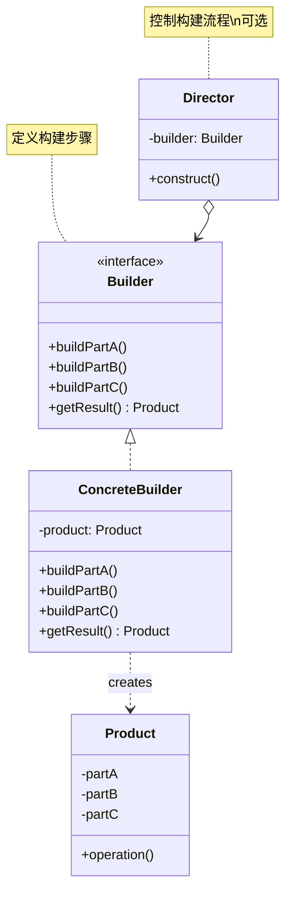
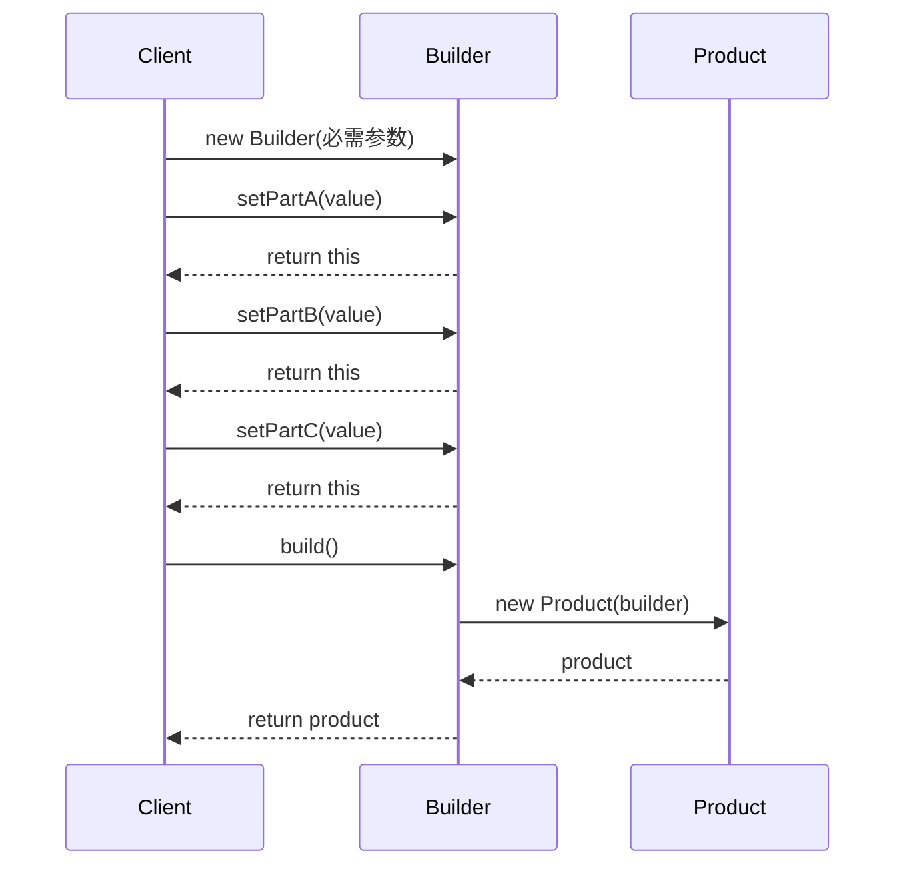
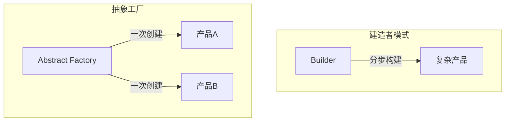

# 建造者模式 (Builder Pattern)

## 模式定义

**建造者模式**是一种创建型设计模式，它允许你分步骤构建复杂对象，使得相同的构建过程可以创建不同的表示。建造者模式将对象的构造与表示分离，使得构建过程更加灵活可控。



## 问题分析

当需要创建复杂对象（包含很多可选属性）时，传统方法的问题：

### 问题 1：构造函数参数爆炸

```java
// 不好的做法 - 构造函数重载爆炸
public class Person {
    public Person(String name) { }
    public Person(String name, int age) { }
    public Person(String name, int age, String email) { }
    public Person(String name, int age, String email, String phone) { }
    public Person(String name, int age, String email, String phone, String address) { }
    // ... 还有更多组合！
}
```

> [!WARNING] > **可笑的构造函数**：假设有 10 个可选参数，理论上需要 2^10 = 1024 个构造函数！这显然是不可行的。

### 问题 2：JavaBeans 模式的问题

```java
public class Person {
    private String name;
    private int age;
    private String email;

    public void setName(String name) { this.name = name; }
    public void setAge(int age) { this.age = age; }
    public void setEmail(String email) { this.email = email; }
}

// 使用
Person person = new Person();
person.setName("张三");
person.setAge(28);
// 忘记设置 email，对象处于不完整状态！
```

**问题**：

- ❌ 对象可能处于不一致状态
- ❌ 无法创建不可变对象
- ❌ 线程不安全

### 问题 3：伸缩构造函数模式

```java
public class Person {
    public Person(String name, int age, String email, String phone,
                  String address, String city, String country, String zipCode) {
        // 8 个参数，难以记住顺序！
    }
}

// 使用 - 容积出错
Person person = new Person("张三", 28, "zhangsan@example.com",
    "北京", "13800138000", "中国", "朝阳区", "100000");
    // 第4和第5个参数弄反了！
```

> [!CAUTION] > **参数顺序易错**：多个相同类型的参数容易搞混顺序，导致难以发现的 bug。

## 解决方案

建造者模式通过链式调用，让对象构建过程清晰易读：



## 代码实现

### 1. 基础建造者模式

```java
/**
 * Person 类 - 复杂对象
 * 使用私有构造函数，只能通过 Builder 创建
 */
public class Person {
    // 必需字段
    private final String name;      // final 保证不可变
    private final int age;

    // 可选字段
    private final String email;
    private final String phone;
    private final String address;
    private final String city;
    private final String country;
    private final String zipCode;

    /**
     * 私有构造函数
     * 只能通过 Builder 调用
     */
    private Person(Builder builder) {
        this.name = builder.name;
        this.age = builder.age;
        this.email = builder.email;
        this.phone = builder.phone;
        this.address = builder.address;
        this.city = builder.city;
        this.country = builder.country;
        this.zipCode = builder.zipCode;
    }

    // Getter 方法（无 Setter，保证不可变）
    public String getName() { return name; }
    public int getAge() { return age; }
    public String getEmail() { return email; }
    public String getPhone() { return phone; }
    public String getAddress() { return address; }
    public String getCity() { return city; }
    public String getCountry() { return country; }
    public String getZipCode() { return zipCode; }

    @Override
    public String toString() {
        return "Person{" +
                "name='" + name + '\'' +
                ", age=" + age +
                ", email='" + email + '\'' +
                ", phone='" + phone + '\'' +
                ", address='" + address + '\'' +
                ", city='" + city + '\'' +
                ", country='" + country + '\'' +
                ", zipCode='" + zipCode + '\'' +
                '}';
    }

    /**
     * 静态内部类 Builder
     * 负责对象的构建
     */
    public static class Builder {
        // 必需字段 - 使用 final 确保必须初始化
        private final String name;
        private final int age;

        // 可选字段 - 提供默认值
        private String email = "";
        private String phone = "";
        private String address = "";
        private String city = "";
        private String country = "";
        private String zipCode = "";

        /**
         * 构造函数：接收必需参数
         */
        public Builder(String name, int age) {
            this.name = name;
            this.age = age;
        }

        /**
         * 设置 email
         * 返回 Builder 对象以支持链式调用
         */
        public Builder email(String email) {
            this.email = email;
            return this;
        }

        public Builder phone(String phone) {
            this.phone = phone;
            return this;
        }

        public Builder address(String address) {
            this.address = address;
            return this;
        }

        public Builder city(String city) {
            this.city = city;
            return this;
        }

        public Builder country(String country) {
            this.country = country;
            return this;
        }

        public Builder zipCode(String zipCode) {
            this.zipCode = zipCode;
            return this;
        }

        /**
         * 构建 Person 对象
         * 可以在此方法中进行参数验证
         */
        public Person build() {
            // 参数验证
            if (age < 0 || age > 150) {
                throw new IllegalArgumentException("年龄必须在 0-150 之间");
            }
            if (email != null && !email.isEmpty() && !email.contains("@")) {
                throw new IllegalArgumentException("邮箱格式不正确");
            }

            return new Person(this);
        }
    }
}
```

> [!TIP] > **关键设计点**：
>
> 1. **私有构造函数** - 强制使用 Builder
> 2. **final 字段** - 创建不可变对象
> 3. **链式调用** - 每个 setter 返回 this
> 4. **参数验证** - 在 build() 中统一验证

### 2. 客户端使用

```java
/**
 * 演示建造者模式的使用
 */
public class Demo {
    public static void main(String[] args) {
        // 示例1：只设置必需参数
        Person person1 = new Person.Builder("张三", 28)
            .build();
        System.out.println(person1);

        // 示例2：设置部分可选参数
        Person person2 = new Person.Builder("李四", 30)
            .email("lisi@example.com")
            .phone("13800138000")
            .build();
        System.out.println(person2);

        // 示例3：设置所有参数（链式调用，清晰易读）
        Person person3 = new Person.Builder("王五", 35)
            .email("wangwu@example.com")
            .phone("13900139000")
            .address("中关村大街1号")
            .city("北京")
            .country("中国")
            .zipCode("100080")
            .build();
        System.out.println(person3);

        // 示例4：参数验证
        try {
            Person invalid = new Person.Builder("赵六", -5)  // 年龄无效
                .build();
        } catch (IllegalArgumentException e) {
            System.out.println("创建失败: " + e.getMessage());
        }
    }
}
```

**输出：**

```
Person{name='张三', age=28, email='', phone='', address='', city='', country='', zipCode=''}
Person{name='李四', age=30, email='lisi@example.com', phone='13800138000', address='', city='', country='', zipCode=''}
Person{name='王五', age=35, email='wangwu@example.com', phone='13900139000', address='中关村大街1号', city='北京', country='中国', zipCode='100080'}
创建失败: 年龄必须在 0-150 之间
```

> [!IMPORTANT] > **建造者模式的优势**：
>
> - 代码清晰易读，像说话一样
> - 参数顺序不重要
> - 可以只设置需要的参数
> - 创建不可变对象
> - 集中进行参数验证

## 实际应用示例

### 示例 1：HTTP 请求构建器

```java
/**
 * HTTP 请求类
 * 演示如何使用建造者模式构建复杂的 HTTP 请求
 */
public class HttpRequest {
    // 请求属性
    private final String url;
    private final String method;
    private final Map<String, String> headers;
    private final Map<String, String> params;
    private final String body;
    private final int timeout;
    private final int retryCount;

    private HttpRequest(Builder builder) {
        this.url = builder.url;
        this.method = builder.method;
        this.headers = builder.headers;
        this.params = builder.params;
        this.body = builder.body;
        this.timeout = builder.timeout;
        this.retryCount = builder.retryCount;
    }

    // Getter 方法
    public String getUrl() { return url; }
    public String getMethod() { return method; }
    public Map<String, String> getHeaders() { return headers; }
    public Map<String, String> getParams() { return params; }
    public String getBody() { return body; }
    public int getTimeout() { return timeout; }
    public int getRetryCount() { return retryCount; }

    /**
     * 发送请求
     */
    public void send() {
        StringBuilder fullUrl = new StringBuilder(url);
        if (!params.isEmpty()) {
            fullUrl.append("?");
            params.forEach((k, v) -> fullUrl.append(k).append("=").append(v).append("&"));
        }

        System.out.println("========== HTTP 请求 ==========");
        System.out.println("方法: " + method);
        System.out.println("URL: " + fullUrl);
        System.out.println("请求头: " + headers);
        System.out.println("请求体: " + body);
        System.out.println("超时: " + timeout + "秒");
        System.out.println("重试次数: " + retryCount);
        System.out.println("==============================");
    }

    /**
     * HTTP 请求建造者
     */
    public static class Builder {
        // 必需字段
        private final String url;

        // 可选字段（带默认值）
        private String method = "GET";
        private Map<String, String> headers = new HashMap<>();
        private Map<String, String> params = new HashMap<>();
        private String body = "";
        private int timeout = 30;
        private int retryCount = 0;

        public Builder(String url) {
            this.url = url;
        }

        /**
         * 设置请求方法
         */
        public Builder method(String method) {
            this.method = method.toUpperCase();
            return this;
        }

        /**
         * 添加请求头
         */
        public Builder header(String key, String value) {
            this.headers.put(key, value);
            return this;
        }

        /**
         * 批量添加请求头
         */
        public Builder headers(Map<String, String> headers) {
            this.headers.putAll(headers);
            return this;
        }

        /**
         * 添加查询参数
         */
        public Builder param(String key, String value) {
            this.params.put(key, value);
            return this;
        }

        /**
         * 设置请求体
         */
        public Builder body(String body) {
            this.body = body;
            return this;
        }

        /**
         * 设置 JSON 请求体
         */
        public Builder jsonBody(Object data) {
            // 简化示例，实际应使用 JSON 库
            this.body = data.toString();
            this.headers.put("Content-Type", "application/json");
            return this;
        }

        /**
         * 设置超时时间（秒）
         */
        public Builder timeout(int seconds) {
            this.timeout = seconds;
            return this;
        }

        /**
         * 设置重试次数
         */
        public Builder retry(int count) {
            this.retryCount = count;
            return this;
        }

        /**
         * 构建请求对象
         */
        public HttpRequest build() {
            // 参数验证
            if (url == null || url.isEmpty()) {
                throw new IllegalArgumentException("URL 不能为空");
            }
            if (timeout < 0) {
                throw new IllegalArgumentException("超时时间不能为负数");
            }

            return new HttpRequest(this);
        }
    }
}

// 使用示例
class HttpRequestDemo {
    public static void main(String[] args) {
        // GET 请求
        HttpRequest getRequest = new HttpRequest.Builder("https://api.example.com/users")
            .param("page", "1")
            .param("limit", "10")
            .header("Authorization", "Bearer token123")
            .timeout(60)
            .build();
        getRequest.send();

        System.out.println();

        // POST 请求
        HttpRequest postRequest = new HttpRequest.Builder("https://api.example.com/users")
            .method("POST")
            .header("Content-Type", "application/json")
            .header("Authorization", "Bearer token123")
            .body("{\"name\":\"张三\",\"age\":28}")
            .timeout(30)
            .retry(3)
            .build();
        postRequest.send();
    }
}
```

### 示例 2：SQL 查询构建器

```java
/**
 * SQL 查询构建器
 * 演示如何使用建造者模式构建 SQL 语句
 */
public class SqlQuery {
    private final StringBuilder query;

    private SqlQuery() {
        this.query = new StringBuilder();
    }

    /**
     * SQL 构建器
     */
    public static class Builder {
        private List<String> columns = new ArrayList<>();
        private String table;
        private List<String> joins = new ArrayList<>();
        private List<String> conditions = new ArrayList<>();
        private String groupBy;
        private String having;
        private String orderBy;
        private Integer limit;
        private Integer offset;

        /**
         * SELECT 子句
         */
        public Builder select(String... columns) {
            this.columns.addAll(Arrays.asList(columns));
            return this;
        }

        /**
         * FROM 子句
         */
        public Builder from(String table) {
            this.table = table;
            return this;
        }

        /**
         * JOIN 子句
         */
        public Builder join(String joinClause) {
            this.joins.add(joinClause);
            return this;
        }

        /**
         * LEFT JOIN
         */
        public Builder leftJoin(String table, String on) {
            this.joins.add("LEFT JOIN " + table + " ON " + on);
            return this;
        }

        /**
         * WHERE 子句
         */
        public Builder where(String condition) {
            this.conditions.add(condition);
            return this;
        }

        /**
         * AND 条件
         */
        public Builder and(String condition) {
            this.conditions.add(condition);
            return this;
        }

        /**
         * GROUP BY 子句
         */
        public Builder groupBy(String column) {
            this.groupBy = column;
            return this;
        }

        /**
         * HAVING 子句
         */
        public Builder having(String condition) {
            this.having = condition;
            return this;
        }

        /**
         * ORDER BY 子句
         */
        public Builder orderBy(String column) {
            this.orderBy = column;
            return this;
        }

        /**
         * LIMIT 子句
         */
        public Builder limit(int limit) {
            this.limit = limit;
            return this;
        }

        /**
         * OFFSET 子句
         */
        public Builder offset(int offset) {
            this.offset = offset;
            return this;
        }

        /**
         * 构建 SQL 语句
         */
        public String build() {
            StringBuilder sql = new StringBuilder();

            // SELECT
            sql.append("SELECT ");
            if (columns.isEmpty()) {
                sql.append("*");
            } else {
                sql.append(String.join(", ", columns));
            }

            // FROM
            if (table == null) {
                throw new IllegalStateException("FROM 子句不能为空");
            }
            sql.append(" FROM ").append(table);

            // JOIN
            for (String join : joins) {
                sql.append(" ").append(join);
            }

            // WHERE
            if (!conditions.isEmpty()) {
                sql.append(" WHERE ");
                sql.append(String.join(" AND ", conditions));
            }

            // GROUP BY
            if (groupBy != null) {
                sql.append(" GROUP BY ").append(groupBy);
            }

            // HAVING
            if (having != null) {
                sql.append(" HAVING ").append(having);
            }

            // ORDER BY
            if (orderBy != null) {
                sql.append(" ORDER BY ").append(orderBy);
            }

            // LIMIT
            if (limit != null) {
                sql.append(" LIMIT ").append(limit);
            }

            // OFFSET
            if (offset != null) {
                sql.append(" OFFSET ").append(offset);
            }

            return sql.toString();
        }
    }
}

// 使用示例
class SqlQueryDemo {
    public static void main(String[] args) {
        // 简单查询
        String sql1 = new SqlQuery.Builder()
            .select("id", "name", "email")
            .from("users")
            .where("age > 18")
            .orderBy("id DESC")
            .limit(10)
            .build();
        System.out.println(sql1);
        // SELECT id, name, email FROM users WHERE age > 18 ORDER BY id DESC LIMIT 10

        System.out.println();

        // 复杂查询（多表关联）
        String sql2 = new SqlQuery.Builder()
            .select("u.id", "u.name", "o.order_number", "o.total")
            .from("users u")
            .leftJoin("orders o", "u.id = o.user_id")
            .where("u.status = 'active'")
            .and("o.created_at > '2024-01-01'")
            .groupBy("u.id")
            .having("COUNT(*) > 5")
            .orderBy("o.total DESC")
            .limit(20)
            .build();
        System.out.println(sql2);
    }
}
```

### 示例 3：配置对象构建器

```java
/**
 * 数据库配置类
 */
public class DatabaseConfig {
    // 必需配置
    private final String host;
    private final String database;

    // 连接配置
    private final int port;
    private final String username;
    private final String password;

    // 连接池配置
    private final int minConnections;
    private final int maxConnections;
    private final long connectionTimeout;
    private final long idleTimeout;

    // 其他配置
    private final boolean useSSL;
    private final String charset;
    private final String timezone;

    private DatabaseConfig(Builder builder) {
        this.host = builder.host;
        this.database = builder.database;
        this.port = builder.port;
        this.username = builder.username;
        this.password = builder.password;
        this.minConnections = builder.minConnections;
        this.maxConnections = builder.maxConnections;
        this.connectionTimeout = builder.connectionTimeout;
        this.idleTimeout = builder.idleTimeout;
        this.useSSL = builder.useSSL;
        this.charset = builder.charset;
        this.timezone = builder.timezone;
    }

    public String getConnectionUrl() {
        return String.format"jdbc:mysql://%s:%d/%s?useSSL=%s&characterEncoding=%s&serverTimezone=%s",
            host, port, database, useSSL, charset, timezone);
    }

    @Override
    public String toString() {
        return "DatabaseConfig{" +
                "host='" + host + '\'' +
                ", database='" + database + '\'' +
                ", port=" + port +
                ", username='" + username + '\'' +
                ", maxConnections=" + maxConnections +
                ", useSSL=" + useSSL +
                '}';
    }

    /**
     * 配置构建器
     */
    public static class Builder {
        // 必需字段
        private final String host;
        private final String database;

        // 默认配置
        private int port = 3306;
        private String username = "root";
        private String password = "";
        private int minConnections = 5;
        private int maxConnections = 20;
        private long connectionTimeout = 30000;
        private long idleTimeout = 600000;
        private boolean useSSL = false;
        private String charset = "UTF-8";
        private String timezone = "UTC";

        public Builder(String host, String database) {
            this.host = host;
            this.database = database;
        }

        public Builder port(int port) {
            this.port = port;
            return this;
        }


public Builder credentials(String username, String password) {
            this.username = username;
            this.password = password;
            return this;
        }

        public Builder poolSize(int min, int max) {
            this.minConnections = min;
            this.maxConnections = max;
            return this;
        }

        public Builder timeout(long connection, long idle) {
            this.connectionTimeout = connection;
            this.idleTimeout = idle;
            return this;
        }

        public Builder ssl(boolean useSSL) {
            this.useSSL = useSSL;
            return this;
        }

        public Builder charset(String charset) {
            this.charset = charset;
            return this;
        }

        public Builder timezone(String timezone) {
            this.timezone = timezone;
            return this;
        }

        public DatabaseConfig build() {
            // 参数验证
            if (minConnections > maxConnections) {
                throw new IllegalArgumentException("最小连接数不能大于最大连接数");
            }
            if (port < 1 || port > 65535) {
                throw new IllegalArgumentException("端口号必须在 1-65535 之间");
            }

            return new DatabaseConfig(this);
        }
    }
}

// 使用示例
class DatabaseConfigDemo {
    public static void main(String[] args) {
        // 开发环境配置
        DatabaseConfig devConfig = new DatabaseConfig.Builder("localhost", "dev_db")
            .credentials("dev_user", "dev_pass")
            .build();
        System.out.println("开发环境: " + devConfig);
        System.out.println("连接URL: " + devConfig.getConnectionUrl());

        System.out.println();

        // 生产环境配置
        DatabaseConfig prodConfig = new DatabaseConfig.Builder("prod.database.com", "prod_db")
            .port(3307)
            .credentials("prod_user", "prod_pass")
            .poolSize(10, 50)
            .timeout(60000, 300000)
            .ssl(true)
            .charset("UTF-8")
            .timezone("Asia/Shanghai")
            .build();
        System.out.println("生产环境: " + prodConfig);
        System.out.println("连接URL: " + prodConfig.getConnectionUrl());
    }
}
```

## Java 标准库中的应用

### 1. StringBuilder

```java
/**
 * StringBuilder 是建造者模式的典型应用
 */
String result = new StringBuilder()
    .append("Hello")
    .append(" ")
    .append("World")
    .append("!")
    .toString();
System.out.println(result); // Hello World!
```

### 2. Stream API

```java
/**
 * Java 8 Stream API 也采用了建造者模式
 */
List<String> result = list.stream()
    .filter(s -> s.length() > 5)
    .map(String::toUpperCase)
    .sorted()
    .limit(10)
    .collect(Collectors.toList());
```

### 3. Calendar

```java
/**
 * Calendar 使用建造者风格的 API
 */
Calendar calendar = new Calendar.Builder()
    .setDate(2024, 0, 1)  // 2024年1月1日
    .setTimeOfDay(10, 30, 0)
    .build();
```

## 项目中的应用

### 1. Lombok @Builder

```java
import lombok.Builder;
import lombok.Data;

/**
 * 使用 Lombok 自动生成建造者
 */
@Data
@Builder
public class User {
    private String name;
    private int age;
    private String email;
    private String phone;
}

// 使用
User user = User.builder()
    .name("张三")
    .age(28)
    .email("zhangsan@example.com")
    .build();
```

> [!TIP] > **Lombok @Builder 的优势**：
>
> - 自动生成 Builder 类，减少样板代码
> - 支持默认值（@Builder.Default）
> - 支持集合属性（@Singular）
> - 自动生成 toBuilder() 方法

### 2. OkHttp

```java
/**
 * OkHttp 使用建造者模式构建请求
 */
OkHttpClient client = new OkHttpClient.Builder()
    .connectTimeout(10, TimeUnit.SECONDS)
    .readTimeout(30, TimeUnit.SECONDS)
    .addInterceptor(new LoggingInterceptor())
    .build();

Request request = new Request.Builder()
    .url("https://api.example.com/users")
    .header("Authorization", "Bearer token")
    .post(requestBody)
    .build();
```

### 3. Retrofit

```java
/**
 * Retrofit 使用建造者模式配置
 */
Retrofit retrofit = new Retrofit.Builder()
    .baseUrl("https://api.example.com/")
    .addConverterFactory(GsonConverterFactory.create())
    .addCallAdapterFactory(RxJava2CallAdapterFactory.create())
    .client(okHttpClient)
    .build();
```

## 建造者模式 vs 其他模式

### 建造者 vs 工厂方法

| 特性           | 建造者模式          | 工厂方法      |
| -------------- | ------------------- | ------------- |
| **对象复杂度** | ⭐⭐⭐⭐⭐ 非常复杂 | ⭐⭐ 相对简单 |
| **构造步骤**   | 多步骤              | 一步完成      |
| **可选参数**   | ✅ 支持大量可选参数 | ❌ 不支持     |
| **链式调用**   | ✅ 支持             | ❌ 不支持     |
| **关注点**     | 对象的构建过程      | 对象的创建    |
| **适用场景**   | 配置对象、请求对象  | 简单对象创建  |

### 建造者 vs 抽象工厂



| 特性         | 建造者模式         | 抽象工厂     |
| ------------ | ------------------ | ------------ |
| **关注点**   | 如何一步步构建对象 | 创建产品族   |
| **返回结果** | 单个复杂对象       | 多个相关对象 |
| **构建方式** | 渐进式构建         | 一次性创建   |

## 优缺点

### 优点

- ✅ **避免参数爆炸** - 无需大量重载构造函数
- ✅ **代码可读性强** - 链式调用像说话一样自然
- ✅ **参数灵活** - 只设置需要的参数
- ✅ **创建不可变对象** - 对象一旦创建不可修改
- ✅ ** 参数验证集中** - 在 build() 方法中统一验证
- ✅ **易于维护扩展** - 添加新参数不影响现有代码

### 缺点

- ❌ **代码量增加** - 需要创建额外的 Builder 类
- ❌ **对象创建成本** - 需要先创建 Builder 对象
- ❌ **简单对象过度设计** - 对于简单对象可能过于复杂
- ❌ **内存开销** - Builder 对象占用额外内存

> [!WARNING] > **何时不使用建造者模式**：
>
> - 对象只有 2-3 个参数
> - 对象没有太多可选参数
> - 性能要求极高的场景

## 适用场景

### 何时使用建造者模式

- ✓ **参数众多** - 对象有 4 个以上参数，且多数为可选
- ✓ **需要不可变对象** - 创建后不可修改
- ✓ **复杂构建逻辑** - 对象创建需要多个步骤
- ✓ **参数验证复杂** - 需要检查参数的有效性和一致性
- ✓ **需要不同表示** - 相同构建过程创建不同对象

### 实际应用场景

- 📝 **HTTP 请求** - 构建复杂的 HTTP 请求
- 💾 **配置对象** - 数据库配置、应用配置
- 🔍 **查询对象** - SQL 查询、搜索条件
- 📄 **文档生成** - Word、PDF 文档
- 🎨 **UI 组件** - 复杂的 UI 组件配置
- 📧 **邮件对象** - 邮件的收件人、主题、正文、附件等

## 最佳实践

### 1. Builder 作为静态内部类

```java
/**
 * 推荐：Builder 作为产品类的静态内部类
 * 优点：紧密关联，访问私有成员方便
 */
public class Product {
    private Product(Builder builder) { }

    public static class Builder {
        public Product build() {
            return new Product(this);
        }
    }
}
```

### 2. 区分必需参数和可选参数

```java
public static class Builder {
    // 必需参数：在构造函数中传入
    private final String mandatoryParam;

    // 可选参数：提供默认值
    private String optionalParam = "default";

    public Builder(String mandatoryParam) {
        this.mandatoryParam = mandatoryParam;
    }
}
```

### 3. 在 build() 中进行验证

```java
public Product build() {
    // 参数验证
    if (name == null || name.isEmpty()) {
        throw new IllegalStateException("name 不能为空");
    }
    if (age < 0) {
        throw new IllegalStateException("age 不能为负数");
    }

    // 逻辑验证
    if (email != null && !email.contains("@")) {
        throw new IllegalStateException("email 格式不正确");
    }

    return new Product(this);
}
```

### 4. 支持不可变性

```java
public class Product {
    // 使用 final 确保不可变
    private final String name;
    private final int age;

    // 只提供 getter，不提供 setter
    public String getName() { return name; }
    public int getAge() { return age; }
}
```

### 5. 提供 toBuilder() 方法

```java
/**
 * 提供从现有对象创建 Builder 的方法
 */
public Builder toBuilder() {
    return new Builder(this.name, this.age)
        .email(this.email)
        .phone(this.phone);
}

// 使用：基于现有对象创建新对象
Person updated = existingPerson.toBuilder()
    .email("newemail@example.com")
    .build();
```

### 6. 使用 Lombok 简化

```java
@Builder
@Data
public class User {
    @NonNull
    private String name;

    @Builder.Default
    private int age = 18;

    @Singular
    private List<String> hobbies;
}

// 使用
User user = User.builder()
    .name("张三")
    .hobby("读书")
    .hobby("运动")
    .build();
```

## 与其他模式的关系

- **建造者 + 单例** - Builder 可以是单例
- **建造者 + 工厂** - 工厂可以返回 Builder
- **建造者 + 原型** - Builder 可以通过克隆创建对象
- **建造者 + 抽象工厂** - 都用于创建复杂对象

## 总结

建造者模式是创建复杂对象的最佳方案：

- **核心思想** - 分步骤构建复杂对象，将构造与表示分离
- **关键优势** - 代码可读性强、参数灵活、创建不可变对象
- **主要缺点** - 代码量增加、对象创建成本
- **适用场景** - 参数众多、需要不可变对象、复杂构建逻辑
- **实际应用** - HTTP 请求、配置对象、SQL 查询、OkHttp、Retrofit

> [!TIP]
> 在现代 Java 开发中，可以使用 Lombok 的 @Builder 注解自动生成建造者代码，大大减少样板代码。但理解建造者模式的原理仍然很重要。

**下一步优化：** `prototype-pattern.md`（原型模式）
