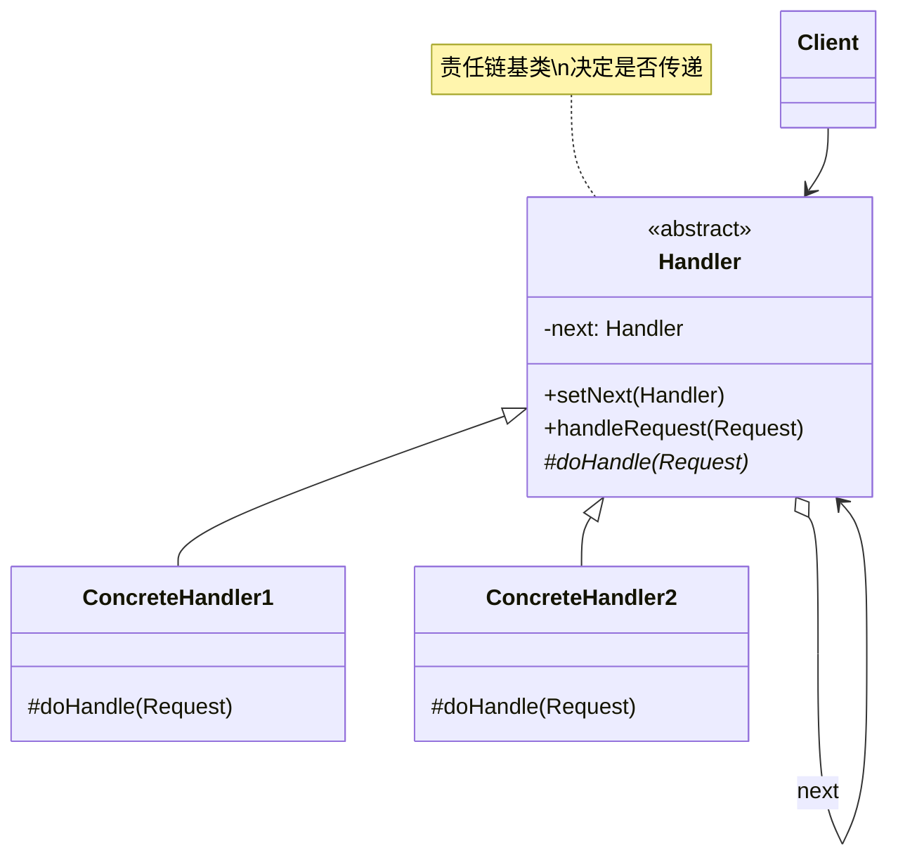
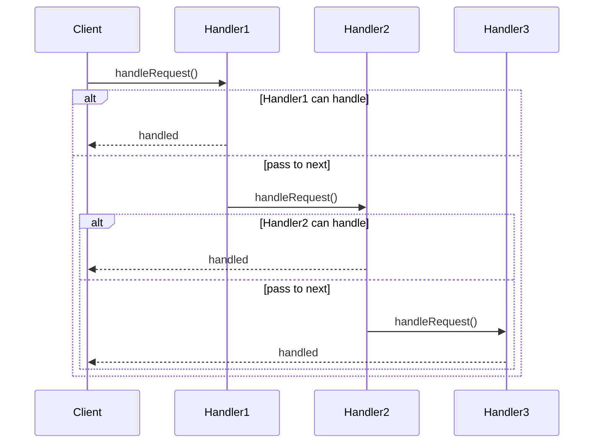

# 责任链模式 (Chain of Responsibility Pattern)

## 模式定义

**责任链模式**是一种行为型设计模式，它让多个对象都有机会处理请求，从而避免请求的发送者和接收者之间的耦合关系。将这些对象连成一条链，并沿着这条链传递请求，直到有一个对象处理它为止。



## 问题分析

当多个对象都可能处理一个请求，但具体由哪个对象处理在运行时才能确定时，直接耦合会导致问题：

```java
// ❌ 不好的做法：请求处理者硬编码
public class RequestProcessor {
    public void process(Request request) {
        if (request.getAmount() <= 1000) {
            // 主管审批
            new Supervisor().approve(request);
        } else if (request.getAmount() <= 10000) {
            // 经理审批
            new Manager().approve(request);
        } else if (request.getAmount() <= 100000) {
            // 总监审批
            new Director().approve(request);
        } else {
            // CEO审批
            new CEO().approve(request);
        }
    }
}
```

**问题**：

- ❌ 发送者与接收者耦合
- ❌ 添加新处理者需要修改代码
- ❌ 处理逻辑固定，不灵活
- ❌ 违反开闭原则

> [!WARNING] > **硬编码陷阱**：每增加一个审批级别，就要修改这个方法，风险很高！

## 解决方案

将处理者连成一条链，请求沿链传递：



> [!IMPORTANT] > **责任链模式的核心**：
>
> - 处理者组成链表结构
> - 每个处理者决定是否处理或传递
> - 请求沿链传递直到被处理
> - 发送者不知道谁会处理请求

## 代码实现

### 场景：请款审批系统

不同金额的请款需要不同级别的审批。

#### 1. 定义处理者抽象类

```java
/**
 * 审批处理者抽象类（Handler）
 */
public abstract class ApprovalHandler {
    // 下一个处理者
    protected ApprovalHandler next;
    // 处理者名称
    protected String handlerName;

    public ApprovalHandler(String handlerName) {
        this.handlerName = handlerName;
    }

    /**
     * 设置下一个处理者
     */
    public ApprovalHandler setNext(ApprovalHandler next) {
        this.next = next;
        return next;  // 返回next支持链式调用
    }

    /**
     * 处理请求
     */
    public final void handleRequest(PurchaseRequest request) {
        if (canHandle(request)) {
            doHandle(request);
        } else if (next != null) {
            System.out.println(\"⏩ \" + handlerName + \" 无权处理，转交给下一级\");
            next.handleRequest(request);
        } else {
            System.out.println(\"❌ 请求金额过大，无人可以审批\");
        }
    }

    /**
     * 判断是否能处理
     */
    protected abstract boolean canHandle(PurchaseRequest request);

    /**
     * 实际处理逻辑
     */
    protected abstract void doHandle(PurchaseRequest request);
}
```

#### 2. 具体处理者

```java
/**
 * 主管（Concrete Handler）
 * 审批限额：≤ 5000
 */
public class Supervisor extends ApprovalHandler {
    private static final double APPROVAL_LIMIT = 5000;

    public Supervisor() {
        super(\"主管\");
    }

    @Override
    protected boolean canHandle(PurchaseRequest request) {
        return request.getAmount() <= APPROVAL_LIMIT;
    }

    @Override
    protected void doHandle(PurchaseRequest request) {
        System.out.println(\"✅ \" + handlerName + \" 批准了请款\");
        System.out.println(\"   金额: ¥\" + request.getAmount());
        System.out.println(\"   理由: \" + request.getPurpose());
    }
}

/**
 * 经理
 * 审批限额：≤ 20000
 */
public class Manager extends ApprovalHandler {
    private static final double APPROVAL_LIMIT = 20000;

    public Manager() {
        super(\"经理\");
    }

    @Override
    protected boolean canHandle(PurchaseRequest request) {
        return request.getAmount() <= APPROVAL_LIMIT;
    }

    @Override
    protected void doHandle(PurchaseRequest request) {
        System.out.println(\"✅ \" + handlerName + \" 批准了请款\");
        System.out.println(\"   金额: ¥\" + request.getAmount());
        System.out.println(\"   理由: \" + request.getPurpose());
    }
}

/**
 * 总监
 * 审批限额：≤ 50000
 */
public class Director extends ApprovalHandler {
    private static final double APPROVAL_LIMIT = 50000;

    public Director() {
        super(\"总监\");
    }

    @Override
    protected boolean canHandle(PurchaseRequest request) {
        return request.getAmount() <= APPROVAL_LIMIT;
    }

    @Override
    protected void doHandle(PurchaseRequest request) {
        System.out.println(\"✅ \" + handlerName + \" 批准了请款\");
        System.out.println(\"   金额: ¥\" + request.getAmount());
        System.out.println(\"   理由: \" + request.getPurpose());
    }
}

/**
 * CEO
 * 审批限额：≤ 100000
 */
public class CEO extends ApprovalHandler {
    private static final double APPROVAL_LIMIT = 100000;

    public CEO() {
        super(\"CEO\");
    }

    @Override
    protected boolean canHandle(PurchaseRequest request) {
        return request.getAmount() <= APPROVAL_LIMIT;
    }

    @Override
    protected void doHandle(PurchaseRequest request) {
        System.out.println(\"✅ \" + handlerName + \" 批准了请款\");
        System.out.println(\"   金额: ¥\" + request.getAmount());
        System.out.println(\"   理由: \" + request.getPurpose());
    }
}
```

#### 3. 请求类

```java
/**
 * 请款请求
 */
public class PurchaseRequest {
    private double amount;      // 金额
    private String purpose;     // 用途
    private String requestor;   // 申请人

    public PurchaseRequest(double amount, String purpose, String requestor) {
        this.amount = amount;
        this.purpose = purpose;
        this.requestor = requestor;
    }

    public double getAmount() {
        return amount;
    }

    public String getPurpose() {
        return purpose;
    }

    public String getRequestor() {
        return requestor;
    }
}
```

#### 4. 客户端使用

```java
/**
 * 责任链模式演示
 */
public class ChainPatternDemo {
    public static void main(String[] args) {
        System.out.println(\"========== 构建审批责任链 ==========\\n\");

        // 构建责任链：主管 -> 经理 -> 总监 -> CEO
        ApprovalHandler supervisor = new Supervisor();
        ApprovalHandler manager = new Manager();
        ApprovalHandler director = new Director();
        ApprovalHandler ceo = new CEO();

        supervisor.setNext(manager)
                  .setNext(director)
                  .setNext(ceo);

        System.out.println(\"责任链: 主管 -> 经理 -> 总监 -> CEO\\n\");

        // 测试不同金额的请款
        System.out.println(\"========== 请款审批测试 ==========\\n\");

        System.out.println(\"【请求1】\");
        PurchaseRequest request1 = new PurchaseRequest(3000, \"办公用品\", \"张三\");
        supervisor.handleRequest(request1);

        System.out.println(\"\\n【请求2】\");
        PurchaseRequest request2 = new PurchaseRequest(15000, \"电脑设备\", \"李四\");
        supervisor.handleRequest(request2);

        System.out.println(\"\\n【请求3】\");
        PurchaseRequest request3 = new PurchaseRequest(45000, \"服务器\",  \"王五\");
        supervisor.handleRequest(request3);

        System.out.println(\"\\n【请求4】\");
        PurchaseRequest request4 = new PurchaseRequest(80000, \"系统升级\", \"赵六\");
        supervisor.handleRequest(request4);

        System.out.println(\"\\n【请求5】\");
        PurchaseRequest request5 = new PurchaseRequest(150000, \"新办公楼装修\", \"孙七\");
        supervisor.handleRequest(request5);
    }
}
```

**输出：**

```
========== 构建审批责任链 ==========

责任链: 主管 -> 经理 -> 总监 -> CEO

========== 请款审批测试 ==========

【请求1】
✅ 主管批准了请款
   金额: ¥3000.0
   理由: 办公用品

【请求2】
⏩ 主管无权处理，转交给下一级
✅ 经理批准了请款
   金额: ¥15000.0
   理由: 电脑设备

【请求3】
⏩ 主管无权处理，转交给下一级
⏩ 经理无权处理，转交给下一级
✅ 总监批准了请款
   金额: ¥45000.0
   理由: 服务器

【请求4】
⏩ 主管无权处理，转交给下一级
⏩ 经理无权处理，转交给下一级
⏩ 总监无权处理，转交给下一级
✅ CEO批准了请款
   金额: ¥80000.0
   理由: 系统升级

【请求5】
⏩ 主管无权处理，转交给下一级
⏩ 经理无权处理，转交给下一级
⏩ 总监无权处理，转交给下一级
❌ 请求金额过大，无人可以审批
```

> [!TIP] > **责任链的优势**：添加新的审批级别只需新建一个处理者并加入链中，无需修改现有代码！

## 实际应用示例

### 示例 1：日志系统

```java
/**
 * 日志处理者抽象类
 */
public abstract class Logger {
    public static final int INFO = 1;
    public static final int DEBUG = 2;
    public static final int ERROR = 3;

    protected int level;
    protected Logger nextLogger;

    public void setNextLogger(Logger nextLogger) {
        this.nextLogger = nextLogger;
    }

    public void logMessage(int level, String message) {
        if (this.level <= level) {
            write(message);
        }
        if (nextLogger != null) {
            nextLogger.logMessage(level, message);
        }
    }

    protected abstract void write(String message);
}

/**
 * 控制台日志
 */
public class ConsoleLogger extends Logger {
    public ConsoleLogger(int level) {
        this.level = level;
    }

    @Override
    protected void write(String message) {
        System.out.println(\"[Console] \" + message);
    }
}

/**
 * 文件日志
 */
public class FileLogger extends Logger {
    public FileLogger(int level) {
        this.level = level;
    }

    @Override
    protected void write(String message) {
        System.out.println(\"[File] \" + message);
    }
}

/**
 * 错误日志
 */
public class ErrorLogger extends Logger {
    public ErrorLogger(int level) {
        this.level = level;
    }

    @Override
    protected void write(String message) {
        System.out.println(\"[Error] \" + message);
    }
}

// 使用示例
class LoggerDemo {
    public static Logger getChainOfLoggers() {
        Logger errorLogger = new ErrorLogger(Logger.ERROR);
        Logger fileLogger = new FileLogger(Logger.DEBUG);
        Logger consoleLogger = new ConsoleLogger(Logger.INFO);

        errorLogger.setNextLogger(fileLogger);
        fileLogger.setNextLogger(consoleLogger);

        return errorLogger;
    }

    public static void main(String[] args) {
        Logger logger = getChainOfLoggers();

        logger.logMessage(Logger.INFO, \"This is an information.\");
        logger.logMessage(Logger.DEBUG, \"This is a debug message.\");
        logger.logMessage(Logger.ERROR, \"This is an error message.\");
    }
}
```

### 示例 2：HTTP 请求过滤器链

```java
/**
 * HTTP请求过滤器
 */
public interface Filter {
    void doFilter(HttpRequest request, HttpResponse response, FilterChain chain);
}

/**
 * 过滤器链
 */
public class FilterChain {
    private List<Filter> filters = new ArrayList<>();
    private int index = 0;

    public void addFilter(Filter filter) {
        filters.add(filter);
    }

    public void doFilter(HttpRequest request, HttpResponse response) {
        if (index < filters.size()) {
            Filter filter = filters.get(index++);
            filter.doFilter(request, response, this);
        }
    }
}

/**
 * 身份验证过滤器
 */
public class AuthenticationFilter implements Filter {
    @Override
    public void doFilter(HttpRequest request, HttpResponse response, FilterChain chain) {
        System.out.println(\"🔐 验证身份...\");
        if (request.hasToken()) {
            System.out.println(\"✅ 身份验证通过\");
            chain.doFilter(request, response);  // 继续执行下一个过滤器
        } else {
            System.out.println(\"❌ 身份验证失败\");
            response.setStatus(401);
        }
    }
}

/**
 * 授权过滤器
 */
public class AuthorizationFilter implements Filter {
    @Override
    public void doFilter(HttpRequest request, HttpResponse response, FilterChain chain) {
        System.out.println(\"🔑 检查权限...\");
        if (request.hasPermission(\"admin\")) {
            System.out.println(\"✅ 权限检查通过\");
            chain.doFilter(request, response);
        } else {
            System.out.println(\"❌ 权限不足\");
            response.setStatus(403);
        }
    }
}

/**
 * 日志过滤器
 */
public class LoggingFilter implements Filter {
    @Override
    public void doFilter(HttpRequest request, HttpResponse response, FilterChain chain) {
        System.out.println(\"📝 记录请求日志: \" + request.getPath());
        chain.doFilter(request, response);
        System.out.println(\"📝 记录响应日志: \" + response.getStatus());
    }
}

// 简化的请求/响应类
class HttpRequest {
    private String token;
    private String permission;
    private String path;

    public boolean hasToken() { return token != null; }
    public boolean hasPermission(String perm) { return perm.equals(permission); }
    public String getPath() { return path; }
}

class HttpResponse {
    private int status;
    public void setStatus(int status) { this.status = status; }
    public int getStatus() { return status; }
}
```

## Java 标准库中的应用

### 1. Servlet Filter

```java
/**
 * Servlet Filter 是责任链模式
 */
public class MyFilter implements Filter {
    @Override
    public void doFilter(ServletRequest request, ServletResponse response,
                        FilterChain chain) throws IOException, ServletException {
        // 前置处理
        System.out.println(\"Before processing request\");

        // 传递给下一个过滤器
        chain.doFilter(request, response);

        //后置处理
        System.out.println(\"After processing request\");
    }
}
```

### 2. Java 异常处理

```java
/**
 * Try-catch 链也是责任链思想
 */
try {
    // code
} catch (IOException e) {
    // Handler 1
} catch (SQLException e) {
    // Handler 2
} catch (Exception e) {
    // Handler 3
}
```

### 3. Event Bubbling (GUI)

```java
/**
 * AWT/Swing 事件冒泡
 */
button.addMouseListener(new MouseAdapter() {
    public void mouseClicked(MouseEvent e) {
        // 处理或传递事件
    }
});
```

## 优缺点

### 优点

- ✅ **降低耦合** - 发送者和接收者解耦
- ✅ **符合单一职责** - 每个处理者只负责一个职责
- ✅ **符合开闭原则** - 易于添加新处理者
- ✅ **灵活组合** - 动态调整责任链
- ✅ **简化对象** - 对象不需要知道链的结构

### 缺点

- ❌ **不保证被处理** - 请求可能到达链末仍未被处理
- ❌ **性能问题** - 链过长影响性能
- ❌ **调试困难** - 不易观察运行时特征

## 适用场景

### 何时使用责任链模式

- ✓ **多个对象可能处理请求** - 具体处理者运行时确定
- ✓ **动态指定处理者** - 处理者集合可变
- ✓ **不明确接收者** - 发送者不知道谁会处理
- ✓ **需要按顺序尝试** - 依次尝试多个处理者

### 实际应用场景

- 📋 **审批流程** - 请假、报销、采购审批
- 🔐 **过滤器链** - HTTP 过滤器、日志过滤
- 📝 **日志系统** - 不同级别日志处理
- 🎮 **事件处理** - GUI 事件冒泡
- ⚠️ **异常处理** - Try-catch 链

## 最佳实践

### 1. 提供默认处理者

```java
/**
 * 默认处理者：处理所有未被处理的请求
 */
public class DefaultHandler extends ApprovalHandler {
    public DefaultHandler() {
        super(\"默认处理者\");
    }

    @Override
    protected boolean canHandle(PurchaseRequest request) {
        return true;  // 处理所有请求
    }

    @Override
    protected void doHandle(PurchaseRequest request) {
        System.out.println(\"⚠️  请求无法处理，记录日志\");
    }
}
```

### 2. 支持链式调用

```java
/**
 * 链式构建责任链
 */
public class ChainBuilder {
    private ApprovalHandler first;
    private ApprovalHandler last;

    public ChainBuilder add(ApprovalHandler handler) {
        if (first == null) {
            first = last = handler;
        } else {
            last.setNext(handler);
            last = handler;
        }
        return this;
    }

    public ApprovalHandler build() {
        return first;
    }
}

// 使用
ApprovalHandler chain = new ChainBuilder()
    .add(new Supervisor())
    .add(new Manager())
    .add(new Director())
    .add(new CEO())
    .build();
```

### 3. 记录责任链执行路径

```java
/**
 * 带日志的处理者
 */
public abstract class LoggingHandler extends ApprovalHandler {
    public LoggingHandler(String name) {
        super(name);
    }

    @Override
    public final void handleRequest(PurchaseRequest request) {
        System.out.println(\"➡️  到达: \" + handlerName);
        super.handleRequest(request);
    }
}
```

### 4. 使用配置驱动

```java
/**
 * 从配置构建责任链
 */
public class ChainConfig {
    public static ApprovalHandler buildFromConfig() {
        List<HandlerConfig> configs = loadConfig();

        ApprovalHandler first = null;
        ApprovalHandler last = null;

        for (HandlerConfig config : configs) {
            ApprovalHandler handler = createHandler(config);
            if (first == null) {
                first = last = handler;
            } else {
                last.setNext(handler);
                last = handler;
            }
        }

        return first;
    }
}
```

## 与其他模式的关系

- **责任链 + 组合** - 组合模式构建树形责任链
- **责任链 + 命令** - 命令作为请求在链中传递
- **责任链 + 装饰器** - 都使用组合，但目的不同

## 总结

责任链模式是解耦请求发送和接收的有效方案：

- **核心思想** - 多个对象组成链，依次处理请求
- **关键优势** - 解耦、灵活、易扩展
- **主要缺点** - 可能无人处理、性能问题
- **经典应用** - Servlet Filter、异常处理、事件冒泡
- **适用场景** - 多个对象可能处理请求

> [!TIP] > **责任链模式的精髓**：
>
> - **组成链表** - 处理者连接成链
> - **依次传递** - 沿链传递直到被处理
> - **松耦合** - 发送者不知道接收者
> - **易扩展** - 动态添加或删除处理者

**已完成：19 个文档** ✅

继续优化剩余 4 个...
